# 2017年重庆市公务员录用考试《行测》题（下半年）

> 数量关系 · 15 题 · 重庆 2017

## 第 1 题　qid 2097280 · 数学运算

小王从A地开车去往B地，下图是一张道路示意图，每段路上的数字表示两地之间的距离（单位：千米）。如果汽车百公里耗油量为10升，油价6.5，问小王从A地去往B地至少要消耗价值多少元的燃油？

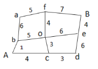

- **A**. 9.5
- **B**. 10.4　✅
- **C**. 12.3
- **D**. 13.1

**答案**：B

**官方解析**

根据图示，则小王从A地至B地共六种走法:

①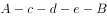，路程为公里；

②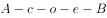，路程为公里；

③，路程为公里；

④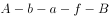，路程为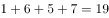公里；

⑤，路程为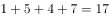公里；

⑥，路程为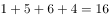公里；

要使油价最少，应选择最短的路径行驶，即第⑥种。汽车每百公里耗油10升，油价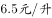，则。

故正确答案为B。

---

## 第 2 题　qid 2097286 · 数学运算

某交警大队的16名民警中，男性为10人，现要选4人进行夜间巡逻工作，要求男性民警不得少于2名，问有多少种选人方法？

- **A**. 1605　✅
- **B**. 1520
- **C**. 1071
- **D**. 930

**答案**：A

**官方解析**

方法一：根据题干，16名民警中，10人为男性，6人为女性。选取4人夜间巡逻，要使男性民警不得少于2人，则有三种情况：男性女性各2人；男性3名女性1名；男性4名。则选人方法为种。

方法二：男性民警不少于2人的情况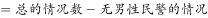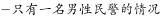。则选人方法为种。

故正确答案为A。

---

## 第 3 题　qid 2097290 · 数学运算

在一个以1为底圆半径、4为高的圆柱体内装了高度为3的液体，在保证液体不流出的前提下倾斜圆柱体，则倾斜的最大角度为（不考虑表面张力）：

- **A**. 

- **B**. 

- **C**. 

　✅
- **D**. 

**答案**：C

**官方解析**

圆柱的高为4，液体的高度为3，则圆柱内的空白部分与液体的体积之比为1:3。倾斜之后，要使倾斜角度最大，则应使液体恰好到达圆柱的上方边沿。

如图所示，AC为水平面，因为空白部分与液体体积之比为1:3，设空白区域体积为1份，液体体积为3份。则倾斜之后AB以上部分空白部分体积与液体相等，都为1份，则AB以下部分为2份。此时AB以上部分与AB以下部分体积之比为1:1，说明A、B点恰好为圆柱体高的中点。圆柱半径为1，高为4，则，，故是等腰直角三角形，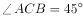，则，。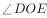即倾斜的最大角度为。

故正确答案为C。

---

## 第 4 题　qid 2097292 · 数学运算

某杂志为每篇投稿文章安排两位审稿人，若都不同意录用则弃用；若都同意则录用；若两人意见不同，则安排第三位审稿人，并根据其意见录用或弃用。如每位审稿人录用某篇文章的概率都是，则该文章最终被录用的概率是：

- **A**. 

- **B**. 

- **C**. 

- **D**. 

　✅

**答案**：D

**官方解析**

被录用的情况有两种：①两位审稿人都同意则录用；②两位审稿人意见不一致且第三位审稿人意见是录用。则概率为。

故正确答案为D。

---

## 第 5 题　qid 2097062 · 数学运算

生产一件甲产品消耗4份原料A、2份原料B、3份原料C，可获得1.1万元利润；生产一件乙产品消耗3份原料A、5份原料B，可获得1.3万元利润。现有40份原料A、38份原料B、15份原料C用于生产，问最多可获得多少万元利润？

- **A**. 10.2
- **B**. 12.0
- **C**. 12.2　✅
- **D**. 12.8

**答案**：C

**官方解析**

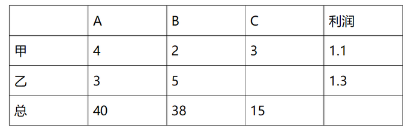

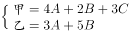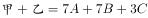，即生产甲、乙各一件需要消耗7份原料A和7份原料B。

考虑到原料A和原料B总数量接近，因此以套装的形式生产（一套中包含1件甲和1件乙）可以保证用掉尽可能多的原料，从而利润尽可能高。通过原料C可知甲最多生产5件，故生产甲、乙各5件，利润为：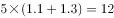万元。但此时原料还剩余5份A和3份B，而且每件乙产品的利润比甲高，考虑少生产一件甲，以此多出的2份原料B恰好足够再生产一件乙产品，可知最大利润为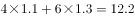万元。

故正确答案为C。

---

## 第 6 题　qid 2097204 · 数学运算

某企业在软件园区的分公司有甲、乙2个开发团队，现从乙团队调走25人，此时甲、乙团队人数比为4:3，然后又从甲团队调走42人，此时甲、乙团队人数比为2:5。问两次调动之前，甲、乙团队人数比为：

- **A**. 3:4
- **B**. 6:7　✅
- **C**. 1:2
- **D**. 2:5

**答案**：B

**官方解析**

假设乙队调走25人后剩余人数为15x，根据甲、乙此时人数之比为4:3，可得甲队人数为20x。又从甲队调走42人后，甲、乙人数之比为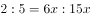，可得甲队人数前后变化量为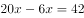人，人，则甲队原有人数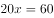人，乙队原有人数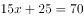人，人数之比为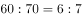。

故正确答案为B。

---

## 第 7 题　qid 2097206 · 数学运算

土质房屋的墙壁底部有一个三棱柱体的孔，其纵截面ABC如下图所示。房主用一个纵截面为三角形的木楔塞住这个孔。为了塞紧孔洞，他用锤子敲击木楔，使木楔移动了4厘米（CD）且其底部EF与孔洞表面BG重合，此时孔的高度增加了3厘米（AG）。已知木楔底部EF高8厘米，问孔的纵截面积增加了多少平方厘米？

- **A**. 26　✅
- **B**. 30
- **C**. 32
- **D**. 36

**答案**：A

**官方解析**

根据题意可得，题目所求为四边形GACD的面积。木楔EFC平移到GBD的位置，已知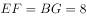厘米，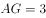厘米，则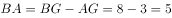厘米，厘米。

根据三角形ABC相似于三角形GBD，可得：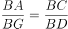，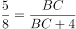，厘米，厘米，原三棱柱孔的截面积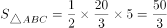平方厘米；木楔截面积平方厘米，增加的面积即四边形GACD的面积，为平方厘米。

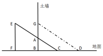

故正确答案为A。

---

## 第 8 题　qid 2097210 · 数学运算

现有10张形状完全相同的卡片，上面分别标有1、2、3、4、5、6、7、8、9、10的数字，从中任取两张卡片，其上两数字之积为4的倍数的概率为：

- **A**. 
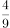
　✅
- **B**. 

- **C**. 
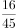

- **D**. 
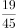

**答案**：A

**官方解析**

抽出的卡片数字有4，其他任选，满足积为4的倍数，情况数为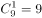种；

抽出的卡片数字有8，其他除4以外任选，满足积为4的倍数，情况数为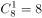种。

抽出的卡片不包含4与8，且二者均为偶数，满足积为4的倍数，只有3种情况，分别为（2,6）、（2,10）、（6,10）。

满足积为4的倍数，共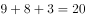种；10张卡片任取2张情况数为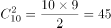种，题目所求概率为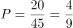。

故正确答案为A。

---

## 第 9 题　qid 2097214 · 数学运算

某高校向学生颁发甲、乙两项奖学金共10万元。已知每份甲等、乙等奖学金的金额分别为3000元和1000元，每人只能最多获得一项奖学金，获得乙等奖学金的人数在获得甲等奖学金人数的2倍到3倍之间。问最多可能有多少人获得奖学金？

- **A**. 62
- **B**. 64
- **C**. 66　✅
- **D**. 68

**答案**：C

**官方解析**

假设获得甲等奖学金人数为，获得乙等奖学金人数为，根据题意可得：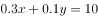；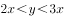。考虑代入，问最多，从最大的选项代入，

D项：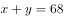，与联立，解得，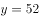。而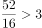，不满足题意；

C项：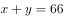，与联立，解得，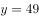。而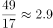，满足题意。

故最多可能有66人获得奖学金。

故正确答案为C。

---

## 第 10 题　qid 2097216 · 数学运算

一个位于O点的雷达探测半径为25千米。某日该雷达探测到一辆车沿直线驶过探测区，行驶过程中途经距离雷达20千米外的P点。如该车在雷达探测区内行驶的距离为X千米，问X的最大值和最小值相差多少千米？

- **A**. 15
- **B**. 16
- **C**. 20　✅
- **D**. 25

**答案**：C

**官方解析**

雷达探测区域为半径为25km的圆形区域，则过P点在该区域行驶的最大距离即该圆形区域的直径长度，为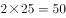km；

以OP为半径画圆，过P点在探测区的最小距离，即以P点为切点，与以OP为半径画圆相切的线段，即图中AB的距离。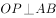，km，km，根据勾股定理，则，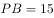km，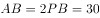km。

则题目所求最大值与最小值相差km。

故正确答案为C。

---

## 第 11 题　qid 2097296 · 数学运算

蔬菜摊贩某日花费元购进蔬菜，上午、下午、傍晚分别按进货单价的、、卖掉占总进货价值、、的蔬菜，并将剩下未卖的蔬菜送给养殖场。如摊位成本为，则该摊贩当日盈利为：

- **A**. 

- **B**. 

　✅
- **C**. 

- **D**. 

**答案**：B

**官方解析**

根据题意蔬菜成本为，售出各部分蔬菜量占比与售价对应关系如下：

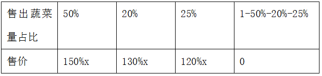

，，

则。

故正确答案为B。

---

## 第 12 题　qid 2097298 · 数学运算

甲、乙两条生产线同时接到羽毛球、网球两种球拍的生产任务。已知甲要生产的球拍总数和乙相同，甲的网球拍生产任务是乙的，乙的羽毛球拍生产任务是甲的，如甲、乙工作效率相同，且单个羽毛球拍生产时间是网球拍的一半，问甲、乙完成任务用时之比为：

- **A**. 7:10　✅
- **B**. 10:7
- **C**. 13:19
- **D**. 19:13

**答案**：A

**官方解析**

设甲生产网球拍个，则乙生产网球拍个；设乙生产羽毛球拍个，则甲生产羽毛球拍个。由于甲乙两人生产球拍总数相同，因此，化简得：。赋值单个羽毛球的生产时间为1，单个网球的生产时间为2，因此甲完成任务：，乙完成任务：，二者用时之比为。

故正确答案为A。

---

## 第 13 题　qid 2097300 · 数学运算

电梯在竖直的矿井内匀速下降。王工程师对电梯开始下降后每分钟的海拔高度数值进行记录（将开始下降后第n分钟的读数记为an，海拔高度在0以下时记为负数），发现，，问电梯是在开始下降后的哪个时间段内降到海拔高度0以下的？

- **A**. 第6分钟之前
- **B**. 第6到第7分钟　✅
- **C**. 第7到第8分钟
- **D**. 第8分钟之后

**答案**：B

**官方解析**

设电梯最初的海拔高度为，每分钟下降1，则，根据题意，

······①

······②

即：······①

······②

解得：，由假设每分钟下降1，那么在第6到7分钟之间，海拔下降到0以下。

故正确答案为B。

---

## 第 14 题　qid 2097302 · 数学运算

某部队的士兵为偶数个，将所有士兵排成长和宽都大于1的实心方阵，发现只有一种排法，且该排法下长和宽都小于100。要使该部队在调入8名新兵之后仍为只有一种排法的实心方阵，问调入后人数最多可能为多少？

- **A**. 104
- **B**. 194
- **C**. 202　✅
- **D**. 9029

**答案**：C

**官方解析**

由于原来士兵总数为偶数，因此调入8人后仍为偶数，D为奇数，排除D项；由于原实心方阵长和宽都大于1，且只有1种排法，因此士兵总数除1和数字本身外，只能再有一种因式分解方法，方阵原人数以及加入8人之后的人数都必须满足这个条件。优先代入数值较大的C项，只有一种因式分解方法，满足要求；原来为人，只有一种因式分解的方式，同时满足要求。

故正确答案为C。

---

## 第 15 题　qid 2097304 · 数学运算

将100名运动员编上从1-100的号码，从中选出号码尾数为3、6和9的人，剩下的人按原来的号码从小到大，重新编上从1开始的号码。小刘发现自己两次得到的号码都是7的倍数，问在第二次编号中，有多少个人的号码比小刘的大？

- **A**. 10
- **B**. 14
- **C**. 20
- **D**. 21　✅

**答案**：D

**官方解析**

1-100的号码中，去掉尾数为3、6、9的号码，剩余人，重新编号为1-70。要满足两次号码都是7的倍数，代入选项：

A项，有10人比小刘大，则第二次编号为号，不是7的倍数，排除；

B项，有14人比小刘大，第二次编号为号，为7的倍数，再验证第一次为号，不是7的倍数，排除；

C项，有20人比小刘大，第二次编号为号，不是7的倍数，排除；

D项，有21人比小刘大，第二次编号为号，为7的倍数，再验证第一次为号，满足两次号码都是7的倍数，当选。

故正确答案为D。

---
