# 2017年重庆市选调优秀大学生到基层工作考试《行测》题

> 数量关系 · 13 题 · 选调 2017

## 第 1 题　qid 2261535 · 数学运算

-3，21，-105，（    ），-315

- **A**. -210
- **B**. 210
- **C**. 315　✅
- **D**. -315

**答案**：C

**官方解析**

观察数列相邻两项有明显倍数关系，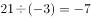，，猜测后一项除以前一项所得到的新数列是公差为2的等差数列。故所求项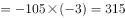。

故正确答案为C。

---

## 第 2 题　qid 2261544 · 数学运算

2，，，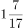，（    ）

- **A**. 
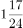

- **B**. 
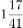
　✅
- **C**. 
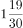

- **D**. 

**答案**：B

**官方解析**

题干数列为分数数列。各项统一形式，为，，，。观察数列，分母的规律：前一项的分子与分母的和等于后一项的分母，，，，，因此下一项的分母为。分子规律：前一项分母和后一项分母之和等于后一项分子，，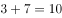，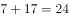，下一项的分子为。则所求项。

故正确答案为B项。

---

## 第 3 题　qid 2261545 · 数学运算

12.6，22.8，34.14，45.18，（  ）

- **A**. 50.32
- **B**. 56.56
- **C**. 61.25
- **D**. 89.34　✅

**答案**：D

**官方解析**

题干均为小数，考虑机械划分。每一项的整数部分各位数字求和分别为：，，，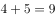。小数部分分别为6，8，14，18，则小数部分数字等于整数部分数字之和的2倍，观察选项，只有D项满足。

故正确答案为D。

---

## 第 4 题　qid 2261546 · 数学运算

长江三峡沿岸两个港口相距240千米，一艘轮船在它们之间行进，其逆水速度是18千米/小时，顺水速度是26千米/小时，如果一艘汽艇在静水中的速度是20千米/小时，那么该汽艇往返于两港之间共需（  ）

- **A**. 10小时
- **B**. 23小时
- **C**. 24小时
- **D**. 25小时　✅

**答案**：D

**官方解析**

设船速为，水流的速度为，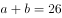①，②，联立①②，解得千米/小时，千米/小时。已知汽艇在静水中的速度是20千米/小时，则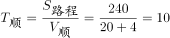小时，小时，往返于两港时间共小时。

故正确答案为D。

---

## 第 5 题　qid 2261547 · 数学运算

某单位组织工会活动，30名员工自愿参加做游戏。游戏规则：按1～30号编号并报数，第一次报数后，单号全部站出来，然后每次余下的人中第一个开始站出来，隔一人站出来一个人。最后站出来的人给大家唱首歌。那么给大家唱歌的员工编号是（  ）

- **A**. 14
- **B**. 16　✅
- **C**. 18
- **D**. 20

**答案**：B

**官方解析**

第一次报数后，单号全部站出来，剩余号码为2、4、6、8、10······30，均为2的倍数；每次余下的人中第一个开始站出来，隔一人站出来一个人，剩余号码为4、8、12、16、20、24、28，均为4的倍数；再从余下的号码中第一个人开始站出来，隔一个人站出来一个人，剩余号码为8、16、24，均为8的倍数；重复上一次的步骤，剩余16号，为16的倍数。所以最后站出来给大家唱歌的员工编号是16。（结论：第n次报数后，剩下人的编号为的倍数）

故正确答案为B。

---

## 第 6 题　qid 2261549 · 数学运算

何镇长决定召集甲乙丙丁四个村干部开会，这四个村每两个村相距4.5千米，参加会议的人数是甲村8人，乙村5人，丙村3人，丁村7人，何镇长准备选择其中一个村委会作为开会地点，以使所有参会人员路程最少，那么选择开会地点是（  ）

- **A**. 甲
- **B**. 乙　✅
- **C**. 丙
- **D**. 丁

**答案**：B

**官方解析**

所有人集中一个地点开会，只与每个地点的人数有关，与距离无关。先考虑甲乙两村人数和、丙丁两村人数和，前者人，后者人，，说明丙丁两村的人数要向甲乙方向移动；同理，甲村8人，乙丙丁三村之和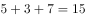人，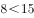，说明甲村的人需要向乙丙丁方向移动。综合以上可知选择开会地点为乙村。

故正确答案为B。

---

## 第 7 题　qid 2261892 · 数学运算

某市电费标准是，若月用电量不超过100千瓦时，则每千瓦时电费0.5元，若月用电量超过100千瓦时，则超过部分每千瓦时0.8元。今年9月份，小玲家比小桃家多交电费6.3元，那么小桃家这个月用电量是（  ）千瓦时。

- **A**. 89　✅
- **B**. 91
- **C**. 93
- **D**. 95

**答案**：A

**官方解析**

多交的6.3元电费，不能被0.5整除，也不能被0.8整除，说明小玲家比小桃家多用的电量一部分算0.5元/千瓦时，一部分算0.8元/千瓦时。假设小桃家用电量比100千瓦时少千瓦时，小玲家比100千瓦时多千瓦时，要使，则有，，或，。当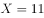时，小桃家用电量为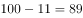千瓦时，当时，小桃家用电量为千瓦时。观察选项，只有A选项成立。

故正确答案为A。

---

## 第 8 题　qid 2261552 · 数学运算

摆钟每隔半小时敲击一次，整点敲击的次数与时针指示的时刻相同，其钟面指示的最大时刻是12，那么一昼夜摆钟敲击次数一共是（  ）下。

- **A**. 90
- **B**. 170
- **C**. 180　✅
- **D**. 190

**答案**：C

**官方解析**

摆钟每隔半小时敲击一次，那么一点钟敲1下，半点敲1下，；根据整点敲击的次数与时针指示的时刻相同，那么两点敲2下，半点敲1下，；依次类推，十二点时敲了12下，半点敲1下，，则12小时共敲击了下，一昼夜指的是24个小时，那么共敲击下。另一个角度：12小时内，整点敲击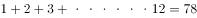次，半点共敲击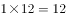次，则一昼夜（24小时）共敲击次。

故正确答案为C。

---

## 第 9 题　qid 2261554 · 数学运算

某金店用一杆不标准的天平（两边臂不等长）称黄金，顾客购买10g黄金，售货员先将5g砝码放在左盘，将黄金放于右盘使之平衡后给顾客，然后又将5g砝码放于右盘，将另一黄金放于左盘使之平衡后又给顾客，则顾客实际所得黄金重量：

- **A**. 大于10g　✅
- **B**. 大于等于10g
- **C**. 小于10g
- **D**. 小于等于10g

**答案**：A

**官方解析**

设天平的左、右臂长分别为和，天平平衡状态下，合力为0，则(F表示天平左、右两侧所放物体的重力)。设黄金第一次的重量为，则有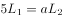，解得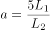；设第二次黄金重量为，则有，解得。所以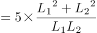。天平两边臂不等长，那么，即，所以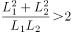，则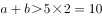g。

故正确答案为A项。

---

## 第 10 题　qid 2261616 · 数学运算

某企业需要从A地运132吨货物到B地，有两种货车可以使用，大卡车载重量5吨，小卡车载重量2吨，每个车次的耗油量分别是10升和5升，那么理论上运完货物至少需要耗油：

- **A**. 260升
- **B**. 265升　✅
- **C**. 270升
- **D**. 275升

**答案**：B

**官方解析**

由题意可得本题为统筹规划问题，只需要比较几种运输方案的耗油量从中选出最优即可。若选择大卡车运则每吨耗油量为升，选择小卡车则每吨耗油量为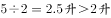，则尽可能选用大卡车运输比较省油，，恰好使用26辆大卡车和１辆小卡车，则总耗油量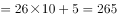升。

故正确答案为B。

---

## 第 11 题　qid 2261557 · 数学运算

两个半径不同的圆柱形玻璃杯内均盛有一定量的水，甲杯的水位比乙杯高了5厘米。甲杯底部沉没着一个石块，当石块被取出并放进乙杯沉没后，乙杯的水位上升了5厘米，并且比这时甲的水位还高10厘米，则可得知甲杯与乙杯底面积之比为：

- **A**. 3:5
- **B**. 2:3
- **C**. 3:2
- **D**. 1:2　✅

**答案**：D

**官方解析**

由题意可得本题为几何问题，需要明确石块取出前后甲乙烧杯的水位变化，再利用体积公式转换为底面积比即可。假设石块取出后甲杯水位下降厘米，则以乙杯原水位为基准，分析甲杯水位的变化可得：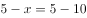，解得厘米。可设甲乙两杯底面积分别为，，则由圆柱形体积公式可得：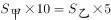，则。

故正确答案为D。

---

## 第 12 题　qid 2261559 · 数学运算

一项农村家庭的调查显示，电冰箱拥有率为，电视机拥有率为，洗衣机拥有率为，至少有两种电器的占，三种电器齐全的占，则一种电器都没有的比例为：

- **A**. 

　✅
- **B**. 

- **C**. 

- **D**. 

**答案**：A

**官方解析**

“至少有两种电器的占”说明，占两项电器的为。利用三集合非标准型公式：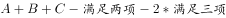，代入数据，都不，即都不，则都不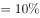。

故正确答案为A。

---

## 第 13 题　qid 2261617 · 数学运算

某画廊设计展出10幅不同的画，其中5幅国画，4幅油画，1幅水彩画，展览时排成一行，要求同一品种的画必须靠在一起，且水彩画不放在两端，那么不同的陈列方式有（  ）种。

- **A**. 

- **B**. 

- **C**. 

- **D**. 

　✅

**答案**：D

**官方解析**

由题意可得本题为排列组合问题，分步排列即可。同一品种的放一起，则5幅国画捆绑在一起，内部全排为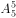，4幅油画捆绑在一起，内部全排为，由于水彩画只能摆中间，则国画和油画全排为，总排列数为。

故正确答案为D。

---
