# 2017年黑龙江省公务员录用考试《行测》题（公检法卷）

> 数量关系 · 10 题 · 黑龙江 2017

## 第 1 题　qid 2051100 · 数学运算

下图为以AC、AD和AF为直径画成的三个圆形，已知AB、BC、CD、DE和EF之间的距离彼此相等，问小圆、弯月以及弯月三部分的面积之比为：

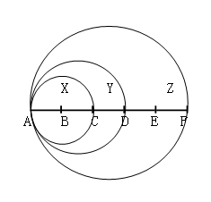

- **A**. 4：5：16　✅
- **B**. 4：5：14
- **C**. 4：7：12
- **D**. 4：3：10

**答案**：A

**官方解析**

假设，由题意得，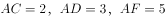，即小圆、大圆、大圆的半径分别为1、1.5、2.5。根据圆的面积公式，，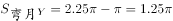，，则。

故正确答案为A。

---

## 第 2 题　qid 2051234 · 数学运算

甲乙两队举行智力抢答比赛，两队平均得分为92分，其中甲队平均得分为88分，乙队平均得分为94分，则甲乙两队人数之和可能是:

- **A**. 20
- **B**. 21　✅
- **C**. 23
- **D**. 25

**答案**：B

**官方解析**

方法一：设甲队有x人，乙队有y人，根据题意可列方程：92（x+y）=88x+94y，化简可得：2x=y。则甲乙两队人数之和=x+y=x+2x=3x，总人数为3的倍数，只有B项符合。

方法二：由题干中“平均分”可知，本题为平均数问题。根据线段法距离与量成反比，甲队和乙队平均得分的距离之比，由于平均得分的距离与人数成反比，则甲队和乙队的人数之比为1:2，总人数为3的倍数，观察选项，只有B选项符合。

故正确答案为B。

---

## 第 3 题　qid 2051342 · 数学运算

甲车从A地，乙车从B地同时出发匀速相向行驶，第一次相遇距离A地100千米。两车继续前进到达对方起点后立即以原速度返回，在距离A地80千米的位置第二次相遇。则AB两地相距多少千米?

- **A**. 170
- **B**. 180
- **C**. 190　✅
- **D**. 200

**答案**：C

**官方解析**

方法一：两人第一次相遇共走了一个AB全程，第二次相遇共走了三个AB全程，两次相遇总路程之比为，因为速度和不变，所以两次相遇时间之比为。甲的速度不变，两次时间之比为，则路程之比也为。甲第一次相遇时的路程为100，设AB全程为，则甲第二次相遇时的路程为，则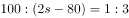，解方程得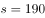千米。

方法二：根据单岸型相遇公式，两地相距的总路程千米。

故正确答案为C。

---

## 第 4 题　qid 2050428 · 数学运算

有一根9节的竹子，其任意节与相邻节的长度成等差数列，上面4节的长度共3尺，下面3节的长度共4尺，则从上到下第6节的长度为多少尺？

- **A**. 

- **B**. 
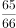

- **C**. 

- **D**. 

　✅

**答案**：D

**官方解析**

假设从上到下9节长度分别为、、、、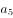、、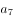、、，呈现等差数列，假设公差为，下面3节长度为4尺即：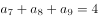，上面4节的长度共3尺，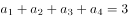，由公式：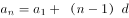，可得方程组：

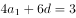······①

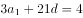······②

解得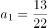尺，尺, 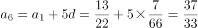尺，则从上到下第6节的长度为尺。

故正确答案为D。

---

## 第 5 题　qid 2050430 · 数学运算

电子计时器一天显示的时间是从00：00到23：59，每一时刻都由四个数字组成，问一天中显示的四个数字之和为24的时刻一共会出现多少次？

- **A**. 24
- **B**. 12
- **C**. 1　✅
- **D**. 0

**答案**：C

**官方解析**

假设电子计时器显示时间为 ，考虑四个数字之和，根据常识，只能取0、1、2；为0~9；为0~5；为0~9。当，时，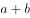取得最大值为10；当，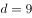时，取得最大值为14，即只有时刻四个数字之和为24。即一天中显示的四个数字之和为24的时刻一共会出现1次。

故正确答案为C。

备注：注意题干表述为“四个数字之和为24”，类似等并不满足四个数字之和为24，它的四个数字之和为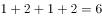。

---

## 第 6 题　qid 2050434 · 数学运算

有一个六位数，既能被13整除又能被7整除。已知前三位上的数字是等差数列，三个数字之和为21。个位数与十位数所组成的数字能被11整除。个位数与十万位数上的数字之和为13，与千位数上的数字之和为17，请问百位数上的数字为：

- **A**. 1
- **B**. 2
- **C**. 3
- **D**. 4　✅

**答案**：D

**官方解析**

假设这6位数为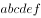，根据题意可得：，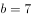，与组成的数字能被11整除，即，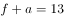，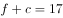，得到，则前三位公差为2，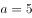，，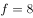，得到六位数为，考虑选项代入验证：只有当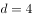时，579488既能被13整除又能被7整除。

故正确答案为D。

---

## 第 7 题　qid 2387406 · 数学运算

从一个棱长为20厘米的正方体零件某一表面中央向内部挖出一个棱长为5厘米的正方体。该零件的表面积增加的百分比在以下哪个范围之内？

- **A**. 
超过

- **B**. 
到之间
　✅
- **C**. 
到之间

- **D**. 
不到

**答案**：B

**官方解析**

原正方体表面积为平方厘米，挖出小正方体后，增加的表面积为4个边长为5厘米的正方形面积之和，为平方厘米。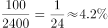，可知表面积增加的百分比范围在到之间。

故正确答案为B。

---

## 第 8 题　qid 2387422 · 数学运算

某公司销售A、B两种商品，其中A为新产品，进货价是B商品的2倍。两类商品的定价都是进货价的，但是B商品在实际销售中按定价的七折出售。问A商品的销量占总销量的比重至少应为多少，才能保证销售收入不低于进货成本？

- **A**. 

- **B**. 

- **C**. 

- **D**. 

　✅

**答案**：D

**官方解析**

赋值A、B进货价分别为200、100，则A售价为，B售价为。设A销量为，B销量为，由题意可列式：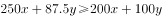，化简得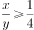，则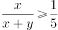，即A商品销量占总销量比重不低于。

故正确答案为D。

---

## 第 9 题　qid 2387435 · 数学运算

有一块圆形花圃，花匠计划在圆形花圃中用花盆摆设图案进行装饰。现在花匠在圆形上设七个等分点，构思以这些点中的三个顶点连成一个等腰三角形，并在三角形内摆放花盆。问共有多少种不同的构图方案？

- **A**. 21　✅
- **B**. 28
- **C**. 35
- **D**. 42

**答案**：A

**官方解析**

七个等分点中任取一点做顶点，可构成3个等腰三角形，则7个点共可构成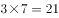个等腰三角形，即有21种构图方案。

故正确答案为A。

---

## 第 10 题　qid 2387450 · 数学运算

某车间有甲、乙、丙三人，其工作效率比为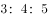。甲单独加工A类产品需要50小时，丙单独加工B类产品需要18小时。现由甲负责加工B类产品，乙负责加工A类产品，丙先帮助甲加工B类产品若干天后转去帮助乙加工A类产品。如要求加工A、B两类产品，且同时开工、同时完工，则丙帮甲工作的时间与丙帮乙工作的时间之比为：

- **A**. 
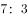

- **B**. 
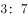
　✅
- **C**. 
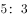

- **D**. 

**答案**：B

**官方解析**

赋值甲乙丙效率分别为3、4、5，则A类产品总量为，B类产品总量为。因为同时开工同时完工，则完成两类产品的时间为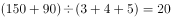小时。20小时甲完成B产品的工作量为，因此丙帮助甲的时间为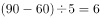小时，丙帮助乙的时间为小时，因此时间之比为。

故正确答案为B。

---
