# 2018年421联考《行测》题（内蒙古卷）（网友回忆版）

> 数量关系 · 10 题 · 内蒙古 2018

## 第 1 题　qid 2188497 · 数学运算

一条笔直的林荫道两旁种植着梧桐树，同侧道路每两棵梧桐树间距50米。林某每天早上七点半穿过林荫道步行去上班，工作地点恰好在林荫道尽头。经测试，他每分钟步行70步，每步大约50厘米，每天早上八点准时到达工作地点。那么，这条林荫道两旁栽种的梧桐树共有：

- **A**. 44棵　✅
- **B**. 42棵
- **C**. 22棵
- **D**. 21棵

**答案**：A

**官方解析**

由“每分钟步行70步，每步大约50厘米”可得，每分钟可步行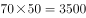厘米，即35米/分钟。由“林某每天早上七点半出发，八点准时到达工作地点”可得，林某步行时间30分钟。由此可以计算出林某步行的路程。根据每两棵梧桐树间距50米，代入线形植树公式棵数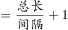，并考虑两旁种树的棵数应乘以2，故这条林荫道两旁栽种的梧桐树共棵。

故正确答案为A。

---

## 第 2 题　qid 2187725 · 数学运算

某公司新近录用五名应聘人员，将分别安排到产品开发、管理、销售和售后服务这四个部门工作，每个部门至少一人。若其中有两人只能从事销售或售后服务两个部门的工作，其余三人均能从事四个部门的工作，则不同的选派方案共有：

- **A**. 12种
- **B**. 18种
- **C**. 36种
- **D**. 48种　✅

**答案**：D

**官方解析**

设五名应聘人员分别为甲、乙、丙、丁、戊，其中甲和乙只能从事销售或售后服务两个部门的工作，则根据题意分类讨论如下：

若甲、乙都安排到同一部门（同时在销售或售后服务部门），其余3人分别安排到剩余三个部门，每个部门1人，有种安排方法；

若甲、乙分别安排到不同部门（一个在销售部门，另一个在售后部门），其余3人有2人安排到产品开发和管理两个部门，剩余1人安排到销售或售后部门，有种安排方法；

若甲、乙分别安排到不同部门（一个在销售部门，另一个在售后部门），其余3人全部安排到产品开发和管理两个部门，有种安排方法。

因此，不同的选派方案共有种。

故正确答案为D。

---

## 第 3 题　qid 2187811 · 数学运算

装修工人小郑用相同的长方形瓷砖装饰正方形墙面，每10块瓷砖组成一个如下图所示的图案。小郑用这个图案恰好铺满该墙面，那么，他最少用了多少块瓷砖？

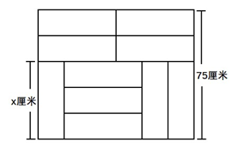

- **A**. 250
- **B**. 300　✅
- **C**. 400
- **D**. 450

**答案**：B

**官方解析**

设长方形瓷砖宽为厘米，由图示可得： ，解得：，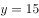。

由图所示，图案的长为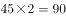厘米。要用长为90厘米、宽为75厘米的长方形图案拼成正方形墙面，若要使用的瓷砖最少，则正方形的边长应该为90和75的最小公倍数450厘米。那么长需要5个，宽需要6个，这样共需要个该图案，每个图案10块瓷砖，则他最少用了块瓷砖。

故正确答案为B。

---

## 第 4 题　qid 2187825 · 数学运算

小庄要制作一个工业模具。他在一个边长4厘米的正方体上表面正中心位置向下挖掉一个直径2厘米、高2厘米的圆柱体，接着再向下挖掉一个直径1厘米、高1厘米的小圆柱体（如右图所示）。那么，该模具的表面积约为多少平方厘米？

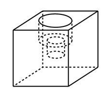

- **A**. 82.8
- **B**. 108.6
- **C**. 111.7　✅
- **D**. 114.8

**答案**：C

**官方解析**

边长4厘米的正方体的表面积为平方厘米。中心位置一个直径2厘米、高2厘米的圆柱体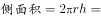平方厘米，一个直径1厘米、高1厘米的小圆柱体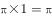平方厘米。那么，该模具的表面积约为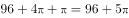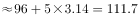平方厘米。

注：挖掉的大小圆柱体底面的面积，可以叠加还原成最上层的表面，故不需要单独计算圆柱体底面积，只需要计算侧面积即可。

故正确答案为C。

---

## 第 5 题　qid 2188666 · 数学运算

劳动技能课上老师给出一道手工题：一张正方形纸片，在一对对角处各减去一个边长为1厘米的小正方形（如右图所示），想办法把这个缺角的正方形恰好剪成一些长2厘米、宽1厘米的小矩形，问初始的大正方形边长要多大时，任务才有可能完成？

- **A**. 8
- **B**. 15
- **C**. 32
- **D**. 以上答案都不对　✅

**答案**：D

**官方解析**

将大正方形拆分为若干个边长1厘米的小正方形，根据大正方形边长的奇偶性分类讨论如下：

①若大正方形的边长为奇数，则小正方形的个数也为奇数，剪去2个小正方形后，剩下的小正方形个数依然为奇数；而每个小矩形需要占用2个小正方形，则剩下的奇数个小正方形不可能全部拆成小矩形，矛盾。故边长为奇数必然不满足题意，排除B项；

②若大正方形的边长为偶数，如下图所示：将其拆分为若干个小正方形之后，黑色和白色方块的总数相等，且拿掉的对角的两个小正方形一定都是黑色或白色，那么剩下的黑色与白色方块数必然不等，此为结论1。

观察图形，要取出的小矩形，必须由一黑一白组成。那么，要让剩下的图形恰好能分成若干个的小矩形，则剩下图形的黑色与白色方块个数必须相等，此为结论2。

结论2与结论1明显矛盾，故边长为偶数也必然不满足题意，排除A、C项。

故正确答案为D。

---

## 第 6 题　qid 2187724 · 数学运算

某苗木公司准备出售一批苗木，如果每株以4元出售，可卖出20万株，若苗木单价每提高0.4元，就会少卖10000株。问在最佳定价的情况下，该公司最大收入是多少万元？

- **A**. 60
- **B**. 80
- **C**. 90　✅
- **D**. 100

**答案**：C

**官方解析**

假设在原价基础上提价次，则共提高元，少卖了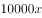株，即万株。根据题意可得方程，收入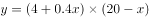，令，解得，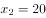，当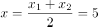时，取得最大值万元。

故正确答案为C。

---

## 第 7 题　qid 2187767 · 数学运算

某单位工会组织桥牌比赛，共有8人报名，随机组成4队，每队2人。那么，小王和小李恰好被分在同一队的概率是：

- **A**. 
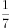
　✅
- **B**. 

- **C**. 

- **D**. 
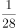

**答案**：A

**官方解析**

方法一：若小王和小李恰好被分在某队，这队人选总情况数为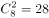种，则小王小李刚好分在这一队的概率为。由于一共有4队，所以小王和小李可以在4队中任意一队，故小王和小李恰好被分在同一队的概率是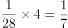。

方法二：若小王分到任意一队，则从其余7个人中抽1个人与小王同队，正好抽到小李的概率为。

故正确答案为A。

---

## 第 8 题　qid 2187774 · 数学运算

某水渠长100米，截面为等腰梯形，其中渠面宽2米，渠底宽1米，渠深2米。因突降暴雨，水深由1米涨至1.8米。则水渠水量增加了：

- **A**. 112立方米
- **B**. 136立方米　✅
- **C**. 272立方米
- **D**. 324立方米

**答案**：B

**官方解析**

根据题意可得下图，增加的水量断面为梯形EFGM。已知水渠截面为等腰梯形，则米，米；，则，即，米，则米；米，则米。梯形EFGM截面积为平方米。又根据水渠长100米，则水渠水量增加了立方米。

故正确答案为B。

---

## 第 9 题　qid 2187796 · 数学运算

一个班级组织跑步比赛，共设100米、200米、400米三个项目。班级有50人，报名参加100米比赛的有27人，参加200米比赛的有25人，参加400米比赛的有21人。如果每人最多只能报名参加2项比赛，那么该班最多有多少人未报名参赛？

- **A**. 11
- **B**. 12
- **C**. 13　✅
- **D**. 14

**答案**：C

**官方解析**

由“每人最多只能报名参加2项比赛”可得，报名三项的人数为0。设参加两项的人数为，未报名参赛的人为，根据三集合非标准公式可得：，化简得。

要让未报名参赛的人最多，则让尽量多。考虑让参加两项的人尽量多，则每人尽量参与两项，此时最多为人，向下取整为36人，即最多为36，故最多为人。

故正确答案为C。

---

## 第 10 题　qid 2187777 · 数学运算

联欢会上，有24人吃冰激凌、30人吃蛋糕、38人吃水果，其中既吃冰激凌又吃蛋糕的有12人，既吃冰激凌又吃水果的有16人，既吃蛋糕又吃水果的有18人，三样都吃的则有6人。假设所有人都吃了东西，那么只吃一样东西的人数是多少？

- **A**. 12
- **B**. 18　✅
- **C**. 24
- **D**. 32

**答案**：B

**官方解析**

如图所示，共有24人吃冰激凌，其中有12人吃了蛋糕，16人吃了水果，既吃了蛋糕又吃了水果的有6人，则只吃了冰激凌的人数为人；同理，只吃了蛋糕的人数为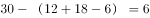人；只吃了水果的人数为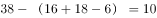人，则只吃一样东西的人数为人。

故正确答案为B。

---
