# 2018年421联考《行测》题（吉林乙级）（网友回忆版）

> 数量关系 · 12 题 · 吉林 2018

## 材料 1

<b>根据下面资料回答96-100题。</b>

        2017年8月24日，全国工商联发布《2017中国民营企业500强》榜单。2016年，民营企业500强出口总额出现大幅回升，达到1495.4亿美元，占我国出口总额的，较2015年增加395.79亿美元，增幅为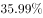，海外投资项目达到1659项，增长；投资总额达515.32亿美元；进行海外投资的企业数量也比2015年的201家增加了113家。

        据统计，民营企业500强中，共有210家企业参与“一带一路”建设。从地区分布看，有144家企业分别位于浙江、江苏、广东、山东和福建等东部沿海经济发达地区。从行业分布看，有121家企业为制造业企业，有25家建筑业企业。另外，有287家民营企业在未来三年对于“一带一路”有投资意向，比2015年增加28家，比2015年提高5.6个百分点。

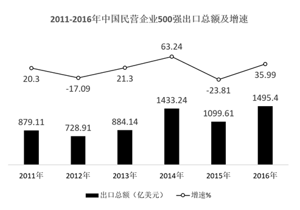

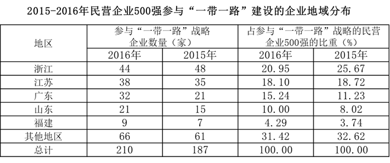

### 第 1 题　qid 2188098 · 数学运算

中国民营企业500强出口总额增速最快的年份是：

- **A**. 2013年
- **B**. 2016年
- **C**. 2015年
- **D**. 2014年　✅

**答案**：D

**官方解析**

定位图形材料可得：2013年增速为，2014年增速为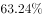，2015年增速为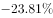，2016年增速为。比较可得，中国民营企业500强出口总额增速最快的年份是2014年。

故正确答案为D。

---

### 第 2 题　qid 2188099 · 数学运算

2015年我国民营企业500强出口总额约为：

- **A**. 1070亿美元
- **B**. 2085亿美元
- **C**. 1177亿美元
- **D**. 1100亿美元　✅

**答案**：D

**官方解析**

定位图形材料可得：2015年我国民营企业500强出口总额为1099.61亿美元，与D项最接近。
故正确答案为D。

---

### 第 3 题　qid 2188100 · 数学运算

2016年，民营企业500强海外投资企业平均每家投资金额约为：

- **A**. 1.6亿美元　✅
- **B**. 4.6亿美元
- **C**. 3.6亿美元
- **D**. 2.6亿美元

**答案**：A

**官方解析**

根据题干“2016年，······平均每家”，可判定本题为现期平均数计算问题。定位文字材料第一段可得：2016年，民营企业500强海外投资总额达515.32亿美元，进行海外投资的企业数量也比2015年的201家增加了113家。代入平均数公式，2016年，民营企业500强海外投资企业平均每家投资金额为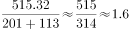亿美元。

故正确答案为A。

---

### 第 4 题　qid 2188102 · 数学运算

下列说法错误的是：

- **A**. 2016年，参与“一带一路”的民营企业500强中制造业企业占据半壁江山
- **B**. 2016年，参与“一带一路”的民营企业500强中东部沿海发达地区居多
- **C**. 参与“一带一路”民营企业500强中，江浙地区的发展比广东后劲强劲　✅
- **D**. 2011-2016年间，民营企业500强出口总额及增速均呈起伏变动

**答案**：C

**官方解析**

A项：定位文字材料第二段，2016年，民营企业500强中，共有210家企业参与“一带一路”建设，有121家企业为制造业企业，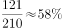，占据半壁江山，正确；

B项：定位文字材料第二段，2016年，民营企业500强中，共有210家企业参与“一带一路”建设，有144家企业分别位于浙江、江苏、广东、山东和福建等东部沿海经济发达地区，，属于居多，正确；

C项：定位表格材料，参与“一带一路”的民营企业500强中，给出了浙江、江苏和广东的企业数量，但无法看出后劲是否强劲，错误；

D项：定位图形材料，从图形中的数据可以看出，2011-2016年间，民营企业500强出口总额及增速均呈起伏变动，正确。

本题为选非题，故正确答案为C。

---

### 第 5 题　qid 2188071 · 数学运算

2.1，3.4，（  ），8.16，13.25

- **A**. 4.3
- **B**. 7.8
- **C**. 5.9　✅
- **D**. 5.1

**答案**：C

**官方解析**

观察题干数字均为小数，进行机械拆分后整数部分为：2、3、（    ）、8、13，小数部分为：1、4、（    ）、16、25。观察小数部分发现均为平方数，所以所求项的小数部分应为，只有C项符合，代入C项的整数部分5，得到数列的整数部分2、3、5、8、13，恰好满足规律“前两项之和等于后一项”。

故正确答案为C。

---

### 第 6 题　qid 2188073 · 数学运算

，，，（  ），

- **A**. 

- **B**. 

- **C**. 
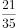

- **D**. 
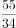
　✅

**答案**：D

**官方解析**

观察数列，后一项分数的分母等于前一项分数的分子与分母之和，后一项分数的分子等于该分数的分母与前一项分数的分子之和，所以所求项的分母为，分子为，即所求项为。

故正确答案为D。

---

### 第 7 题　qid 2188076 · 数学运算

，，，（  ），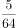，

- **A**. 
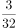

- **B**. 
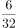

- **C**. 
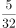

- **D**. 
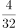
　✅

**答案**：D

**官方解析**

分数数列，分母没有呈递增趋势，优先反约分。原数列可转化为：、、、（    ）、、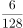，发现分母是公比为2的等比数列，分子是公差为1的等差数列，所以所求项应为。

故正确答案为D。

---

### 第 8 题　qid 2188083 · 数学运算

某景区门票定价为每位游客100元。节假日按团队人数采取以下优惠办法：10人及以下的团队按照原价售票，超过10人的团队，其中10人按原价售票，超过10人部分的游客按照8折售票。某导游在10月1日带团到该景点旅游，买门票花掉2600元，则该旅游团共有游客：

- **A**. 15人
- **B**. 30人　✅
- **C**. 25人
- **D**. 20人

**答案**：B

**官方解析**

由选项可知，游客人数一定超过10人。设该旅游团游客人数为人，根据题意可得：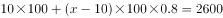，解得，即该旅游团共有游客30人。

故正确答案为B。

---

### 第 9 题　qid 2187567 · 数学运算

一长方形纸板长为4cm，宽为3cm，将其折叠后，折痕为AF，如图所示，则阴影三角形的周长是：

- **A**. 

- **B**. 

- **C**. 

- **D**. 

　✅

**答案**：D

**官方解析**

长方形纸板按AF折痕折叠后，由图可知AB与AE重合，故，。而也为，所以ABFE为正方形，故。根据勾股定理， ，故。

故正确答案为D。

---

### 第 10 题　qid 2188074 · 数学运算

某单位财务主管准备去办理公积金业务，他在时钟的时针和分针重合时准时出发，当他办理完业务返回时，时针刚好旋转30度，此时分针旋转过的角度是时针旋转过的角度的：

- **A**. 8倍
- **B**. 15倍
- **C**. 12倍　✅
- **D**. 10倍

**答案**：C

**官方解析**

24小时，分针转了24圈，时针转了2圈，时间相同，分针转的圈数是时针的倍，则分针转动的速度为时针的12倍，因办理业务时间为定值，则分针旋转过的角度为时针的12倍。

故正确答案为C。

---

### 第 11 题　qid 2188075 · 数学运算

一位乒乓球学员手中拿着装有7只乒乓球的不透明口袋，其中3只黄球，4只白球。他随机取出一只乒乓球，观察颜色后放回袋中，同时放入2只与取出的球同色的球。这样连续取2次，则他取出的两只球中第1次取出的是白球，第2次取出的是黄球的概率是：

- **A**. 

- **B**. 

　✅
- **C**. 

- **D**. 

**答案**：B

**官方解析**

原有7只乒乓球，其中4只白球，则第一次取出白球的概率为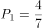，然后将2只白球放入袋中，此时共有乒乓球只，黄球3只，第二次取出黄球的概率为。分步用乘法，则题目所求的概率为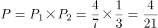。

故正确答案为B。

---

### 第 12 题　qid 2188080 · 数学运算

将5个不同颜色的锦囊放入4个不同的锦盒里，如果允许锦盒是空的，则所有可能的放置方法有：

- **A**. 
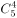种

- **B**. 
种
　✅
- **C**. 
种

- **D**. 
种

**答案**：B

**官方解析**

由题意可得，每个锦囊均有4个不同的锦盒可以放置，则5个锦囊总的放置方法数为种。

故正确答案为B。

---
