# 2018年421联考《行测》题（吉林甲级）（网友回忆版）

> 数量关系 · 9 题 · 吉林 2018

## 第 1 题　qid 2187543 · 数学运算

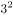，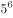，，(  )，

- **A**. 

　✅
- **B**. 
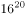

- **C**. 

- **D**. 

**答案**：A

**官方解析**

数列形式特殊，包含底数和指数两个部分，优先拆分查找规律。原数列底数分别为：3，5，9，（ ），33，作差后得：2，4，（ ），（ ），考虑公比为2的等比数列，下两项为8，16。验证：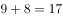，，与题干数字吻合，故所求项底数应为17；原数列指数分别为：2，6，12，（ ），30，作差后得：4，6，（ ），（ ），考虑公差为2的等差数列，下两项为8，10。验证：，，与题干数字吻合，故所求项指数应为20，即所求项为。

故正确答案为A。

---

## 第 2 题　qid 2187546 · 数学运算

一位女士为了寻找曾经帮助她的司机，向新闻媒体提供了她记得的车牌信息。女士看到的车牌号为“吉AC****”，最后一位是字母，其他三位全是奇数，且数字逐渐变大，那么符合要求的车牌有：

- **A**. 380个
- **B**. 260个　✅
- **C**. 180个
- **D**. 460个

**答案**：B

**官方解析**

方法一：根据题意可得，车牌号的最后一位是字母，共有26种选择。其他三位均为奇数，即可为“1，3，5，7，9”中的任意3个数字。从5个奇数中选出3个，有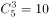种情况。每3个奇数中，满足数字逐渐变大的只有1种，故三位数字的排列共有种选择。则满足要求的车牌共有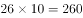种。

方法二：在后四位号码中，最后一位是字母，有26种选择，设其他三位数字满足条件的情况数为，则，一定是26的倍数，只有B项满足。

故正确答案为B。

---

## 第 3 题　qid 2187547 · 数学运算

某业务处长和科员两人属相相同，科员在第一个本命年时处长是第三个本命年。科员今年20岁，当处长年龄是科员年龄的2倍时，需要经过的时间是：

- **A**. 5年
- **B**. 6年
- **C**. 7年
- **D**. 4年　✅

**答案**：D

**官方解析**

根据“科员在第一个本命年时处长是第三个本命年”，结合常识每相差1个本命年，年龄差12岁，可知：处长比科员大岁。故科员今年20岁，则处长今年岁。设经过年后，处长年龄是科员年龄的2倍，所以有，解得。

故正确答案为D。

---

## 第 4 题　qid 2187567 · 数学运算

一长方形纸板长为4cm，宽为3cm，将其折叠后，折痕为AF，如图所示，则阴影三角形的周长是：

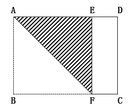

- **A**. 

- **B**. 
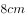

- **C**. 
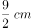

- **D**. 
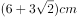
　✅

**答案**：D

**官方解析**

长方形纸板按AF折痕折叠后，由图可知AB与AE重合，故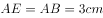，。而也为，所以ABFE为正方形，故。根据勾股定理，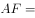 ，故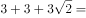。

故正确答案为D。

---

## 第 5 题　qid 2187537 · 数学运算

某市出租车采用分段计价办法：2.5公里及以内收费5元，超过2.5公里按每公里1.5元计价，每次加收1元燃油附加费。某位乘客有22.5元零钱，最多能走的距离是：

- **A**. 14公里
- **B**. 13.5公里　✅
- **C**. 12公里
- **D**. 15.5公里

**答案**：B

**官方解析**

设最多能走公里，根据“22.5元零钱”可列方程：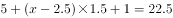，求得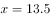公里。

故正确答案为B。

---

## 第 6 题　qid 2187540 · 数学运算

某仓库存放三个厂家生产的同一品牌洗衣液，其中甲厂生产的占，乙厂生产的占，剩余为丙厂生产的，且三个厂家的次品率分别为，，，则从仓库中随机取出一件是次品的概率为：

- **A**. 

- **B**. 

　✅
- **C**. 

- **D**. 

**答案**：B

**官方解析**

赋值总量为1000件，则甲、乙、丙三厂生产的洗衣液各有200、300、500件，次品件数分别为：件，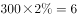件，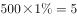件，次品数共有件。故从仓库的1000件产品中，随机取出一件是次品的概率为：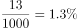。

故正确答案为B。

---

## 第 7 题　qid 2187541 · 数学运算

某商场柜台销售一款时装，若将进价的作为利润，则销售价为240元。若该款时装销售价为300元时，此时利润率是：

- **A**. 

- **B**. 

- **C**. 

　✅
- **D**. 

**答案**：C

**官方解析**

设进价为元，根据题意列式：，解得进价元。根据公式：，当售价为300元时，。

故正确答案为C。

---

## 第 8 题　qid 2187542 · 数学运算

甲乙两个工程队承担了精准扶贫村公路的修筑任务，先是甲工程队单独修了10天，完成了总工程的四分之一，接着乙工程队加入合作，完成剩余工程。在第14天完成到总工程的一半，则按照这种进度完成全部工程所用的天数比由甲单独完成这项工程少用的天数是：

- **A**. 18天　✅
- **B**. 16天
- **C**. 12天
- **D**. 20天

**答案**：A

**官方解析**

方法一：赋值甲的效率为1，则工程总量为，所以甲单独完成这项工程需要40天。

根据题目工作过程，完成总工程的一半时，甲队工作14天且乙队工作4天，即，解得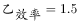。后面甲乙继续合作完成剩下的一半工程还需要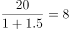天，故按照这种进度完成全部工程的时间为天。

则题目所求少用的天数为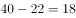天。

方法二：根据题意，甲10天可完成总工程的，则剩下工程的若由甲单独完成需要30天；现甲乙合作4天完成了总量的，则剩下工程的若由甲乙合作完成共需要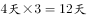；则题目所求少用的天数为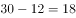天。

故正确答案为A。

---

## 第 9 题　qid 2187545 · 数学运算

王老师将天然蜂蜜和矿泉水混合成蜂蜜水，现有一瓶浓度为的蜂蜜水100克，如果需要将蜂蜜水的浓度提高，需加入天然蜂蜜克和矿泉水克，那么后加入的蜂蜜是原来的：

- **A**. 2倍
- **B**. 1.5倍
- **C**. 1倍
- **D**. 2.5倍　✅

**答案**：D

**官方解析**

方法一：根据题干可得，的蜂蜜水中原有蜂蜜重量为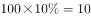克，水的重量为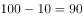克；加入克蜂蜜和克水后，浓度提高，列式：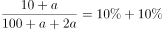，解得克，则后加入的蜂蜜是原来的倍。

方法二：原蜂蜜水浓度为，蜂蜜水为100g，原蜂蜜的量为克。后加入的蜂蜜水浓度为，二者混合之后的浓度为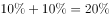，根据线段法，距离与量成反比。

则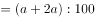，解得克，即后加入蜂蜜的量为25克，题目所求倍数为倍。

故正确答案为D。

---
