# 2018年421联考《行测》题（四川卷）（网友回忆版）

> 数量关系 · 10 题 · 四川 2018

## 第 1 题　qid 2188550 · 数学运算

甲乙两车早上分别同时从A、B两地出发驶向对方所在城市，在分别到达对方城市并各自花费1小时卸货后，立刻出发以原速返回出发地。甲车的速度为60千米/小时，乙车的速度为40千米/小时，两地之间相距480千米。问两车第二次相遇距离两车早上出发经过了多少个小时？

- **A**. 13.4
- **B**. 14.4
- **C**. 15.4　✅
- **D**. 16.4

**答案**：C

**官方解析**

第二次相遇存在两种可能，即在端点处或中间某一位置。根据题意，甲从A地到B地需要小时，卸货花费1小时，回到A地再花费8小时，共用时小时；同理，乙从B地到A地需要小时，卸货花费1小时，共用时小时，，则两车第二次相遇一定在A、B两地之间（非端点）。结合两端出发多次相遇公式：，第二次相遇时：，解得；由于两车在中间各自花费1小时卸货，则两车第二次相遇距离两车早上出发经过了小时。

故正确答案为C。

---

## 第 2 题　qid 2188551 · 数学运算

某超市下午3点开始对其新上架的洗发液进行半价促销，并规定之后每次整点时，洗发液的价格都会上调其原价的，直至恢复原价。张大妈4点15分在超市抢购了2瓶，6点半又去超市买了2瓶。张大妈两次购买洗发液共花费48元，问与原价相比共节省了多少元？

- **A**. 12
- **B**. 24
- **C**. 32　✅
- **D**. 48

**答案**：C

**官方解析**

根据题意，设洗发液原价为100a元，则有：

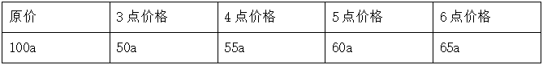

张大妈两次抢购的总价，解得；原价购买4瓶的总价元，则与原价相比共节省了元。

故正确答案为C。

---

## 第 3 题　qid 2188552 · 数学运算

6月1日当天，小张用去其当月手机上网套餐流量的，2日用去8MB，这时用去的流量和套餐内剩下的流量之比为1:3。如小张从3日开始每天使用6MB流量，问小张6月使用的套餐外手机流量为多少MB？

- **A**. 80
- **B**. 96
- **C**. 108　✅
- **D**. 128

**答案**：C

**官方解析**

根据题意，设当月上网套餐流量为x MB，则该月流量如下表：

由“这时用去的流量和套餐内剩下的流量之比为1:3”可得，解得。那么，剩下套餐内流量。又“小张从3日开始每天使用6MB流量”，可计算出6月3日-30日共需流量，因此，小张6月使用的套餐外手机流量为。

故正确答案为C。

---

## 第 4 题　qid 2188553 · 数学运算

如图所示长方形恰好分成六个正方形，其中最小的正方形面积是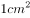，则这个长方形的面积是：

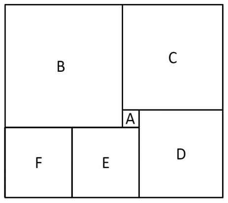

- **A**. 

　✅
- **B**. 
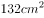

- **C**. 
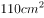

- **D**. 
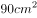

**答案**：A

**官方解析**

由“最小的正方形面积是”可得，A正方形边长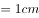，设D正方形边长为d，则C正方形边长为，B正方形边长为，E、F正方形边长为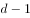。

用B、C正方形边长表示长方形的长，

用D、E、F正方形边长表示长方形的长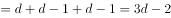，

就有，解得。

，。

则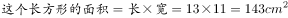。

故正确答案为A。

---

## 第 5 题　qid 2188555 · 数学运算

若干名天使投资人对某个需求资金120万的创业项目表达出投资意向，并计划每人以相同的金额投资该项目。但实际投资时有2人退出，剩下的每人需要多投资10万元才能满足该项目的资金需求，问实际投资这一项目的有多少人？

- **A**. 3
- **B**. 4　✅
- **C**. 6
- **D**. 8

**答案**：B

**官方解析**

设实际投资这一项目的有x人，则计划投资的有人，根据题意可得，，解得（分式方程求解过程计算量大，建议结合选项代入）。

故正确答案为B。

---

## 第 6 题　qid 2188498 · 数学运算

甲、乙、丙三个网站定期更新，甲网站每隔48小时，乙网站每隔72小时，丙网站每隔96小时更新一次内容。问在一个星期内至多有几天，三个网站中至少有一个更新内容？

- **A**. 4天
- **B**. 5天
- **C**. 6天
- **D**. 7天　✅

**答案**：D

**官方解析**

由题意可知，甲每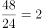天更新一次，乙每天更新一次，丙每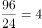天更新一次，要想有更新的天数尽可能多，则三个网站在一周的更新天数应尽可能多，且尽量不重复。安排甲从周一开始更新，则甲在周一、周三、周五、周日均更新一次，此时乙在周一、周四、周日更新，丙分别在周二与周六更新，情况最优，一周内每天均有网站更新。

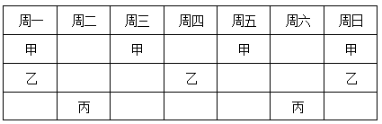

注：每隔48小时就是每48小时，不需要额外加1小时。

故正确答案为D。

---

## 第 7 题　qid 2188560 · 数学运算

一战斗机从甲机场匀速开往乙机场，如果速度提高，可比原定时间提前12分钟到达；如果以原定速度飞行600千米后，再将速度提高，可以提前5分钟到达。那么甲乙两机场的距离是多少千米？

- **A**. 750
- **B**. 800
- **C**. 900　✅
- **D**. 1000

**答案**：C

**官方解析**

第一种情况：如果提速，可比原定时间提前12分钟到达。可知，提速前后速度之比为4：5，路程相同时，时间与速度成反比，则时间之比为5：4。节省了1份等于12分钟，所以原计划用时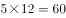分钟；

第二种情况：如果原定速度飞行600千米后，再将速度提高，可以提前5分钟到达。可知，提高速度前后速度之比为3：4，则在提速后所走的路程内，时间之比为4：3，节省了1份等于5分钟，则原计划用时分钟。故前600千米用时分钟，则全程路程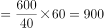千米。

故正确答案为C。

---

## 第 8 题　qid 2188556 · 数学运算

从A地到B地为上坡路。自行车选手从A地出发按A-B-A-B的路线行进，全程平均速度为从B地出发，按B-A-B-A的路线行进的全程平均速度的，如自行车选手在上坡路与下坡路上分别以固定速度匀速骑行，问他上坡的速度是下坡速度的：

- **A**. 

　✅
- **B**. 

- **C**. 

- **D**. 

**答案**：A

**官方解析**

假设上坡所用时间为x，下坡所用时间为y，从A地出发按A-B-A-B的路线行进所用时间为，从B地出发按B-A-B-A的路线行进所用时间为。总路程相同，速度与时间成反比，已知前者全程平均速度是后者的，则，则。由于上坡和下坡路程相同，速度和时间成反比，。

故正确答案为A。

---

## 第 9 题　qid 2188500 · 数学运算

加油站营业时间为每日1时到午夜12时，且在每日停业的1小时中进货1万升92号汽油。某月1日开始营业时有92号汽油库存4万升，当日销售92号汽油1万升，但由于周边车流量增加，每日92号汽油销量都比上一日增加1000升。问该加油站如不增加每日的进货量，92号汽油将在哪一日售罄？

- **A**. 11日
- **B**. 10日
- **C**. 9日　✅
- **D**. 8日

**答案**：C

**官方解析**

由“每日停业的1小时中进货1万升，某月1日开始营业时有92号汽油库存4万升”，开始营业是1时，说明4万升已经包含了当日进货的1万升，故1日0时库存为3万升。又“某月1日，当日销售1万升”可得，在不增加车流量的情况下，每日新进货和当日销售额持平，故原库存3万升不会被消耗掉。

考虑在增加车流量的情况下，“比上一日增加1000升”，每日新增销量构成一个首项为0，公差为0.1万升的等差数列。设天内新增销量之和超过3万升，由等差数列求和公式，代入数据可得，化简得。结合选项枚举代入：

当时，，不满足题意；

当时，，满足题意，即汽油将在9日售罄。

故正确答案为C。

---

## 第 10 题　qid 2188571 · 数学运算

10个相同的盒子中分别装有1～10个球，任意两个盒子中的球数都不相同。小李分三次每次取出若干个盒子，每次取出的盒子中的球数之和都是上一次的3倍，且最后剩下1个盒子。问剩下的盒子中有多少个球？

- **A**. 9
- **B**. 6
- **C**. 5
- **D**. 3　✅

**答案**：D

**官方解析**

由题意可得，共有小球个数为个，假设第一次取出小球个数为x，剩下盒子中球数为y，则第二次与第三次取出小球个数分别为3x，9x，前三次取出小球总个数为，则，是13的倍数，只有D项满足。

故正确答案为D。

---
