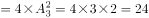
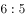
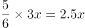
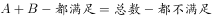
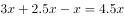
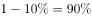
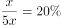

# 2018年421联考《行测》题（天津卷）（网友回忆版）

> 数量关系 · 10 题 · 天津 2018

## 第 1 题　qid 2188497 · 数学运算

一条笔直的林荫道两旁种植着梧桐树，同侧道路每两棵梧桐树间距50米。林某每天早上七点半穿过林荫道步行去上班，工作地点恰好在林荫道尽头。经测试，他每分钟步行70步，每步大约50厘米，每天早上八点准时到达工作地点。那么，这条林荫道两旁栽种的梧桐树共有：

- **A**. 44棵　✅
- **B**. 42棵
- **C**. 22棵
- **D**. 21棵

**答案**：A

**官方解析**

由“每分钟步行70步，每步大约50厘米”可得，每分钟可步行厘米，即35米/分钟。由“林某每天早上七点半出发，八点准时到达工作地点”可得，林某步行时间30分钟。由此可以计算出林某步行的路程。根据每两棵梧桐树间距50米，代入线形植树公式棵数，并考虑两旁种树的棵数应乘以2，故这条林荫道两旁栽种的梧桐树共棵。

故正确答案为A。

---

## 第 2 题　qid 2187825 · 数学运算

小庄要制作一个工业模具。他在一个边长4厘米的正方体上表面正中心位置向下挖掉一个直径2厘米、高2厘米的圆柱体，接着再向下挖掉一个直径1厘米、高1厘米的小圆柱体（如右图所示）。那么，该模具的表面积约为多少平方厘米？

- **A**. 82.8
- **B**. 108.6
- **C**. 111.7　✅
- **D**. 114.8

**答案**：C

**官方解析**

边长4厘米的正方体的表面积为平方厘米。中心位置一个直径2厘米、高2厘米的圆柱体平方厘米，一个直径1厘米、高1厘米的小圆柱体平方厘米。那么，该模具的表面积约为平方厘米。

注：挖掉的大小圆柱体底面的面积，可以叠加还原成最上层的表面，故不需要单独计算圆柱体底面积，只需要计算侧面积即可。

故正确答案为C。

---

## 第 3 题　qid 2188447 · 数学运算

甲、乙、丙三所学校的学生被安排在周一至周五参观某革命纪念馆。纪念馆每天最多只能安排一所学校，其中甲学校连续参观两天，其余学校均只参观一天，那么共有多少种安排方法？

- **A**. 12种
- **B**. 24种　✅
- **C**. 36种
- **D**. 60种

**答案**：B

**官方解析**

由于甲学校连续参观两天，故先安排甲，甲参加的时间可能为“周一和周二、周二和周三、周三和周四、周四和周五”共4种情况。甲安排好后，工作日还差3天未安排，故在其中选择2天安排乙和丙，情况数为种。故总的情况数种。

故正确答案为B。

---

## 第 4 题　qid 2187720 · 数学运算

甲、乙、丙、丁四人同时同地出发，绕一椭圆形环湖栈道行走。甲顺时针行走，其余三人逆时针行走。已知乙的行走速度为60米/分钟，丙的速度为48米/分钟。甲在出发6、7、8分钟时分别与乙、丙、丁三人相遇，求丁的行走速度是多少？

- **A**. 31米/分钟
- **B**. 36米/分钟
- **C**. 39米/分钟　✅
- **D**. 42米/分钟

**答案**：C

**官方解析**

由题意可知，甲与乙相遇，甲与丙相遇均为两人合走完一个环湖的全程。根据总路程相等，可得方程，解方程得。同理，甲与乙相遇，甲与丁相遇时的路程也相等，，解得，则丁的速度是39米/分钟。

故正确答案为C。

---

## 第 5 题　qid 2187724 · 数学运算

某苗木公司准备出售一批苗木，如果每株以4元出售，可卖出20万株，若苗木单价每提高0.4元，就会少卖10000株。问在最佳定价的情况下，该公司最大收入是多少万元？

- **A**. 60
- **B**. 80
- **C**. 90　✅
- **D**. 100

**答案**：C

**官方解析**

假设在原价基础上提价次，则共提高元，少卖了株，即万株。根据题意可得方程，收入，令，解得，，当时，取得最大值万元。

故正确答案为C。

---

## 第 6 题　qid 2187772 · 数学运算

某试验室通过测评Ⅰ和Ⅱ来核定产品的等级：两项测评都不合格的为次品，仅一项测评合格的为中品，两项测评都合格的为优品。某批产品只有测评Ⅰ合格的产品数是优品数的2倍，测评Ⅰ合格和测评Ⅱ合格的产品数之比为。若该批产品次品率为，则该批产品的优品率为：

- **A**. 

- **B**. 

- **C**. 

　✅
- **D**. 

**答案**：C

**官方解析**

假设这批产品的优品数为，则只有测评Ⅰ合格的产品数为，测评Ⅰ合格的全部产品数为，测评Ⅱ合格的产品数为。根据两集合容斥原理公式：，则这批产品非次品数量为，在总数中占比为，则产品总数为，则优品率为。

故正确答案为C。

---

## 第 7 题　qid 2187767 · 数学运算

某单位工会组织桥牌比赛，共有8人报名，随机组成4队，每队2人。那么，小王和小李恰好被分在同一队的概率是：

- **A**. 

　✅
- **B**. 

- **C**. 

- **D**. 

**答案**：A

**官方解析**

方法一：若小王和小李恰好被分在某队，这队人选总情况数为种，则小王小李刚好分在这一队的概率为。由于一共有4队，所以小王和小李可以在4队中任意一队，故小王和小李恰好被分在同一队的概率是。

方法二：若小王分到任意一队，则从其余7个人中抽1个人与小王同队，正好抽到小李的概率为。

故正确答案为A。

---

## 第 8 题　qid 2187774 · 数学运算

某水渠长100米，截面为等腰梯形，其中渠面宽2米，渠底宽1米，渠深2米。因突降暴雨，水深由1米涨至1.8米。则水渠水量增加了：

- **A**. 112立方米
- **B**. 136立方米　✅
- **C**. 272立方米
- **D**. 324立方米

**答案**：B

**官方解析**

根据题意可得下图，增加的水量断面为梯形EFGM。已知水渠截面为等腰梯形，则米，米；，则，即，米，则米；米，则米。梯形EFGM截面积为平方米。又根据水渠长100米，则水渠水量增加了立方米。

故正确答案为B。

---

## 第 9 题　qid 2187793 · 数学运算

某村民要在屋顶建造一个长方体无盖贮水池，如果池底每平方米的造价为150元，池壁每平方米的造价为120元，那么要造一个深为3米容积为48立方米的无盖贮水池最低造价是多少元？

- **A**. 6460
- **B**. 7200
- **C**. 8160　✅
- **D**. 9600

**答案**：C

**官方解析**

由“一个深为3米容积为48立方米的水池”，可计算出水池底面面积为平方米。若要此水池造价最低，根据几何最值规律：在面积一定的长方形中，正方形的周长最小。则此底面为正方形，即边长为米，池壁总面积为平方米。则这个无盖贮水池最低造价是元。

故正确答案为C。

---

## 第 10 题　qid 2187777 · 数学运算

联欢会上，有24人吃冰激凌、30人吃蛋糕、38人吃水果，其中既吃冰激凌又吃蛋糕的有12人，既吃冰激凌又吃水果的有16人，既吃蛋糕又吃水果的有18人，三样都吃的则有6人。假设所有人都吃了东西，那么只吃一样东西的人数是多少？

- **A**. 12
- **B**. 18　✅
- **C**. 24
- **D**. 32

**答案**：B

**官方解析**

如图所示，共有24人吃冰激凌，其中有12人吃了蛋糕，16人吃了水果，既吃了蛋糕又吃了水果的有6人，则只吃了冰激凌的人数为人；同理，只吃了蛋糕的人数为人；只吃了水果的人数为人，则只吃一样东西的人数为人。

故正确答案为B。

---
