# 2018年421联考《行测》题（山东卷）（网友回忆版）

> 数量关系 · 10 题 · 山东 2018

## 第 1 题　qid 2187801 · 数学运算

小张和小王18:00分别从甲、乙两地同时出发，沿相同道路匀速相向而行。18:20小张到达丙地停留，18:40两人在丙地碰面并均以出发时速度继续行进。18:50小王到达甲地，问小张在几点到达乙地？

- **A**. 20:00　✅
- **B**. 20:40
- **C**. 19:00
- **D**. 19:40

**答案**：A

**官方解析**

由题意可得：从甲到丙小张用时20分钟，从丙到甲小王用时10分钟；根据路程相等，时间和速度成反比可得：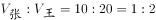。由于两人速度不变，从乙到丙小王用时40分钟；根据路程相等，时间和速度成反比可得：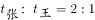，则从丙到乙小张用时分钟，故小张到达乙地。

故正确答案为A。

---

## 第 2 题　qid 2187808 · 数学运算

为响应城市节能减排政策，邻居小邢和小赵决定拼车上班。从小区开车35公里后到达小赵单位，继续直线行驶5公里后到达小邢单位。已知小赵、小邢的车在市区行驶百公里耗油分别为10L、12L，油价为每升6元。如开小赵的车，需先将小邢送至单位再原路折返回小赵单位。如开小邢的车，则无需折返。那么两种方案花费相差多少元？

- **A**. 0.9
- **B**. 1.2
- **C**. 1.8　✅
- **D**. 2.4

**答案**：C

**官方解析**

两种方案费用如下表：

则两种方案花费相差元。

故正确答案为C。

---

## 第 3 题　qid 2187815 · 数学运算

一艘船模出发后先逆流航行1分钟；掉头后顺流航行2分钟；再掉头后逆流航行3分钟……以此类推。已知船模顺流速度为30米/分钟，逆流速度为10米/分钟。问10分钟后船模的位置和20分钟后船模的位置相距多少米？

- **A**. 0
- **B**. 30
- **C**. 50
- **D**. 100　✅

**答案**：D

**官方解析**

根据题意，船模20分钟内的行进轨迹为：

则10分钟与20分钟之间船模的位置相距即为后10分钟船模的行进路程。后10分钟内，逆流5分钟，顺流5分钟，且船模的顺流速度为30米/分钟，逆流速度为10米/分钟，假设顺流方向为正，则共计行进了米。

故正确答案为D。

---

## 第 4 题　qid 2187840 · 数学运算

某企业有不到100名员工，本月只有的员工未得到每人1000元的全勤奖，只有13名员工未得到每人1000元的绩效奖，两个奖都未得到的员工占员工总数的。问企业本月共发放全勤奖和绩效奖多少万元？

- **A**. 7.1
- **B**. 12.6
- **C**. 14.8　✅
- **D**. 16.8

**答案**：C

**官方解析**

根据题意“本月只有的员工未得到全勤奖，两个奖都未得到的员工占员工总数的”，则员工总数应为12和14的公倍数，即为84的倍数。又因为“某企业有不到100名员工”，因此员工总数为84人。有人未得到全勤奖，即有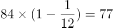人得到全勤奖；有13名未得到绩效奖，即有人得到绩效奖。则共计发放奖金总数为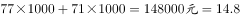万元。

故正确答案为C。

---

## 第 5 题　qid 2187847 · 数学运算

某企业招聘一批新员工，有的应聘者通过笔试，在面试环节有20人被淘汰，最终录取的人数占总应聘人数的，企业将录取的新员工分成若干个小组进行业务培训，每个小组的人数都不相同，每组至少2人，问至多可以分成多少个组？

- **A**. 7
- **B**. 8
- **C**. 5
- **D**. 6　✅

**答案**：D

**官方解析**

的人进入笔试，的人被录取，则有的人进入笔试但被淘汰，为20人，则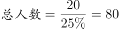人，录取的人数为人。32人分为若干个小组，人数不同且每组至少2人，要使组数多，则每个小组的人数应尽可能少，有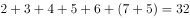，其中最后剩余的5人不能单独一组，这5人也可分给其他组只要保证不出现人数相同即可，因此最多有6组。

故正确答案为D。

---

## 第 6 题　qid 2187849 · 数学运算

甲、乙两个投资公司共同投资了A、B两个项目，甲公司在A项目中的投资额是B项目的2倍，乙公司在A项目中的投资额是B项目的一半，这两个投资公司在A项目的总投资额是B项目总投资额的1.2倍，问甲公司总投资额与乙公司总投资额之比为：

- **A**. 

- **B**. 

　✅
- **C**. 

- **D**. 

**答案**：B

**官方解析**

设甲公司在B项目的投资额为，乙公司在A项目的投资额为，根据条件有：

根据题意得，整理得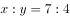。因此，甲的总投资额与乙的总投资额之比为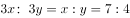。

故正确答案为B。

---

## 第 7 题　qid 2187851 · 数学运算

甲、乙、丙和丁四个依次相邻的农场分别饲养76头、82头、45头和93头牛，位置如下图所示（虚线位置为栅栏）。现由于两处栅栏损坏，有3个农场的牛混在一起。问最多需要分辨多少头牛，就一定能将所有牛还回原本的农场？

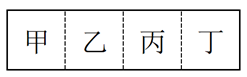

- **A**. 219　✅
- **B**. 220
- **C**. 250
- **D**. 251

**答案**：A

**官方解析**

根据“两处栅栏损坏，有3个农场的牛混在一起”可知，只能是相邻的甲乙丙或者相邻的乙丙丁混在一起。甲乙丙的和为：，乙丙丁的和为：，因为题目所求为辨认牛的数量尽可能的多，所以应是乙丙丁3个农场的牛混在一起；当剩余最后一头牛时，有两个农场的牛已返回，此牛不需再分辨，则最多要分辨头。

故正确答案为A。

---

## 第 8 题　qid 2187856 · 数学运算

商店购入一批某种水果，如按定价销售，每千克盈利23元。销售总量的后，每千克降价8元卖出剩余部分，销售这批水果共盈利2275元。问按原定售价卖出了多少千克水果？

- **A**. 60
- **B**. 65　✅
- **C**. 75
- **D**. 80

**答案**：B

**官方解析**

设共有千克水果，则按原定售价销售千克，降价销售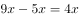千克。定价销售每千克盈利23元，当降价8元时，成本不变则每千克的盈利变为元，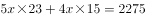，解得千克。则按原定售价卖出了千克。

故正确答案为B。

---

## 第 9 题　qid 2187861 · 数学运算

甲、乙、丙和丁四辆卡车运输一批货物，已知甲车满载可以装50箱，乙车满载可以装35箱。如果只使用甲车和丁车，满载4次正好可以运完；如果只使用乙车和丁车，满载5次正好可以运完；如果只使用丙车和丁车，满载6次正好可以运完。问丙车满载可以装多少箱？

- **A**. 18
- **B**. 20
- **C**. 25　✅
- **D**. 27

**答案**：C

**官方解析**

假设丙车和丁车的满载量分别为丙箱和丁箱，根据运输货物总量不变：，解方程得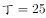箱。同理，，解方程箱。

故正确答案为C。

---

## 第 10 题　qid 2187864 · 数学运算

某市场调查公司3个调查组共40余人，每组都有10余人且人数各不相同。2017年重新调整分组时发现，若想分为4个人数相同的小组，至少需要新招1人；若想分为5个人数相同的小组，至少还需要新招2人。问原来3个组中人数最多的组比人数最少的组至少多几人？

- **A**. 2
- **B**. 3　✅
- **C**. 4
- **D**. 5

**答案**：B

**官方解析**

设总数为，根据题意可知4050，又因为是4的倍数，且为5的倍数，只有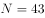满足所有要求。要想人数最多的组与最少的组相差人数尽可能少,则最多的组人数尽量的少，最少的组尽量的多。设人数最多的组为人，则人数第二多的组至多为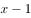人，人数最少的组至多为人。根据总人数列方程可得：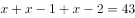人，解得人，最少的组人。人数最多的组至少为16人，人数最少的组至多为13人，此时二者相差最少为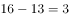人。

故正确答案为B。

---
