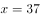
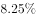
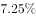
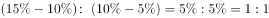
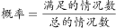
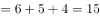
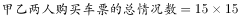

# 2018年421联考《行测》题（新疆卷）（网友回忆版）

> 数量关系 · 15 题 · 新疆 2018

## 第 1 题　qid 2188447 · 数学运算

甲、乙、丙三所学校的学生被安排在周一至周五参观某革命纪念馆。纪念馆每天最多只能安排一所学校，其中甲学校连续参观两天，其余学校均只参观一天，那么共有多少种安排方法？

- **A**. 12种
- **B**. 24种　✅
- **C**. 36种
- **D**. 60种

**答案**：B

**官方解析**

由于甲学校连续参观两天，故先安排甲，甲参加的时间可能为“周一和周二、周二和周三、周三和周四、周四和周五”共4种情况。甲安排好后，工作日还差3天未安排，故在其中选择2天安排乙和丙，情况数为种。故总的情况数种。

故正确答案为B。

---

## 第 2 题　qid 2187720 · 数学运算

甲、乙、丙、丁四人同时同地出发，绕一椭圆形环湖栈道行走。甲顺时针行走，其余三人逆时针行走。已知乙的行走速度为60米/分钟，丙的速度为48米/分钟。甲在出发6、7、8分钟时分别与乙、丙、丁三人相遇，求丁的行走速度是多少？

- **A**. 31米/分钟
- **B**. 36米/分钟
- **C**. 39米/分钟　✅
- **D**. 42米/分钟

**答案**：C

**官方解析**

由题意可知，甲与乙相遇，甲与丙相遇均为两人合走完一个环湖的全程。根据总路程相等，可得方程，解方程得。同理，甲与乙相遇，甲与丁相遇时的路程也相等，，解得，则丁的速度是39米/分钟。

故正确答案为C。

---

## 第 3 题　qid 2188497 · 数学运算

一条笔直的林荫道两旁种植着梧桐树，同侧道路每两棵梧桐树间距50米。林某每天早上七点半穿过林荫道步行去上班，工作地点恰好在林荫道尽头。经测试，他每分钟步行70步，每步大约50厘米，每天早上八点准时到达工作地点。那么，这条林荫道两旁栽种的梧桐树共有：

- **A**. 44棵　✅
- **B**. 42棵
- **C**. 22棵
- **D**. 21棵

**答案**：A

**官方解析**

由“每分钟步行70步，每步大约50厘米”可得，每分钟可步行厘米，即35米/分钟。由“林某每天早上七点半出发，八点准时到达工作地点”可得，林某步行时间30分钟。由此可以计算出林某步行的路程。根据每两棵梧桐树间距50米，代入线形植树公式棵数，并考虑两旁种树的棵数应乘以2，故这条林荫道两旁栽种的梧桐树共棵。

故正确答案为A。

---

## 第 4 题　qid 2188743 · 数学运算

老师拿来一箱笔记本让班长负责给同学们分发，如果每人发2本，还剩22本，如果每人发3本，就少15本，该班共有多少学生？

- **A**. 37　✅
- **B**. 34
- **C**. 23
- **D**. 17

**答案**：A

**官方解析**

假设该班共有名学生，根据老师两次分发的笔记本总数不变可得：，解方程得。

故正确答案为A。

---

## 第 5 题　qid 2187727 · 数学运算

某银行推出3年期和5年期的两种理财产品A和B。小王分别购买这两种产品各1万元，结果发现，按单利计算（即利息不产生收益），B产品平均年收益率比A产品多2个百分点，期满后，B产品总收益是A产品的2.5倍。那么，小王各花1万元购买A、B两种产品的平均年收益分别是：

- **A**. 700元和900元
- **B**. 600元和900元
- **C**. 500元和700元
- **D**. 400元和600元　✅

**答案**：D

**官方解析**

设A产品的平均年收益率为，则B产品的平均年收益率为，根据A、B两种产品的总收益关系可得，，解得。所以A产品的平均年收益为，B产品的平均年收益为。

故正确答案为D。

---

## 第 6 题　qid 2187755 · 数学运算

一直升机在海上救援行动中搜索到遇险者方位后通知快艇，快艇立即朝遇险者直线驶去。此时，直升机距离海平面的垂直高度200米，从机上看，遇险者在正南方向，俯角（朝下看时视线与水平面的夹角）为，快艇在正东方向，俯角为。若忽略当时风向、潮流等其它因素，且假定遇险者位置不变，则快艇以60千米/小时的速度匀速前进需要多长时间才能到达遇险者的位置？

- **A**. 21秒
- **B**. 22秒
- **C**. 23秒
- **D**. 24秒　✅

**答案**：D

**官方解析**

因为直升机距离海平面的垂直高度200米，在机上看遇险者俯角为，所以直升机和遇险者的水平距离为米；同理，直升机和快艇的水平距离为米。如图所示，直升机在O点正上方200米A点处，遇险者在正南方向的B点，快艇在正东方向的C点，其中米，米，所以米。快艇的速度为60千米/小时=米/秒，所以快艇匀速前进到达遇险者的位置所需要的时间是秒。

故正确答案为D。

---

## 第 7 题　qid 2187724 · 数学运算

某苗木公司准备出售一批苗木，如果每株以4元出售，可卖出20万株，若苗木单价每提高0.4元，就会少卖10000株。问在最佳定价的情况下，该公司最大收入是多少万元？

- **A**. 60
- **B**. 80
- **C**. 90　✅
- **D**. 100

**答案**：C

**官方解析**

假设在原价基础上提价次，则共提高元，少卖了株，即万株。根据题意可得方程，收入，令，解得，，当时，取得最大值万元。

故正确答案为C。

---

## 第 8 题　qid 2187772 · 数学运算

某试验室通过测评Ⅰ和Ⅱ来核定产品的等级：两项测评都不合格的为次品，仅一项测评合格的为中品，两项测评都合格的为优品。某批产品只有测评Ⅰ合格的产品数是优品数的2倍，测评Ⅰ合格和测评Ⅱ合格的产品数之比为。若该批产品次品率为，则该批产品的优品率为：

- **A**. 

- **B**. 

- **C**. 

　✅
- **D**. 

**答案**：C

**官方解析**

假设这批产品的优品数为，则只有测评Ⅰ合格的产品数为，测评Ⅰ合格的全部产品数为，测评Ⅱ合格的产品数为。根据两集合容斥原理公式：，则这批产品非次品数量为，在总数中占比为，则产品总数为，则优品率为。

故正确答案为C。

---

## 第 9 题　qid 2187777 · 数学运算

联欢会上，有24人吃冰激凌、30人吃蛋糕、38人吃水果，其中既吃冰激凌又吃蛋糕的有12人，既吃冰激凌又吃水果的有16人，既吃蛋糕又吃水果的有18人，三样都吃的则有6人。假设所有人都吃了东西，那么只吃一样东西的人数是多少？

- **A**. 12
- **B**. 18　✅
- **C**. 24
- **D**. 32

**答案**：B

**官方解析**

如图所示，共有24人吃冰激凌，其中有12人吃了蛋糕，16人吃了水果，既吃了蛋糕又吃了水果的有6人，则只吃了冰激凌的人数为人；同理，只吃了蛋糕的人数为人；只吃了水果的人数为人，则只吃一样东西的人数为人。

故正确答案为B。

---

## 第 10 题　qid 2188744 · 数学运算

将浓度为和的盐水各1000克，分别倒出若干配置成浓度为的盐水1200克，将剩下的盐水全部混合在一起，得到的盐水浓度为：

- **A**. 

　✅
- **B**. 

- **C**. 

- **D**. 

**答案**：A

**官方解析**

根据线段法，混合溶液的浓度之差与溶液量成反比，，则两种溶液量的比例为1:1。又因为两种溶液的总量相同，则剩下质量也为1:1，再次混合的情况与倒出部分完全相同，那么混后浓度依然为。

故正确答案为A。

---

## 第 11 题　qid 2358729 · 数学运算

某加工厂要将一批规格相同的三角形铁片裁制成尽可能大的圆形垫片和正方形垫片。如果三角形铁片的三条边长分别为5厘米、12厘米和13厘米，那么，裁制而成的正方形垫片边长和圆形垫片直径分别是多少厘米?

- **A**. 
，

- **B**. 
，
　✅
- **C**. 
，

- **D**. 
，

**答案**：B

**官方解析**

如图所示，要想三角形铁片裁制的圆形垫片尽可能大，则圆应与三角形铁片相切。设内切圆半径为r，，则，解得。故圆形垫片直径为，排除A、C两项。

要想三角形铁片裁制的正方形垫片尽可能大，可如图所示剪裁正方形。设正方形边长为，根据与相似，则，即，解得。，排除D项。

故正确答案为B。

---

## 第 12 题　qid 2188545 · 数学运算

A、B两地间有三种类型列车运行，其中高速铁路动车组列车每天6车次，普通动车组列车每天5车次，快速旅客列车每天4车次。甲、乙两人要同一天从A地出发前往B地。假设他们买票前没有互通信息，而且火车票票源充足，问他们买到同一趟列车车票的概率有多大？

- **A**. 
小于
　✅
- **B**. 
到之间

- **C**. 
到之间

- **D**. 
到之间

**答案**：A

**官方解析**

方法一：，由题意从A到B的买到的车票种类数种，则。甲乙都买同一趟列车共有15种情况，因此他们买到同一趟列车车票的概率。

方法二：从A到B共有6+5+4=15种选择，其中任意一人从A到B有15种选择，另外一人与该人买到同一趟列车车票，即只有一种情况，因此满足条件的概率为。

故正确答案为A。

---

## 第 13 题　qid 2187796 · 数学运算

一个班级组织跑步比赛，共设100米、200米、400米三个项目。班级有50人，报名参加100米比赛的有27人，参加200米比赛的有25人，参加400米比赛的有21人。如果每人最多只能报名参加2项比赛，那么该班最多有多少人未报名参赛？

- **A**. 11
- **B**. 12
- **C**. 13　✅
- **D**. 14

**答案**：C

**官方解析**

由“每人最多只能报名参加2项比赛”可得，报名三项的人数为0。设参加两项的人数为，未报名参赛的人为，根据三集合非标准公式可得：，化简得。

要让未报名参赛的人最多，则让尽量多。考虑让参加两项的人尽量多，则每人尽量参与两项，此时最多为人，向下取整为36人，即最多为36，故最多为人。

故正确答案为C。

---

## 第 14 题　qid 2187774 · 数学运算

某水渠长100米，截面为等腰梯形，其中渠面宽2米，渠底宽1米，渠深2米。因突降暴雨，水深由1米涨至1.8米。则水渠水量增加了：

- **A**. 112立方米
- **B**. 136立方米　✅
- **C**. 272立方米
- **D**. 324立方米

**答案**：B

**官方解析**

根据题意可得下图，增加的水量断面为梯形EFGM。已知水渠截面为等腰梯形，则米，米；，则，即，米，则米；米，则米。梯形EFGM截面积为平方米。又根据水渠长100米，则水渠水量增加了立方米。

故正确答案为B。

---

## 第 15 题　qid 2187793 · 数学运算

某村民要在屋顶建造一个长方体无盖贮水池，如果池底每平方米的造价为150元，池壁每平方米的造价为120元，那么要造一个深为3米容积为48立方米的无盖贮水池最低造价是多少元？

- **A**. 6460
- **B**. 7200
- **C**. 8160　✅
- **D**. 9600

**答案**：C

**官方解析**

由“一个深为3米容积为48立方米的水池”，可计算出水池底面面积为平方米。若要此水池造价最低，根据几何最值规律：在面积一定的长方形中，正方形的周长最小。则此底面为正方形，即边长为米，池壁总面积为平方米。则这个无盖贮水池最低造价是元。

故正确答案为C。

---
