# 2018年421联考《行测》题（江西卷）（网友回忆版）

> 数量关系 · 15 题 · 江西 2018

## 第 1 题　qid 2188282 · 数学运算

甲、乙两家园林公司共同完成两个项目。已知甲公司单独完成项目Ⅰ需要3天，单独完成项目Ⅱ需要12天；乙公司单独完成项目Ⅰ需要5天，单独完成项目Ⅱ需要8天，并且甲公司在开工后的第2天，因故停工1天。那么，两家公司共同完成两个项目最少需要多少天？

- **A**. 

- **B**. 
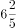
　✅
- **C**. 

- **D**. 
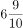

**答案**：B

**官方解析**

由题干可得，甲公司做项目Ⅰ所需时间（3天）比乙公司（5天）少；乙公司做项目Ⅱ所需时间（8天）比甲公司（12天）少，求最少需要多少天，应由甲公司做项目Ⅰ、乙公司做项目Ⅱ，则甲公司3天可以完成项目Ⅰ，又由“开工后第2天停工1天”，则甲公司完成项目Ⅰ的时间为天。

赋值项目Ⅱ的工程总量（12和8的最小公倍数），则甲公司做项目Ⅱ的效率、乙公司做项目Ⅱ的效率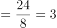。当甲公司用4天完成项目Ⅰ后，乙公司也完成了个工作量，项目Ⅱ剩余总量。若要共同完成两个项目时间最短，则需两公司合作完成项目Ⅱ的剩余部分，因此总时间共需天。

故正确答案为B。

---

## 第 2 题　qid 2188296 · 数学运算

将一长度为的线段任意截成三段，设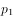为所截的三线段能构成三角形的概率，为所截的三线段不能构成三角形的概率，则下列选项正确的是：

- **A**. 

- **B**. 

- **C**. 
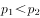
　✅
- **D**. 
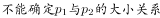

**答案**：C

**官方解析**

方法一：设三条线段的长度分别为、、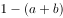，由三角形定理“两边之和大于第三边”可得：

；

；

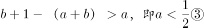。

则概率如图所示：

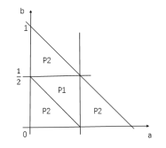

则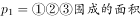，总情况数为和两个坐标轴围成的面积，故；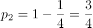，则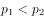。

方法二：由三角形定理“两边之和大于第三边”，可得：当其中一边长度时，不能构成三角形。在这条线段上，先任取一个截点，那么第二个截点与其位于中点同侧或不同侧的概率均为，分类讨论如下：

当第二个截点与第一个截点在同侧时，两个截点中的任意一个与另一侧的端点之间的距离必然，不能构成三角形，即；

当第二个截点与第一个截点在不同侧时，有可能两个截点之间的长度，如下图所示，此时截成的三条线段将无法构成三角形，即。

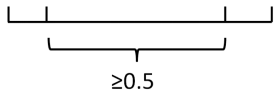

综合以上两种情况，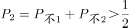，而，则。

故正确答案为C。

---

## 第 3 题　qid 2188303 · 数学运算

设乙地在甲、丙两地之间，小赵从乙地出发到甲地去送材料，小钱从乙地到丙地去送另一份材料，两人同时出发，10分钟后，小孙发现小赵小钱两人都忘记带介绍信，于是他从乙地出发骑车去追赶小赵和小钱，以便把介绍信送给他们。已知小赵小钱小孙的速度之比为1:2:3，且中途不停留。那么，小孙从乙地出发到把介绍信送到后返回乙地最少需要多少分钟？

- **A**. 45
- **B**. 70
- **C**. 90　✅
- **D**. 95

**答案**：C

**官方解析**

设小赵、小钱和小孙的速度分别为1、2和3。

若小孙先追小赵，再追小钱：10分钟后，小赵的路程为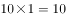，此时小孙开始追小赵，根据，可得：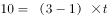，分钟，即5分钟后小孙追上小赵，再用5分钟小孙返回乙地；此时小钱出发时间分，，根据，可得：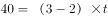，分钟，即小孙又用了40分钟追上小钱，再用40分钟返回乙地。则小孙从乙地出发到把介绍信送到后返回乙地用时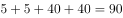分钟。

若小孙先追小钱，再追小赵：10分钟后，小钱的路程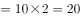，此时小孙开始追小钱，根据，可得：，分钟，即20分钟后小孙追上小钱，再用20分钟小孙返回乙地；此时小赵出发时间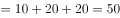分，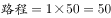，根据，可得：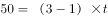，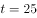分钟，即小孙又用了25分钟追上小赵，再用25分钟返回乙地。则小孙从乙地出发到把介绍信送到后返回乙地用时分钟。

故正确答案为C。

---

## 第 4 题　qid 2188310 · 数学运算

一家三口，妈妈比儿子大26岁，爸爸比儿子大33岁。1995年，一家三口的年龄之和为62。那么，2018年儿子、妈妈和爸爸的年龄分别是：

- **A**. 23，51，57
- **B**. 24，50，57　✅
- **C**. 25，51，57
- **D**. 26，52，58

**答案**：B

**官方解析**

方法一：设儿子1995年的年龄为岁，则妈妈的年龄为岁，爸爸的年龄为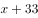岁。由于1995年一家三口年龄和为62，则有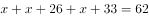，解得。因此儿子在1995年为1岁，则2018年儿子是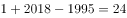岁，只有B项符合。

方法二：选项信息充分，考虑代入排除。根据题意“妈妈比儿子大26岁，爸爸比儿子大33岁”，依次代入选项：

A项51-23=28，妈妈比儿子大28岁，不符合题意，排除A项；

B项：满足50-24=26，57-24=33，满足条件，保留；

C项：57-25=32，即爸爸比儿子大32岁，不符合题意，排除；

D项，58-26=32，即爸爸比儿子大32岁，不符合题意，排除。

故正确答案为B。

---

## 第 5 题　qid 2188315 · 数学运算

设a、b、c、d分别代表四棱台、圆柱、正方体和球体，已知这四个几何体的表面积相同，则体积最小与体积最大的几何体分别是：

- **A**. d和a
- **B**. c和d
- **C**. a和d　✅
- **D**. d和b

**答案**：C

**官方解析**

根据几何问题中立体图形的性质：立体图形中，表面积一定，越接近于球，其体积越大。则四个立体图形中体积最大的一定是球体（d），排除A、D。剩余三个图形中，最不接近球体的是四棱台（a），因此其体积最小。
故正确答案为C。

---

## 第 6 题　qid 2188270 · 数学运算

在一条公路上每隔10里有一个集散地，共有5个集散地，其中一号集散地有旅客10人，三号集散地有25人，五号集散地有45人，其余两个集散地没有人。如果把所有人集中到一个集散地，那么，所有旅客所走的总里数最少是：

- **A**. 1100
- **B**. 900　✅
- **C**. 800
- **D**. 700

**答案**：B

**官方解析**

要使所有旅客走的总里数最少，则应该使人数多的集散地尽可能地少移动。根据货物集中问题原则，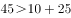，所以应把所有人集中在五号集散地。此时1号集散地的旅客每人走里。三号集散地的旅客每人走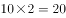里。总里数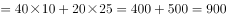里。

故正确答案为B。

---

## 第 7 题　qid 2188276 · 数学运算

某高校组织200名学生植树198棵，其中有一人植1棵，其余的199人分成甲乙两组，甲组每人植3棵，乙组每两人植1棵。那么，甲乙两组各有多少名学生？

- **A**. 49，140
- **B**. 39，160　✅
- **C**. 29，170
- **D**. 19，180

**答案**：B

**官方解析**

方法一：甲乙两组共植树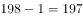棵，甲乙两组共199人，设甲组有甲人，乙组有乙人。根据题意，有

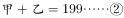

解得，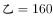。

方法二：直接代入排除。A项，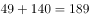人，不符合题意“其余的199人分成甲乙两组”，排除A项；B项，，满足所有题意，当选；C项，，排除C项；D项，，排除D项。

故正确答案为B。

---

## 第 8 题　qid 2188278 · 数学运算

张三和李四准备进行一个娱乐游戏：将一枚质地均匀的硬币连续抛三次，如果落地后三次都是正面朝上或三次都是反面朝上，则李四就给张三糖果；但如果出现两次正面一次反面或两次反面一次正面，则张三就给李四糖果，且李四要求张三每次给15颗糖果。那么，从长远来看，张三应该要求李四每次至少给多少颗糖果才能考虑参加这个娱乐游戏？

- **A**. 30
- **B**. 35
- **C**. 40
- **D**. 45　✅

**答案**：D

**官方解析**

落地后三次正面朝上或三次反面朝上的概率，李四给张三糖果的概率为，出现两次正面一次反面或两次反面一次正面的概率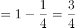，张三给李四糖果的概率为。从长远来看，张三要考虑参加这个游戏，只有给李四的糖果数量小于等于李四给他的数量，即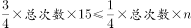，则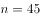颗，即张三应该要求李四每次至少给45颗糖果。

故正确答案为D。

---

## 第 9 题　qid 2188284 · 数学运算

某学院从9名同学中选出4名同学去四个不同的乡镇甲、乙、丙、丁参加三下乡社会实践活动，其中有两名同学不能去乡镇丁，则分配方案共有多少种？

- **A**. 2352　✅
- **B**. 2452
- **C**. 2552
- **D**. 2652

**答案**：A

**官方解析**

方法一：首先，有两名同学不能去乡镇丁，则去丁的一名同学应从其他7个中选取，有7种方法；其次，剩余三个乡镇没有要求，则从其他8个同学中任意选取三个即可，有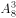种方法。因此分配方案共有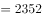种。

方法二：“有两名同学不能去乡镇丁”也可以考虑从反面入手。有两名同学不能去乡镇丁的情况数=总情况数-这两名同学去乡镇丁的情况数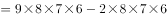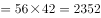种。

故正确答案为A。

---

## 第 10 题　qid 2188297 · 数学运算

甲、乙、丙、丁4人去完成四项任务，并要求每人只完成一项任务，每一项任务只能由一人完成，每人完成各项任务的所用时间（单位：小时）如下表：

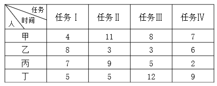

则最优分配方案是：

- **A**. 甲—任务Ⅰ，乙—任务Ⅱ，丙—任务Ⅳ，丁—任务Ⅲ
- **B**. 甲—任务Ⅰ，乙—任务Ⅲ，丙—任务Ⅱ，丁—任务Ⅳ
- **C**. 甲—任务Ⅳ，乙—任务Ⅱ，丙—任务Ⅲ，丁—任务Ⅰ
- **D**. 甲—任务Ⅰ，乙—任务Ⅲ，丙—任务Ⅳ，丁—任务Ⅱ　✅

**答案**：D

**官方解析**

最优方案是每人选择最擅长的任务。
甲用时最短的是完成任务Ⅰ，只需4小时，则安排甲做任务Ⅰ；
乙用时最短的是完成任务Ⅱ和任务Ⅲ，均需3小时，则做两项都可以；
丙用时最短的是完成任务Ⅳ，只需2小时，则安排丙做任务Ⅳ；
丁用时最短的是完成任务Ⅰ和任务Ⅱ，均需5小时，甲比丁更擅长做任务Ⅰ，安排甲做任务Ⅰ，丁做任务Ⅱ，则乙做任务Ⅲ。即甲—任务Ⅰ，乙—任务Ⅲ，丙—任务Ⅳ，丁—任务Ⅱ。
故正确答案为D。

---

## 第 11 题　qid 2188286 · 数学运算

为了节约水资源，某城市规定每人每月不超过5吨，则按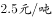收费；超出5吨的，超出部分按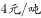收费，每次收费时用水量都按整数计算，已知胡家3口人，熊家4口人。某月月底结算时，胡家收费69.5元，比熊家多交了15.5元。那么，熊家该月用了多少吨水？

- **A**. 20
- **B**. 21　✅
- **C**. 22
- **D**. 23

**答案**：B

**官方解析**

熊家该月收费元。设熊家该月用了吨水，根据总收费为两部分的和可得方程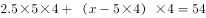。解方程得吨。

故正确答案为B。

---

## 第 12 题　qid 2188288 · 数学运算

某高校做有关碎片化学习的问卷调查，问卷回收率为，在调查对象中有180人会利用网络课程进行学习，200人利用书本进行学习，100人利用移动设备进行碎片化学习，同时使用三种方式学习的有50人，同时使用两种方式学习的有20人，不存在三种方式学习都不用的人。那么，这次共发放了多少份问卷？

- **A**. 370
- **B**. 380
- **C**. 390
- **D**. 400　✅

**答案**：D

**官方解析**

设共发放问卷份，根据容斥原理三集合非标准型公式：，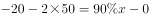，解得。则这次共发放了400份问卷。

故正确答案为D。

---

## 第 13 题　qid 2188299 · 数学运算

小李四年前投资的一套商品房价格上涨了，由于担心房价下跌，将该商品房按市价的9折出售，扣除成交价的相关交易费用后，比买进时赚了56.5万元。那么，小李买进该商品房时花了多少万元？

- **A**. 200　✅
- **B**. 250
- **C**. 300
- **D**. 350

**答案**：A

**官方解析**

设买进该商品房时成本为万元，则定价为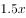，实际售价为。利润，解得。

故正确答案为A。

---

## 第 14 题　qid 2188306 · 数学运算

某品牌的葛粉进价为20元，现降价卖出，结果还获得进价的利润。那么，该葛粉的定价是多少元？

- **A**. 36
- **B**. 37
- **C**. 38　✅
- **D**. 39

**答案**：C

**官方解析**

设葛粉的定价为元，售价为元，利润为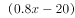元，利润率，解得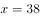元。

故正确答案为C。

---

## 第 15 题　qid 2188316 · 数学运算

某自助餐饮店推出了两种自助方案：甲方案成人每人90元，小孩每人60元；乙方案无论大人小孩，每人均为70元。现有人组团就餐，并规定1个大人至多带2个小孩就餐。那么，对于这些顾客来说：

- **A**. 只要选择甲方案都不会吃亏
- **B**. 甲方案总是比乙方案更优惠
- **C**. 只要选择乙方案都不会吃亏　✅
- **D**. 甲方案和乙方案一样优惠

**答案**：C

**官方解析**

假设该团中没有小孩，则甲方案平均每人90元，乙为70元，乙优于甲，排除A、B、D三项。
故正确答案为C。

---
