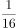
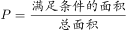
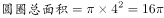
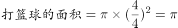
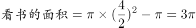
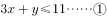
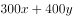
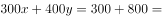

# 2018年421联考《行测》题（贵州卷）（网友回忆版）

> 数量关系 · 10 题 · 贵州 2018

## 第 1 题　qid 2187513 · 数学运算

两对夫妇各带一个小孩乘坐有6个座位的游览车，游览车每排只有1个座位。为安全起见，车的首尾两座一定要坐两位爸爸；两个小孩一定要排在一起。那么，这6人的排座方法有：

- **A**. 12种
- **B**. 24种　✅
- **C**. 36种
- **D**. 48种

**答案**：B

**官方解析**

由题干“排座方法有”，判断本题为排列组合问题。根据题意，先在车的首尾安排两位爸爸，考虑顺序，有种排座方法；再将两个小孩进行捆绑排在一起，有种方法；最后将两个小孩作为一个主体和两个妈妈排在一起，有种方法。分步用乘法，共种方法。

故正确答案为B。

---

## 第 2 题　qid 2187536 · 数学运算

现有一种浓度为的盐水30千克，如果用50千克浓度更高的盐水和它混合，混合后的盐水浓度将大于，而小于。据此可知，后加入的盐水的浓度（假设浓度为）范围是：

- **A**. 
 
　✅
- **B**. 

- **C**. 

- **D**. 

**答案**：A

**官方解析**

根据题意及溶液混合前后溶质（盐）质量不变可得：，整理得，解得：。

故正确答案为A。

---

## 第 3 题　qid 2188112 · 数学运算

在一个不透明的布袋中，有红色、黑色、白色的小球共60个。小明通过足够多次摸球试验后发现其中摸到红色球、黑色球的概率分别为、。那么，口袋中白色球的个数最可能是：

- **A**. 25
- **B**. 26
- **C**. 27　✅
- **D**. 29

**答案**：C

**官方解析**

根据，可知个，个，则个。

故正确答案为C。

---

## 第 4 题　qid 2187538 · 数学运算

小波通过往圆圈里投掷米粒（米粒本身长度不计，视为一个点）的方式决定自己的周末活动。经过试验，他将米粒投进圆圈内的成功率达到，但投掷在圆内的位置随机。如果米粒到圆心的距离大于圆半径的一半，那么他周末去看电影；若米粒到圆心的距离小于半径的，他会去打篮球；否则，他将在家看书。据此可知小波周末不在家看书的概率为：

- **A**. 

　✅
- **B**. 

- **C**. 

- **D**. 

**答案**：A

**官方解析**

因题目中圆的半径均为比例关系，且最终所求概率，也为比例，故可设圆圈半径为4，则。如图所示：；，则小波周末不在家看书的概率。

故正确答案为A。

---

## 第 5 题　qid 2187544 · 数学运算

小张家养了一只大狗和一只小狗。现在，小狗的体重只有大狗的一半。如果两只狗的体重各增加5千克，那么小狗的体重将达到大狗的。据此可知，若两只狗的体重各增加10千克，小狗、大狗的体重比将会是：

- **A**. 

- **B**. 

　✅
- **C**. 

- **D**. 

**答案**：B

**官方解析**

设小狗的体重为千克，则大狗的体重为千克。根据“两只狗的体重各增加5千克，那么小狗的体重将达到大狗的”，则有，解得，则大狗的体重为20千克。此时各增加10千克，则小狗、大狗的体重分别为千克、千克，则小狗、大狗的体重比为。

故正确答案为B。

---

## 第 6 题　qid 2187539 · 数学运算

某公司有员工100人从事某产品的生产。现在，公司决定从这些员工中分流一些去生产新产品。分流后，继续从事老产品生产的员工平均每人每年创造产值在原有的基础上最多可增长1.2倍。若要保证老产品的年产值不减少，则最多能分流的人数是：

- **A**. 15人
- **B**. 16人
- **C**. 53人
- **D**. 54人　✅

**答案**：D

**官方解析**

根据题意，公司共有100人从事生产，假设每人每年的产值为1，则总产值为100。分流后每位员工创造产值最多可增长1.2倍，即最多为。若要保证老产品的年产值不减少，则，，即最少要有46人从事老产品的生产，因此最多分流人。

故正确答案为D。

---

## 第 7 题　qid 2187518 · 数学运算

A、B两种规格的产品需要在甲、乙两台机器上各自加工一道工序才能成为成品。已知A产品需要在甲机器上加工3小时，在乙机器上加工1小时；B产品需要在甲机器上加工1小时，在乙机器上加工3小时。在一个工作日内，甲机器至多只能使用11小时，乙机器至多只能使用9小时。A产品每件利润300元，B产品每件利润400元。据此可知，若这两台机器只加工A、B这两种产品，那么它们在一个工作日内能创造的最大利润为：

- **A**. 1600元
- **B**. 1700元　✅
- **C**. 1800元
- **D**. 2000元

**答案**：B

**官方解析**

设生产件A产品，生产件B产品。根据两台机器都有最大使用时间，则有

要想利润最多，则要尽可能的大。、均为整数，考虑代入，最大值为3，最小值为0：

时，要满足①②两式，最大为2，此时利润元；

时，要满足①②两式，最大为2，此时利润；

时，要满足①②两式，最大为2，此时利润；

时，要满足①②两式，最大为3，此时利润；

所以当，时，利润最大，为1700元。

故正确答案为B。

---

## 第 8 题　qid 2188117 · 数学运算

某公司将在本周一至周日连续七天举办联谊会，某员工随机地选择其中的连续两天参加联谊会，那么他在周五至周日期间连续两天参加联谊会的概率为：

- **A**. 

- **B**. 

　✅
- **C**. 

- **D**. 

**答案**：B

**官方解析**

满足“周五至周日期间连续两天参加联谊会”的情况数为2种，即周五周六、周六周日参加联谊会；总情况数为在本周一至周日连续七天内选择连续两天参加联谊会，有6种情况（即周一周二、周二周三、周三周四、周四周五、周五周六、周六周日6种情况）。故。

故正确答案为B。

---

## 第 9 题　qid 2187520 · 数学运算

有一项测验由20道单选题组成，每道题有A、B、C、D四个选项。回答正确1道题得2分，回答错误1道题倒扣1分。若20道题全部选择A，得分将为分；若全部选B，得分将为4分；若全部选C，得分将为1分。那么该项测验中正确答案为D项的题目有多少道？

- **A**. 0　✅
- **B**. 2
- **C**. 3
- **D**. 4

**答案**：A

**官方解析**

设正确答案为A项、B项、C项和D项的题量分别为a道、b道、c道和d道。根据题意可得方程组，,解得，则。

故正确答案为A。

---

## 第 10 题　qid 2187523 · 数学运算

某市地铁1号线、2号线均是早上6点首发，分别间隔4分钟、6分钟发一次车。小李每天上班的路线及所需时间为：早上从家步行5分钟到达地铁1号线A站乘车（列车从1号线起点到A站需行驶15分钟），15分钟后到达B站，随后步行4分钟抵达2号线的起点站C，然后换乘2号线，20分钟后到D站，最后步行6分钟到达公司。据此，小李在保证9点能到达公司的前提下，早上最迟离家时间是：

- **A**. 8:10
- **B**. 8:08
- **C**. 8:06　✅
- **D**. 8:04

**答案**：C

**官方解析**

题目复杂，考虑代入。题目问最迟离家时间，从A选项开始代入：

表中1号线的发车时间是根据6点首发、发车间隔为4分钟，以及运行到站需要15分钟计算所得；同理，表中2号线的发车时间是根据6点首发且发车间隔为6分钟计算所得。问题为最迟离家时间，对应C项。

故正确答案为C。

---
