# 2018年421联考《行测》题（陕西卷）（网友回忆版）

> 数量关系 · 13 题 · 陕西 2018

## 第 1 题　qid 2188146 · 数学运算

（    ），4，9，16，27，38，（    ）

- **A**. 0
- **B**. 2　✅
- **C**. 53　✅
- **D**. 68

**答案**：BC

**官方解析**

数列中各个数字均位于幂次数附近，考虑幂次数列。观察可得：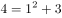、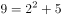、、、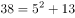，即幂次均为2，底数为1、2、3、4、5的等差列，修正项为3、5、7、11、13的质数列。故首项，末项。

故正确答案为BC。

---

## 第 2 题　qid 2188154 · 数学运算

（    ），10，7，9，9，15，（    ）

- **A**. 11
- **B**. 13　✅
- **C**. 23　✅
- **D**. 31

**答案**：BC

**官方解析**

观察数列可得：第四项、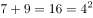、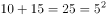，即以中间项9为中点，左右两项相加之和为平方数，则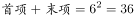，只有BC（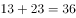）满足条件。

故正确答案为BC。

---

## 第 3 题　qid 2188161 · 数学运算

-3，4，-1，（  ），1，4，（  ）

- **A**. 0　✅
- **B**. 1
- **C**. 2
- **D**. 3　✅

**答案**：AD

**官方解析**

数列多次出现4和1这样的幂次数，考虑将数列转换成幂次形式。原数列转换后可得：

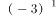，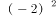 ，， ， ，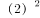，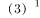。底数为公差为1的等差数列，指数为1、2交替出现的循环数列。故两空所在位置分别为和即0和3。

故正确答案为AD。

---

## 第 4 题　qid 2188153 · 数学运算

苗苗有一堆草莓，乐乐也有一堆草莓。苗苗的草莓五个五个地数，最后剩两个，七个七个地数，最后还是剩两个；乐乐的草莓五个五个地数，最后剩四个，六个六个地数，最后剩三个。已知苗苗比乐乐多8个草莓，则苗苗的草莓数为（  ）

- **A**. 37
- **B**. 62
- **C**. 72
- **D**. 77
- **E**. 87
- **F**. 92
- **G**. 102
- **H**. 107　✅

**答案**：H

**官方解析**

根据题意，苗苗的草莓数量-2之后既是5的倍数，又是7的倍数，则-2之后应是35的倍数，排除B、D、E、F、G共5项。又因为乐乐的草莓数量-4之后是5的倍数，且-3之后是6的倍数，则乐乐的草莓数量是3的倍数。因为苗苗草莓数量比乐乐多8个，则苗苗的草莓数量-8之后是3的倍数，只有107符合。
故正确答案为H。

---

## 第 5 题　qid 2188162 · 数学运算

有一个特制的钟，一昼夜的时间为20小时，每小时100分钟，钟面上刻有从1到10十个计时数字，均匀分布，每两个数字之间有10个刻度。正午12点时，这个钟显示为10点整，那么下午3点半时，这个钟的时针与分针的夹角为多少度？

- **A**. 55
- **B**. 60
- **C**. 65
- **D**. 70
- **E**. 105
- **F**. 115
- **G**. 125
- **H**. 135　✅

**答案**：H

**官方解析**

由于正常的钟从正午12点至下午3点半，共走了3.5小时，则特制的钟在这段时间里应该走了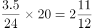小时。由于特制的钟表盘上共有10个大刻度，时针每小时会走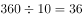度，因此时针共走了度；分针每小时会走一圈，即360度，小时走了2圈又圈，距10点整还差度，因此这个钟的时针与分针之间的夹角为度。

故正确答案为H。

---

## 第 6 题　qid 2188165 · 数学运算

某企业引进新技术后，原材料成本降低了，单位人工成本上涨了，所需要的工人数降低为原来的一半，已知采用新技术前，总人工成本为原材料成本的4倍，则采用新技术后总人工成本是原材料成本的（  ）倍。

- **A**. 1
- **B**. 2
- **C**. 3
- **D**. 4
- **E**. 5
- **F**. 6　✅
- **G**. 7
- **H**. 8

**答案**：F

**官方解析**

设引进新技术前原材料成本为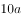，单位人工成本为，工人数为，则有：

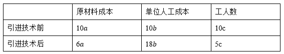

根据“采用新技术前，总人工成本为原材料成本的4倍”列式：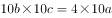，解得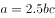。采用新技术后：倍。

故正确答案为F。

---

## 第 7 题　qid 2188166 · 数学运算

上午9点整，甲从A地出发，骑自行车去B地，乙从B地出发，开车去A地。两人第一次相遇时为9点半，甲乙到达目的地后都立即返回，若甲乙的速度比为1：3，则他们第二次相遇时为（  ）。

- **A**. 9：40
- **B**. 9：50
- **C**. 10：00　✅
- **D**. 10：10
- **E**. 10：20
- **F**. 10：30
- **G**. 10：40
- **H**. 10：50

**答案**：C

**官方解析**

根据甲乙速度比为1：3，可以赋值甲乙的速度分别为1、3。

相遇分为迎面相遇和背后相遇，一般情况下第二次相遇是迎面相遇，但是当两人速度差异很大时，第二次相遇有可能是背后相遇，即速度快的人从背后追上另一个人。

从9点出发到9点半迎面相遇，耗时30分钟，AB两地之间的距离。

将第二次相遇理解为背后相遇，也就是乙追上甲时，乙比甲多走了一个全程。

根据追及公式，路程差=速度差×时间，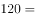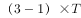，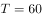分钟。从9点出发，60分钟后乙追上甲，属于第二次相遇，故所求时间为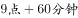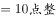。

故正确答案为C。

备注：本题存在争议点，详细说明如下：

1、本题存在另一种思路，因为在行程问题中，出现相遇通常是指“迎面相遇”。做法如下：

根据两端出发多次相遇公式：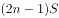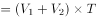

第一次相遇时：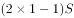

第二次相遇时：

，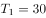，则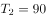。那么第二次相遇为两人在出发90分钟后，即10：30。按这种理解，争议答案是F。

2、追及是否属于相遇的一种，在国考或大多数省考属于出题人有意回避的争议点。但是在陕西省考历史上，由于2013年陕西省的第76题必须把追及理解为相遇的一种，才能做出答案，否则无解。而我们认为同一个省在不同年份对同一种题型的理解应当是一致的，所以在陕西省我们推荐将追及也看成是相遇的一种特殊情况。

综上所述，粉笔推荐C为正确答案。

---

## 第 8 题　qid 2188142 · 数学运算

观众对五位歌手的歌曲进行投票，每张选票都可以选择五首歌曲中的一首或多首，但只有选择不超过3首歌曲的选票才是有效票。五首歌曲的得票数分别为总票数的、、、和，那么本次投票的有效率最高可能为（  ）。

- **A**. 

- **B**. 

　✅
- **C**. 

- **D**. 

- **E**. 

- **F**. 

- **G**. 

- **H**. 

**答案**：B

**官方解析**

假设共有100位观众，每名观众有一张选票。则5首歌曲的总得票数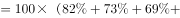票，人均投票数为票。要使投票有效率（即有效票占比）最高，则让有效票的人均投票数尽可能靠近3.2票，即取一人3票；反之，无效票占比最低，则无效票的人均投票数尽可能远离3.2票，取一人5票。

设有效票观众人数为，无效票观众人数为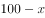，则总票数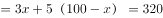票，解得。此时有效率最高为。

故正确答案为B。

---

## 第 9 题　qid 2188143 · 数学运算

有关部门对120种抽样食品进行化验分析，结果显示，抗氧化剂达标的有68种，防腐剂达标的有77种，漂白剂达标的有59种，抗氧化剂和防腐剂都达标的有54种，防腐剂和漂白剂都达标的有43种，抗氧化剂和漂白剂都达标的有35种，三种食品添加剂都达标的有30种，那么三种食品添加剂都不达标的有（  ）种。

- **A**. 14
- **B**. 15
- **C**. 16
- **D**. 17
- **E**. 18　✅
- **F**. 19
- **G**. 20
- **H**. 21

**答案**：E

**官方解析**

根据容斥原理三集合标准型公式：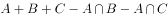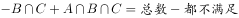，则有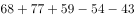。根据选项尾数不同，都不达标的种数尾数为8，即18种。

故正确答案为E。

---

## 第 10 题　qid 2188144 · 数学运算

张老板用100万元购买甲乙两公司的理财产品，其中64万元购买了长期理财产品，已知他在甲公司购买的理财产品中，长期与短期之比为5：3，在乙公司购买的理财产品中，长期与短期之比为2：1，则在甲公司购买的短期理财产品为（  ）万元。

- **A**. 15
- **B**. 18
- **C**. 21
- **D**. 24　✅
- **E**. 27
- **F**. 30
- **G**. 33
- **H**. 36

**答案**：D

**官方解析**

根据比例关系设未知数，设在甲公司购买长期理财万元，短期理财万元，在乙公司购买长期理财万元，短期理财万元。根据题意，张老板购买长期理财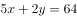万元，理财总数为万元，解得万元。则在甲公司购买的短期理财产品为万元。

故正确答案为D。

---

## 第 11 题　qid 2188147 · 数学运算

要完成某项工程，甲施工队单独干需要30天才能完成，乙施工队需要40天才能完成。甲乙合作干了10天，因故停工10天，再开工时甲乙丙三个施工队一起工作，再干4天就可全部完工。那么，丙队单独干需要大约（  ）天才能完成这项工程。

- **A**. 21
- **B**. 22　✅
- **C**. 23
- **D**. 24
- **E**. 25
- **F**. 26
- **G**. 27
- **H**. 28

**答案**：B

**官方解析**

读题判定题型为给定时间型工程问题，赋值总量为时间的公倍数120，则甲队的工作效率为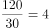，乙队的工作效率为，设丙的工作效率为，根据总量列等式：，解得。则丙单独干大约需要天，即需要干22天。

故正确答案为B。

---

## 第 12 题　qid 2188155 · 数学运算

胜利小学的225名同学与红旗小学的256名同学一起春游，将两所小学的同学混合在一起，随机组合，重新组织队伍，要求每队人数相同且队伍数尽可能少，那么胜利小学的张华与红旗小学的张明出现在同一队伍的概率约为（  ）。

- **A**. 

- **B**. 

- **C**. 

- **D**. 

- **E**. 

- **F**. 

- **G**. 

　✅
- **H**. 

**答案**：G

**官方解析**

两个学校共有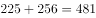人，要使每队人数相同且队伍数尽可能少，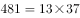，则应将其分为13个队伍，每队37人。

方法一：胜利小学的张华与红旗小学的张明出现在同一队伍的概率约为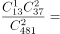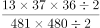。

方法二：张华任选一队，则此队剩下位置数为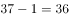个，张明可选的总位置数为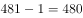个。故所求概率。

故正确答案为G。

---

## 第 13 题　qid 2188163 · 数学运算

将棱长为1的正方体的六个面的中点相连接可以得到一个六面体，则这个六面体的体积为（  ）。

- **A**. 

　✅
- **B**. 
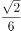

- **C**. 

- **D**. 

- **E**. 

- **F**. 

- **G**. 
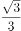

- **H**. 

**答案**：A

**官方解析**

正方体六个面的中点连接得到八面体，由两个完全相同的正四棱锥组成，四棱锥底面是对角线为1的正方形，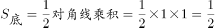。四棱锥的高是正方体边长的一半，即。，则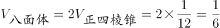。

故正确答案为A。

注：题中考生回忆为六面体，而实际连线应为八面体。附图如下：

---
