# 2018年421联考《行测》题（青海卷）（网友回忆版）

> 数量关系 · 10 题 · 青海 2018

## 第 1 题　qid 2187720 · 数学运算

甲、乙、丙、丁四人同时同地出发，绕一椭圆形环湖栈道行走。甲顺时针行走，其余三人逆时针行走。已知乙的行走速度为60米/分钟，丙的速度为48米/分钟。甲在出发6、7、8分钟时分别与乙、丙、丁三人相遇，求丁的行走速度是多少？

- **A**. 31米/分钟
- **B**. 36米/分钟
- **C**. 39米/分钟　✅
- **D**. 42米/分钟

**答案**：C

**官方解析**

由题意可知，甲与乙相遇，甲与丙相遇均为两人合走完一个环湖的全程。根据总路程相等，可得方程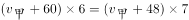，解方程得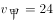。同理，甲与乙相遇，甲与丁相遇时的路程也相等，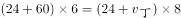，解得，则丁的速度是39米/分钟。

故正确答案为C。

---

## 第 2 题　qid 2187774 · 数学运算

某水渠长100米，截面为等腰梯形，其中渠面宽2米，渠底宽1米，渠深2米。因突降暴雨，水深由1米涨至1.8米。则水渠水量增加了：

- **A**. 112立方米
- **B**. 136立方米　✅
- **C**. 272立方米
- **D**. 324立方米

**答案**：B

**官方解析**

根据题意可得下图，增加的水量断面为梯形EFGM。已知水渠截面为等腰梯形，则米，米；，则，即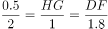，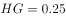米，则米；米，则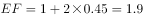米。梯形EFGM截面积为平方米。又根据水渠长100米，则水渠水量增加了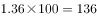立方米。

故正确答案为B。

---

## 第 3 题　qid 2187793 · 数学运算

某村民要在屋顶建造一个长方体无盖贮水池，如果池底每平方米的造价为150元，池壁每平方米的造价为120元，那么要造一个深为3米容积为48立方米的无盖贮水池最低造价是多少元？

- **A**. 6460
- **B**. 7200
- **C**. 8160　✅
- **D**. 9600

**答案**：C

**官方解析**

由“一个深为3米容积为48立方米的水池”，可计算出水池底面面积为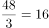平方米。若要此水池造价最低，根据几何最值规律：在面积一定的长方形中，正方形的周长最小。则此底面为正方形，即边长为米，池壁总面积为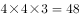平方米。则这个无盖贮水池最低造价是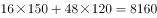元。

故正确答案为C。

---

## 第 4 题　qid 2187725 · 数学运算

某公司新近录用五名应聘人员，将分别安排到产品开发、管理、销售和售后服务这四个部门工作，每个部门至少一人。若其中有两人只能从事销售或售后服务两个部门的工作，其余三人均能从事四个部门的工作，则不同的选派方案共有：

- **A**. 12种
- **B**. 18种
- **C**. 36种
- **D**. 48种　✅

**答案**：D

**官方解析**

设五名应聘人员分别为甲、乙、丙、丁、戊，其中甲和乙只能从事销售或售后服务两个部门的工作，则根据题意分类讨论如下：

若甲、乙都安排到同一部门（同时在销售或售后服务部门），其余3人分别安排到剩余三个部门，每个部门1人，有种安排方法；

若甲、乙分别安排到不同部门（一个在销售部门，另一个在售后部门），其余3人有2人安排到产品开发和管理两个部门，剩余1人安排到销售或售后部门，有种安排方法；

若甲、乙分别安排到不同部门（一个在销售部门，另一个在售后部门），其余3人全部安排到产品开发和管理两个部门，有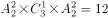种安排方法。

因此，不同的选派方案共有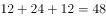种。

故正确答案为D。

---

## 第 5 题　qid 2187727 · 数学运算

某银行推出3年期和5年期的两种理财产品A和B。小王分别购买这两种产品各1万元，结果发现，按单利计算（即利息不产生收益），B产品平均年收益率比A产品多2个百分点，期满后，B产品总收益是A产品的2.5倍。那么，小王各花1万元购买A、B两种产品的平均年收益分别是：

- **A**. 700元和900元
- **B**. 600元和900元
- **C**. 500元和700元
- **D**. 400元和600元　✅

**答案**：D

**官方解析**

设A产品的平均年收益率为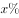，则B产品的平均年收益率为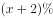，根据A、B两种产品的总收益关系可得，，解得。所以A产品的平均年收益为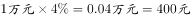，B产品的平均年收益为。

故正确答案为D。

---

## 第 6 题　qid 2187721 · 数学运算

某社团组织周末自驾游，集合后发现小王和小李未到。由于每辆小车限坐5人，按照现有车辆恰有1人坐不上车。为难之际，小王和小李分别开车赶到，于是所有人都坐上车，且每辆车人数均相同。那么，参加本次自驾游的小车数为：

- **A**. 9
- **B**. 8
- **C**. 7　✅
- **D**. 6

**答案**：C

**官方解析**

方法一：设参加本次自驾游的小车总数（包含小王和小李的车）为辆，根据题意可得，包含小王和小李在内的人。因为小王和小李开车赶到后每辆车人数均相同，所以总人数能被整除，是的倍数，所以7应是的倍数，只有C项满足条件。

方法二：代入排除法。

代入A选项，若参加本次自驾游的小车数为9辆，则人，平均每辆车可坐人，不是整数，错误；

代入B选项，若参加本次自驾游的小车数为8辆，则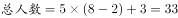人，平均每辆车可坐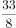人，不是整数，错误；

代入C选项，若参加本次自驾游的小车数为7辆，则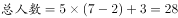人，平均每辆车可坐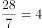人，符合条件，正确；

代入D选项，若参加本次自驾游的小车数为6辆，则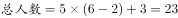人，平均每辆车可坐人，不是整数，错误。

故正确答案为C。

---

## 第 7 题　qid 2187796 · 数学运算

一个班级组织跑步比赛，共设100米、200米、400米三个项目。班级有50人，报名参加100米比赛的有27人，参加200米比赛的有25人，参加400米比赛的有21人。如果每人最多只能报名参加2项比赛，那么该班最多有多少人未报名参赛？

- **A**. 11
- **B**. 12
- **C**. 13　✅
- **D**. 14

**答案**：C

**官方解析**

由“每人最多只能报名参加2项比赛”可得，报名三项的人数为0。设参加两项的人数为，未报名参赛的人为，根据三集合非标准公式可得：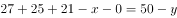，化简得。

要让未报名参赛的人最多，则让尽量多。考虑让参加两项的人尽量多，则每人尽量参与两项，此时最多为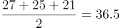人，向下取整为36人，即最多为36，故最多为人。

故正确答案为C。

---

## 第 8 题　qid 2187755 · 数学运算

一直升机在海上救援行动中搜索到遇险者方位后通知快艇，快艇立即朝遇险者直线驶去。此时，直升机距离海平面的垂直高度200米，从机上看，遇险者在正南方向，俯角（朝下看时视线与水平面的夹角）为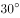，快艇在正东方向，俯角为。若忽略当时风向、潮流等其它因素，且假定遇险者位置不变，则快艇以60千米/小时的速度匀速前进需要多长时间才能到达遇险者的位置？

- **A**. 21秒
- **B**. 22秒
- **C**. 23秒
- **D**. 24秒　✅

**答案**：D

**官方解析**

因为直升机距离海平面的垂直高度200米，在机上看遇险者俯角为，所以直升机和遇险者的水平距离为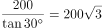米；同理，直升机和快艇的水平距离为米。如图所示，直升机在O点正上方200米A点处，遇险者在正南方向的B点，快艇在正东方向的C点，其中米，米，所以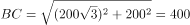米。快艇的速度为60千米/小时=米/秒，所以快艇匀速前进到达遇险者的位置所需要的时间是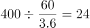秒。

故正确答案为D。

---

## 第 9 题　qid 2188666 · 数学运算

劳动技能课上老师给出一道手工题：一张正方形纸片，在一对对角处各减去一个边长为1厘米的小正方形（如右图所示），想办法把这个缺角的正方形恰好剪成一些长2厘米、宽1厘米的小矩形，问初始的大正方形边长要多大时，任务才有可能完成？

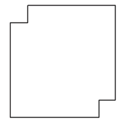

- **A**. 8
- **B**. 15
- **C**. 32
- **D**. 以上答案都不对　✅

**答案**：D

**官方解析**

将大正方形拆分为若干个边长1厘米的小正方形，根据大正方形边长的奇偶性分类讨论如下：

①若大正方形的边长为奇数，则小正方形的个数也为奇数，剪去2个小正方形后，剩下的小正方形个数依然为奇数；而每个小矩形需要占用2个小正方形，则剩下的奇数个小正方形不可能全部拆成小矩形，矛盾。故边长为奇数必然不满足题意，排除B项；

②若大正方形的边长为偶数，如下图所示：将其拆分为若干个小正方形之后，黑色和白色方块的总数相等，且拿掉的对角的两个小正方形一定都是黑色或白色，那么剩下的黑色与白色方块数必然不等，此为结论1。

观察图形，要取出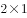的小矩形，必须由一黑一白组成。那么，要让剩下的图形恰好能分成若干个的小矩形，则剩下图形的黑色与白色方块个数必须相等，此为结论2。

结论2与结论1明显矛盾，故边长为偶数也必然不满足题意，排除A、C项。

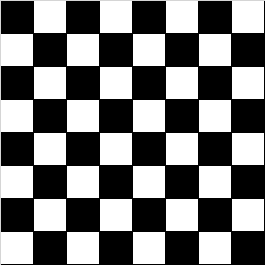

故正确答案为D。

---

## 第 10 题　qid 2358729 · 数学运算

某加工厂要将一批规格相同的三角形铁片裁制成尽可能大的圆形垫片和正方形垫片。如果三角形铁片的三条边长分别为5厘米、12厘米和13厘米，那么，裁制而成的正方形垫片边长和圆形垫片直径分别是多少厘米?

- **A**. 
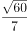，

- **B**. 
，
　✅
- **C**. 
，

- **D**. 
，

**答案**：B

**官方解析**

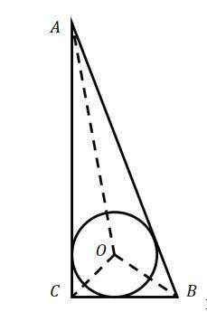

如图所示，要想三角形铁片裁制的圆形垫片尽可能大，则圆应与三角形铁片相切。设内切圆半径为r，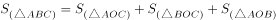，则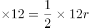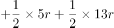，解得。故圆形垫片直径为，排除A、C两项。

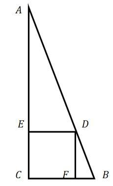

要想三角形铁片裁制的正方形垫片尽可能大，可如图所示剪裁正方形。设正方形边长为，根据与相似，则，即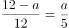，解得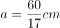。，排除D项。

故正确答案为B。

---
