# 2018年上海市公务员录用考试《行测》题（A类）（网友回忆版）

> 数量关系 · 28 题 · 上海 2018

## 材料 1

（一）根据下列资料，回答76-80题。

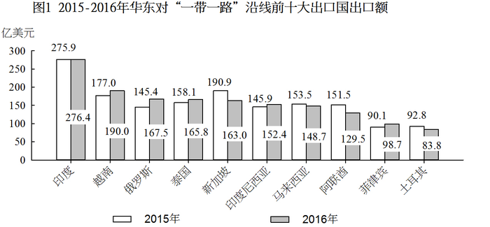

注：前十大出口国和进口国均按2016年数据排列。

### 第 1 题　qid 2137404 · 数学运算

2015年，华东地区与马来西亚贸易额约占当年华东地区与“一带一路”沿线国家贸易额的      。

- **A**. 

　✅
- **B**. 

- **C**. 

- **D**. 

**答案**：A

**官方解析**

问题问的是2015年，······占······的比重，而2015年的数据可以从材料得出，故本题是现期比重问题。由表格可得2015年华东地区与“一带一路”沿线国家贸易额3675.2亿美元，由图1得2015年华东对马来西亚出口额为153.5亿美元，由图2得2015年华东自马来西亚进口额为252.5亿美元，故所求为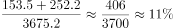。

故正确答案为A。

---

### 第 2 题　qid 2137408 · 数学运算

2016年对华东地区出口额排名前5名的“一带一路”沿线国家中，有      个国家同年在华东地区进口额也排名“一带一路”沿线国家前5名。

- **A**. 1
- **B**. 2
- **C**. 3　✅
- **D**. 4

**答案**：C

**官方解析**

对华东地区出口额排名前5名的“一带一路”沿线国家即华东地区自“一带一路”沿线国家进口额排名前五的国家，分别为：马来西亚、泰国、新加坡、印度尼西亚、越南；在华东地区进口额排名“一带一路”沿线国家前5名即华东地区对“一带一路”沿线国家出口额排名前五的国家，分别为：印度、越南、俄罗斯、泰国、新加坡，综合可见泰国、新加坡、越南3个国家满足条件。
故正确答案为C。

---

### 第 3 题　qid 2137410 · 数学运算

2016年对华东地区出口额排名前10名的“一带一路”沿线国家，当年对华东地区出口额比2015年      。

- **A**. 增加了不到20亿美元
- **B**. 增加了超过20亿美元
- **C**. 下降了不到20亿美元
- **D**. 下降了超过20亿美元　✅

**答案**：D

**官方解析**

由题意：2016年比2015年增加（下降）多少亿元，可判定本题为增长量计算问题。对华东地区出口的“一带一路”沿线国家即华东地区自“一带一路”沿线进口的国家，所以要定位图2，图中给出了2016年和2015年的数据。故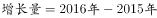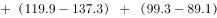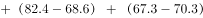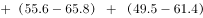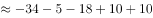亿美元，即下降了49亿美元，与D项符合。

故正确答案为D。

---

### 第 4 题　qid 2137414 · 数学运算

如华东地区对俄罗斯每年贸易的增长额维持2016年的数值，则华东地区对俄罗斯贸易额将在      突破400亿美元。

- **A**. 2020年
- **B**. 2021年　✅
- **C**. 2022年
- **D**. 2023年

**答案**：B

**官方解析**

根据题干“如······增长额维持······数值，则······将在······年突破·······”，可判定本题为现期追赶问题。定位图1可得：2015年、2016年华东地区对俄罗斯的出口额分别是145.4、167.5亿美元，故2016年出口额的增长量为亿美元；定位图2可得：2015年、2016年华东地区自俄罗斯的进口额分别是68.6、82.4亿美元，故2016年进口额的增长量为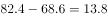亿美元；故2016年华东地区对俄罗斯每年贸易的增长额为亿美元。2016年华东地区对俄罗斯的贸易总额为亿美元，要想达到400亿美元，则总的增长量为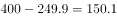亿美元，需要经过年，向上取整，即至少经过5年才能突破400亿美元。2016年再过5年，即2021年。

故正确答案为B。

---

### 第 5 题　qid 2137418 · 数学运算

能够从上述资料中推出的是      。

- **A**. 2013年，“一带一路”沿线国家与华东地区日均贸易额超过10亿美元
- **B**. 2016年，俄罗斯与华东地区贸易额占“一带一路”沿线国家与华东地区贸易额比重高于上年　✅
- **C**. 2016年，华东地区对新加坡贸易顺差高于上年水平
- **D**. 2016年，新加坡与华东地区贸易额占“一带一路”沿线国家与华东地区贸易额比重比菲律宾高5个百分点以上

**答案**：B

**官方解析**

A项：定位表格，2013年，“一带一路”沿线国家与华东地区贸易额为3644.1亿美元，2013年全年共365天，所以日均贸易额为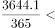亿美元，错误；

B项：定位表格，2015年、2016年“一带一路”沿线国家与华东地区贸易额分别为3675.2亿美元、3616.2亿美元；由图1可得，2015年、2016年华东对俄罗斯出口额分别是145.4亿美元、167.5亿美元；由图2可得，2015年、2016年华东自俄罗斯进口额分别是68.6亿美元、82.4亿美元，所以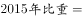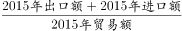=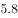，2016年比重=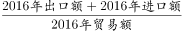=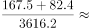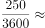，16年比重高于15年，正确；

C项：，定位图1，2015年、2016年华东对新加坡出口额分别是190.9、163.0亿美元，定位图2，2015年、2016年华东自新加坡进口额分别是137.3、119.9亿美元，所以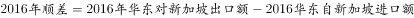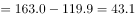亿美元，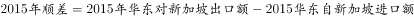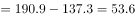亿美元，2016年顺差2015年顺差，错误；

D项：定位图1，2016年华东对新加坡、菲律宾出口额分别是163.0亿美元、98.7亿美元，定位图2，2016年华东自新加坡、菲律宾进口额分别是119.9亿美元、67.3亿美元，定位表格，2016年“一带一路”沿线国家与华东地区贸易额为3616.2亿美元，所以2016年新加坡所占比重比菲律宾高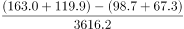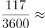，即高3.2个百分点，不到5个百分点，错误。

故正确答案为B。

---

## 材料 2

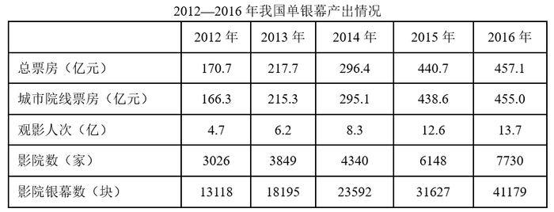 

### 第 6 题　qid 2395230 · 数学运算

2012-2016年，我国单银幕总票房平均每年较上年增长约：

- **A**. 

- **B**. 

　✅
- **C**. 

- **D**. 

**答案**：B

**官方解析**

由题干“平均每年较上年增长”，结合选项为百分数，可判定本题为年均增长率计算问题。定位表格材料，2016年总票房为457.1亿元，2012年总票房为170.7亿元。代入公式，则有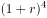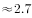。

若，则。

若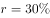，则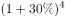。

因此可得：，结合选项只有B项满足。

故正确答案为B。

---

### 第 7 题　qid 2395231 · 数学运算

如每块银幕每天平均上映5场电影，则2016年平均每场电影观众人数约为：

- **A**. 12
- **B**. 18　✅
- **C**. 27
- **D**. 41

**答案**：B

**官方解析**

由题干“2016年平均每场电影观众人数约为”，结合表格数据有2016年，可判定本题为现期平均数问题。平均每场电影观众人数，定位表格材料，2016年观众观影人次数为13.7亿，影院屏幕数为41179块，结合题干条件每块银幕每天平均上映5场电影，则全年的总场数为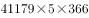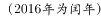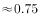亿场，代入公式平均每场电影观众人数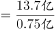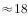人，与B项最接近。

故正确答案为B。

---

### 第 8 题　qid 2395232 · 数学运算

2016年我国平均电影票价比上一年约：

- **A**. 提高了2.9元
- **B**. 提高了1.6元
- **C**. 下降了1.6元　✅
- **D**. 下降了2.9元

**答案**：C

**官方解析**

根据题干“2016年我国平均电影票价比上一年约”，结合选项为提高/下降单位，可判定本题为平均数的增长量问题。定位表格材料可得：2016年总票房为457.1亿元，观影人次为13.7亿人次；2015年总票房为440.7亿元，观影人次为12.6亿人次。故所求2016年平均电影票价2015年平均电影票价，即下降了1.6元。

故正确答案为C。

---

### 第 9 题　qid 2395233 · 数学运算

2013-2016年，我国平均每家影院拥有的银幕数最少的是：

- **A**. 2013年　✅
- **B**. 2014年
- **C**. 2015年
- **D**. 2016年

**答案**：A

**官方解析**

根据“······平均每家影院拥有的银幕数最少”，可判定本题为现期平均数问题。定位表格第五、六行，结合公式：平均每家影院拥有的银幕数，则选项年份所求平均数如下：

2013年：块/家；

2014年：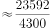块/家；

2015年：块/家；

2016年：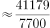块/家。

则2013年我国平均每家影院拥有的银幕数最少。

故正确答案为A。

---

### 第 10 题　qid 2395234 · 数学运算

下列选项中，与资料不符的是：

- **A**. 2012-2014年农村院线票房占全国票房的比重逐年降低
- **B**. 2016年电影观影人次较2013年增加了一倍以上
- **C**. 2015年我国影院银幕数同比增量高于2014年水平
- **D**. 2016年我国平均每家影院的观影人次同比上升　✅

**答案**：D

**官方解析**

A项：定位表格第二、三行，农村院线票房占全国票房的比重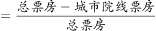。2012-2014年农村院线票房所占比重分别为：2012年：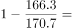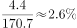；2013年：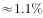；2014年：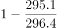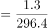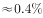，比重逐年降低，正确；

B项：定位表格第四行，2016年观影人次为13.7亿，2013年观影人次为6.2亿。2016年观影人次比2013年增加的倍数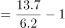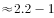，即增加了一倍多，正确；

C项：定位表格第六行，，则2015年我国影院银幕数同比增量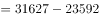块；2014年同比增量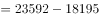块，2015年的同比增量高于2014年，正确；

D项：定位表格第四、五行，平均每家影院的观影人次，则2016年平均每家影院的观影人次；2015年平均每家影院的观影人次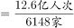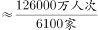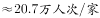，2016年我国平均每家影院的观影人次同比下降，错误。

本题为选非题，故正确答案为D。

---

## 材料 3

        2017年8月，国内汽车产销分别完成209.3万辆和218.6万辆，产销量分别比上月增长和，同比分别增长和。当月新能源汽车产销分别完成7.2万辆和6.8万辆，同比分别增长和。

### 第 11 题　qid 2395235 · 数学运算

2017年8月国内生产的汽车中，有（    ）是新能源汽车。

- **A**. 
不到

- **B**. 
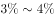
　✅
- **C**. 

- **D**. 
超过

**答案**：B

**官方解析**

根据“2017年8月国内生产的汽车中，有（  ）是新能源汽车”，结合选项为百分数，且材料时间为2017年8月，判断本题为现期比重问题。定位文字资料，2017年8月，国内汽车产量为209.3万辆，当月新能源汽车产量为7.2万辆，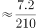，在之间。

故正确答案为B。

---

### 第 12 题　qid 2395236 · 数学运算

2017年7月国内汽车销量比2016年8月约：

- **A**. 
低
　✅
- **B**. 
低

- **C**. 
高

- **D**. 
高

**答案**：A

**官方解析**

由题干“2017年7月······比2016年8月”且选项为百分数，可判定本题为一般增长率问题。定位文字材料可知，国内汽车销量为218.6万辆，比上月增长，同比增长。所以2017年7月国内汽车销量为万辆，2016年8月国内汽车销量为万辆。根据公式，2017年7月国内汽车销量比2016年8月，即低。

故正确答案为A。

---

### 第 13 题　qid 2395238 · 数学运算

如按照公式“”计算，则2017年8月月末国内新能源汽车库存量比上年12月月末增加了（    ）万辆。

- **A**. 1.0
- **B**. 1.5
- **C**. 2.0
- **D**. 2.5　✅

**答案**：D

**官方解析**

根据题干“2017年8月······比上年12月······增加了（    ）万辆。”，可判定本题为增长量计算问题。定位图形材料第二行、第三行数据，根据公式：“”可得：，则2017年8月末库存比2016年12月末增加的就是1-8月产销量之差的和，所求数值万辆，D项当选。

故正确答案为D。

---

### 第 14 题　qid 2395223 · 数学运算

根据图中数字规律，问号处应填：

- **A**. 6
- **B**. 8
- **C**. 10　✅
- **D**. 12

**答案**：C

**官方解析**

观察数列，第一列和第三列均偏大，第二列略小，即考虑第一列数和第三列数作差后与第二列数的关系。第一行：；第三行：。所以每行规律为：，故，解得。

故正确答案为C。

---

### 第 15 题　qid 2395224 · 数学运算

，，，，，（    ）

- **A**. 

- **B**. 

- **C**. 

　✅
- **D**. 

**答案**：C

**官方解析**

数列全为分数，判定为分数数列。观察分子分母，增减规律不统一，考虑反约分。将原数列转化为：，，，，，（    ）。分子为：2，4，6，8，10，（    ），是公差为2的等差数列，即所求项分子为；分母为：5，21，45，77，117，（    ），无明显特征，作差后新数列为：16，24，32，40，（    ），是公差为8的等差数列，新数列所求项，推出分母原数列所求项。故原数列所求项为。

故正确答案为C。

---

### 第 16 题　qid 2137342 · 数学运算

根据下图数字之间的规律，问号处应填<u>        </u>。

- **A**. 22
- **B**. 41
- **C**. 61　✅
- **D**. 71

**答案**：C

**官方解析**

题干出现图形，凑大数。数字差距较大，考虑乘积。由已知4=1×2+2，9=2×3+3，19=3×5+4，33=4×7+5，可推出所求项？=5×11+6=61。
故正确答案为C。

---

### 第 17 题　qid 2137372 · 数学运算

按此规律，第7行的数字和为<u>        </u>。

- **A**. 155
- **B**. 165
- **C**. 175　✅
- **D**. 185

**答案**：C

**官方解析**

方法一：观察图形可以看出，第1、3、5行的数字分别是（1），（3，5，7），（9，11，13，15，17），正好是奇数数列的连续项且分别有1、3、5个数。按此规律，第7行的数字应为19开头的7个连续奇数，即19、21、23、25、27、29、31这7个数字，它们的数字和为19+21+23+25+27+29+31=175。
方法二：观察图形可看出，第n行有n个数，且这些数构成等差数列。所以第7行的7个数构成等差数列，其和为7的倍数，选项中只有175满足7的倍数。
故正确答案为C。

---

### 第 18 题　qid 2137396 · 数学运算

-1，1，0，2，4，12，

- **A**. 30
- **B**. 31
- **C**. 32　✅
- **D**. 33

**答案**：C

**官方解析**

数列变化明显，作差无规律，考虑递推。第三项=（第一项+第二项）×2，则所求项应为（4+12）×2=32。
故正确答案为C。

---

### 第 19 题　qid 2395225 · 数学运算

老李每天早晨9点准时出门散步锻炼身体。他以3千米每小时的速度步行6千米，其中每走20分钟休息5分钟。那么老李锻炼到（    ）回家。

- **A**. 11点20分
- **B**. 11点25分　✅
- **C**. 11点30分
- **D**. 11点45分

**答案**：B

**官方解析**

已知老李速度为3千米每小时，20分钟=小时，即每走20分钟走1千米路。根据“每走20分钟休息5分钟”，可得老李每走1千米，加上休息共需要25分钟。

路程全长6千米，老李前5千米每走1千米需要休息一次，最后1千米直接走到终点，不需要休息。故所需时间为，所以老李早上出发，到家。

故正确答案为B。

---

### 第 20 题　qid 2137278 · 数学运算

某马路宽8米，为方便行人过马路，要刷一条4米宽的人行横道线。已知横道线每间隔45厘米刷一条宽也为45厘米的白线，白漆每升可以刷6平方米，则刷这条横道线至少需要      桶一升装的白漆。

- **A**. 2
- **B**. 3　✅
- **C**. 4
- **D**. 5

**答案**：B

**官方解析**

每隔45厘米刷一条宽为45厘米的白线，可知周期为45+45=90厘米。马路宽8米=800厘米，800÷90=8······80。为保证白漆最少，则剩余80厘米应先间隔45厘米再刷80-45=35厘米的白线。此时刷白漆的总面积为0.45×4×8+0.35×4=15.8平方米。白漆每升刷6平方米，则需要一升装白漆的桶数为桶，不少于2.63桶，即至少3桶。

故正确答案为B。

---

### 第 21 题　qid 2137290 · 数学运算

根据预报，洪水将于2小时后袭击村庄。现武警调用2辆卡车帮助村民转移到高地，第一次转移后发现从村庄到高地需要30分钟，回程需要10分钟，2辆卡车需要再走4个来回才能转移完毕，则必须至少再调用      辆卡车才能在洪水到达前将村民全部转移。

- **A**. 1
- **B**. 2　✅
- **C**. 3
- **D**. 4

**答案**：B

**官方解析**

总时间为，一个来回所需时间为分钟，所以还剩余分钟来转移村民。

从村庄到高地，每辆卡车运两趟最少需要，因此剩余时间最多可让每辆卡车运两趟。剩下的村民需要2辆卡车运四趟，则需要4辆卡车运两趟，即在原来的基础上再增加辆。

故正确答案为B。

---

### 第 22 题　qid 2395227 · 数学运算

如右图所示，向高度为H的水瓶中注水，注满为止，下列反映注水量V与水深h的函数关系正确的是：

- **A**. A
- **B**. B
- **C**. C
- **D**. D　✅

**答案**：D

**官方解析**

根据题目所示容器，从底部到顶部，截面积由大变小再到大，则随着水面高度均匀增加时，单位时间内注水量应由多变少再变多，即对应V-h的函数图形中部应较为平缓，D项满足。
故正确答案为D。

---

### 第 23 题　qid 2395228 · 数学运算

航空公司规定旅客免费携带行李箱的长、宽、高之和不超过115厘米，某厂家生产符合该规定的行李箱，已知行李箱的高为20厘米，长与宽之比为，则该行李箱长度的最大值是（    ）厘米。

- **A**. 50
- **B**. 55　✅
- **C**. 60
- **D**. 65

**答案**：B

**官方解析**

根据题意，假设该行李箱长度为，宽度为，则，厘米，长度的最大值为厘米。

故正确答案为B。

---

### 第 24 题　qid 2395229 · 数学运算

某品牌家用血糖仪说明书上表示，该血糖仪测量误差在以内属于正常情况。老王用该血糖仪测空腹血糖为5.2，但是医院测量数据为4.5，假设该血糖仪的误差一直保持同一数值，那么老王用该血糖仪测餐后血糖为8.7，则其实际餐后血糖最接近：

- **A**. 7.2
- **B**. 7.5　✅
- **C**. 7.8
- **D**. 8.0

**答案**：B

**官方解析**

根据题意，血糖仪的误差值保持不变，则每次血糖仪测量值与实际值之比保持不变。假设实际餐后血糖为，则，，B项满足。

故正确答案为B。

---

### 第 25 题　qid 2137298 · 数学运算

游乐园的摩天轮有60个舱，20分钟转一圈，小王进了摩天轮舱之后5分钟，小李也进了摩天轮舱，则再经过      分钟，小王和小李到达同一高度。

- **A**. 2.5
- **B**. 7.5　✅
- **C**. 12.5
- **D**. 17.5

**答案**：B

**官方解析**

60个舱，20分钟转一圈，则每分钟转个舱。小李在小王5分钟之后进去，则两者相差个舱。当两人等距分布在最高点的两侧，即两人都离最高点7.5个舱位时，小王和小李在同一高度。最高点离小李进去的点有个舱位，因此需要再转个舱，则时间为分钟。

故正确答案为B。

---

### 第 26 题　qid 2137260 · 数学运算

6支队伍进行单循环的足球比赛，比赛结束后，战绩如下：

则F队的战绩为<u>      </u>。

- **A**. 0胜5负
- **B**. 1胜4负　✅
- **C**. 2胜3负
- **D**. 3胜2负

**答案**：B

**官方解析**

题干为单循环赛问题，单循环赛每两个队之间比赛一场，一共15场比赛，每场比赛有一方胜利，则一共有15个胜场。

可得，，即F队一共胜了1场。 

同理，15场比赛有15个负场。

可得，，即F队一共负了4场。

综上，F队一共胜了1场，负了4场。

故正确答案为B。

---

### 第 27 题　qid 2137310 · 数学运算

某建筑工程队工人要用铁丝捆扎塑料管，有四种规格的铁丝可供使用。1.6米长的能捆10根，1.2米长的能捆8根，0.8米长的能捆6根，0.4米长的能捆4根。要捆扎好24根塑料管，工人至少要使用      米铁丝。

- **A**. 2.0
- **B**. 2.4　✅
- **C**. 2.8
- **D**. 3.2

**答案**：B

**官方解析**

要使用的铁丝少，对比四种规格铁丝的单位成本，即每捆一根塑料管需要的铁丝长度。

1.6米长的能捆10根，则捆一根塑料管需要米铁丝；

1.2米长的能捆8根，则捆一根塑料管需要米铁丝；

0.8米长的能捆6根，则捆一根塑料管需要米铁丝；

0.4米的能捆4根，则捆一根塑料管需要米铁丝。

规格为0.4米的铁丝最优，所以优先选择它来捆绑塑料管，0.4米能捆4根，则捆24根需要2.4米。

故正确答案为B。

---

### 第 28 题　qid 2137272 · 数学运算

大小两个玻璃瓶装着芝麻，如果将小瓶子里的芝麻全部倒入大瓶子，大瓶子还可以装45克；如果将大瓶子里的芝麻倒入小瓶子，大瓶子里还剩下455克。已知大瓶子的容积是小瓶子的2倍，则大瓶子最多可装芝麻      克。

- **A**. 1000　✅
- **B**. 850
- **C**. 750
- **D**. 500

**答案**：A

**官方解析**

根据题干条件可得，大瓶子的容积是小瓶子的2倍，设小瓶子最多装克芝麻，则大瓶子最多装克芝麻。

第一次芝麻全部倒入大瓶子，大瓶子还可以装45克，可得：

第二次芝麻全部倒入小瓶子，大瓶子还剩下455克，可得：

综上可得： 

，则大瓶子最多装克

故正确答案为A。

---
