# 2018年上海市公务员录用考试《行测》题（B类）（网友回忆版）

> 数量关系 · 30 题 · 上海 2018

## 材料 1

（一）根据下列资料，回答76-80题。

注：前十大出口国和进口国均按2016年数据排列。

### 第 1 题　qid 2137404 · 数学运算

2015年，华东地区与马来西亚贸易额约占当年华东地区与“一带一路”沿线国家贸易额的      。

- **A**. 

　✅
- **B**. 

- **C**. 

- **D**. 

**答案**：A

**官方解析**

问题问的是2015年，······占······的比重，而2015年的数据可以从材料得出，故本题是现期比重问题。由表格可得2015年华东地区与“一带一路”沿线国家贸易额3675.2亿美元，由图1得2015年华东对马来西亚出口额为153.5亿美元，由图2得2015年华东自马来西亚进口额为252.5亿美元，故所求为。

故正确答案为A。

---

### 第 2 题　qid 2137408 · 数学运算

2016年对华东地区出口额排名前5名的“一带一路”沿线国家中，有      个国家同年在华东地区进口额也排名“一带一路”沿线国家前5名。

- **A**. 1
- **B**. 2
- **C**. 3　✅
- **D**. 4

**答案**：C

**官方解析**

对华东地区出口额排名前5名的“一带一路”沿线国家即华东地区自“一带一路”沿线国家进口额排名前五的国家，分别为：马来西亚、泰国、新加坡、印度尼西亚、越南；在华东地区进口额排名“一带一路”沿线国家前5名即华东地区对“一带一路”沿线国家出口额排名前五的国家，分别为：印度、越南、俄罗斯、泰国、新加坡，综合可见泰国、新加坡、越南3个国家满足条件。
故正确答案为C。

---

### 第 3 题　qid 2137410 · 数学运算

2016年对华东地区出口额排名前10名的“一带一路”沿线国家，当年对华东地区出口额比2015年      。

- **A**. 增加了不到20亿美元
- **B**. 增加了超过20亿美元
- **C**. 下降了不到20亿美元
- **D**. 下降了超过20亿美元　✅

**答案**：D

**官方解析**

由题意：2016年比2015年增加（下降）多少亿元，可判定本题为增长量计算问题。对华东地区出口的“一带一路”沿线国家即华东地区自“一带一路”沿线进口的国家，所以要定位图2，图中给出了2016年和2015年的数据。故亿美元，即下降了49亿美元，与D项符合。

故正确答案为D。

---

### 第 4 题　qid 2137414 · 数学运算

如华东地区对俄罗斯每年贸易的增长额维持2016年的数值，则华东地区对俄罗斯贸易额将在      突破400亿美元。

- **A**. 2020年
- **B**. 2021年　✅
- **C**. 2022年
- **D**. 2023年

**答案**：B

**官方解析**

根据题干“如······增长额维持······数值，则······将在······年突破·······”，可判定本题为现期追赶问题。定位图1可得：2015年、2016年华东地区对俄罗斯的出口额分别是145.4、167.5亿美元，故2016年出口额的增长量为亿美元；定位图2可得：2015年、2016年华东地区自俄罗斯的进口额分别是68.6、82.4亿美元，故2016年进口额的增长量为亿美元；故2016年华东地区对俄罗斯每年贸易的增长额为亿美元。2016年华东地区对俄罗斯的贸易总额为亿美元，要想达到400亿美元，则总的增长量为亿美元，需要经过年，向上取整，即至少经过5年才能突破400亿美元。2016年再过5年，即2021年。

故正确答案为B。

---

### 第 5 题　qid 2137418 · 数学运算

能够从上述资料中推出的是      。

- **A**. 2013年，“一带一路”沿线国家与华东地区日均贸易额超过10亿美元
- **B**. 2016年，俄罗斯与华东地区贸易额占“一带一路”沿线国家与华东地区贸易额比重高于上年　✅
- **C**. 2016年，华东地区对新加坡贸易顺差高于上年水平
- **D**. 2016年，新加坡与华东地区贸易额占“一带一路”沿线国家与华东地区贸易额比重比菲律宾高5个百分点以上

**答案**：B

**官方解析**

A项：定位表格，2013年，“一带一路”沿线国家与华东地区贸易额为3644.1亿美元，2013年全年共365天，所以日均贸易额为亿美元，错误；

B项：定位表格，2015年、2016年“一带一路”沿线国家与华东地区贸易额分别为3675.2亿美元、3616.2亿美元；由图1可得，2015年、2016年华东对俄罗斯出口额分别是145.4亿美元、167.5亿美元；由图2可得，2015年、2016年华东自俄罗斯进口额分别是68.6亿美元、82.4亿美元，所以=，2016年比重==，16年比重高于15年，正确；

C项：，定位图1，2015年、2016年华东对新加坡出口额分别是190.9、163.0亿美元，定位图2，2015年、2016年华东自新加坡进口额分别是137.3、119.9亿美元，所以亿美元，亿美元，2016年顺差2015年顺差，错误；

D项：定位图1，2016年华东对新加坡、菲律宾出口额分别是163.0亿美元、98.7亿美元，定位图2，2016年华东自新加坡、菲律宾进口额分别是119.9亿美元、67.3亿美元，定位表格，2016年“一带一路”沿线国家与华东地区贸易额为3616.2亿美元，所以2016年新加坡所占比重比菲律宾高，即高3.2个百分点，不到5个百分点，错误。

故正确答案为B。

---

## 材料 2

（二）根据下列资料，回答81—85题。

### 第 6 题　qid 2137442 · 数学运算

假设E网站2014-2015年在全国各地区均实现了日到达人数的增长，则2014年武汉和南京两地区的日到达人数之和最接近 <u>     </u>。

- **A**. 167万
- **B**. 172万
- **C**. 177万　✅
- **D**. 182万

**答案**：C

**官方解析**

根据题干所求“2014年······日到达人数······”，结合材料时间为2015年，可判定此题为基期计算问题。定位表格，2015年E网站武汉、南京日到达人数分别为1044175人和812512人；定位题干“假设E网站2014-2015年在全国各地区均实现了日到达人数的增长”，可知E网站于南京、武汉日到达人数的增长率均为，所以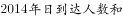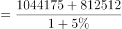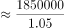万，最接近C选项。

故正确答案为C。

---

### 第 7 题　qid 2137446 · 数学运算

2015年5个网站在南京地区的无重复目标受众人数均为      。

- **A**. 300多万
- **B**. 400多万　✅
- **C**. 500多万
- **D**. 600多万

**答案**：B

**官方解析**

根据题干所求“···无重复目标受众人数均为”，结合材料“”，可知：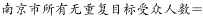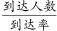，结合表格，到达人数和到达率已知，可判定此题为现期比重问题。求南京地区的无重复目标受众人数，所以定位表格一组方便计算得数据即可，A网站南京日到达人数为1294579人，日到达率为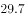，所以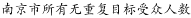，与B项符合。

---

### 第 8 题　qid 2137458 · 数学运算

如D网站2015年内任意一天在武汉市的到达率均相同，则在2015年内（1月4日以后）任选一名武汉目标受众，其在过去3天内在D网站上看到或听到一则特定广告的概率约为      。

- **A**. 

- **B**. 
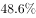
　✅
- **C**. 

- **D**. 

**答案**：B

**官方解析**

根据题干所求“······特定广告的概率约为”，可知本题为应用数学运算中的概率知识解决的简单计算问题。

根据材料：“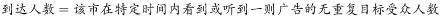；。”

可知：任选一名武汉目标受众，1天内在D网站上看到或听到一则特定广告的，所以任选一名武汉目标受众，1天内在D网站上看到或听到一则特定广告的概率为，反之没看到或听到的概率为（）。则任选一名武汉目标受众在过去3天内在D网站上看到或听到一则特定广告的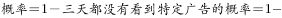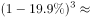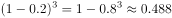，接近B选项。

（备注：三天内听到一则特定广告的概率，若理解成三天内<b>恰好只听到</b>一则广告，则没有正确答案；故只能理解为三天内<b>至少听到</b>一则广告的概率）

故正确答案为B。

---

### 第 9 题　qid 2137468 · 数学运算

如A网站2018年在武汉地区的无重复目标受众人数较2015年增加，日到达率较2015年增加5个百分点，则其2018年在武汉的日到达人数将比2015年高约<u>      </u>。

- **A**. 50万　✅
- **B**. 80万
- **C**. 110万
- **D**. 140万

**答案**：A

**官方解析**

根据题干所求“······2018年在武汉的日到达人数······”，结合材料“”，可判定此题为现期比重问题，所以，因此分别求出2018日到达率和2018无重复目标人数即可求出2018武汉日到达人数。

根据材料“”，所以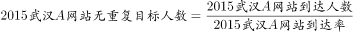，即560万人。

根据题干“A网站2018年在武汉地区的无重复目标受众人数较2015年增加”，所以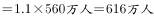。

根据题干，2018年武汉A网站日到达率较2015年增加5个百分点，所以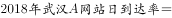。

故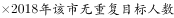

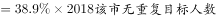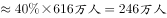。

所求2018年日到达人数比2015年高的，与A项最接近。

故正确答案为A。

---

### 第 10 题　qid 2137472 · 数学运算

将不同网站按2015年在武汉和南京两地日到达人数之差从低到高排列，以下正确的是      。

- **A**. 
C网站A网站D网站

- **B**. 
D网站B网站E网站

- **C**. 
C网站D网站A网站

- **D**. 
D网站E网站A网站
　✅

**答案**：D

**官方解析**

根据题干所求“······武汉和南京两地日到达人数之差从低到高排列······”，结合选项，可判定此题为排序类问题。

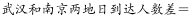

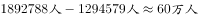；

；

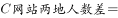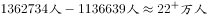；

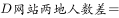；

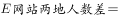；

观察四个选项，都包含D网站，而D网站人数差最少，应排在最低的位置，所以A、C两项错误，排除。B项中，B网站人数差E网站人数差，B项错误，排除。

故正确答案为D。

---

## 材料 3

        2017年上半年，S市出口手机1.9亿台，比去年同期减少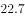；价值513.1亿元人民币，下降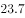。6月份当月出口3217.5万台，减少；价值86亿元，下降。 

        上半年，S市以一般贸易方式出口手机1.8亿台，减少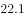；以加工贸易方式出口699.9万台，减少；以海关特殊监管方式出口手机245.2万台，减少。

        上半年，S市民营企业出口手机1.6亿台，减少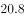；外商投资企业出口2043.9万台，减少；同期，国有企业出口1859.3万台，减少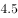。

        上半年，S市对香港地区出口手机1.5亿台，减少；对印度、美国、阿联酋分别出口1151万台、978.2万台和511.3万台，增加、和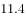。此外，对东盟、欧盟分别出口251.2万台、210.4万台，减少、。

        上半年，S市出口GSM数字式手机8910.5万台，减少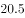；出口含4G手机在内的其他手机7480.6万台，减少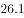；出口CDMA数字式手机307.3万台，减少。

### 第 11 题　qid 2137496 · 数学运算

2017年上半年，S市平均每台出口手机的价值比去年同期约      。

- **A**. 
上升0.8

- **B**. 
上升1.3

- **C**. 
下降0.8

- **D**. 
下降1.3
　✅

**答案**：D

**官方解析**

由题干“平均每台出口手机的价值比去年同期约”，选项里面给的是上升或下降的百分数，可判定本题为平均数增长率计算问题。平均每台出口手机的，根据平均数代入数据，定位材料第一段，a为价值的增长率是，b为出口台数的增长率是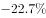，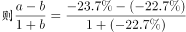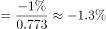，即下降，D项正确。

故正确答案为D。

---

### 第 12 题　qid 2137500 · 数学运算

2016年上半年，S市以加工贸易方式出口手机数量约是以海关特殊监管方式出口的    倍。

- **A**. 2.1
- **B**. 2.6　✅
- **C**. 2.9
- **D**. 3.5

**答案**：B

**官方解析**

由题干“2016年上半年，S市以加工贸易方式出口手机数量约是以海关特殊监管方式出口的多少倍”，根据给定材料2017年上半年的数据，可判定本题为基期倍数计算问题。根据基期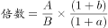代入数据，定位材料第二段，A为2017年上半年S市以加工贸易方式出口手机数量699.9万台，a为其增长率；B为以海关特殊监管方式出口手机数量245.2万台，b为其增长率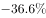。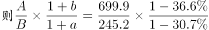，最接近的为B项。

故正确答案为B。

---

### 第 13 题　qid 2137506 · 数学运算

将不同出口目的地按2016年上半年自S市进口手机台数从多到少排列，正确的是      。

- **A**. 
东盟美国印度
　✅
- **B**. 
印度美国东盟

- **C**. 
印度东盟美国

- **D**. 
美国东盟印度

**答案**：A

**官方解析**

由题干“2016年上半年自S市进口手机台数从多到少排列”，材料给的是2017年上半年的数据，可判定本题为基期比较问题。根据代入数据，”各地区自S市进口手机“这个题干设问是一个陷阱，各地区自S市进口手机台数即为S市对各地区的出口数量，因此定位材料第四段，找到选项中美国、东盟、印度的相关数据，可以得到2016年上半年：印度为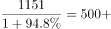，美国为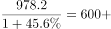，东盟为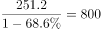，由此可得东盟美国印度，A项符合。

故正确答案为A。

---

### 第 14 题　qid 2137510 · 数学运算

2017年上半年，S市出口GSM数字式手机占同期手机出口总量的比重，约比出口含4G手机在内的其他手机占同期手机出口总量比重高      个百分点。

- **A**. 1.9
- **B**. 3.8
- **C**. 7.5　✅
- **D**. 13.6

**答案**：C

**官方解析**

由题干“2017年上半年，S市出口GSM数字式手机占同期手机出口总量的比重，约比出口含4G手机在内的其他手机占同期手机出口总量比重高多少个百分点”，可判定本题为现期比重差值计算。

，定位材料第五段，。

故正确答案为C。

---

### 第 15 题　qid 2137512 · 数学运算

能够从上述资料中推出的是      。

- **A**. 2017年6月份，S市手机出口量低于1-5月的平均值
- **B**. 2016年上半年，S市民营企业出口手机超过2亿台　✅
- **C**. 2017年上半年，S市出口手机中，超过八成出口到香港地区
- **D**. 2016年上半年，S市月均出口CDMA数字式手机不到60万台

**答案**：B

**官方解析**

A项：根据材料第一段可知，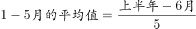，故6月出口量3217.5万台高于1-5月的平均值，错误。

B项：根据材料第三段可知，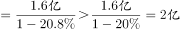，正确。

C项：根据材料第四段可知出口到香港的手机占出口总量的比重为，没有超过八成，错误。

D项：根据材料第五段可知，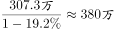，则月均出口量约为，错误。

故正确答案为B。

---

### 第 16 题　qid 2137342 · 数学运算

根据下图数字之间的规律，问号处应填<u>        </u>。

- **A**. 22
- **B**. 41
- **C**. 61　✅
- **D**. 71

**答案**：C

**官方解析**

题干出现图形，凑大数。数字差距较大，考虑乘积。由已知4=1×2+2，9=2×3+3，19=3×5+4，33=4×7+5，可推出所求项？=5×11+6=61。
故正确答案为C。

---

### 第 17 题　qid 2137370 · 数学运算

1，2，，，，<u>        </u>。

- **A**. 

- **B**. 
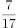

- **C**. 

　✅
- **D**. 
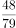

**答案**：C

**官方解析**

题干为分数数列，且变化趋势不单调，先考虑反约分，无规律。观察数字特征，（第一项+第二项）×第三项=1，即每一项与前两项之和互为倒数，则所求项应为。

故正确答案为C。

---

### 第 18 题　qid 2137372 · 数学运算

按此规律，第7行的数字和为<u>        </u>。

- **A**. 155
- **B**. 165
- **C**. 175　✅
- **D**. 185

**答案**：C

**官方解析**

方法一：观察图形可以看出，第1、3、5行的数字分别是（1），（3，5，7），（9，11，13，15，17），正好是奇数数列的连续项且分别有1、3、5个数。按此规律，第7行的数字应为19开头的7个连续奇数，即19、21、23、25、27、29、31这7个数字，它们的数字和为19+21+23+25+27+29+31=175。
方法二：观察图形可看出，第n行有n个数，且这些数构成等差数列。所以第7行的7个数构成等差数列，其和为7的倍数，选项中只有175满足7的倍数。
故正确答案为C。

---

### 第 19 题　qid 2137390 · 数学运算

根据下表数字之间的规律，问号处应填<u>        </u>。

- **A**. 32
- **B**. 43
- **C**. 48　✅
- **D**. 56

**答案**：C

**官方解析**

题干为三行四列表格，考虑凑大数。数字差距较大，考虑乘积。由已知30=3×8+6，43=7×5+8，？=6×7+6=48。
故正确答案为C。

---

### 第 20 题　qid 2137396 · 数学运算

-1，1，0，2，4，12，

- **A**. 30
- **B**. 31
- **C**. 32　✅
- **D**. 33

**答案**：C

**官方解析**

数列变化明显，作差无规律，考虑递推。第三项=（第一项+第二项）×2，则所求项应为（4+12）×2=32。
故正确答案为C。

---

### 第 21 题　qid 2137402 · 数学运算

小瑗和爸爸一起包饺子，爸爸包的饺子是小瑗的两倍。爸爸的饺子放在四个盘子里，小瑗的饺子放在两个盘子里。六个盘子中的饺子数依次为15、19、20、21、22、23。那么小瑗的饺子在      。

- **A**. 第2盘与第4盘　✅
- **B**. 第3盘与第4盘
- **C**. 第2盘与第3盘
- **D**. 第1盘与第6盘

**答案**：A

**官方解析**

根据题干条件可得，爸爸的饺子数是小瑗的两倍，设小瑗饺子数x，则爸爸饺子数2x，可得：
总数=x+2x=3x=15+19+20+21+22+23=120，解得x=40。
六个盘子中只有19+21=40可以凑出小瑗的饺子数，所以小瑗的饺子放在第二盘和第四盘。
故正确答案为A。

---

### 第 22 题　qid 2137412 · 数学运算

现有甲、乙、丙三种货物，若购买甲1件、乙3件、丙7件共需200元；若购买甲2件、乙5件、丙11件共需350元。则购买甲、乙、丙各1件共需      元。

- **A**. 50
- **B**. 100　✅
- **C**. 150
- **D**. 200

**答案**：B

**官方解析**

根据题干条件，假设甲、乙、丙的价格依次是x、y、z元，则根据题意可列方程组：

方法一：可得：

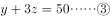

可得：

元

方法二：钱数x、y、z不一定为整数，所以本题属于非限定性不定方程。可以采用赋零法，赋丙的价格为0，即z=0。原方程组转化为

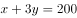

解得：，。可得：

元

故正确答案为B。

---

### 第 23 题　qid 2137428 · 数学运算

非高峰时段，地铁每8分钟一班，在车站停靠1分钟，则乘客到达站台2分钟内能乘上地铁的概率为      。

- **A**. 

- **B**. 

- **C**. 

　✅
- **D**. 

**答案**：C

**官方解析**

地铁8分钟一趟，则以每8分钟为一个周期进行考虑。

最早在地铁到来前2分钟到达地铁站，则2分钟内地铁到达时可乘车；

最晚在地铁到达后1分钟内到达地铁站，也可以赶上本趟地铁。

前后一共3分钟的时间可以乘坐地铁。

综上所述：每8分钟内有3分钟可以坐上车，坐上车的概率为。

故正确答案为C。

---

### 第 24 题　qid 2137260 · 数学运算

6支队伍进行单循环的足球比赛，比赛结束后，战绩如下：

则F队的战绩为<u>      </u>。

- **A**. 0胜5负
- **B**. 1胜4负　✅
- **C**. 2胜3负
- **D**. 3胜2负

**答案**：B

**官方解析**

题干为单循环赛问题，单循环赛每两个队之间比赛一场，一共15场比赛，每场比赛有一方胜利，则一共有15个胜场。

可得，，即F队一共胜了1场。 

同理，15场比赛有15个负场。

可得，，即F队一共负了4场。

综上，F队一共胜了1场，负了4场。

故正确答案为B。

---

### 第 25 题　qid 2137272 · 数学运算

大小两个玻璃瓶装着芝麻，如果将小瓶子里的芝麻全部倒入大瓶子，大瓶子还可以装45克；如果将大瓶子里的芝麻倒入小瓶子，大瓶子里还剩下455克。已知大瓶子的容积是小瓶子的2倍，则大瓶子最多可装芝麻      克。

- **A**. 1000　✅
- **B**. 850
- **C**. 750
- **D**. 500

**答案**：A

**官方解析**

根据题干条件可得，大瓶子的容积是小瓶子的2倍，设小瓶子最多装克芝麻，则大瓶子最多装克芝麻。

第一次芝麻全部倒入大瓶子，大瓶子还可以装45克，可得：

第二次芝麻全部倒入小瓶子，大瓶子还剩下455克，可得：

综上可得： 

，则大瓶子最多装克

故正确答案为A。

---

### 第 26 题　qid 2137278 · 数学运算

某马路宽8米，为方便行人过马路，要刷一条4米宽的人行横道线。已知横道线每间隔45厘米刷一条宽也为45厘米的白线，白漆每升可以刷6平方米，则刷这条横道线至少需要      桶一升装的白漆。

- **A**. 2
- **B**. 3　✅
- **C**. 4
- **D**. 5

**答案**：B

**官方解析**

每隔45厘米刷一条宽为45厘米的白线，可知周期为45+45=90厘米。马路宽8米=800厘米，800÷90=8······80。为保证白漆最少，则剩余80厘米应先间隔45厘米再刷80-45=35厘米的白线。此时刷白漆的总面积为0.45×4×8+0.35×4=15.8平方米。白漆每升刷6平方米，则需要一升装白漆的桶数为桶，不少于2.63桶，即至少3桶。

故正确答案为B。

---

### 第 27 题　qid 2137290 · 数学运算

根据预报，洪水将于2小时后袭击村庄。现武警调用2辆卡车帮助村民转移到高地，第一次转移后发现从村庄到高地需要30分钟，回程需要10分钟，2辆卡车需要再走4个来回才能转移完毕，则必须至少再调用      辆卡车才能在洪水到达前将村民全部转移。

- **A**. 1
- **B**. 2　✅
- **C**. 3
- **D**. 4

**答案**：B

**官方解析**

总时间为，一个来回所需时间为分钟，所以还剩余分钟来转移村民。

从村庄到高地，每辆卡车运两趟最少需要，因此剩余时间最多可让每辆卡车运两趟。剩下的村民需要2辆卡车运四趟，则需要4辆卡车运两趟，即在原来的基础上再增加辆。

故正确答案为B。

---

### 第 28 题　qid 2137298 · 数学运算

游乐园的摩天轮有60个舱，20分钟转一圈，小王进了摩天轮舱之后5分钟，小李也进了摩天轮舱，则再经过      分钟，小王和小李到达同一高度。

- **A**. 2.5
- **B**. 7.5　✅
- **C**. 12.5
- **D**. 17.5

**答案**：B

**官方解析**

60个舱，20分钟转一圈，则每分钟转个舱。小李在小王5分钟之后进去，则两者相差个舱。当两人等距分布在最高点的两侧，即两人都离最高点7.5个舱位时，小王和小李在同一高度。最高点离小李进去的点有个舱位，因此需要再转个舱，则时间为分钟。

故正确答案为B。

---

### 第 29 题　qid 2137306 · 数学运算

如图，两个同心圆构成的圆环被均匀地分割成7份，连同中间的小圆共8个区域。若要给这8个区域着色，至少需要<u>      </u>种颜色，才能使相邻区域颜色不同。

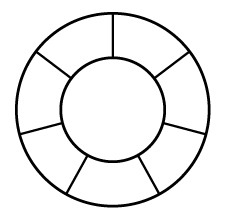

- **A**. 3
- **B**. 4　✅
- **C**. 5
- **D**. 6

**答案**：B

**官方解析**

要求相邻区域颜色不同，优先涂相邻面最多的区域，即中间的圆。为了使得所用颜色最少，则其他7个区域涂色如下：

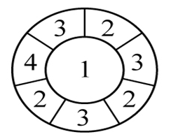

由上图可知，至少需要4种颜色。

---

### 第 30 题　qid 2137310 · 数学运算

某建筑工程队工人要用铁丝捆扎塑料管，有四种规格的铁丝可供使用。1.6米长的能捆10根，1.2米长的能捆8根，0.8米长的能捆6根，0.4米长的能捆4根。要捆扎好24根塑料管，工人至少要使用      米铁丝。

- **A**. 2.0
- **B**. 2.4　✅
- **C**. 2.8
- **D**. 3.2

**答案**：B

**官方解析**

要使用的铁丝少，对比四种规格铁丝的单位成本，即每捆一根塑料管需要的铁丝长度。

1.6米长的能捆10根，则捆一根塑料管需要米铁丝；

1.2米长的能捆8根，则捆一根塑料管需要米铁丝；

0.8米长的能捆6根，则捆一根塑料管需要米铁丝；

0.4米的能捆4根，则捆一根塑料管需要米铁丝。

规格为0.4米的铁丝最优，所以优先选择它来捆绑塑料管，0.4米能捆4根，则捆24根需要2.4米。

故正确答案为B。

---
