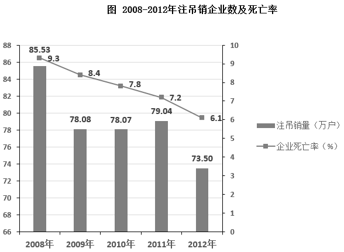
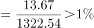

# 2018年上海市行政执法类考试《行测》试题（网友回忆版）

> 数量关系 · 20 题 · 上海 2018

## 材料 1

        2017年一季度工业企业景气指数为128.0，比上年四季度高3.7点。其中，反映工业企业当前景气状态的即期工业企业景气指数为122.5，比上年四季度低6.1点；反映工业企业未来景气预判的预期工业企业景气指数为131.6，比上年四季度高10.2点。2017年一季度，工业企业家信心指数为124.3，比上年四季度高3.3点。

        从企业盈利水平看，76.3%的工业企业表示2017年一季度盈利状况处于“正常水平”或“好于正常水平”，比上年四季度下降2.7个百分点，但比上年同期高2.1个百分点。

        从企业库存情况看，86.4%的工业企业表示2017年一季度企业库存处于“正常水平”，比上年四季度上升0.5个百分点；5.3%的企业“低于正常水平”，比上年四季度下降0.5个百分点；8.3%的企业“高于正常水平”，与上年四季度持平。

        从企业订货情况看，81.2%的工业企业表示2017年一季度订货处于“正常水平”或“高于正常水平”，比上年四季度下降1.2个百分点，但比上年同期高2.5个百分点。

        分行业看，2017年一季度工业企业景气指数由高到低排列依次是电力、热力、燃气及水生产和供应业，制造业和采矿业，企业景气指数分别为135.5、130.1和89.8。其中，制造业中景气度较高的行业由高到低排列依次是：医药，烟草，汽车，酒、饮料和精制茶，食品制造，电气机械和器材制造，仪器仪表制造，专用设备制造，木材加工，计算机、通信和其他电子设备制造，通用设备制造，家具制造，金属制品，印刷和记录媒介复制，橡胶和塑料制品，农副食品加工，文教、工美、体育和娱乐用品制造等17个行业，景气指数在130以上；景气度相对较低的行业按景气指数由低到高排列依次是石油加工，钢铁和废弃资源利用等3个行业，景气指数在110以下；其他行业景气指数均在110-130之间。

        分企业规模看，大、中、小型工业企业景气指数分别为132.5、129.4和121.0，分别比上年四季度下降0.6、上升3.5和上升5.3点。

        分地区看，东、中、西部地区的工业企业景气指数分别为129.9、129.3和118.3，分别比上年四季度上升4.4、2.3和2.6点。

### 第 1 题　qid 5676443 · 数学运算

与2016年四季度相比，2017年一季度各项指数的增长量由高到低排序正确的是        。

- **A**. 工业企业景气指数>即期工业企业景气指数>预期工业企业景气指数>工业企业家信心指数
- **B**. 预期工业企业景气指数>工业企业景气指数>工业企业家信心指数>即期工业企业景气指数　✅
- **C**. 工业企业景气指数>预期工业企业景气指数>工业企业家信心指数>即期工业企业景气指数
- **D**. 工业企业家信心指数>工业企业景气指数>预期工业企业景气指数>即期工业企业景气指数

**答案**：B

**官方解析**

定位文字材料第一段可得，2017年一季度工业企业景气指数比上年四季度高3.7点，即期工业企业景气指数比上年四季度低6.1点，预期工业企业景气指数比上年四季度高10.2点，工业企业家信心指数比上年四季度高3.3点。则与2016年四季度相比，2017年一季度各项指数的增长量由高到低排序为：预期工业企业景气指数（10.2）＞工业企业景气指数（3.7）＞工业企业家信心指数（3.3）＞即期工业企业景气指数（-6.1）。
故正确答案为B。

---

### 第 2 题　qid 12118333 · 数学运算

以下关于2016年四季度的情况，说法错误的是        。

- **A**. 79%的工业企业表示该季度盈利状况处于“正常水平”或“好于正常水平”
- **B**. 85.9%的工业企业表示该季度企业库存处于“正常水平”
- **C**. 5.8%的工业企业表示该季度企业库存“低于正常水平”
- **D**. 80%的工业企业表示该季度订货处于“正常水平”或“高于正常水平”　✅

**答案**：D

**官方解析**

A项：定位文字材料第二段可得，从企业盈利水平看，76.3%的工业企业表示2017年一季度盈利状况处于“正常水平”或"好于正常水平”，比上年四季度下降2.7个百分点。76.3%+2.7%=79%，则2016年四季度，79%的工业企业表示该季度盈利状况处于“正常水平”或“好于正常水平”，正确；
B项：定位文字材料第三段可得，从企业库存情况看，86.4%的工业企业表示2017年一季度企业库存处于“正常水平”，比上年四季度上升0.5个百分点。86.4%-0.5%=85.9%，则2016年四季度，85.9%的工业企业表示该季度企业库存处于“正常水平”，正确；
C项；定位文字材料第三段可得，从企业库存情况看······2017年一季度······5.3%的企业“低于正常水平”，比上年四季度下降0.5个百分点。5.3%+0.5%=5.8%，则2016年四季度，5.8%的工业企业表示该季度企业库存“低于正常水平”，正确；
D项：定位文字材料第四段可得，从企业订货情况看，81.2%的工业企业表示2017年一季度订货处于“正常水平”或“高于正常水平”，比上年四季度下降1.2个百分点。81.2%+1.2%=82.4%，则2016年四季度，82.4%的工业企业表示该季度订货处于“正常水平”或“高于正常水平”，而非80%，错误。
本题为选非题，故正确答案为D。

---

### 第 3 题　qid 5676448 · 数学运算

关于2017年一季度制造业的行业景气指数，由高到低排序正确的是        。

- **A**. 汽车>专用设备制造>金属制品>废弃资源利用　✅
- **B**. 烟草>木材加工>仪器仪表制造>家具制造
- **C**. 农副食品加工>石油加工>钢铁>废弃资源利用
- **D**. 通用设备制造>橡胶和塑料制品>石油加工>农副食品加工

**答案**：A

**官方解析**

定位文字材料第五段可得，2017年一季度，制造业中景气度较高的行业由高到低排列依次是：医药，烟草，汽车······仪器仪表制造，专用设备制造，木材加工······通用设备制造，家具制造，金属制品······橡胶和塑料制品，农副食品加工；景气度相对较低的行业按景气指数由低到高排列依次是石油加工，钢铁和废弃资源利用等3个行业。故按照由高到低的排序:
A项：汽车＞专用设备制造＞金属制品＞废弃资源利用，正确；
B项：木材加工＜仪器仪表制造，错误；
C项：石油加工＜钢铁＜废弃资源利用，错误；
D项：石油加工＜农副食品加工，错误。
故正确答案为A。

---

### 第 4 题　qid 5676456 · 数学运算

根据该材料分析，以下说法正确的是        。

- **A**. 2016年四季度中型工业企业景气指数为132.9
- **B**. 2016年四季度小型工业企业景气指数为115.7　✅
- **C**. 2016年四季度中部地区工业企业景气指数为131.6
- **D**. 2016年四季度西部地区工业企业景气指数为120.9

**答案**：B

**官方解析**

A项：定位文字材料第六段可得，2017年一季度，中型工业企业景气指数为129.4，比上年四季度上升3.5点。故2016年四季度中型工业企业景气指数为，错误；

B项：定位文字材料第六段可得，2017年一季度，小型工业企业景气指数为121.0，比上年四季度上升5.3点。故2016年四季度小型工业企业景气指数为121.0-5.3=115.7，正确；

C项：定位文字材料第七段可得，2017年一季度，中部地区的工业企业景气指数为129.3，比上年四季度上升2.3点。故2016年四季度中部地区工业企业景气指数为，错误；

D项：定位文字材料第七段可得，2017年一季度，西部地区的工业企业景气指数为118.3，比上年四季度上升2.6点。故2016年四季度西部地区工业企业景气指数为，错误。

故正确答案为B。

---

### 第 5 题　qid 12118336 · 数学运算

根据该材料分析，以下说法正确的是        。

- **A**. 2017年一季度制造业的行业景气指数中，景气指数在130以下的行业个数小于130以上的行业个数
- **B**. 2016年一季度74.2%的工业企业表示该季度盈利状况处于“正常水平”或“好于正常水平”　✅
- **C**. 2016年一季度83.7%的工业企业表示该季度订货状况处于“正常水平”或“高于正常水平”
- **D**. 综合地区与规模来看，2017年一季度东部地区的中型工业企业的景气状况最好

**答案**：B

**官方解析**

A项：定位文字材料第五段可知2017年一季度制造业景气指数在130以上的有17个行业，在110以下的有3个行业，其他行业景气指数均在110-130之间。其他行业数量未知，故无法比较景气指数在130以下和130以上的行业个数的大小关系，错误；
B项：定位文字材料第二段可知，从企业盈利水平看，76.3%的工业企业表示2017年一季度盈利状况处于“正常水平”或"好于正常水平"，比上年四季度下降2.7个百分点，但比上年同期高2.1个百分点。故2016年一季度盈利状况处于“正常水平”或“好于正常水平”的工业企业占比为76.3%-2.1%=74.2%，正确；
C项：定位文字材料第四段可知，从企业订货情况看，81.2%的工业企业表示2017年一季度订货处于“正常水平”或“高于正常水平”，比上年四季度下降1.2个百分点，但比上年同期高2.5个百分点。故2016年一季度订货状况处于“正常水平”或“高于正常水平”的工业企业占比为81.2%-2.5%=78.7%，错误；
D项：文字材料第六、七段分别给出了2017年一季度中型工业企业景气指数以及东部地区工业企业景气指数，无法得出东部地区中型工业企业景气指数大小情况，错误。
故正确答案为B。

---

## 材料 2

        截至2012年底，A国实有企业1322.54万户。其中，生存时间为0-4年的企业652.78万户，约占企业总量的49.4%；5-10年的435.24万户；约占企业总量的32.9%；10年以上的234.52万户，约占企业总量的17.7%。

### 第 6 题　qid 5676473 · 数学运算

截至2012年底，A国企业中生存时间在2年以内（含2年）的企业约占企业总数的        。

- **A**. 15%
- **B**. 22%
- **C**. 29%　✅
- **D**. 36%

**答案**：C

**官方解析**

根据题干“截至2012年底，······占······”，结合选项为百分数，可以判定本题为现期比重问题。定位统计表可得：截至2012年底，生存时间为1年以内的企业有195.91万户，生存时间为2年的企业有185.19万户，A国共有1322.54万户企业。根据公式：比重，可得所求比重。

故正确答案为C。

---

### 第 7 题　qid 5676476 · 数学运算

截至2012年底，A国企业中生存时间在10年以下的企业约是生存时间在10年以上的企业的        倍。

- **A**. 3.2
- **B**. 3.6
- **C**. 4.6　✅
- **D**. 5.2

**答案**：C

**官方解析**

根据题干“截至2012年底，······是······倍”，结合材料时间为2012年，可以判定本题为现期倍数问题。

方法一：定位文字材料可得：截至2012年底，A国实有企业1322.54万户······10年以上的234.52万户。则所求倍数，与C项最为接近。

方法二：定位文字材料可得：截至2012年底，10年以上的234.52万户，约占企业总量的17.7%。则所求倍数。

故正确答案为C。

---

### 第 8 题　qid 12118343 · 数学运算

2008-2012年之间，A国企业死亡率变化趋势最符合以下        项表述。

- **A**. 持续下降　✅
- **B**. 持续上升
- **C**. 先升后降
- **D**. 先降后升

**答案**：A

**官方解析**

定位统计图可得：2008-2012年各年A国企业死亡率分别为9.3%、8.4%、7.8%、7.2%、6.1%。则2008-2012年之间，A国企业死亡率变化趋势最符合的表述是持续下降。
故正确答案为A。

---

### 第 9 题　qid 5676479 · 数学运算

2010年初A国存续企业数量约比上年初增加了        万户。

- **A**. 71　✅
- **B**. 52
- **C**. 33
- **D**. 14

**答案**：A

**官方解析**

根据题干“2010年初······增加了······万户”，可判定本题为增长量计算问题。定位统计图可得：2009年和2010年A国注吊销企业数分别为78.08万户、78.07万户；企业死亡率分别为8.4%、7.8%。根据公式：整体，可得2009年初A国存续企业数量万户，2010年初存续企业数量万户，则所求增长量=现期量-基期量=1001-929=72万户，与A项最接近。

故正确答案为A。

注：企业死亡率

---

### 第 10 题　qid 5676484 · 数学运算

能够从上述资料中推出的是        。

- **A**. 截至2012年底，A国生存时间6年以内的企业数量不到一半
- **B**. 2009-2012年，注吊销企业数量同比上升的年份多于下降的年份
- **C**. 成立时间在1989年之前的企业占实有企业总数的1%以上　✅
- **D**. 与2008年相比，2012年注吊销企业的数量下降了20%以上

**答案**：C

**官方解析**

A项：定位文字材料可得，截至2012年底，A国实有企业1322.54万户。其中，生存时间为0-4年的企业······约占企业总量的49.4%。定位表格材料可得，A国生存时间为5年的企业数量为89.92万户。则A国生存时间6年以内的企业数量所占比重，超过一半，错误；

B项：定位图形材料可得2008-2012年注吊销企业数量，比较可知，同比上升的年份为2011年，同比下降的年份为2009年、2010年、2012年，共3年，即2009-2012年，注吊销企业数量同比上升的年份少于下降的年份，错误；

C项：定位表格材料可得，截至2012年底，A国生存时间在24年以上的企业数量为13.67万户，实有企业总数为1322.54万户。成立时间在1989年之前，至少2012-1989=23年前成立，即生存时间在23年以上，而生存时间在24年以上的企业占比，则生存时间在23年以上的企业占比一定大于1%，正确；

D项：定位图形材料可得，2008年、2012年注吊销企业的数量分别为85.53万户、73.50万户。则所求增长率，即下降约14%，不到20%，错误。

故正确答案为C。

---

### 第 11 题　qid 5676405 · 数学运算

小明要读完一本若干页的书，已经读了3天，还剩182页，他决定再花2天把它全部读完。假如后面2天每天平均读的页数比前面3天每天读的页数少31页，则这本书共有        页。

- **A**. 548　✅
- **B**. 457
- **C**. 426
- **D**. 366

**答案**：A

**官方解析**

根据题意可知，小明后面2天每天平均读的页数为页，则前面3天每天读的页数为91+31=122页，这本书共有122×3+182=548页。

故正确答案为A。

---

### 第 12 题　qid 5676409 · 数学运算

某工厂计划当月生产机器380台，其中甲车间的生产量占25%，而乙车间的生产量比甲车间多20%，则乙车间的生产量为        台。

- **A**. 114　✅
- **B**. 95
- **C**. 133
- **D**. 209

**答案**：A

**官方解析**

根据题意可知，甲车间的生产量=380×25%=95台，则乙车间的生产量=95×（1+20%）=114台。
故正确答案为A。

---

### 第 13 题　qid 5676417 · 数学运算

甲时钟每天走快2分钟，乙时钟每天走慢3分钟，星期一正午12点，两时钟都准确，则当两时钟相差20分钟时，是在        。

- **A**. 星期二上午11点
- **B**. 星期三下午6点
- **C**. 星期四下午9点
- **D**. 星期五中午12点　✅

**答案**：D

**官方解析**

根据甲时钟每天走快2分钟，乙时钟每天走慢3分钟，可得甲时钟每天比乙时钟多走2+3=5分钟。又根据两时钟相差20分钟，可得甲时钟比乙时钟多走20分钟，则从星期一正午12点，经过了天，两时钟相差20分钟，即是在星期五中午12点。

故正确答案为D。

---

### 第 14 题　qid 5676420 · 数学运算

如果王先生家的门牌号K能够同时被2、3和15整除，则        也一定能被这三个数整除。

- **A**. K+5
- **B**. K+15
- **C**. K+20
- **D**. K+30　✅

**答案**：D

**官方解析**

由于王先生家的门牌号K能够同时被2、3和15整除，则K为2、3和15的最小公倍数30的倍数，设K所加数字为x，根据K+x也能被这三个数整除，结合倍数特性可知x也为30的倍数，只有D项满足。
故正确答案为D。

---

### 第 15 题　qid 5676423 · 数学运算

电信公司推出了两种长途话费套餐，套餐A打长途的费用是前20分钟3元，20分钟以后每分钟0.2元。套餐B打长途的费用是每分钟0.18元。假如一个电话持续了t分钟，t是一个大于20的正整数，用套餐A和套餐B打这个电话是一样的费用，则t是        分钟。

- **A**. 30
- **B**. 40
- **C**. 50　✅
- **D**. 60

**答案**：C

**官方解析**

根据题意，用套餐A打该电话的费用为3+（t-20）×0.2=0.2t-1元，用套餐B的费用为0.18t元，则有0.2t-1=0.18t，解得t=50。
故正确答案为C。

---

### 第 16 题　qid 5676427 · 数学运算

共有5分和2分的硬币80枚，合计2元3角2分，则其中有5分硬币        枚。

- **A**. 20
- **B**. 24　✅
- **C**. 28
- **D**. 60

**答案**：B

**官方解析**

设5分硬币有x枚，则2分硬币有80-x枚。根据题意，2元3角2分=2×100+3×10+2=232分，则有，解得x=24。

故正确答案为B。

---

### 第 17 题　qid 5676428 · 数学运算

某工程队有10人，筑路工程需30天完成，做了6天后，要求提前8天完成，那么需要增加        人。

- **A**. 4
- **B**. 5　✅
- **C**. 6
- **D**. 7

**答案**：B

**官方解析**

根据题意，赋值每名工人的工作效率为1，则工程总量为10×1×30=300。设需要增加x人，根据工作过程可列式：10×1×6+（10+x）×1×（30-6-8）=300，解得x=5。
故正确答案为B。

---

### 第 18 题　qid 5676429 · 数学运算

有两台不同型号的收割机共同收割麦子，已知甲收割机比乙收割机一天能多收割20亩，且甲收割机收割600亩麦子与乙收割机收割500亩麦子所用的天数相同，则甲、乙两台收割机每天分别能收割麦子        亩。

- **A**. 100、80
- **B**. 105、85
- **C**. 120、100　✅
- **D**. 125、105

**答案**：C

**官方解析**

根据时间相同，总量与效率成正比，可知甲、乙两台收割机的效率比为600：500=6：5。
方法一：设甲、乙两台收割机每天收割6x、5x亩麦子，6x-5x=20，解得x=20，即甲、乙两台收割机每天分别能收割6×20=120亩、5×20=100亩麦子。
方法二：观察选项，只有C项120：100=6：5，排除A、B、D三项。
故正确答案为C。

---

### 第 19 题　qid 5676431 · 数学运算

一家管道疏通公司共有4名有经验的水管工和4名实习生，现有一大楼需要3名水管工去疏通管道，如果由1名有经验的水管工和2名实习生组成疏通小组，则组成方式共有        种。

- **A**. 6
- **B**. 10
- **C**. 12
- **D**. 24　✅

**答案**：D

**官方解析**

先从4名有经验的水管工中选1人，有种情况；从4名实习生中选2人，有种情况，则疏通小组的组成方式共有4×6=24种情况。

故正确答案为D。

---

### 第 20 题　qid 5676432 · 数学运算

某人从家走到公司，走了24分钟时接到电话，随后加快速度，提高了20%，到公司时，他发现共走了48分钟。那么他从家走出一半路程花了        分钟。

- **A**. 20
- **B**. 22
- **C**. 26　✅
- **D**. 30

**答案**：C

**官方解析**

赋值该人加速前速度为5，则加速后速度为5×（1+20%）=6。加速前、后的路程分别为5×24=120、6×（48-24）=144，总路程的一半，即他从家走出一半路程为加速前行走的路程120和加速后再走的路程132-120=12，则走一半路程花费时间为分钟。

故正确答案为C。

---
