# 2018年北京市公务员录用考试《行测》题（网友回忆版）

> 数量关系 · 15 题 · 北京 2018

## 第 1 题　qid 2137108 · 数学运算

老张购买学习和生活用品捐赠给山区贫困小学生。3个笔盒、2个皮球和4个杯子一共89元，4个笔盒、3个皮球和6个杯子一共127元。则一个笔盒多少元？

- **A**. 10
- **B**. 11
- **C**. 12
- **D**. 13　✅

**答案**：D

**官方解析**

设笔盒、皮球、杯子的价格分别为元、元和元，可得方程组，题目要求笔盒的价格，保留，可得：元。

故正确答案为D。

---

## 第 2 题　qid 2137112 · 数学运算

甲、乙、丙、丁四人赛跑。已知乙比丙快3分钟，丁比甲快6分钟，丙比丁慢1分钟。那么最快和最慢的相差几分钟？

- **A**. 6
- **B**. 7
- **C**. 8　✅
- **D**. 9

**答案**：C

**官方解析**

根据题意，，设乙的用时为分钟，则丙为分钟，丁为分钟，甲为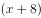分钟，故最快的是乙，最慢的是甲，两者相差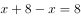分钟。

故正确答案为C。

---

## 第 3 题　qid 2137116 · 数学运算

有一种电子铃，每到整点就响一次铃，每走9分钟亮一次灯。正午12点时，它既亮灯又响铃。它下一次既响铃又亮灯是下午几点钟？

- **A**. 1点钟
- **B**. 2点钟
- **C**. 3点钟　✅
- **D**. 4点钟

**答案**：C

**官方解析**

每到整点就响一次铃，说明响铃的周期是60分钟；每走9分钟亮一次灯，说明亮灯的周期是9分钟。根据题意，求下次既响铃又亮灯的时间，实则求响铃和亮灯周期的最小公倍数，两者最小公倍数为180，则下次既响铃又亮灯是在12点再过180分钟后，即下午3点钟。
故正确答案为C。

---

## 第 4 题　qid 2137118 · 数学运算

小马从A地到B地自驾游，如果驾驶原来的燃油汽车所需油费为108元，驾驶新购买的纯电动汽车所需电费为27元。已知每行驶1千米，原来的燃油汽车所需的油费比新购买的纯电动汽车所需的电费多0.54元，从A地到B地的路程是多少千米？

- **A**. 100
- **B**. 150　✅
- **C**. 180
- **D**. 200

**答案**：B

**官方解析**

走完全程驾驶原来的燃油汽车比新购买的电动汽车多花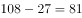元，每千米多花0.54元，故千米。

故正确答案为B。

---

## 第 5 题　qid 2137120 · 数学运算

本题图中，左边的图形每个小圆的面积为，那么右边图形中阴影部分面积为：

- **A**. 

- **B**. 

　✅
- **C**. 
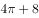

- **D**. 
20

**答案**：B

**官方解析**

左图中，每个小圆的面积为，则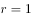，故正方形的边长为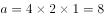，则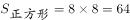。

右图中，大圆的半径为正方形边长的一半，即，则大圆的面积为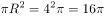。

所以右图阴影部分的面积为正方形面积减去大圆面积，即。

故正确答案为B。

---

## 第 6 题　qid 2137062 · 数学运算

一家电影院的电影票收费标准为50元/次，若购买会员年卡，可享受如下优惠：

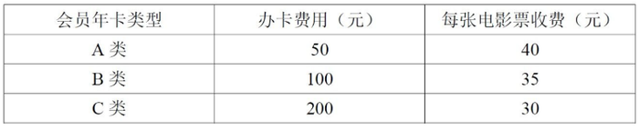

若小李一年内在该电影院观影次数介于10-20次之间，则对于他来说最省钱的方式为：

- **A**. 购买A类会员年卡
- **B**. 不购买会员年卡
- **C**. 购买C类会员年卡
- **D**. 购买B类会员年卡　✅

**答案**：D

**官方解析**

方法一：由于观影次数介于10-20次之间，考虑极端情况，当观影次数问题为11次时：

不购买会员年卡所花钱数为元；

购买A类会员年卡所花钱数为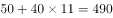元；

购买B类会员年卡所花钱数为元；

购买C类会员年卡所花钱数为元，此时购买B类会员卡最省钱；

当观影次数为19次时：

不购买会员年卡所花钱数为元；

购买A类会员年卡所花钱数为元；

购买B类会员年卡所花钱数为元；

购买C类会员年卡所花钱数为元，此时也是购买B类会员卡最省钱。

综合两个极端情况，当观影次数介于10-20次之间时候选择B类会员卡最省钱。

故正确答案为D。

方法二：每种购票方式两两比较如下：

A与B比较时，B类办卡费用比A类多花50元，但是每张电影票多节省5元，张。即当购买10张电影票时，A、B花钱一样多，超过10张时，B类更省钱；

B与C比较时，C类办卡费用比B类多花100元，但是每张电影票节省5元，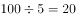张。即当购买20张电影票时，B、C花钱一样多，超过20张时，C类才会更省钱，所以20张以下时，B类更省钱；

B与不购买会员卡比较时，办卡花费100元，会员卡每张电影票节省元，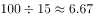。即购票超过6.67张时，B类更省钱，所以当购票在10-20张之间时，购买B类会员卡更优惠。

综上，在观影次数介于10-20次时，购买B类会员卡相比其他三种方式都更省钱。

备注：10-20之间不包括端点，即10和20。

故正确答案为D。

---

## 第 7 题　qid 2137064 · 数学运算

张某和李某在同一家公司工作，其2017年的月薪都是10000元。已知张某和李某加入公司第一年的月薪都是4000元，张某每年的月薪都比上一年上涨元，而李某每年的月薪都比上一年上涨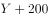元。则张某在公司最少工作了几年？

- **A**. 6　✅
- **B**. 5
- **C**. 4
- **D**. 3

**答案**：A

**官方解析**

设张某在公司工作了年，由题干条件可得，年后（即2017年）张某的。

同理，设李某在单位工作了年，则年后（即2017年）李某的。

梳理可得：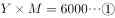；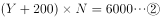。

结合选项，问的是最少，从小到大代入可得：

D项：当时，可得。代入②式，解得不为整，排除；

C项：当时，可得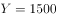。代入②式，解得不为整，排除；

B项：当时，可得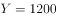。代入②式，解得不为整，排除；

A项：当时，可得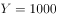。代入②式，解得，当选。

即张某在公司至少工作了6年。

故正确答案为A。

---

## 第 8 题　qid 2137068 · 数学运算

甲、乙两人生产零件，甲的任务量是乙的2倍，甲每天生产200个零件，乙每天生产150个零件，甲完成任务的时间比乙多2天，则甲、乙任务量总共为多少个零件？

- **A**. 1200
- **B**. 1800　✅
- **C**. 2400
- **D**. 3600

**答案**：B

**官方解析**

设乙完成任务的时间为天，则甲为天。则甲的个，乙的个。因甲的任务量是乙的2倍，则，解得天。则乙的个，甲的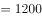个。二者个。

故正确答案为B。

---

## 第 9 题　qid 2137078 · 数学运算

某水果批发商从果农那里以10元/公斤的价格购买了一批芒果，运送到某地区售出。在长途运输过程中有的芒果磕碰受损和另外的芒果过度成熟，因此无法卖出，其余部分以25元/公斤的价格售出后，如果不计运输等其他费用，这批芒果赚得利润为12000元。则该批发商从果农那里购买了多少公斤芒果？

- **A**. 480
- **B**. 800
- **C**. 960　✅
- **D**. 1000

**答案**：C

**官方解析**

设批发商购买了公斤芒果，因的芒果因故无法出售，故只售出了的芒果，即只售出了公斤芒果。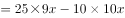，解得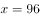公斤，则批发商购买了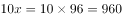公斤芒果。

故正确答案为C。

---

## 第 10 题　qid 2137080 · 数学运算

某单位有甲和乙两个人数相同的处室，甲处室党员人数是群众人数的1.5倍，而两个处室党员总人数与群众总人数正好相同。现从甲处室调走10名党员后，甲处室和乙处室党员占各自处室现有职工的比例相同。则两个处室最初共有多少人？

- **A**. 48
- **B**. 60　✅
- **C**. 72
- **D**. 90

**答案**：B

**官方解析**

方法一：设甲处室党员为人，则群众为人，所以甲处室总共有人。已知甲、乙两处室人数相同，所以乙处室人数也是人。由“两个处室党员总人数和群众总人数正好相同”可知，乙处室党员人数为，群众人数为。甲处室调走10名党员后，两处室党员占各自处室现有职工的比例相同，即，解得，所以两处室最初共有人。

方法二：由“甲处室党员人数是群众人数的1.5倍”可得，甲处室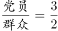。因为两处室人数相等，且党员和群众的总人数也相等，所以乙处室。因此两处室的总人数一定是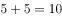的倍数，排除A、C选项；代入B选项，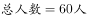，则甲处室人数为30人，即，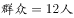。调走10名党员后，甲处室党员人数占本处室总人数的，乙处室党员占本处室总人数的比例为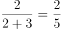，两处室党员占各自处室现有职工的比例相同，满足题意。

故正确答案为B。

---

## 第 11 题　qid 2137092 · 数学运算

军事演习的模拟战场上有3个要点，B点在A点正北方3千米处，C点在A点正东方4千米处。现某部队保持与B、C两点相同的距离穿过战场，其在行进过程中，与A点之间最短的距离为多少千米？

- **A**. 0.5
- **B**. 0.6
- **C**. 0.7　✅
- **D**. 0.875

**答案**：C

**官方解析**

DE为BC的垂直平分线，则DE上任一点到B、C的距离均相等。在直角△ABC中，AB=3，AC=4，根据勾股定理可得BC=5，BD=CD=2.5。从A点向DE作垂线并与之相交于E点，则AE即为点A到DE最短的距离。从A点向BC作垂线并与之相交于F点，则AF//DE，且。由于，且，因此，则有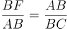，即，可得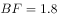。因此。

故正确答案为C。

---

## 第 12 题　qid 2137094 · 数学运算

工业原料A因供不应求，每吨的价格上涨了，导致使用A原料的产品每件生产成本较最初上涨了120元。此时企业改进生产工艺，每件产品可少使用A原料1公斤，此时每件产品的生产成本只较最初上涨40元。则改进生产工艺之前，每件产品使用多少公斤A原料？

- **A**. 12
- **B**. 9　✅
- **C**. 7.5
- **D**. 6

**答案**：B

**官方解析**

设使用原料A的产品每件原来成本是元，则价格上涨后是元；改进工艺前每件产品使用原料A为公斤，则改进工艺后每件产品使用原料A为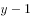公斤。

由题意“使用A原料的产品每件生产成本较最初上涨了120元”，可得：

“改进工艺后每件产品少使用A原料1公斤，成本只上涨40元”，可得：

联立方程①②解得。

故正确答案为B。

---

## 第 13 题　qid 2137096 · 数学运算

5名职工在办公室里的分机号码都是2位数字，且他们分机号码最后一位的5个数字相加为32，最大的数比最小的大7且各不相同。如将每个人的分机号码个位和十位颠倒形成新的分机号，则5个人新分机号码的5个2位数字之和最大为：

- **A**. 365　✅
- **B**. 395
- **C**. 482
- **D**. 495

**答案**：A

**官方解析**

根据题意，原来的分机号最后一位的5个数字相加为32，则分机号颠倒后，所有十位上的数字和就是32。为了使得新分机号码的5个两位数字的和最大，则新分机号的个位数都取最大值9。因此题目所求为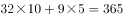。

故正确答案为A。

---

## 第 14 题　qid 2137100 · 数学运算

甲和乙走完AB两地之间的距离分别需要120分钟和分钟。某日甲从A地出发前往B地，1小时后乙从B地出发前往A地，两人到达目的地后都立刻折返。如甲和乙前两次遇见都是迎面相遇，问的取值范围为（    ）。

- **A**. 

- **B**. 

　✅
- **C**. 

- **D**. 

**答案**：B

**官方解析**

根据题干，甲、乙第一次遇见一定是迎面相遇，而第二次迎面相遇可以发生在AB间任意一点，那么极限情况一定是在A、B两个端点。

若是在A点发生第二次相遇（如下图1），此时甲走完2个全程，用时120×2=240分钟，乙晚出发1小时，并走完1个全程（x分钟），则240=60+x，解得x=180分钟。

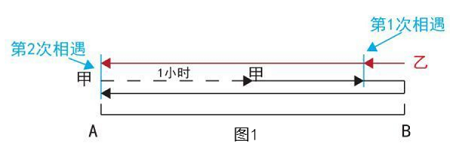

若是在B点发生第二次相遇（如下图2），此时甲走完1个全程，用时120分钟，乙晚出发1小时，并走完2个全程（2x分钟），则120=60+2x，解得x=30分钟。

因要求两次都是迎面相遇，故取值范围为30&lt;x&lt;180。

故正确答案为B。

---

## 第 15 题　qid 2137104 · 数学运算

某工厂的产品有7家代理商，如果以满意度最高为7分，满意度最低为1分，7家代理商对工厂的满意度正好是1分到7分的不同整数值。如从中任意选择3家代理商进行调查，其对工厂满意度的平均值与所有代理商满意度平均值相差小于1的概率为

- **A**. 

- **B**. 

- **C**. 

- **D**. 

　✅

**答案**：D

**官方解析**

根据题意，共有7家代理商，从中任取3家，总的情况数为。7家代理商满意度平均值为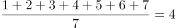分，要使从中任取3家代理商对工厂满意度的平均值与所有代理商满意度平均值相差小于1分，则被抽出的3家代理商对工厂满意度的平均值应大于3分，小于5分，即其总分应大于9分，小于15分。

正向考虑，情况较多，从反面进行枚举，即被抽出的3家代理商对工厂满意度总分小于等于9分或大于等于15分。小于等于9分的情况有（1,2,3）、（1,2,4）、（1,2,5）、（1,2,6）、（1,3,4）、（1,3,5），（2,3,4），共7种；大于等于15分的情况有（2,6,7）、（3,5,7）、（3,6,7）、（4,5,6）、（4,5,7）、（4,6,7）、（5,6,7），共7种。则满足题意的情况数为种，所求概率。

故正确答案为D。

---
