# 2018年四川省公务员录用考试《行测》题（下半年）（网友回忆版）

> 数量关系 · 10 题 · 四川 2018

## 第 1 题　qid 2280974 · 数学运算

甲车间的生产效率是乙车间的1.5倍，分别生产1200件相同的产品，甲车间所需时间比乙车间少10天。问甲、乙两个车间合作生产3000件相同的产品需要多少天？

- **A**. 20
- **B**. 25
- **C**. 30　✅
- **D**. 35

**答案**：C

**官方解析**

甲车间的生产效率是乙车间的1.5倍。设甲车间工作效率为，乙车间工作效率为，已知“分别生产1200件相同的产品，甲车间所需时间比乙车间少10天”，则，解得。甲车间每天生产件，乙车间每天生产件。甲、乙两个车间合作生产3000件相同的产品需要天数为：天。

故正确答案为C。

---

## 第 2 题　qid 2280976 · 数学运算

某企业采购A类、B类和C类设备各若干台，21台设备共用48万元。已知A、B、C类设备的单价分别为1.2万元、2万元和2.4万元。问该企业最多可能采购了多少台C类设备？

- **A**. 16
- **B**. 17　✅
- **C**. 18
- **D**. 19

**答案**：B

**官方解析**

设该企业采购A类、B类和C类设备数量分别为、、。已知“21台设备共用48万元”，则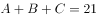······①，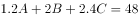······②。联立两式，可得：，化简得：。由于设备购买数量一定是不为零的整数，根据奇偶特性，一定是奇数，排除A、C两项。若要C类设备最多，代入D项可得：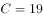，，此时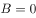不符合题意，排除。

故正确答案为B。

---

## 第 3 题　qid 2280982 · 数学运算

某档案馆将从001开始编号的档案按顺序放入不同的文件箱，每份档案编号唯一且每个文件箱所装档案数量相同。已知185号档案位于第3箱，406号档案位于第5箱。问每箱装有的档案份数有多少种可能性？

- **A**. 1种
- **B**. 2～5种之间
- **C**. 6～10种之间
- **D**. 超过10种　✅

**答案**：D

**官方解析**

每份档案编号唯一且每个文件箱所装档案数量相同，按顺序放入，每箱档案数一定为整数。因此若要185号档案在第3箱，则≤每箱档案数≤，即61.7≤每箱档案数≤92。若要406号档案在第5箱，则≤每箱档案数≤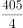，即81.2≤每箱档案数≤101.25。由于两个条件都要满足，因此取两者交集，即81.2≤每箱档案数≤92，故从82到92的整数均满足要求，总共有11种情况，超过10种。

故正确答案为D。

---

## 第 4 题　qid 2280986 · 数学运算

某试验田为长20米、宽1米的长条形地块，将其分割为3个宽为1米、长为6米的长方形地块，以及2个边长为1米的正方形地块，种植A、B、C三种药材。每种药材至少种一个小地块，相邻地块种植不同药材。A、B、C三种药材每平方米的产量分别为1.2公斤、0.9公斤、2.5公斤，该试验田最多可产出多少公斤药材？

- **A**. 27.6
- **B**. 37.8
- **C**. 39.0
- **D**. 47.1　✅

**答案**：D

**官方解析**

想让试验田种出的药材尽可能多，则应让面积大的地块种植产量高的C药材，因相邻地块种植不同药材，则各地块分布可如下图所示：

由图可知，A、B、C的面积分别为1平方米、1平方米、18平方米。

则总产量为公斤。

故正确答案为D。

---

## 第 5 题　qid 2280990 · 数学运算

甲工程队与乙工程队的效率之比为4：5，一项工程由甲工程队先单独做6天，再由乙工程队单独做8天，最后由甲、乙两个工程队合作4天刚好完成，如果这项工程由甲工程队或乙工程队单独完成，则甲工程队所需天数比乙工程队所需天数多多少天？

- **A**. 3
- **B**. 4
- **C**. 5　✅
- **D**. 6

**答案**：C

**官方解析**

赋值甲、乙效率分别为4、5，则工程总量为。甲单独完成所需天数比乙多天。

故正确答案为C。

---

## 第 6 题　qid 2281010 · 数学运算

甲、乙、丙三个农户种植龙稻、徽稻两种水稻，已知乙和丙水稻总产量是甲的，且龙稻产量分别占甲、乙、丙水稻总产量的、和，乙和丙的龙稻产量之和等于甲龙稻产量，则甲、乙、丙水稻产量比为：

- **A**. 5：3：1
- **B**. 10：7：1
- **C**. 15：11：1
- **D**. 20：15：1　✅

**答案**：D

**官方解析**

方法一：由题意可列式为：①，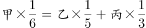②。将①式代入②式可得，，化简为，即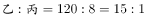，观察选项只有D满足。

方法二：由题意可知，甲总产量为5、6的倍数，赋值甲总产量为30，则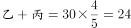①，②，联立①②解得，，。则。

故正确答案为D。

---

## 第 7 题　qid 2281013 · 数学运算

企业今年从全国6所知名大学招聘了500名应届生，从其中任意2所大学招聘的应届生数量均不相同。其中从A大学招聘的应届生数量最少且正好为B大学的一半。从B大学招聘的应届生数量为6所大学中最多的。则该企业今年从A大学至少招聘了多少名应届生？

- **A**. 48
- **B**. 47　✅
- **C**. 46
- **D**. 45

**答案**：B

**官方解析**

由题意可知，A大学招聘数量最少且为B大学的一半，B大学数量最多，即。因任意2所大学招聘的应届生数量均不相同，若让A大学招聘数量尽量少，则其他学校数量要尽量多。设A学校招聘数量为名，则从B大学最多招聘名，可将各学校招聘数量列表如下：

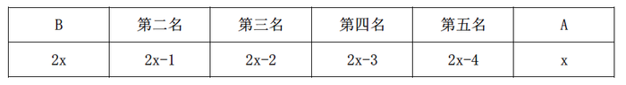

可列式为，解得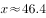，问最少需向上取整，则A大学至少招聘47名。

故正确答案为B。

---

## 第 8 题　qid 2281015 · 数学运算

某场学术论坛有6家企业作报告，其中A企业和B企业要求在相邻的时间内作报告，C企业作报告的时间必须在D企业之后、在E企业之前，F企业要求不能第一个，也不能最后一个作报告。如满足所有企业的要求，则报告的先后次序共有多少种不同的安排方式？

- **A**. 12
- **B**. 24　✅
- **C**. 72
- **D**. 144

**答案**：B

**官方解析**

根据题意，按照先后次序，D、C、E三者相对顺序仅此1种；A、B要求相邻，利用捆绑法有种，再插入D、C、E形成的空中，有种方法；F不是第一个，也不是最后一个，只能插入AB、D、C、E之间的3个空中，有种方法；分步用乘法，因此不同安排方式共1×2×4×3=24种。

故正确答案为B。

---

## 第 9 题　qid 2281018 · 数学运算

甲和丙的年龄和是乙的2倍，今年甲的年龄是丙的3倍，9年后甲的年龄是丙的2.4倍，则多少年后丙的年龄是乙的？

- **A**. 7　✅
- **B**. 9
- **C**. 12
- **D**. 14

**答案**：A

**官方解析**

设今年丙的年龄为，则甲的年龄为，乙的年龄为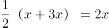。根据题意有：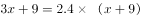，解得：。设n年后丙的年龄是乙的，则有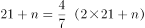，解得n=7。

故正确答案为A。

---

## 第 10 题　qid 2281022 · 数学运算

在美化城市活动中，某街道工作人员想借助如图所示的直角墙角，用28米长的篱笆围成一个矩形花园ABCD，篱笆只围AB、BC两边。图中的P为一棵直径为1米的树，其与墙CD、AD的最短距离分别是14米和5米，若要将这棵树围在花园内，则花园的最大面积为多少平方米？

- **A**. 187
- **B**. 192
- **C**. 195　✅
- **D**. 196

**答案**：C

**官方解析**

树的直径为1米，与墙CD、AD的最短距离分别是14米和5米，则BC≥14+1=15，AB≥5+1=6。根据题意，BC+AB=28，故长方形ABCD周长一定，要使其面积最大，则其形状尽量接近正方形，因此BC=15，AB=28-15=13。此时ABCD面积最大，为15×13=195平方米。

故正确答案为C。

---
