# 2018年国家公务员录用考试《行测》题（副省级网友回忆版）

> 数量关系 · 15 题 · 国考 2018

## 第 1 题　qid 2133512 · 数学运算

甲商店购入400件同款夏装。7月以进价的1.6倍出售，共售出200件；8月以进价的1.3倍出售，共售出100件；9月以进价的0.7倍将剩余的100件全部售出，总共获利15000元。问这批夏装的单件进价为多少元？

- **A**. 125　✅
- **B**. 144
- **C**. 100
- **D**. 120

**答案**：A

**官方解析**

设同款夏装的单件进价为元，则7月利润元、8月利润元、9月利润元，，解得。

故正确答案为A。

---

## 第 2 题　qid 2133762 · 数学运算

一辆汽车第一天行驶了5个小时，第二天行驶了600公里，第三天比第一天少行驶200公里，三天共行驶了18个小时。已知第一天的平均速度与三天全程的平均速度相同，问三天共行驶了多少公里？

- **A**. 800
- **B**. 900　✅
- **C**. 1000
- **D**. 1100

**答案**：B

**官方解析**

设第一天的平均速度为公里/小时，则第一天路程为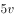公里，第三天路程为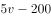公里。由全程平均速度与第一天相同，可得方程：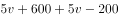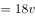，解得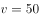，则三天共行驶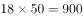公里。

故正确答案为B。

---

## 第 3 题　qid 2133518 · 数学运算

企业某次培训的员工中有369名来自A部门，412名来自B部门。现分批对所有人进行培训，要求每批人数相同且批次尽可能少。如果有且仅有一批培训对象同时包含来自A和B部门的员工，那么该批中有多少人来自B部门？

- **A**. 14
- **B**. 32
- **C**. 57　✅
- **D**. 65

**答案**：C

**官方解析**

两部门总人数人。要使每批人数相同且批次尽可能少，则可以对总人数因式分解为，要让批次最少，则将所有人分为11批，每批人数71人。

根据题意“有且仅有一批培训对象同时包含来自A和B部门的员工”，故只有这一批的71人由两个部门组合而成，其余的每一批71人均来自同一个部门。

考虑B部门，则B部门可以分为完整的5批再加57人，故所求的这一批人中有57人来自B部门。

故正确答案为C。

---

## 第 4 题　qid 2133516 · 数学运算

某单位的会议室有5排共40个座位，每排座位数相同。小张和小李随机入座，则他们坐在同一排的概率：

- **A**. 
不高于

- **B**. 
高于但低于
　✅
- **C**. 
正好为

- **D**. 
高于

**答案**：B

**官方解析**

从40个座位中选2个座位，由小张和小李随机入座，总的情况数为。

要让他们恰好坐在同一排，应先从5排中选一排，再从这一排中选2个座位，符合条件的情况为。满足情况的概率，在到之间。

故正确答案为B。

---

## 第 5 题　qid 2133520 · 数学运算

将一块长24厘米、宽16厘米的木板分割成一个正方形和两个相同的圆形，其余部分弃去不用。在弃去不用的部分面积最小的情况下，圆的半径为多少厘米？

- **A**. 

- **B**. 

- **C**. 
8

- **D**. 
4
　✅

**答案**：D

**官方解析**

若要求弃去不用的面积最小，则分割出的面积应尽可能大。

如图所示，分割出的正方形面积应尽可能大，可分割出一个厘米的正方形，还剩一个厘米的小长方形。小长方形可以分割出两个厘米的小正方形，再从每个小正方形内部分割出一个完整的内切圆，此时弃去不用的面积最小。

依此可得，厘米。

故正确答案为D。

---

## 第 6 题　qid 2133532 · 数学运算

工程队接到一项工程，投入80台挖掘机。如连续施工30天，每天工作10小时，正好按期完成。但施工过程中遭遇大暴雨，有10天时间无法施工。工期还剩8天时，工程队增派70台挖掘机并加班施工。问工程队若想按期完成，平均每天需多工作多少个小时？

- **A**. 1.5
- **B**. 2　✅
- **C**. 2.5
- **D**. 3

**答案**：B

**官方解析**

赋值每台挖掘机每小时的效率为1，因遭遇暴雨，10天时间无法施工，则只能施工天，在还剩8天时，已施工12天，此时。在增派70台挖掘机后，若想在规定时间完工，设每天需工作小时，则可得：，解得。即平均每天需多工作小时。

故正确答案为B。

---

## 第 7 题　qid 2133772 · 数学运算

书法大赛的观众对5幅作品进行不记名投票。每张选票都可以选择5幅作品中的任意一幅或多幅，但只有在选择不超过2幅作品时才为有效票。5幅作品的得票数（不考虑是否有效）分别为总票数的、、、和。问本次投票的有效率最高可能为多少？

- **A**. 

- **B**. 

　✅
- **C**. 

- **D**. 

**答案**：B

**官方解析**

假设共有100位观众，每名观众有一张投票，在票上写出相应作品的编号。则5幅作品的总得票数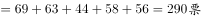。说明人均投票数为2.9票。

要使投票有效率（即有效票占比）最高，则让有效票的人均投票数尽可能靠近2.9票，取为一人2票；反之，无效票占比最低，则无效票的人均投票数尽可能远离2.9票，取为一人5票。

设有效票观众人数为人，无效票观众人数为人，则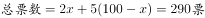，解得：人，即有效率为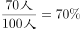。

故正确答案为B。

---

## 第 8 题　qid 2133524 · 数学运算

企业花费600万元升级生产线，升级后能耗费用降低了，人工成本降低了。如每天的产量不变，预计在400个工作日后收回成本。如果升级前人工成本为能耗费用的3倍，问升级后每天的人工成本比能耗费用高多少万元？

- **A**. 1.2
- **B**. 1.5
- **C**. 1.8　✅
- **D**. 2.4

**答案**：C

**官方解析**

根据条件“升级前人工成本为能耗费用的3倍”，设能耗费用为，则人工成本为。在升级生产线后，能耗费用降低了，则降低了；人工成本降低了，则降低了。

在400个工作日后收回成本，此时减少的成本达到升级生产线所花的钱数，即万，解得万。

则升级后每天的，每天的。前者比后者高万元。

故正确答案为C。

---

## 第 9 题　qid 2133534 · 数学运算

枣园每年产枣2500公斤，每公斤固定盈利18元。为了提高土地利用率，现决定明年在枣树下种植紫薯（产量最大为10000公斤），每公斤固定盈利3元。当紫薯产量大于400公斤时，其产量每增加n公斤将导致枣的产量下降0.2n公斤。问该枣园明年最多可能盈利多少元？

- **A**. 46176
- **B**. 46200　✅
- **C**. 46260
- **D**. 46380

**答案**：B

**官方解析**

当紫薯产量大于400公斤时，每增加n公斤将导致枣的产量下降0.2n公斤。

假设紫薯的产量为公斤，则此时枣的产量为公斤。

则总盈利为，要让总盈利最大，则n取0，此时总盈利为46200元。

故正确答案为B。

---

## 第 10 题　qid 2133538 · 数学运算

某企业国庆放假期间，甲、乙和丙三人被安排在10月1号到6号值班。要求每天安排且仅安排1人值班，每人值班2天，且同一人不连续值班2天。问有多少种不同的安排方式？

- **A**. 15
- **B**. 24
- **C**. 30　✅
- **D**. 36

**答案**：C

**官方解析**

方法一：

情况较复杂，考虑枚举法，设10月1日安排甲值班，10月2日安排乙值班，将安排情况梳理如下：

此时符合条件的情况有5种，又因为10月1日和2日可以从甲、乙、丙三人中任选两人值班，所以共有种不同的安排方式。

方法二：

1号，甲、乙、丙三人选一人，有种排法；2号，从另外两人中选一人，有种排法；设1号安排甲值班，2号安排乙值班，在3号有两种可能性：①如果为甲，则剩下的4号丙、5号乙、6号丙，有1种情况；②如果为丙，则4号可排甲、乙，2种情况，5号有2种情况，一共有种情况。因此总的情况数为种不同的安排方式。

故正确答案为C。

---

## 第 11 题　qid 2133776 · 数学运算

一艘非法渔船作业时发现其正右方有海上执法船，于是沿下图所示方向左转后，立即以15节（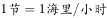）的速度逃跑，同时执法船沿某一直线方向匀速追赶，并正好在某一点追上。已知渔船在被追上前逃跑的距离刚好与其发现执法船时与执法船的距离相同，问执法船的速度为多少节？

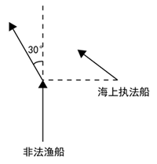

- **A**. 
20

- **B**. 
30

- **C**. 

- **D**. 
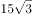
　✅

**答案**：D

**官方解析**

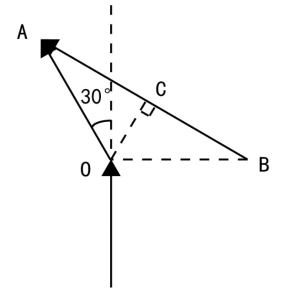

根据题意可知，非法渔船和执法船的行驶路线为上图所示，非法渔船在A点被追上。由于非法渔船的逃跑距离和发现执法船时跟其距离相同，假设距离为，即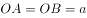；渔船左转，即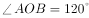。又因为为等腰三角形，故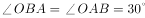。

过点O做OC垂直AB于点C，根据为直角三角形，且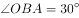可得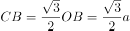，因此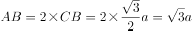。

渔船从O到A，执法船从B到A，行驶时间相同，假设执法船速度为，则有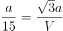，解得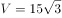。

故正确答案为D。

---

## 第 12 题　qid 2133778 · 数学运算

某公司A商品利润为定价的，前年销量为10万个；B商品利润为定价的，前年销量为4万个。去年公司将A、B商品捆绑销售，售价为前年两种商品定价之和的，共卖出8万套，总利润比前年增加了。如两种商品去年的成本与前年相同，则前年A商品的定价为B商品定价的：

- **A**. 

　✅
- **B**. 

- **C**. 

- **D**. 

**答案**：A

**官方解析**

假设前年每个A商品定价为x，利润为0.3x，则其成本为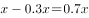；每个B商品定价为y，利润为0.4y，则其成本为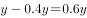。

前年的总利润为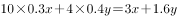，去年的总利润为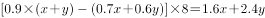，去年总利润比前年增加了，则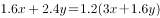，解得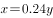，则前年A商品的定价为B商品定价的。

故正确答案为A。

---

## 第 13 题　qid 2133540 · 数学运算

某新能源汽车企业计划在A、B、C、D四个城市建设72个充电站，其中在B市建设的充电站数量占总数的，在C市建设的充电站数量比A市多6个，在D市建设的充电站数量少于其他任一城市。问至少要在C市建设多少个充电站？

- **A**. 20
- **B**. 18
- **C**. 22
- **D**. 21　✅

**答案**：D

**官方解析**

因为B市建设充电站的数量占总数的，C市又比A市多6个，D市最少，所以四个城市充电站个数关系为：B、C两市建设充电站的数量较多，A市第三多，D市最少。要使C市建设的充电站尽量少，就要让其他市建设的充电站尽量多，其中，，D尽量多且比A少，所以D最多为。此时充电站总个数，解得，问至少，应向上取整，所以C至少建设21个充电站。

故正确答案为D。

---

## 第 14 题　qid 2133780 · 数学运算

某饲料厂原有旧粮库存袋，现购进袋新粮后，将粮食总库存的精加工为饲料。被精加工为饲料的新粮最多为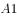袋，最少为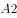袋。如所有旧粮、新粮每袋重量相同，则以下哪个坐标图最能准确描述、分别与的关系？

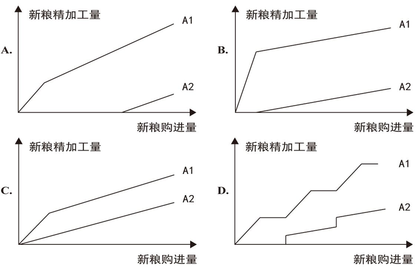

- **A**. A　✅
- **B**. B
- **C**. C
- **D**. D

**答案**：A

**官方解析**

根据题干“某饲料厂原有旧粮库存袋，现购进袋新粮后，将粮食总库存的精加工为饲料”可知需加工成饲料的粮食量为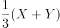袋。

若想要新粮加工量最少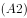，则我们需要先加工旧粮，旧粮为恒定不变的值。分类讨论如下：

如果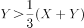，则新粮精加工量为0，说明的函数图必须有一段纵轴值为0的横线，而C选项没有，排除C选项；

如果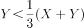，则需要加工一部分新粮，需要新粮量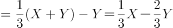，而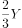是常数，故可知需要新粮的量为一条斜率为的直线，说明的函数图后半部分是直线上升的，而D是阶梯型上升，排除D选项。 

（备注：此时如考生能观察到B选项A2图的斜率明显远小于1/3，也可以排除B项，从而直接选择A答案。）

若想要新粮加工量最多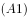，则需要先加工新粮，旧粮为恒定不变的值。分类讨论如下：

如果新粮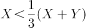，则新粮需全部使用，图形纵坐标新粮加工量为，故的函数图的前半部分应为斜率为1的直线（斜率为1，倾斜角为），而B项的斜率远大于1（或看倾斜角远大于），排除B选项；

（备注：考场上此时可直接选择A项，无需完整解题。）

如果新粮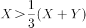，则新粮加工量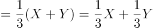，而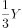是常数，故的函数图的后半部分应为斜率为的直线，与A项符合。

故正确答案为A。

---

## 第 15 题　qid 2133544 · 数学运算

某公司按1:3:4的比例订购了一批红色、蓝色、黑色的签字笔，实际使用时发现三种颜色的笔消耗比例为1:4:5。当某种颜色的签字笔用完时，发现另两种颜色的签字笔共剩下100盒。此时又购进三种颜色签字笔总共900盒，从而使三种颜色的签字笔可以同时用完。问新购进黑色签字笔多少盒？

- **A**. 450　✅
- **B**. 425
- **C**. 500
- **D**. 475

**答案**：A

**官方解析**

根据题意，红色、蓝色、黑色签字笔订购量的比例为1:3:4，黑色签字笔订购数量是所有签字笔订购数量的；签字笔实际消耗的比例为1:4:5，黑色占消耗数量的，说明剩下的100盒笔中，有的黑色签字笔。现在又购进三种颜色共900盒，若同时用完，必然其中有为黑色，所以新购进900盒中也应该有的黑色签字笔盒。 

故正确答案为A。

---
