# 2018年国家公务员录用考试《行测》题（地市级网友回忆版）

> 数量关系 · 10 题 · 国考 2018

## 第 1 题　qid 2133512 · 数学运算

甲商店购入400件同款夏装。7月以进价的1.6倍出售，共售出200件；8月以进价的1.3倍出售，共售出100件；9月以进价的0.7倍将剩余的100件全部售出，总共获利15000元。问这批夏装的单件进价为多少元？

- **A**. 125　✅
- **B**. 144
- **C**. 100
- **D**. 120

**答案**：A

**官方解析**

设同款夏装的单件进价为元，则7月利润元、8月利润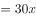元、9月利润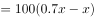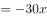元，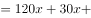，解得。

故正确答案为A。

---

## 第 2 题　qid 2133516 · 数学运算

某单位的会议室有5排共40个座位，每排座位数相同。小张和小李随机入座，则他们坐在同一排的概率：

- **A**. 
不高于

- **B**. 
高于但低于
　✅
- **C**. 
正好为

- **D**. 
高于

**答案**：B

**官方解析**

从40个座位中选2个座位，由小张和小李随机入座，总的情况数为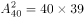。

要让他们恰好坐在同一排，应先从5排中选一排，再从这一排中选2个座位，符合条件的情况为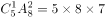。满足情况的概率，在到之间。

故正确答案为B。

---

## 第 3 题　qid 2133518 · 数学运算

企业某次培训的员工中有369名来自A部门，412名来自B部门。现分批对所有人进行培训，要求每批人数相同且批次尽可能少。如果有且仅有一批培训对象同时包含来自A和B部门的员工，那么该批中有多少人来自B部门？

- **A**. 14
- **B**. 32
- **C**. 57　✅
- **D**. 65

**答案**：C

**官方解析**

两部门总人数人。要使每批人数相同且批次尽可能少，则可以对总人数因式分解为，要让批次最少，则将所有人分为11批，每批人数71人。

根据题意“有且仅有一批培训对象同时包含来自A和B部门的员工”，故只有这一批的71人由两个部门组合而成，其余的每一批71人均来自同一个部门。

考虑B部门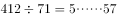，则B部门可以分为完整的5批再加57人，故所求的这一批人中有57人来自B部门。

故正确答案为C。

---

## 第 4 题　qid 2133520 · 数学运算

将一块长24厘米、宽16厘米的木板分割成一个正方形和两个相同的圆形，其余部分弃去不用。在弃去不用的部分面积最小的情况下，圆的半径为多少厘米？

- **A**. 

- **B**. 
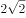

- **C**. 
8

- **D**. 
4
　✅

**答案**：D

**官方解析**

若要求弃去不用的面积最小，则分割出的面积应尽可能大。

如图所示，分割出的正方形面积应尽可能大，可分割出一个厘米的正方形，还剩一个厘米的小长方形。小长方形可以分割出两个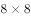厘米的小正方形，再从每个小正方形内部分割出一个完整的内切圆，此时弃去不用的面积最小。

依此可得，厘米。

故正确答案为D。

---

## 第 5 题　qid 2133524 · 数学运算

企业花费600万元升级生产线，升级后能耗费用降低了，人工成本降低了。如每天的产量不变，预计在400个工作日后收回成本。如果升级前人工成本为能耗费用的3倍，问升级后每天的人工成本比能耗费用高多少万元？

- **A**. 1.2
- **B**. 1.5
- **C**. 1.8　✅
- **D**. 2.4

**答案**：C

**官方解析**

根据条件“升级前人工成本为能耗费用的3倍”，设能耗费用为，则人工成本为。在升级生产线后，能耗费用降低了，则降低了；人工成本降低了，则降低了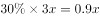。

在400个工作日后收回成本，此时减少的成本达到升级生产线所花的钱数，即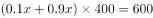万，解得万。

则升级后每天的，每天的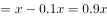。前者比后者高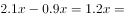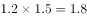万元。

故正确答案为C。

---

## 第 6 题　qid 2133532 · 数学运算

工程队接到一项工程，投入80台挖掘机。如连续施工30天，每天工作10小时，正好按期完成。但施工过程中遭遇大暴雨，有10天时间无法施工。工期还剩8天时，工程队增派70台挖掘机并加班施工。问工程队若想按期完成，平均每天需多工作多少个小时？

- **A**. 1.5
- **B**. 2　✅
- **C**. 2.5
- **D**. 3

**答案**：B

**官方解析**

赋值每台挖掘机每小时的效率为1，因遭遇暴雨，10天时间无法施工，则只能施工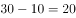天，在还剩8天时，已施工12天，此时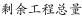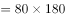。在增派70台挖掘机后，若想在规定时间完工，设每天需工作小时，则可得：，解得。即平均每天需多工作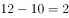小时。

故正确答案为B。

---

## 第 7 题　qid 2133534 · 数学运算

枣园每年产枣2500公斤，每公斤固定盈利18元。为了提高土地利用率，现决定明年在枣树下种植紫薯（产量最大为10000公斤），每公斤固定盈利3元。当紫薯产量大于400公斤时，其产量每增加n公斤将导致枣的产量下降0.2n公斤。问该枣园明年最多可能盈利多少元？

- **A**. 46176
- **B**. 46200　✅
- **C**. 46260
- **D**. 46380

**答案**：B

**官方解析**

当紫薯产量大于400公斤时，每增加n公斤将导致枣的产量下降0.2n公斤。

假设紫薯的产量为公斤，则此时枣的产量为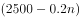公斤。

则总盈利为，要让总盈利最大，则n取0，此时总盈利为46200元。

故正确答案为B。

---

## 第 8 题　qid 2133538 · 数学运算

某企业国庆放假期间，甲、乙和丙三人被安排在10月1号到6号值班。要求每天安排且仅安排1人值班，每人值班2天，且同一人不连续值班2天。问有多少种不同的安排方式？

- **A**. 15
- **B**. 24
- **C**. 30　✅
- **D**. 36

**答案**：C

**官方解析**

方法一：

情况较复杂，考虑枚举法，设10月1日安排甲值班，10月2日安排乙值班，将安排情况梳理如下：

此时符合条件的情况有5种，又因为10月1日和2日可以从甲、乙、丙三人中任选两人值班，所以共有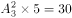种不同的安排方式。

方法二：

1号，甲、乙、丙三人选一人，有种排法；2号，从另外两人中选一人，有种排法；设1号安排甲值班，2号安排乙值班，在3号有两种可能性：①如果为甲，则剩下的4号丙、5号乙、6号丙，有1种情况；②如果为丙，则4号可排甲、乙，2种情况，5号有2种情况，一共有种情况。因此总的情况数为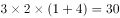种不同的安排方式。

故正确答案为C。

---

## 第 9 题　qid 2133540 · 数学运算

某新能源汽车企业计划在A、B、C、D四个城市建设72个充电站，其中在B市建设的充电站数量占总数的，在C市建设的充电站数量比A市多6个，在D市建设的充电站数量少于其他任一城市。问至少要在C市建设多少个充电站？

- **A**. 20
- **B**. 18
- **C**. 22
- **D**. 21　✅

**答案**：D

**官方解析**

因为B市建设充电站的数量占总数的，C市又比A市多6个，D市最少，所以四个城市充电站个数关系为：B、C两市建设充电站的数量较多，A市第三多，D市最少。要使C市建设的充电站尽量少，就要让其他市建设的充电站尽量多，其中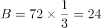，，D尽量多且比A少，所以D最多为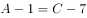。此时充电站总个数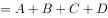，解得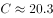，问至少，应向上取整，所以C至少建设21个充电站。

故正确答案为D。

---

## 第 10 题　qid 2133544 · 数学运算

某公司按1:3:4的比例订购了一批红色、蓝色、黑色的签字笔，实际使用时发现三种颜色的笔消耗比例为1:4:5。当某种颜色的签字笔用完时，发现另两种颜色的签字笔共剩下100盒。此时又购进三种颜色签字笔总共900盒，从而使三种颜色的签字笔可以同时用完。问新购进黑色签字笔多少盒？

- **A**. 450　✅
- **B**. 425
- **C**. 500
- **D**. 475

**答案**：A

**官方解析**

根据题意，红色、蓝色、黑色签字笔订购量的比例为1:3:4，黑色签字笔订购数量是所有签字笔订购数量的；签字笔实际消耗的比例为1:4:5，黑色占消耗数量的，说明剩下的100盒笔中，有的黑色签字笔。现在又购进三种颜色共900盒，若同时用完，必然其中有为黑色，所以新购进900盒中也应该有的黑色签字笔盒。 

故正确答案为A。

---
