# 2018年山东省选调应届优秀高校毕业生到基层工作笔试行政职业能力测验

> 数量关系 · 10 题 · 选调 2018

## 第 1 题　qid 2660807 · 数学运算

某火车站的始发车一般是提前若干分钟进行检票，假设每分钟到车站检票的乘客数一样多。从开始检票到等候队伍消失，若同时开启2个检票口需要30分钟；若同时开启3个检票口需要15分钟。问：若同时开启4个检票口需要几分钟？

- **A**. 9
- **B**. 10　✅
- **C**. 11
- **D**. 12

**答案**：B

**官方解析**

设开始检票前原有乘客数为人，每分钟新增加的乘客人数为人。则代入牛吃草公式可得，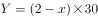，解得，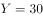。设若同时开启4个检票口需要分钟，则有：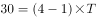，解得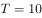，即需要10分钟。

故正确答案为B。

---

## 第 2 题　qid 2660808 · 数学运算

设有A、B两项工程，甲队单独完成A工程需要15天，单独完成B工程需要10天；乙队单独完成A工程需要5天，单独完成B工程需要15天。统筹安排甲、乙两队分工协作，以有效方式完成这两项工程，最少需要多少天？

- **A**. 7
- **B**. 7.5
- **C**. 8　✅
- **D**. 9

**答案**：C

**官方解析**

赋值A工程的工程总量为15和5的最小公倍数15，则甲完成A工程的效率为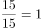，乙完成A工程的效率为；赋值B工程的工程总量为10和15的最小公倍数30，则甲完成B工程的效率为，乙完成B工程的效率为。因为乙完成A工程的效率更高，甲完成B工程的效率更高，所以优先让乙做A工程，甲做B工程。乙单独完成A工程需要5天，此时甲已做B工程的工程量为，剩下的工程量由甲、乙共同完成，还需要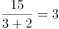天。因此以有效方式完成这两项工程最少需要天。

故正确答案为C。

---

## 第 3 题　qid 2660810 · 数学运算

某高校举办春季运动会，共有1000名学生报名参加竞赛项目。为从运动员中选拔人员参加开幕式和闭幕式队列，现把所有运动员从1到1000进行编号，选出编号为3的倍数的运动员参加开幕式队列，而编号为7的倍数的运动员参加闭幕式队列。问：既不参加开幕式队列也不参加闭幕式队列的运动员有多少人？

- **A**. 428
- **B**. 475
- **C**. 525
- **D**. 572　✅

**答案**：D

**官方解析**

编号为3的倍数的运动员共有取整，为333人；

编号为7的倍数的运动员共有取整，为142人；

两者都满足的运动员共有取整，为47人。

根据两集合容斥原理公式：，可得到关系：参加开幕式的人数参加闭幕式的人数开闭幕式都参加的人数总人数开闭幕式都不参加的人数，代入数字：开闭幕式都不参加的人数，解得：开闭幕式都不参加的运动员人。

故正确答案为D。

---

## 第 4 题　qid 2660815 · 数学运算

一台全自动咖啡机打八折销售，利润为进价的，如打七折出售，利润为50元。则这台咖啡机的原价是多少元？

- **A**. 250　✅
- **B**. 240
- **C**. 210
- **D**. 200

**答案**：A

**官方解析**

设这台咖啡机的原价为x元，进价为y元，根据“打八折销售，利润为进价的60%”，可得：0.8x-y=0.6y······①；根据“如打七折出售，利润为50元”，可得：0.7x-y=50······②，联立①和②，解得x=250。
故正确答案为A。

---

## 第 5 题　qid 2660818 · 数学运算

小王开车上班必须经过3个带有交通信号灯的路口，在每个路口遇到红灯的概率为0.2。如果小王一路遇到的红灯数不超过1个，上班将不会迟到。那么小王上班迟到的概率为：

- **A**. 0.04
- **B**. 0.048
- **C**. 0.104　✅
- **D**. 0.128

**答案**：C

**官方解析**

方法一：小王迟到的概率小王不迟到的概率。不迟到的情况有两种：没有遇到红灯和遇到1个红灯。没有遇到红灯的概率为。遇到1个红灯的概率为。故上班迟到的概率。

方法二：小王迟到的情况为遇到超过1个红灯，即他遇到2个红灯或3个红灯。遇到2个红灯的概率为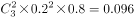。遇到3个红灯的概率为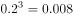。故他上班迟到的概率为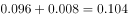。

故正确答案为C。

---

## 第 6 题　qid 2660828 · 数学运算

某企业产品成本和产量的关系为：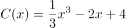，产品销售收入和产量的关系为：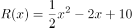。问：该企业产量为多少时才能获得最大利润？

- **A**. 
1
　✅
- **B**. 
2

- **C**. 

- **D**. 
8

**答案**：A

**官方解析**

设该企业的利润为，则利润和产量的关系为：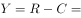，对函数求导，并令其导数为0，即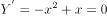，解得或，将这两个的值代入原函数，可得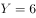或，由于，因此当产量为1时，获得最大利润。

故正确答案为A。

---

## 第 7 题　qid 2660835 · 数学运算

在一次马拉松比赛中，男子组和女子组从同一起点开始沿相同路线行进。已知男子组和女子组在前半程所用时间之比为5：6，跑后半程所用时间之比为4：5；男子组跑前、后半程所用时间之比为3：4。假定男子组和女子组前、后半程都是匀速跑，则女子组跑前、后半程所用时间之比为：

- **A**. 25：32
- **B**. 2：3
- **C**. 7：8
- **D**. 18：25　✅

**答案**：D

**官方解析**

由题意可知，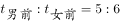，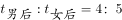，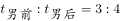，则可赋值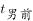为5和3的最小公倍数15，那么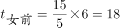，，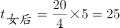，因此。

故正确答案为D。

---

## 第 8 题　qid 2660838 · 数学运算

某纸箱加工厂具有三种规格的原材料，大型原材料9平方米，可以制作6个纸箱；中型原材料7平方米，可以制作4个纸箱；小型原材料6平方米，可以制作3个纸箱。现要加工1000个纸箱，则纸箱加工厂最少使用多少平方米的原材料？

- **A**. 1503
- **B**. 1502
- **C**. 1501　✅
- **D**. 1500

**答案**：C

**官方解析**

由题意可知，用大型原材料制作每个纸箱需要平方米，用中型原材料需要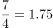平方米，用小型原材料需要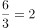平方米。对比可知，用大型原材料相对比较节省，因此制作纸箱尽可能多的使用大型原材料。

大型原材料可看成6个纸箱为一组，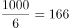组······4个，则166组纸箱需要的原材料为：平方米。剩下4个纸箱，用大型原材料需要9平方米，用中型原材料需要7平方米，用小型原材料需要平方米，可知用中型原材料最节省。

则加工1000个纸箱，最少使用原材料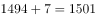平方米。

故正确答案为C。

---

## 第 9 题　qid 2660842 · 数学运算

某单位在植树节组织职工参加义务植树活动，每人至少参加挖树坑和运树苗两项活动中的一项。只挖树坑的人数和没挖树坑的人数相同，且两者之和是既挖树坑又运树苗的人数的4倍。则只参加一项活动的人数占参加植树活动总人数的比例为：

- **A**. 4:5　✅
- **B**. 2:3
- **C**. 3:4
- **D**. 5:6

**答案**：A

**官方解析**

设既挖树坑又运树苗的人为人，则只挖树坑的人、没挖树坑的人均是人，因为每人至少参加挖树坑和运树苗两项活动中的一项，则没挖树坑即只运树苗。只挖树苗的人也为人。参加活动的总人数只挖树坑的人只运树苗的人既挖树坑又运树苗的人人。所求比例为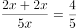。

故正确答案为A。

---

## 第 10 题　qid 2660845 · 数学运算

赵先生今年80岁，他有一个45岁的儿子、一个15岁的孙子、一个10岁的孙女。问：多少年后儿子、孙子、孙女三者的年龄之和恰好等于赵先生的年龄？

- **A**. 2
- **B**. 3
- **C**. 4
- **D**. 5　✅

**答案**：D

**官方解析**

设年后儿子、孙子、孙女三者的年龄之和等于赵先生。根据每过一年长一岁可知：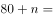，解得。

故正确答案为D。

---
