# 2018年山东省选调生优选计划笔试综合测试（节选）

> 数量关系 · 2 题 · 选调 2018

## 第 1 题　qid 2657345 · 数学运算

某单位要从机关抽点6名女干部，20名男干部到基层锻炼。其中从事技术工作的女干部和男干部的人数比为2：7，从事行政工作的女干部和男干部的人数比为1：3。问从事行政工作的干部共有多少人？

- **A**. 4
- **B**. 8　✅
- **C**. 12
- **D**. 16

**答案**：B

**官方解析**

方法一：方程法。设从事技术工作的女干部和男干部的人数为和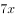，从事行政工作的女干部和男干部的人数为和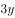，根据题意可知，①，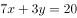②，联立①②解得，。因此从事行政工作的干部一共有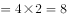人。

方法二：倍数特性法。根据题意可知，从事技术工作的干部人数为的倍数，从事行政工作的干部为的倍数。设技术干部和行政干部分别为和，则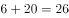。根据倍数特性，和26均为2的倍数，则9m为2的倍数。当时，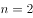；当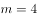时，，排除。故行政工作的干部人数为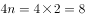人。

方法三：代入排除法。根据题意可知，从事行政工作的干部为的倍数，设为人。代入选项。

A项，若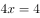，则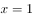，从事行政工作的女干部有1份即1人，那么从事技术工作的女干部为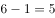人，与从事技术工作的女干部是2的倍数矛盾，排除；

B项，若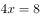，则，从事行政工作的女干部有1份即2人，那么从事技术工作的女干部为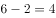人，根据从事技术工作的女干部和男干部的人数比为2：7，那么男干部总数为人，符合题意，当选；

C项，若，则，从事行政工作的女干部有1份即3人，那么从事技术工作的女干部为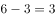人，与从事技术工作的女干部是2的倍数矛盾，排除；

D项，若，则，从事行政工作的女干部有1份即4人，那么从事技术工作的女干部为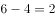人，那么男干部总数为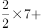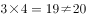，排除。

故正确答案为B。

---

## 第 2 题　qid 2657346 · 数学运算

小王到商场购买7件甲商品，9件乙商品，按照定价需要支付285元。由于商场做促销活动，甲商品8折销售，乙商品9折销售。但收银员在收款时将两种商品的件数弄反，少收了12元钱。问小王实际应该支付的金额是多少元？

- **A**. 246　✅
- **B**. 234
- **C**. 270
- **D**. 258

**答案**：A

**官方解析**

方法一：方程法。设甲的定价为，乙的定价为，则有······①；打完折应该支付的金额为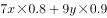，收营员弄反件数后所收的金额为：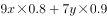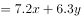，根据比实际金额少收12元得：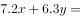，整理为：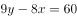······②，联立①②解得，。则小王实际应该支付的金额为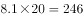元。

方法二：倍数特性法。根据题意，设甲的定价为，乙的定价为，小王实际支付金额为。根据“收银员在收款时将两种商品的件数弄反，少收了12元钱”可得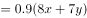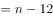。因为、均为正整数，则能被0.9除尽。代入选项。

A项，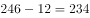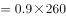，满足，当选；

B项，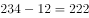，不能除尽，排除；

C项，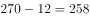，不能除尽，排除；

D项，，不能除尽，排除。

故正确答案为A。

---
