# 2018年广东省公务员录用考试《行测》题（县级、乡镇统一卷）（网友回忆版）

> 数量关系 · 15 题 · 广东 2018

## 第 1 题　qid 2185088 · 数学运算

31  29  28  26  25  23  （  ）

- **A**. 22　✅
- **B**. 24
- **C**. 35
- **D**. 38

**答案**：A

**官方解析**

方法一：数列项数较多，考虑多重数列。抽取奇数项可得新数列为：31，28，25，（）；偶数项为：29，26，23；观察可得二者均为公差为-3的等差数列，故题目所求项为。

方法二：数列数字依次递减，变化不大，优先考虑作差。前项减后项得到新数列为：2、1、2、1、2，新数列以（2、1）为一个循环，则题目所求项应为：。

故正确答案为A。

---

## 第 2 题　qid 2185089 · 数学运算

3  5  17  39  71  （  ）

- **A**. 107
- **B**. 113　✅
- **C**. 121
- **D**. 135

**答案**：B

**官方解析**

数列无明显特征，且数字依次递增，变化不大，优先考虑作差。后项减前项得到新数列为：2、12、22、32，判定其为公差是10的等差数列，故新数列下一项为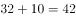，则所求项应为：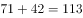。

故正确答案为B。

---

## 第 3 题　qid 2185090 · 数学运算

0.5  3  8  18  38  （  ）

- **A**. 75
- **B**. 78　✅
- **C**. 82
- **D**. 85

**答案**：B

**官方解析**

方法一：数列无明显特征，且数字依次递增，变化不大，优先考虑作差。后项减前项得到新数列为：2.5、5、10、20，为公比为2的等比数列，故新数列下一项为：，则所求项应为：。

方法二：观察数字，前项和后项有接近两倍关系，发现，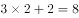，，，则所求项应为：。

故正确答案为B。

---

## 第 4 题　qid 2185093 · 数学运算

1  2  5  26  （  ）

- **A**. 377
- **B**. 477
- **C**. 577
- **D**. 677　✅

**答案**：D

**官方解析**

数列依次递增，且出现幂次数附近的数字，考虑幂次数。观察发现，题干数列分别为：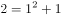、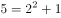、，可得：后一项为前一项的平方加1，则所求项应为：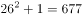。

故正确答案为D。

---

## 第 5 题　qid 2185101 · 数学运算

14  28  56  112  （  ）

- **A**. 155
- **B**. 186
- **C**. 224　✅
- **D**. 320

**答案**：C

**官方解析**

观察数推前后项存在明显的倍数关系，考虑作商。发现均为2，则所求项应为。

故正确答案为C。

---

## 第 6 题　qid 2185111 · 数学运算

工厂的两个车间共同组装6300辆自行车。如果先由一号车间组装8天，再由二号车间组装3天，刚好可以完成任务；如果先由二号车间组装6天，再由一号车间组装6天，也刚好可以完成任务。则一号车间每天比二号车间多组装（  ）辆自行车。

- **A**. 210　✅
- **B**. 180
- **C**. 150
- **D**. 130

**答案**：A

**官方解析**

方法一：设一号车间每天组装x辆自行车，二号车间每天组装y辆自行车，根据题意可得：

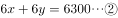，联立解得，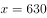，；则一号车间每天比二号车间多组装自行车辆。

方法二：设一号车间每天组装x辆自行车，二号车间每天组装y辆自行车，根据题意可得：

，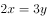，一号车间与二号车间效率之比为3:2，两个车间每天共加工自行车辆，一号车间每天比二号车间多组装自行车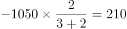辆。

故正确答案为A。

---

## 第 7 题　qid 2185114 · 数学运算

一列货运火车和一列客运火车同向匀速行驶，货车的速度为72千米/时，客车的速度为108千米/时。已知货车的长度是客车的1.5倍，两列火车由车尾平齐到车头平齐共用了20秒，则客运火车长（  ）米。

- **A**. 160
- **B**. 240
- **C**. 400　✅
- **D**. 600

**答案**：C

**官方解析**

设客运车长度为x，则货运车长度为1.5x，两列火车由车尾平齐到车头平齐，客车比货车多行驶的长度为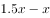，两车速度差为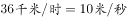。用时20秒，则米，解方程得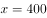米，客运车长为400米。

故正确答案为C。

---

## 第 8 题　qid 2185128 · 数学运算

某市服务行业举行业务技能大赛，其中东区参赛人数占总人数的，西区参赛人数占总人数的，南区参赛人数占总人数的，其余的是北区的参赛人员。结果东区参赛人数的获奖，西区参赛人数的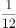获奖，南区参赛人数的获奖。已知参赛总人数超过100人，不到200人，则参赛总人数为（  ）。

- **A**. 120
- **B**. 140
- **C**. 160
- **D**. 180　✅

**答案**：D

**官方解析**

假设参赛总人数为x，则南区参赛人数为，南区获奖人数为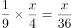，因人数须为正整数，则x应为36的整数倍，代入选项，只有D项满足。

故正确答案为D。

---

## 第 9 题　qid 2185133 · 数学运算

一个箱子的底部由5块正方形纸板ABCDE和1块长方形纸板F拼接而成（如图所示），已知A、B两块纸板的面积比是1:16，假设A纸板的边长为2厘米，则该箱子底部的面积为（    ）平方厘米。

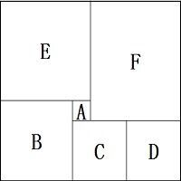

- **A**. 200
- **B**. 320
- **C**. 360　✅
- **D**. 420

**答案**：C

**官方解析**

方法一：根据题意及给定图形，判定箱子底部为长方形。已知A、B均为正方形，面积之比为1:16，则边长之比为1:4，A的边长为2cm，则B的边长为8cm，E的边长为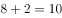cm，C与D的边长为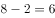cm，则箱子底部长方形的长为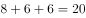cm，宽为cm，面积为。

方法二：已知A、B均为正方形，面积之比为1:16，则边长之比为1:4，A的边长为2cm，则B的边长为8cm，E的边长为cm，则箱子底部长方形的宽为cm，面积应能被18整除，结合选项，只有C项满足。

故正确答案为C。

---

## 第 10 题　qid 2185138 · 数学运算

工厂要对一台已经拆成6个部件的机器进行清洗，并重新组装。清洗6个部件的时间分别为10分钟、15分钟、21分钟、8分钟、5分钟、26分钟，重新组装需要15分钟。假设清洗每一个部件或重新组装时都需要甲乙两人合作才能完成，报酬标准为每人每小时150元（不足一小时按一小时计），则工厂需要支付给甲乙两人共（    ）元。

- **A**. 300
- **B**. 600　✅
- **C**. 900
- **D**. 1200

**答案**：B

**官方解析**

甲、乙清洗部件及重新组装共用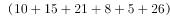，因为报酬标准为每人每小时150元且不足1小时按一小时计，花费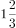小时计为2小时，则工厂需支付给甲乙两人共元。

故正确答案为B。

---

## 第 11 题　qid 2185069 · 数学运算

有一条长100厘米的纸带，从一端开始，先涂一段红色，长度为4厘米；再涂一段白色，长度为4厘米。按此规律重复操作，直到颜色涂满整条纸带。则涂红色的部分共有（    ）段。

- **A**. 10
- **B**. 13　✅
- **C**. 15
- **D**. 25

**答案**：B

**官方解析**

总长度为100厘米，每4厘米涂一段，共涂了段，按照“红色，白色，红色，白色······”规律涂色，则涂红色的部分共有13段。

故正确答案为B。

---

## 第 12 题　qid 2185077 · 数学运算

某软件公司对旗下甲、乙、丙、丁四款手机软件进行使用情况调查，在接受调查的1000人中，有的人使用过甲软件，有的人使用过乙软件，有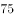的人使用过丙软件，有的人使用过丁软件。那么，在这1000人中，使用过全部四款手机软件的至少有（    ）人。

- **A**. 120　✅
- **B**. 250
- **C**. 380
- **D**. 430

**答案**：A

**官方解析**

要求使用过全部四款手机软件的尽可能少，则应让没使用过全部四款手机软件的人最多。根据题意，没有使用过甲软件的人有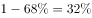，没有使用过乙软件的人有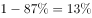，没有使用过丙软件的人有，没有使用过丁软件的人有。当没有使用过任意一种软件的人均不重复时，没使用过全部四款手机软件的人最多。此时没有使用过全部四款手机软件的人为，则使用过全部四款手机软件的人至少有，即人。

故正确答案为A。

---

## 第 13 题　qid 2185080 · 数学运算

某公园有一个周长为1千米的长方形花坛，计划在其周围每隔100米放置一个垃圾桶。现已将所需垃圾桶全部放在其中一个放置点（如图所示），接下来要用手推车将垃圾桶运到每一个放置点。假如该手推车每次最多能运3个垃圾桶，则将垃圾桶运到最后一个放置点时手推车行程最少为（    ）米。

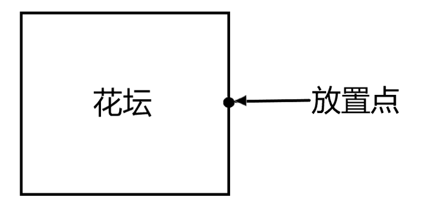

- **A**. 1600
- **B**. 1800　✅
- **C**. 1900
- **D**. 2200

**答案**：B

**官方解析**

周长1千米，每隔100米放一个垃圾桶，则总共有垃圾桶：个。现在需要从其中一个放置点把垃圾桶运到每一个放置点，则一共需要运送9个垃圾桶，手推车一次能运3个垃圾桶，需要分3次运送。要让手推车行程最少，即每一次都选择最短路线。第一次：顺时针运送三个，按序摆放在沿途放置点，再空车回到起点，手推车行程：米。第二次：逆时针运送三个，按序摆放在沿途放置点，再空车回到起点，手推车行程：米。第三次：选择任意一个方向，按序摆放在剩余的放置点，无需返程，手推车行程：米。手推车行程最少为：米。

故正确答案为B。

---

## 第 14 题　qid 2185082 · 数学运算

某条道路一侧共有20盏路灯。为了节约用电，计划只打开其中的10盏。但为了不影响行路安全，要求相邻的两盏路灯中至少有一盏是打开的，则共有（    ）种开灯方案。

- **A**. 2
- **B**. 6
- **C**. 11　✅
- **D**. 13

**答案**：C

**官方解析**

要求相邻的两盏路灯中至少有一盏是打开的，即相邻的路灯不能同时熄灭。则可以先让其中10盏路灯先亮，然后在10盏亮着的路灯之间进行插空，每个空插1盏熄灭的路灯。10盏路灯共有11个空，选择其中10个空插入不亮的路灯，方案数量为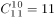种。

故正确答案为C。

---

## 第 15 题　qid 2185084 · 数学运算

一项足球比赛共有8支队伍参加，每两支队伍之间需要踢两场比赛，获胜得3分，打平得1分，落败不得分。在该项足球比赛中，获得第一名的队伍积分最多可能比第二名多（    ）分。

- **A**. 40
- **B**. 30　✅
- **C**. 20
- **D**. 10

**答案**：B

**官方解析**

要让获得第一名的队伍积分尽可能多，那么第一名需要全胜，8支队伍两两比赛，第一名需要和其他7支队伍各进行两场比赛，那么一共进行场比赛，获胜得3分，第一名共积分分。若要让第一名和第二名分差尽量大，那么要让第二名积分尽量低，当其他七支队伍全部同分并列第二时积分最低。此时所有队伍都只输2场给第一名，其他12场比赛全部打平，积分为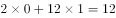分。所以，获得第一名的队伍积分最多可能比第二名多：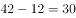分。

故正确答案为B。

---
