# 2018年广州市公务员录用考试 《行测》题（3月24日网友回忆版）

> 数量关系 · 12 题 · 广州市考 2018

## 第 1 题　qid 2172076 · 数学运算

2，3，-1，4，-5，（    ）

- **A**. -8
- **B**. -9
- **C**. 8
- **D**. 9　✅

**答案**：D

**官方解析**

数列无明显特征，作差无规律，考虑递推。，，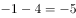，故规律为：。所求项为：。

故正确答案为D。

---

## 第 2 题　qid 2172081 · 数学运算

1，，2，，，（    ）

- **A**. 

- **B**. 

- **C**. 

- **D**. 

　✅

**答案**：D

**官方解析**

题干虽为分数列，但反约分后无任何规律，同时作差也无规律，考虑作积查找规律。前项乘以后项得到：，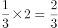，，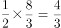，是公差为的等差数列。因此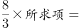，解得。

故正确答案为D。

---

## 第 3 题　qid 2172083 · 数学运算

某单位计划为95名员工每人购买一本政策法规小册子，该小册子的售价为6元。书店对购买100本及以上者给予9折优惠。该单位可与其他单位拼团购买，如果该单位想完成这一任务，则最少需要花费（    ）元。

- **A**. 570
- **B**. 540
- **C**. 513　✅
- **D**. 500

**答案**：C

**官方解析**

根据题意，该单位有两种购买方式：

方案一：以原价购买95本，则需要花费元；

方案二：与其他单位拼团购买，且拼团成功，则需要花费元。

则该单位最少需要花费513元。

故正确答案为C。

---

## 第 4 题　qid 2172085 · 数学运算

水果店里有相同数量的苹果和梨，现要把这些苹果和梨放入若干个水果篮中。已知每个水果篮放6个苹果和4个梨，最后还剩下2个苹果和18个梨，那么一共包装了（  ）个水果篮。

- **A**. 2
- **B**. 4
- **C**. 6
- **D**. 8　✅

**答案**：D

**官方解析**

设一共包装了个水果篮，根据题意可得：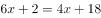，解得，即一共包装了8个水果篮。

故正确答案为D。

---

## 第 5 题　qid 2172088 · 数学运算

某条道路进行灯光增亮工程，原来间隔35米的路灯一共有21盏，现要将路灯的间隔缩短为25米，那么有（    ）盏路灯无需移动。

- **A**. 2
- **B**. 3
- **C**. 4
- **D**. 5　✅

**答案**：D

**官方解析**

由题干可知，在缩短间隔之前，道路安装了21盏路灯，间隔35米，则道路总长米。前后两个间隔35米和25米的最小公倍数为175米，说明无需移动的路灯除了第一座外，其余路灯距离起点的距离应为175米的倍数，分别为：175、350、525、700，再加上起点的第一座，共计5盏。

故正确答案为D。

---

## 第 6 题　qid 2172090 · 数学运算

一个车间需要生产模具256个，每小时生产32个可按时完成，但是生产期间机器发生了故障，修理了1.5个小时，后来只能加派人手使得每小时生产的模具提高到48个，这样恰好按时完成任务。机器在生产了（    ）个零件后发生了故障。

- **A**. 112　✅
- **B**. 108
- **C**. 96
- **D**. 72

**答案**：A

**官方解析**

根据题意可得，生产模具原计划所需时间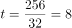小时。设机器在发生故障前生产了小时，则可得：，解得。故发生故障前共生产了个。

故正确答案为A。

---

## 第 7 题　qid 2172093 · 数学运算

快递员小张在A、B、C三个小区送快递，已知小张走三条线路A→B→C、B→C→A和C→A→B所花的时间分别为15分钟、17分钟和18分钟。那么距离最近的两个小区之间的路程要花（    ）分钟。

- **A**. 7　✅
- **B**. 8
- **C**. 9
- **D**. 10

**答案**：A

**官方解析**

方法一：假设快递员在三个小区之间运动的时间分别为、、，根据题意有，，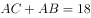，解得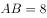，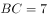，。则距离最近的两个小区是B和C，所花时间为7分钟。

方法二：快递员走的三条路线最短耗时15分钟，说明AB与BC的平均时间是7.5分钟，而距离最近的两个小区之间的耗时应低于平均时间7.5分钟，选项中只有A项低于7.5分钟。

故正确答案为A。

---

## 第 8 题　qid 2172095 · 数学运算

某人用一笔钱买入两年期年化利率为的银行理财产品M，两年后连本带息再追加10万元又买入年化利率为的银行理财产品N，又一年后全部收益为3.09万元，那么这个人第一次买入了（    ）万元的银行理财产品M。

- **A**. 10
- **B**. 15　✅
- **C**. 20
- **D**. 30

**答案**：B

**官方解析**

，设第一次买入银行理财产品M的金额为，则两年后收益为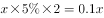；买入银行理财产品N的金额为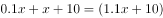万元，一年后收益为万元；两次买入的全部收益为万元，解得万元，故第一次买入了15万元的银行理财产品M。

故正确答案为B。

---

## 第 9 题　qid 2172097 · 数学运算

某电影院根据放映时间将电影票分为A档、B档和C档，票价分别为30元、50元和80元。某天有5200名观众购票观影，电影院售票收入25.5万元。已知售出的A档电影票是C档电影票的2倍，则当天售出B档电影票（    ）张。

- **A**. 500
- **B**. 1000
- **C**. 3700　✅
- **D**. 4600

**答案**：C

**官方解析**

根据“售出的A档电影票是C档电影票的2倍”设A档电影票张，C档电影票张，则B档电影票为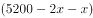张，即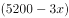张。由，且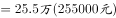，则，解得，则。

故正确答案为C。

---

## 第 10 题　qid 2172098 · 数学运算

某部门开展年终评选工作，需从11名员工中评选出一名优秀员工和两名积极员工，且优秀员工与积极员工不能为同一人，则可能会出现的评选结果共有（    ）种。

- **A**. 495　✅
- **B**. 990
- **C**. 1210
- **D**. 1980

**答案**：A

**官方解析**

根据题意，从11名员工中选出1名优秀员工，有种；因优秀员工与积极员工不能为同一人，因此，再从剩下的10人中选出2名积极员工，有种；则可能出现的评选结果共种。

故正确答案为A。

---

## 第 11 题　qid 2172118 · 数学运算

印刷厂印刷了一批共1080本字典，用大、小两种箱子进行分装。已知每个大箱子比小箱子多装15本，且8个小箱子的容量等于3个大箱子的容量。如果只用大箱子进行分装，则至少需要（    ）个大箱子。

- **A**. 40
- **B**. 45　✅
- **C**. 50
- **D**. 55

**答案**：B

**官方解析**

设每个大箱子所装字典数量为，则每个小箱子所装数量为。根据题意，，解得。共1080本字典，只用大箱子进行分装，至少需要个。

故正确答案为B。

---

## 第 12 题　qid 2172120 · 数学运算

如图所示，市政部门在一块周长为260米的长方形草地旁边铺设宽为10米的L形道路。已知铺好道路后，道路和草地面积之和为草地面积的1.5倍，则草地的面积为（    ）平方米。

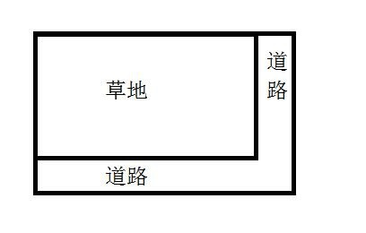

- **A**. 4200
- **B**. 4000
- **C**. 3000
- **D**. 2800　✅

**答案**：D

**官方解析**

已知长方形草地周长为260，设草地长为，则宽为，则道路面积为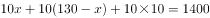平方米。又已知道路和草地面积之和为草地面积的1.5倍，设草地面积为，则，解得平方米。

故正确答案为D。

---
