# 2018年广州市公务员录用考试 《行测》题（3月25日网友回忆版）

> 数量关系 · 10 题 · 广州市考 2018

## 第 1 题　qid 2172814 · 数学运算

甲、乙、丙三个小朋友中任意两人身高的平均数加上另一个小朋友的身高，分别为258cm，238cm，230cm，则这三个小朋友的平均身高是（    ）cm。

- **A**. 118
- **B**. 120
- **C**. 121　✅
- **D**. 122

**答案**：C

**官方解析**

设甲、乙、丙的身高分别为x、y、z，根据题意可知，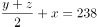，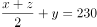，将三个方程相加可得，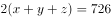，则这三个小朋友的平均身高为cm。

故正确答案为C。

---

## 第 2 题　qid 2172815 · 数学运算

篮子里有苹果和梨两种水果若干个，将这些水果分发给13个人，每人最少拿一个，最多拿两个不同的水果。已知有9个人拿到了苹果，有8个人拿到了梨，最后全部分完。那么，有（    ）人只拿到了苹果。

- **A**. 4
- **B**. 5　✅
- **C**. 6
- **D**. 7

**答案**：B

**官方解析**

本题可以把拿苹果和拿梨子的人看成两个集合，根据两集合容斥原理公式：，而题目中每人至少拿一个，说明没有都不拿的。所以有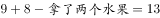，计算可得“拿了两个水果”的人有4人，所以只拿了苹果的人有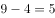人。

故正确答案为B。

---

## 第 3 题　qid 2172816 · 数学运算

A、B、C、D四个小朋友进行分组跳绳比赛，结果A与B两个小朋友比C与D两个小朋友多跳20个。又已知A比B少跳9个，C比D多跳15个。那么，跳得最多的小朋友比最少的多（    ）个。

- **A**. 19
- **B**. 20
- **C**. 21
- **D**. 22　✅

**答案**：D

**官方解析**

设A、B、C、D四个小朋友分别跳了A、B、C、D个。根据题意可知：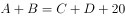，，。将后面两个式子代入第一个式子，可得：，则可知B和D之间相差22个，因题干问最多和最少之间的差距，而B和D相差的22已经是选项中最大的，排除A、B、C三项，D项当选。

故正确答案为D。

---

## 第 4 题　qid 2172817 · 数学运算

现有左右相邻规模一样的两个水池，左边水池的水位比右边的高36cm。用抽水机从左边的水池抽水注入右边的水池，每分钟能使右边的水池水位升高3cm，那么（  ）分钟后两个水池的水位一样高。

- **A**. 12
- **B**. 9
- **C**. 6　✅
- **D**. 3

**答案**：C

**官方解析**

因为两个水池规模一样，且从左边水池抽的水全部注入右边水池，则右边水池水位上升的速度应该等于左边水池水位下降的速度，所以左边水池水位下降速度为每分钟3cm。

原来两个水池水位差为36cm，每分钟左边下降3cm、右边上升3cm，相差6cm，故分钟后水位差为0，即水位一样高。

故正确答案为C。

---

## 第 5 题　qid 2172818 · 数学运算

公司安排甲、乙、丙三人从周一开始上班，已知甲每上班一天休一天，乙每上班两天休一天，丙每上班三天休一天，那么三人第三次同时休息是星期（  ）。

- **A**. 日
- **B**. 一　✅
- **C**. 二
- **D**. 三

**答案**：B

**官方解析**

由题干条件可知，甲每2天休息一天，乙每3天休息一天，丙每4天休息一天。甲乙丙同时休息的周期应该是2、3、4的最小公倍数，每12天休息一天。第三次同时休息时，应为第天。，说明第36天即经过五个完整周后的第一天，应为周一。

故正确答案为B。

---

## 第 6 题　qid 2172819 · 数学运算

办公室需要复印一批文件，使用甲复印机单独印需要20分钟，使用甲乙两台复印机一起印需要12分钟，已知甲复印机每分钟比乙复印机多印6份文件，则这批文件一共有（  ）份。

- **A**. 216
- **B**. 240
- **C**. 360　✅
- **D**. 600

**答案**：C

**官方解析**

设甲复印机每分钟所印文件份数为x，则乙复印机为，根据题意，这批文件总份数为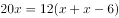，解得份，则这批文件共有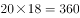份。

故正确答案为C。

---

## 第 7 题　qid 2172820 · 数学运算

文体用品店有一批数量为35支的羽毛球拍，进货价为每支130元。在进货价基础上提高销售，并实行消费返现制度，顾客购买羽毛球拍每满100元即减5元。假如规定每名顾客最多只能买3支球拍，则销售这批球拍至少可赚（  ）元。

- **A**. 650　✅
- **B**. 675
- **C**. 735
- **D**. 900

**答案**：A

**官方解析**

根据题意，售价为每支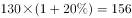元，要使这批球拍所赚利润最少，那么每支球拍的利润应尽量少。每满100元即减5元，且每人最多只能买3支，分析如下：

每人买2支时，平均每支利润最少，因此应该让买2支的人数尽量多。共35支球拍，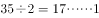，此时销售情况为：17人每人买2支，另有1人买1支或者16人每人买2只，另有1人买3支。但这两种情况总利润相同，因此此时总利润至少为元。

故正确答案为A。

---

## 第 8 题　qid 2172821 · 数学运算

某单位计划在户外举办讲座，计划使用72米的隔离带围成一个长方形作为活动场所，其中一边不封闭（即成形），缺口面向讲坛。能围成的场所面积最大是（  ）平方米。

- **A**. 324
- **B**. 648　✅
- **C**. 972
- **D**. 1296

**答案**：B

**官方解析**

设隔离带围成的场所宽为x米，则长为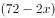米，则场所面积为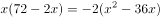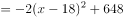。因此，当时，场所面积最大，为648平方米。

故正确答案为B。

---

## 第 9 题　qid 2172822 · 数学运算

投资公司计划对甲乙两个创业项目进行投资，若甲项目投资额减少，乙项目投资额增加，则总投资额将减少8万元；若甲项目投资额增加，乙项目投资额减少，则总投资额将增加19万元。那么，原计划的总投资额是（  ）万元。

- **A**. 350
- **B**. 370　✅
- **C**. 420
- **D**. 450

**答案**：B

**官方解析**

设原计划甲、乙两项目投资额分别是x、y，根据题意，可列方程组：

解得：，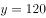，则原计划总投资额是万元。

故正确答案为B。

---

## 第 10 题　qid 2172823 · 数学运算

用全部156个边长为1的小正方形，最多可以拼成（  ）种形状不同的长方形。

- **A**. 5
- **B**. 6　✅
- **C**. 7
- **D**. 8

**答案**：B

**官方解析**

156个边长为1的小正方形拼成长方形，则长方形面积为156，即。需拼成形状不同的长方形，可将156因式分解为：，有6种因式分解的方式，故最多可组成6种形状不同的长方形。

故正确答案为B。

---
