# 2018年广西公务员录用考试《行测》题（网友回忆版）

> 数量关系 · 15 题 · 广西 2018

## 第 1 题　qid 2184621 · 数学运算

某处室的第一科室和第二科室中分别有6人和3人具备硕士及以上学历。现要从这2个科室中随机选择3名具有硕士及以上学历的人参加某个会议，问3人全部来自第一科室的概率是全部来自第二科室的多少倍？

- **A**. 2
- **B**. 8
- **C**. 12
- **D**. 20　✅

**答案**：D

**官方解析**

。第一科室6人，第二科室3人，总共9人。当3人全部来自第一科室时，所求；当3人全部来自第二科室时，所求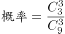。故前者是后者的：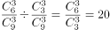倍。

故正确答案为D。

---

## 第 2 题　qid 2184623 · 数学运算

年终某大型企业的甲、乙、丙三个部门评选优秀员工，已知甲、乙部门优秀员工数分别占三个部门总优秀员工数的和，且甲部门优秀员工数比丙部门的多12人，问三个部门共评选出优秀员工多少人？

- **A**. 120
- **B**. 150
- **C**. 160
- **D**. 180　✅

**答案**：D

**官方解析**

由题干可知，三个部门优秀员工的总人数既为3的倍数又为5的倍数，设优秀员工总人数有15x人。则甲部门优秀员工有人，乙部门有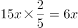人，丙部门有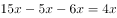人。甲部门比丙部门多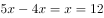人，则三个部门优秀员工总人数有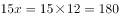人。

故正确答案为D。

---

## 第 3 题　qid 2184625 · 数学运算

在一个高x米的电视塔周围选择6个位置作观测点，每个位置和它相邻的两个位置距离相等，每个位置和电视塔的距离也都相等。每个位置和它相邻位置的距离为144米，在其中一个位置距离地面1.6米的地方以向上45度的角度观测，正好观测到塔顶。问x的值在以下哪个范围？

- **A**. 
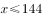

- **B**. 

　✅
- **C**. 

- **D**. 

**答案**：B

**官方解析**

由条件“每个位置和它相邻的两个位置距离相等，和电视塔的距离也都相等”，可判定得出6个观测点构成一个正六边形，而电视塔刚好在六边形的中心，如下图所示：连接正六边形对角线，则构成6个正三角形，故ED与每相邻两个点的距离相等，为144米。因为45°，，则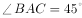，即为等腰直角三角形，则米。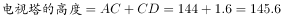米，在B项范围。

故正确答案为B。

---

## 第 4 题　qid 2184629 · 数学运算

甲和乙两家工厂各开一条产量为250件/天的生产线，完成相同数量的某种产品生产任务。完成部分生产任务后，供货商向乙工厂追加了相当于两家工厂当前已完成任务总量的订单。此时乙工厂增开一条产量为200件/天的生产线，生产10整天后与甲工厂同时完成任务。问供货商是在开始生产多少天后追加的订单？

- **A**. 2
- **B**. 4　✅
- **C**. 6
- **D**. 8

**答案**：B

**官方解析**

设供货商是在开始生产x天后追加的订单，此时甲、乙共完成的工作量，此工作量即为供货商向乙工厂追加的工作量。又因乙工厂增开一条产量为200件/天的生产线，生产10整天后与甲工厂同时完成任务。则，解得，即生产4天后追加的订单。

故正确答案为B。

---

## 第 5 题　qid 2184635 · 数学运算

甲、乙两名编辑校对同一本书，校对速度保持不变。甲完成时乙还有420页没完成，甲完成时乙完成了450页。问乙完成全部工作时，甲：

- **A**. 
早已完成

- **B**. 
刚好完成

- **C**. 
还剩200页
　✅
- **D**. 
还剩

**答案**：C

**官方解析**

根据题意可设书本共有x页，由，可知相同时间内，效率比等于工作量的比值。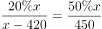，化简可得：，解得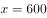页，故，设甲的效率为2，乙的效率为3，则乙全部完成所需时间为，甲完成了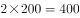，甲还剩页。

故正确答案为C。

---

## 第 6 题　qid 2184642 · 数学运算

某工厂加工一批定制口罩，计划15天完成。做完第5天时订货方要求追加的订货量，且最多延迟5天交货。问工厂的工作效率至少需要提高：

- **A**. 

- **B**. 

- **C**. 

- **D**. 

　✅

**答案**：D

**官方解析**

根据题意赋值原来的工作总量为300，则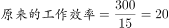，做完第5天，追加的订货单，则此时还需完成，还剩下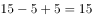天，，故至少需要提高：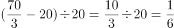。

故正确答案为D。

---

## 第 7 题　qid 2184652 · 数学运算

某种商品出厂编号的最后三位为阿拉伯数字。现有出厂编号最后三位为001～100的产品100件，从中任意抽取1件，出厂编号后三位数字之和为奇数的概率比其为偶数的概率：

- **A**. 
高
　✅
- **B**. 
低

- **C**. 
高

- **D**. 
低

**答案**：A

**官方解析**

根据题意可知：，总情况数为100种。

三位数字之和为奇数的情况有：

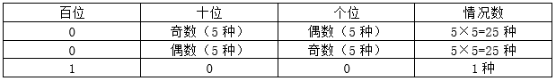

所以，加和为奇数的情况数为种，则加和为偶数情况数为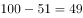种。

故出厂编号后三位数字之和为奇数的概率比其为偶数的概率高。

故正确答案为A。

---

## 第 8 题　qid 2184663 · 数学运算

某工厂生产线有若干台相同的机器，平时固定有5台机器同时生产，每小时总计可以生产300件产品。由于操作机器的人手有限，故每多上线一台机器生产，每台机器平均每小时少生产2件产品。问至少多开多少台机器，才能使生产效率提升以上？

- **A**. 3
- **B**. 4　✅
- **C**. 5
- **D**. 6

**答案**：B

**官方解析**

根据题意可得原来每台机器的生产效率为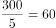，设至少多开x台机器，则此时每台机器每小时的生产效率为，共有台，根据题意可列不等式：，化简可得：，代入选项，问至少，从最小开始代。代入A项：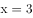，则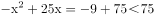，排除A项。代入B项：，则，满足条件。

故正确答案为B。

---

## 第 9 题　qid 2184667 · 数学运算

单位3个科室分别有7名、9名和6名职工。现抽调2名来自不同科室的职工参加调研活动，问有多少种不同的挑选方式？

- **A**. 146
- **B**. 159　✅
- **C**. 179
- **D**. 286

**答案**：B

**官方解析**

方法一：抽调的2名职工来自不同科室，则抽调的情况为抽调两个科室且每个科室各抽调1人，则挑选方式共有种。

方法二：抽调的2名职工来自不同的科室，其反面为2名职工来自同一个科室。则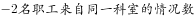。三个科室共人，抽调2名职工的总情况数为。来自同一科室的情况共有。因此抽调2名来自不同科室的职工，挑选方式为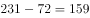种。

故正确答案为B。

---

## 第 10 题　qid 2184672 · 数学运算

姐弟俩相差3岁，2000年姐弟两人年龄之和是妈妈年龄的四分之一，2006年姐弟两人年龄之和是妈妈年龄的二分之一。问哪一年姐弟两人年龄之和等于妈妈的年龄？

- **A**. 2012
- **B**. 2018
- **C**. 2024
- **D**. 2027　✅

**答案**：D

**官方解析**

设2000年弟弟的年龄为x，则姐姐的年龄为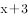，由题意可得：

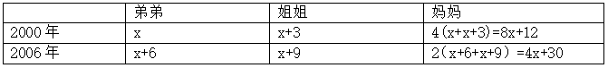

妈妈2000年和2006年年龄相差6岁，即，解得。

所以2000年弟弟年龄为3，姐姐年龄为6，妈妈年龄为36。设从2000年开始，过n年，姐弟两人年龄之和等于妈妈年龄，则有，解得。即2000年再过27年为2027年，D项满足要求。

故正确答案为D。

---

## 第 11 题　qid 2184679 · 数学运算

一项测验共有29道单项选择题，答对得5分，答错减3分，不答不得分也不减分，答对15题及以上另加10分，否则另减5分。小郑答题共得60分，问他最少有几道题未答？

- **A**. 1
- **B**. 2
- **C**. 3　✅
- **D**. 4

**答案**：C

**官方解析**

设答对x题，答错y题。由于共29道题，根据选项可知，未答的题均大于0，可知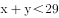。根据小郑答题共得60分，且答对15题及以上另加10分，否则另减5分。则有两种情况：

①；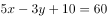。

因为，5x和50为5的倍数，则y也为5的倍数。当时，，不满足；当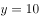时，，满足，此时未答的题为道；当时，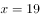，不满足。且y增大时，x也会随之增大，则不满足。

②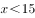；。

因为，要满足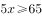，则，又由于，即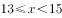。

验证当时，，此时不答的题为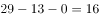。

当时，y为小数，不满足题意要求。

根据上述分析可知，最少有3道题未答。

故正确答案为C。

---

## 第 12 题　qid 2184681 · 数学运算

某企业20多名员工参加拓展训练，共准备了16箱饮用水。每人饮用6瓶后，将剩下的1箱半分配给所有女员工，正好每人分1瓶。问参加拓展训练的男员工有多少人？

- **A**. 10
- **B**. 11　✅
- **C**. 12
- **D**. 13

**答案**：B

**官方解析**

设男员工的人数为x，根据题意，女员工的人数等于1箱半饮用水的瓶数，设一箱饮用水有y瓶，则女员工的人数为1.5y。根据所有人共饮用16箱水，男员工每人6瓶，女员工每人瓶。则有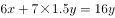。得，即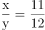，根据倍数特性，可得x是11的倍数，结合选项只有B项满足。

故正确答案为B。

---

## 第 13 题　qid 2184683 · 数学运算

某储蓄所两名工作人员，一天内共办理了122件业务，其中小王经手的有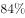是现金业务，小李经手的有为非现金业务，小李当天办理了多少件现金业务？

- **A**. 36
- **B**. 42
- **C**. 48
- **D**. 54　✅

**答案**：D

**官方解析**

根据题意可知：小王经手的有是现金业务，小李经手的有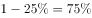为现金业务，可表示为：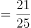，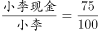。可知，小王办理的业务总件数应为25的倍数，小李办理的业务总件数为4的倍数。

当小王办理的业务总件数为25件时，小李办理的业务总件数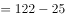件不是4的倍数；

当小王办理的业务总件数为50件时，小李办理的业务总件数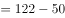件，现金业务件数件。

故正确答案为D。

---

## 第 14 题　qid 2184687 · 数学运算

有甲、乙两种不同浓度的盐水，取3克甲盐水和1克乙盐水混合可以得到浓度为的盐水；用1克甲盐水和3克乙盐水混合可以得到丙盐水。问用多少克甲盐水和1克丙盐水混合可以得到浓度为的盐水？

- **A**. 2　✅
- **B**. 4
- **C**. 6
- **D**. 8

**答案**：A

**官方解析**

方法一：赋值甲盐水的浓度为，乙盐水。根据“3克甲盐水和1克乙盐水混合可以得到浓度为”及公式可得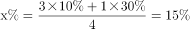；根据“1克甲盐水和3克乙盐水混合可以得到丙盐水”可得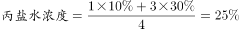。设需要甲盐水a克，则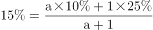，解得。

方法二：根据“1克甲盐水和3克乙盐水混合可以得到丙盐水”，即4克丙中有1克甲和3克乙，所以1克丙中有克甲和克乙，根据题目第一次兑换情况可知：要兑浓度，则需要甲乙的量之比为3:1，设共需要甲a克，即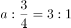，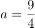。所以还需要加克。

故正确答案为A。

---

## 第 15 题　qid 2184688 · 数学运算

办公室8名员工围着一张圆桌就座准备用餐，此时又有3名加完班的员工在已就座的员工中间加座并参加用餐。已知加座后，3名加完班的员工彼此都不相邻，且8名已就座的员工最多与1名加完班的员工相邻。问有多少种不同的加座方式？

- **A**. 336
- **B**. 96　✅
- **C**. 48
- **D**. 30

**答案**：B

**官方解析**

八边形的顶点表示已落座的8个人。根据条件可知，要满足3名加完班的员工彼此都不相邻，且8名已就座的员工最多与1名加完班的员工相邻，有以下情况：

（1）可直接从4个三角形中选3个或4个五角星中选3个，此时方法数为种；

（2）可以从三角形或五角星交叉选。选2个相邻的三角形并选对面的一个五角星，这样可组成4种；同样2个五角星并选对面的一个三角形，也可组成4组。共8组。此时方法数有种。

故满足题意要求的方法数有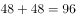种。

故正确答案为B。

---
