# 2018年新疆生产建设兵团面向社会招录公务员考试《行测》题（网友回忆版）

> 数量关系 · 10 题 · 新疆 2018

## 第 1 题　qid 2247211 · 数学运算

为迎接检阅，某连队挑选了63名士兵组成7排9列的方阵。若第1排从左到右的第3个士兵的位置为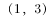，问队伍中间的位置应记为：

- **A**. 
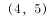
　✅
- **B**. 
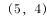

- **C**. 

- **D**. 

**答案**：A

**官方解析**

若第1排从左到右的第3个士兵的位置为，即其中前面的数字表示排数，后面的数字表示列数。队伍的中间位置，应为最中间一排与最中间一列的交叉点。方阵共7排9列，则最中间一排为第4排、最中间一列为第5列，所以位置应记为。

故正确答案为A。

---

## 第 2 题　qid 2247213 · 数学运算

某公司装修面积320平方米的办公室恰好使用了500块正方形的地砖。问每块地砖的边长为多少米？

- **A**. 0.6
- **B**. 0.8　✅
- **C**. 1
- **D**. 1.2

**答案**：B

**官方解析**

设每块地砖的边长为a，根据500块正方形地砖的面积为320平米可得，，则，解得。

故正确答案为B。

---

## 第 3 题　qid 2247218 · 数学运算

某农家要建造一个新的矩形鸡圈，如图所示，该鸡圈一面靠围墙，另外三面共使用了200米长的铁丝网。问如果想让鸡圈的面积最大，鸡圈的长和宽比值应为多少？

- **A**. 
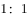

- **B**. 
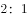
　✅
- **C**. 

- **D**. 

**答案**：B

**官方解析**

根据题意设长为，宽为，则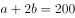。

方法一：根据均值不等式：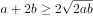，当且仅当时取等号，此时长方形的面积最大。即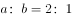。

方法二：，则，故。当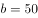时，S有最大值。此时，，即。

故正确答案为B。

---

## 第 4 题　qid 2247221 · 数学运算

某公司要完成一项工程，如果单独交给甲项目组，需要x天完成；如果单独交给乙项目组，需要y天完成。若甲、乙两个项目组共同完成该项目，最短需要多少天？

- **A**. 
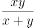
　✅
- **B**. 

- **C**. 

- **D**. 

**答案**：A

**官方解析**

根据题意，已知完工时间，故赋值工程总量为工作时间的公倍数。则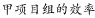，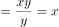，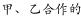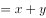，所以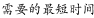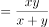。

故正确答案为A。

---

## 第 5 题　qid 2247224 · 数学运算

下列哪组边长可以组成一个三角形？

- **A**. 3cm  4cm  7cm
- **B**. 4cm  4cm  9cm
- **C**. 1cm  4cm  6cm
- **D**. 2cm  5cm  4cm　✅

**答案**：D

**官方解析**

根据三角形的性质“两边之和大于第三边，两边之差小于第三边”，逐一验证各选项。 A项：，排除；B项：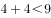，排除；C项：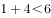，排除；仅剩D项，经验证三边关系满足性质，当选。

故正确答案为D。

---

## 第 6 题　qid 2247210 · 数学运算

某球赛积分规则为胜一场积3分，平一场积1分，负一场积0分。某队经过8场比赛，最终积了13分。问此球队胜、平、负的情况可能有几种？

- **A**. 1
- **B**. 2　✅
- **C**. 3
- **D**. 4

**答案**：B

**官方解析**

设球队胜、平、负的场数分别为x、y、z。根据“经过8场比赛，最终积了13分”，可列不定方程组：                                                

 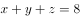 ······①；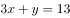······②。

由于数据较小，因此可通过一一枚举来求解。

当时，则、，不满足题意，排除；

当，则、，排除；

当，则、，排除；

当，则、，满足题意；

当，则、，满足题意；

当，y必然小于0，因此不需要考虑。

则满足题意的情况共有2种。

故正确答案为B。

---

## 第 7 题　qid 2247214 · 数学运算

妇女节时，某饭店推出两种优惠方案，方案一为男士全价，女士打七折；方案二为不分男女，只要三人以上就餐，总价就打八折。若两位男士和两位女士一同前来就餐，方案一的总价比方案二的总价：

- **A**. 
低

- **B**. 
低

- **C**. 
高
　✅
- **D**. 
高

**答案**：C

**官方解析**

由于本题没有给带单位的具体数值，故可采用赋值法，赋值每人的全价费用为100。根据题意可得，按照方案一计算，总价为；按照方案二计算，总价为。方案一比方案二的总价要高，高出的比例为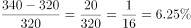。

故正确答案为C。

---

## 第 8 题　qid 2247216 · 数学运算

某公司产品10月销售利润为20万元，12月份的销售利润比11月份增加11.2万元，假设该产品销售利润逐月增加，且10-12月每月利润增长率相同。问每月利润增长率为：

- **A**. 

- **B**. 

- **C**. 

　✅
- **D**. 

**答案**：C

**官方解析**

设每月利润增长率为r，根据题意可知11月销售利润为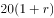。根据公式“”，可知12月相对11月的增长量为：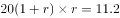，化简得：，解得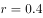或。由于利润逐月增加，则利润率为正数，因此每月利润增长率为0.4，即。

故正确答案为C。

注：本题直接解方程难度较大，也可以考虑代入选项进行验证。

---

## 第 9 题　qid 2247217 · 数学运算

在一次体检中，测了学生的身高水平，身高不超过160cm的有30名学生，平均身高为155cm；身高不低于180cm的有45名学生，平均身高为183cm；身高超过160cm的平均身高为175cm；身高低于180cm的平均身高为172cm。请问此次学生的平均身高约为：

- **A**. 172cm
- **B**. 173cm　✅
- **C**. 174cm
- **D**. 175cm

**答案**：B

**官方解析**

设身高超过160cm且低于180cm的学生有x名，身高超过160cm且低于180cm的学生的身高总和为y(cm)。根据题意可得：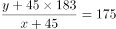······①，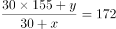······②，联合①②，解得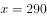，，则此次学生的平均身高=，与B项最为接近。

故正确答案为B。

---

## 第 10 题　qid 2247220 · 数学运算

若一个凸多边形有且仅有两个内角为钝角，有至少两个外角为钝角，问该多边形最多有几条边？

- **A**. 4
- **B**. 5　✅
- **C**. 6
- **D**. 7

**答案**：B

**官方解析**

多边形边数=多边形外角个数，问“最多有几条边”，分析最多有几个外角即可。因多边形的外角和为，要外角的个数尽量多，则每个角的角度应尽量小。根据“有且仅有两个内角为钝角（&lt;角度&lt;）”，结合外角+内角，可知外角中有且仅有两个锐角（&lt;角度&lt;），且其余的外角角度均不小于······①。根据“至少两个外角为钝角”，可列表如下：

则其他外角角度之和，结合结论①，可知其他外角个数达不到2个，最多有1个，因此，该多边形最多有5条边。

故正确答案为B。

---
