# 2018年江苏省公务员录用考试《行测》题（A类）（网友回忆版）

> 数量关系 · 15 题 · 江苏 2018

## 第 1 题　qid 2172347 · 数学运算

1，-2，-3，-2，1，（    ）

- **A**. 6　✅
- **B**. 3
- **C**. -1
- **D**. -4

**答案**：A

**官方解析**

数列无明显特征，优先考虑作差。作差后得到新数列：-3，-1，1，3，（  ），为公差是2的等差数列，新数列中，则。

故正确答案为A。

---

## 第 2 题　qid 2172349 · 数学运算

2.1，5.2，8.4，11.8，14.16，（    ）

- **A**. 19.52
- **B**. 19.24
- **C**. 17.82
- **D**. 17.32　✅

**答案**：D

**官方解析**

数列为小数数列，作差无规律，考虑小数点前后的机械划分。划分为：
整数部分：2，5，8，11，14，（  ），为公差是3的等差数列，下一项为17；
小数部分：1，2，4，8，16，（  ），为公比是2的等比数列，下一项为32。
综上可得：所求项为17.32。
故正确答案为D。

---

## 第 3 题　qid 2172351 · 数学运算

1，-5，10，10，40，（  ）

- **A**. -35
- **B**. 50
- **C**. 135
- **D**. 280　✅

**答案**：D

**官方解析**

数列存在明显的倍数关系，优先考虑作商。作商后得到新数列：-5，-2，1，4，（  ），为公差是3的等差数列，新数列中，则。

故正确答案为D。

---

## 第 4 题　qid 2172359 · 数学运算

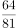，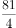，4，9，6，（  ）

- **A**. 
7

- **B**. 

　✅
- **C**. 
8.5

- **D**. 
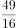

**答案**：B

**官方解析**

数列无明显特征，作差与幂次均无规律，考虑递推。观察可得：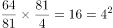，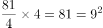，，即每相邻三项中，前面两项的乘积等于第三项的平方。依此规律，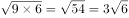。

故正确答案为B。

---

## 第 5 题　qid 2172344 · 数学运算

，，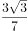，，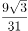，（    ）

- **A**. 

- **B**. 

- **C**. 

　✅
- **D**. 

**答案**：C

**官方解析**

题干中分子部分均包含因子，观察分子分母变化趋势，进行反约分，则原数列转化为：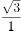，，，，，（    ）。观察可得，分子部分为公比是的等比数列，下一项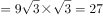；分母部分作差后得：2，4，8，16，（    ），为公比是2的等比数列，下一项，则所求项分母部分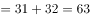。故所求项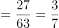。

故正确答案为C。

---

## 第 6 题　qid 2172341 · 数学运算

一款手机按2000元单价销售，利润为售价的。若重新定价，将利润降至新售价的，则新售价是：

- **A**. 1900元
- **B**. 1875元　✅
- **C**. 1840元
- **D**. 1835元

**答案**：B

**官方解析**

由题干“售价2000元，利润为售价的”可得，元。又由“重新定价，利润降至新售价的”，设新售价为x元，则，解得，则新售价是1875元。

故正确答案为B。

---

## 第 7 题　qid 2172338 · 数学运算

手工制作一批元宵节花灯，甲、乙、丙三位师傅单独做，分别需要40小时、48小时、60小时完成。如果三位师傅共同制作4小时后，剩余任务由乙、丙一起完成，则乙在整个花灯制作过程中所投入的时间是：

- **A**. 24小时　✅
- **B**. 25小时
- **C**. 26小时
- **D**. 28小时

**答案**：A

**官方解析**

由题意，赋值工作总量为40、48、60的最小公倍数240，则甲的效率为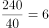、乙的效率为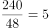、丙的效率为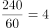。三位师傅共同制作4小时，完成工程量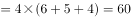。剩余任务由乙、丙一起完成，则需要时间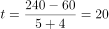小时。则乙在整个花灯制作过程中所投入的时间是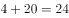小时。

故正确答案为A。

---

## 第 8 题　qid 2172388 · 数学运算

某化学实验室有A、B、C三个试管分别盛有10克、20克、30克水，将某种盐溶液10克倒入试管A中，充分混合均匀后，取出10克溶液倒入B试管，充分混合均匀后，取出10克溶液倒入C试管，充分混合均匀后，这时C试管中溶液浓度为，则倒入A试管中的盐溶液浓度是：

- **A**. 

- **B**. 

- **C**. 

- **D**. 

　✅

**答案**：D

**官方解析**

设倒入A试管中的盐溶液浓度为a，将溶液倒入A试管时，混合之后的浓度；同理经过B、C试管的混合之后溶液浓度为，解得。

故正确答案为D。

---

## 第 9 题　qid 2172382 · 数学运算

燃气公司欲在某新建楼盘内铺设天然气管道连通所有住宅楼，楼与楼之间可铺设管道的路线如图所示，圆圈表示各住宅楼，线段及线上数字表示路线及其长度（单位：百米），则铺设的管道最短长度是

- **A**. 1800米
- **B**. 1850米　✅
- **C**. 1950米
- **D**. 2000米

**答案**：B

**官方解析**

要求“天然气管道连通所有住宅楼”且管道长度最短，那么铺设的管道数量应尽量少且每条管道的长度应尽量短。A-F共6栋住宅楼，因此管道数量最少为5条，根据图示，尽可能选择短的管道，选择FA、AC、CE、CD、BD，此时6栋住宅楼均被管道连通且所用长度最短，总长度为米。

故正确答案为B。

---

## 第 10 题　qid 2172299 · 数学运算

如图，在长方形ABCD中，已知三角形ABE、三角形ADF与四边形AECF的面积相等，则三角形AEF与三角形CEF的面积之比是：

- **A**. 5：1　✅
- **B**. 5：2
- **C**. 5：3
- **D**. 2：1

**答案**：A

**官方解析**

设长方形ABCD的长，宽，根据题意，，。因为，则，所以，；同理，，则，所以，。

，则，因此。

故正确答案为A。

---

## 第 11 题　qid 2172286 · 数学运算

小李为办公室购买了红、黄、蓝三种颜色的笔若干支，共花费40.6元。已知红色笔单价为1.7元、黄色笔为3元、蓝色笔为4元，则小李买的笔总数最多是：

- **A**. 19支
- **B**. 20支
- **C**. 21支　✅
- **D**. 22支

**答案**：C

**官方解析**

设购买红色笔、黄色笔、蓝色笔的数量分别为x、y、z支，根据题意可得，即······①。由于y、z均为正整数，而30y与40z的尾数均为0，因此17x的尾数必定为6，则x的尾数必定为8。要使买的笔总数最多，则价格最低的红色笔的数量x应尽量多，又因为，则x最大取18。将18代入①式：，化简得，此时只有，满足二者均为正整数的条件，且此时价钱低的笔购买数量较多，符合题干要求。所买笔总数最多为支。

故正确答案为C。

---

## 第 12 题　qid 2172289 · 数学运算

某高校组织省大学生运动会预选赛，报名选手中男女人数之比为4：3，赛后有91人入选，其中男女之比为8：5。已知落选选手中男女之比为3：4，则报名选手共有：

- **A**. 98人
- **B**. 105人
- **C**. 119人　✅
- **D**. 126人

**答案**：C

**官方解析**

方法一：根据题意可知，入选选手中男女人数分别为人、人。设落选选手中男女人数分别为3x人和4x人，则报名选手中男女人数之比为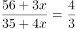，解得，所以落选选手人数为人，报名选手共有人。

方法二：线段法。根据题意可得，入选选手中男选手占比为，落选选手中男选手占比为，报名选手中男选手占比为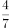，所以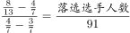，化简得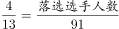，解得人，所以报名选手共有人。

故正确答案为C。

---

## 第 13 题　qid 2172296 · 数学运算

某市公安局从辖区2个派出所分别抽调2名警察，将他们随机安排到3个专案组工作，则来自同一派出所的警察不在同一组的概率是：

- **A**. 

　✅
- **B**. 

- **C**. 

- **D**. 

**答案**：A

**官方解析**

由题意可知，4名警察分到3个专案组，必有2人同组，其他2人各自一组。从4人中选出2人，有种方法；随机安排到3个专案组工作，每种分组情况均有种安排方法。所以将4名警察随机安排到3个专案组工作共有种情况。

从反面考虑，若同一派出所的警察在同一组，则其中一个派出所的2名警察被安排到一个专案组，另外一个派出所的2名警察分别安排到另外2个专案组，所以共有种情况。

因此，来自同一派出所的警察不在同一组的概率是。

故正确答案为A。

---

## 第 14 题　qid 2172385 · 数学运算

某单位举行象棋比赛，计分规则为：赢者得2分，负者得0分，平局各得1分，每位选手与其他选手各下一局。已知男选手数是女选手的10倍，而得分是女选手的4.5倍，则参加比赛的男选手数是

- **A**. 40人
- **B**. 30人
- **C**. 20人
- **D**. 10人　✅

**答案**：D

**官方解析**

根据题意可知，无论是有胜负还是平局，每局比赛共得2分。为方便计算，从小到大代入。代入D项：假设参加比赛的男选手数是10人，则女选手人，选手总数人。因为每位选手与其他选手各下一局，所以11人有局比赛，共分，女选手得分为分，1名女选手总得分最多为分，符合题干条件。（同理验证C、B、A选项可知，计算得出女选手总得分均大于可得的最高分）

故正确答案为D。

---

## 第 15 题　qid 2172387 · 数学运算

甲乙两车分别以96千米/小时、24千米/小时的速度在一长288千米的环形公路上行驶。如果甲乙两车在同一地点、沿同一方向同时出发，甲每次追上乙时甲减速，而乙增速，则当甲乙速度相等时甲所行驶的路程是：

- **A**. 950千米
- **B**. 960千米　✅
- **C**. 970千米
- **D**. 980千米

**答案**：B

**官方解析**

根据题意，设甲第一次追上乙所用的时间为，则根据环形追及公式可得：，解得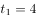小时。此时甲的速度降低为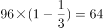千米/小时，乙的速度提高到千米/小时。

设甲第二次追上乙所用的时间为，则根据环形追及公式可得：，解得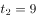小时。此时甲的速度降低为千米/小时，乙的速度提高到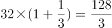千米/小时，甲乙速度相等。

所以当甲乙速度相等时甲所行驶的路程是千米。

故正确答案为B。

---
