# 2018年江苏省公务员录用考试《行测》题（B类）（网友回忆版）

> 数量关系 · 14 题 · 江苏 2018

## 第 1 题　qid 2172347 · 数学运算

1，-2，-3，-2，1，（    ）

- **A**. 6　✅
- **B**. 3
- **C**. -1
- **D**. -4

**答案**：A

**官方解析**

数列无明显特征，优先考虑作差。作差后得到新数列：-3，-1，1，3，（  ），为公差是2的等差数列，新数列中，则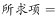。

故正确答案为A。

---

## 第 2 题　qid 2172351 · 数学运算

1，-5，10，10，40，（  ）

- **A**. -35
- **B**. 50
- **C**. 135
- **D**. 280　✅

**答案**：D

**官方解析**

数列存在明显的倍数关系，优先考虑作商。作商后得到新数列：-5，-2，1，4，（  ），为公差是3的等差数列，新数列中，则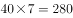。

故正确答案为D。

---

## 第 3 题　qid 2172466 · 数学运算

1，2，，，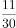，（  ）

- **A**. 
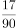

- **B**. 

- **C**. 
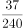

- **D**. 
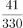
　✅

**答案**：D

**官方解析**

题干中数据大部分为分数，优先考虑分数数列。三个分数中，分母分别为2、6、30，明显倍数关系，倍数分别为3、5，分别与前两项分子相同，猜测前一项的分子、分母乘积为后一项的分母；再观察分子，，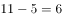，分别与前两项分母相同，猜测前一项的分子、分母之和为后一项分子。再对前两个整数进行整化分，该数列为，，，，，（  ）。（第二项分子），（第二项分母）；（第三项分子），（第三项分母），均满足刚才猜测的规律，则规律成立。因此所求项分子为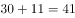，分母为，即。

故正确答案为D。

---

## 第 4 题　qid 2172443 · 数学运算

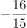，，，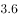，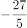，（  ）

- **A**. 

- **B**. 
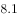
　✅
- **C**. 

- **D**. 
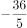

**答案**：B

**官方解析**

数列中出现分数，无其他明显规律，考虑将数列通分为分母相同的分数：，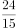，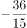，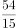，。此时分母相同观察分子规律：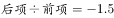，是公比为-1.5的等比数列，因此所求项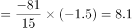。如果对于数据比较敏感，直接看出相邻项是-1.5倍的关系，可以直接按照等比数列来做。

故正确答案为B。

---

## 第 5 题　qid 2172341 · 数学运算

一款手机按2000元单价销售，利润为售价的。若重新定价，将利润降至新售价的，则新售价是：

- **A**. 1900元
- **B**. 1875元　✅
- **C**. 1840元
- **D**. 1835元

**答案**：B

**官方解析**

由题干“售价2000元，利润为售价的”可得，元。又由“重新定价，利润降至新售价的”，设新售价为x元，则，解得，则新售价是1875元。

故正确答案为B。

---

## 第 6 题　qid 2172445 · 数学运算

如图，在长方形ABCD中，已知三角形ABE、三角形ADF与四边形AECF的面积相等，则三角形AEF与三角形CEF的面积之比是

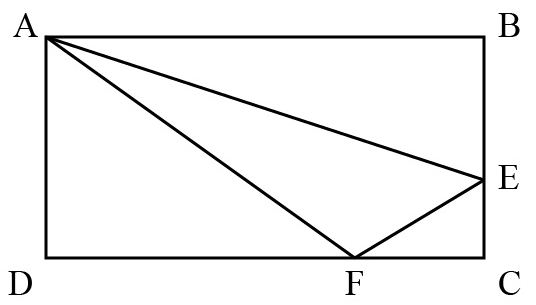

- **A**. 5:1　✅
- **B**. 5:2
- **C**. 5:3
- **D**. 6:1

**答案**：A

**官方解析**

设长方形ABCD的长，宽，根据题意，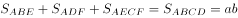，。因为，则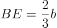，所以，；同理，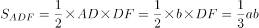，则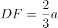，所以，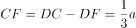。

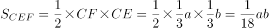，则，因此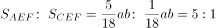。

故正确答案为A。

---

## 第 7 题　qid 2172382 · 数学运算

燃气公司欲在某新建楼盘内铺设天然气管道连通所有住宅楼，楼与楼之间可铺设管道的路线如图所示，圆圈表示各住宅楼，线段及线上数字表示路线及其长度（单位：百米），则铺设的管道最短长度是

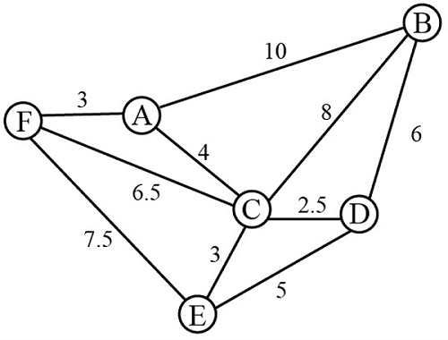

- **A**. 1800米
- **B**. 1850米　✅
- **C**. 1950米
- **D**. 2000米

**答案**：B

**官方解析**

要求“天然气管道连通所有住宅楼”且管道长度最短，那么铺设的管道数量应尽量少且每条管道的长度应尽量短。A-F共6栋住宅楼，因此管道数量最少为5条，根据图示，尽可能选择短的管道，选择FA、AC、CE、CD、BD，此时6栋住宅楼均被管道连通且所用长度最短，总长度为米。

故正确答案为B。

---

## 第 8 题　qid 2172286 · 数学运算

小李为办公室购买了红、黄、蓝三种颜色的笔若干支，共花费40.6元。已知红色笔单价为1.7元、黄色笔为3元、蓝色笔为4元，则小李买的笔总数最多是：

- **A**. 19支
- **B**. 20支
- **C**. 21支　✅
- **D**. 22支

**答案**：C

**官方解析**

设购买红色笔、黄色笔、蓝色笔的数量分别为x、y、z支，根据题意可得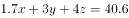，即······①。由于y、z均为正整数，而30y与40z的尾数均为0，因此17x的尾数必定为6，则x的尾数必定为8。要使买的笔总数最多，则价格最低的红色笔的数量x应尽量多，又因为，则x最大取18。将18代入①式：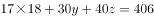，化简得，此时只有，满足二者均为正整数的条件，且此时价钱低的笔购买数量较多，符合题干要求。所买笔总数最多为支。

故正确答案为C。

---

## 第 9 题　qid 2172434 · 数学运算

甲乙丙分别骑摩托车、乘大巴、打的从A地去B地，甲的出发时间分别比乙丙早15分钟、20分钟，到达时间比乙丙都晚5分钟。已知甲乙的速度之比是2：3，丙的速度是60千米/小时，则AB两地间的距离是

- **A**. 75千米
- **B**. 60千米
- **C**. 48千米
- **D**. 35千米　✅

**答案**：D

**官方解析**

根据题意，设甲从A地到B地用时x分钟，则乙用时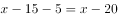分钟，丙用时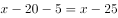分钟。根据“路程一定，速度与时间成反比”可得，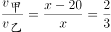，解得分钟，所以丙从A地到B地用时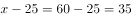分钟，又因为千米/小时，因此AB两地间的距离是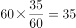千米。

故正确答案为D。

---

## 第 10 题　qid 2172435 · 数学运算

编制一批“中国结”，甲乙合作6天可完成；乙丙合作10天可完成；甲乙合作4天后，乙再单独做5天可完成，则甲、乙、丙的工作效率之比是

- **A**. 3：2：1　✅
- **B**. 4：3：2
- **C**. 5：3：1
- **D**. 6：4：3

**答案**：A

**官方解析**

赋值工程总量为30，则 甲、乙、丙的效率关系为：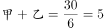，。甲乙合作4天，完成工程量，剩余工程量，乙再单独做5天可完成，则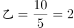。因此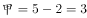、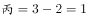，则甲、乙、丙的工作效率之比是3:2:1。

故正确答案为A。

---

## 第 11 题　qid 2172436 · 数学运算

已知正月初六从某火车站乘车出行旅客人数恰好是正月初五的8.5倍，且恰好比正月初七少，则正月初七从该火车站乘车出行的旅客人数至少是：

- **A**. 850人
- **B**. 1300人
- **C**. 1700人　✅
- **D**. 3400人

**答案**：C

**官方解析**

设初五、初六、初七的旅客人数分别为a、b、c（均为正整数）。由题意可知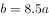，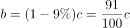。根据倍数特性，c一定是100倍数，排除A项；两式整理可得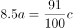，即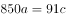，根据倍数特性，c应该是850的倍数，排除B项。题目问“至少”，则在C、D两项中选择较小的1700。

故正确答案为C。

---

## 第 12 题　qid 2172388 · 数学运算

某化学实验室有A、B、C三个试管分别盛有10克、20克、30克水，将某种盐溶液10克倒入试管A中，充分混合均匀后，取出10克溶液倒入B试管，充分混合均匀后，取出10克溶液倒入C试管，充分混合均匀后，这时C试管中溶液浓度为，则倒入A试管中的盐溶液浓度是：

- **A**. 

- **B**. 

- **C**. 

- **D**. 

　✅

**答案**：D

**官方解析**

设倒入A试管中的盐溶液浓度为a，将溶液倒入A试管时，混合之后的浓度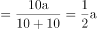；同理经过B、C试管的混合之后溶液浓度为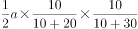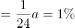，解得。

故正确答案为D。

---

## 第 13 题　qid 2172296 · 数学运算

某市公安局从辖区2个派出所分别抽调2名警察，将他们随机安排到3个专案组工作，则来自同一派出所的警察不在同一组的概率是：

- **A**. 

　✅
- **B**. 

- **C**. 

- **D**. 

**答案**：A

**官方解析**

由题意可知，4名警察分到3个专案组，必有2人同组，其他2人各自一组。从4人中选出2人，有种方法；随机安排到3个专案组工作，每种分组情况均有种安排方法。所以将4名警察随机安排到3个专案组工作共有种情况。

从反面考虑，若同一派出所的警察在同一组，则其中一个派出所的2名警察被安排到一个专案组，另外一个派出所的2名警察分别安排到另外2个专案组，所以共有种情况。

因此，来自同一派出所的警察不在同一组的概率是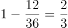。

故正确答案为A。

---

## 第 14 题　qid 2172385 · 数学运算

某单位举行象棋比赛，计分规则为：赢者得2分，负者得0分，平局各得1分，每位选手与其他选手各下一局。已知男选手数是女选手的10倍，而得分是女选手的4.5倍，则参加比赛的男选手数是

- **A**. 40人
- **B**. 30人
- **C**. 20人
- **D**. 10人　✅

**答案**：D

**官方解析**

根据题意可知，无论是有胜负还是平局，每局比赛共得2分。为方便计算，从小到大代入。代入D项：假设参加比赛的男选手数是10人，则女选手人，选手总数人。因为每位选手与其他选手各下一局，所以11人有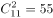局比赛，共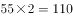分，女选手得分为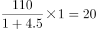分，1名女选手总得分最多为分，符合题干条件。（同理验证C、B、A选项可知，计算得出女选手总得分均大于可得的最高分）

故正确答案为D。

---
