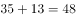
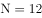
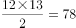
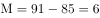
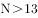
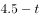
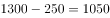

# 2018年江苏省公务员录用考试《行测》题（C类）（网友回忆版）

> 数量关系 · 14 题 · 江苏 2018

## 第 1 题　qid 2172347 · 数学运算

1，-2，-3，-2，1，（    ）

- **A**. 6　✅
- **B**. 3
- **C**. -1
- **D**. -4

**答案**：A

**官方解析**

数列无明显特征，优先考虑作差。作差后得到新数列：-3，-1，1，3，（  ），为公差是2的等差数列，新数列中，则。

故正确答案为A。

---

## 第 2 题　qid 2172351 · 数学运算

1，-5，10，10，40，（  ）

- **A**. -35
- **B**. 50
- **C**. 135
- **D**. 280　✅

**答案**：D

**官方解析**

数列存在明显的倍数关系，优先考虑作商。作商后得到新数列：-5，-2，1，4，（  ），为公差是3的等差数列，新数列中，则。

故正确答案为D。

---

## 第 3 题　qid 2172563 · 数学运算

3.2，8.6，15.12，24.20，35.30，（  ）

- **A**. 42.42
- **B**. 48.42　✅
- **C**. 42.56
- **D**. 48.56

**答案**：B

**官方解析**

题干为小数数列，直接作差无规律，考虑整数与小数部分之间作机械划分。整数部分：3、8、15、24、35、（  ），作差后得到：5、7、9、11、（  ），构成公差为2的等差数列，新数列下一项为13，则原数列所求项整数部分为；小数部分：2、6、12、20、30、（  ），作差后得到：4、6、8、10、（  ），构成公差为2的等差数列，新数列下一项为12，则原数列所求项小数部分为。因此，所求项为48.42。

故正确答案为B。

---

## 第 4 题　qid 2172466 · 数学运算

1，2，，，，（  ）

- **A**. 

- **B**. 

- **C**. 

- **D**. 

　✅

**答案**：D

**官方解析**

题干中数据大部分为分数，优先考虑分数数列。三个分数中，分母分别为2、6、30，明显倍数关系，倍数分别为3、5，分别与前两项分子相同，猜测前一项的分子、分母乘积为后一项的分母；再观察分子，，，分别与前两项分母相同，猜测前一项的分子、分母之和为后一项分子。再对前两个整数进行整化分，该数列为，，，，，（  ）。（第二项分子），（第二项分母）；（第三项分子），（第三项分母），均满足刚才猜测的规律，则规律成立。因此所求项分子为，分母为，即。

故正确答案为D。

---

## 第 5 题　qid 2172341 · 数学运算

一款手机按2000元单价销售，利润为售价的。若重新定价，将利润降至新售价的，则新售价是：

- **A**. 1900元
- **B**. 1875元　✅
- **C**. 1840元
- **D**. 1835元

**答案**：B

**官方解析**

由题干“售价2000元，利润为售价的”可得，元。又由“重新定价，利润降至新售价的”，设新售价为x元，则，解得，则新售价是1875元。

故正确答案为B。

---

## 第 6 题　qid 2172388 · 数学运算

某化学实验室有A、B、C三个试管分别盛有10克、20克、30克水，将某种盐溶液10克倒入试管A中，充分混合均匀后，取出10克溶液倒入B试管，充分混合均匀后，取出10克溶液倒入C试管，充分混合均匀后，这时C试管中溶液浓度为，则倒入A试管中的盐溶液浓度是：

- **A**. 

- **B**. 

- **C**. 

- **D**. 

　✅

**答案**：D

**官方解析**

设倒入A试管中的盐溶液浓度为a，将溶液倒入A试管时，混合之后的浓度；同理经过B、C试管的混合之后溶液浓度为，解得。

故正确答案为D。

---

## 第 7 题　qid 2172572 · 数学运算

小李家住在一个小胡同里，各家门牌号从1开始按顺序排列。已知胡同里各家门牌号之和减去小李家门牌号等于85，则小李家门牌号是

- **A**. 5
- **B**. 6　✅
- **C**. 7
- **D**. 8

**答案**：B

**官方解析**

由题干“各家门牌号从1开始按顺序排列”可得，各家门牌号为从1开始的连续自然数列。又已知“胡同里各家门牌号之和减去小李家门牌号等于85”，设一共有N家，小李家门牌号为M，则，直接求解较复杂，因数目不大，对于N直接枚举代入即可，从1开始的自然数求和比85大一些，试探当时，，小于85；当时，，恰好比85大一些，此时；当时，不符合题意。所以小李家门牌号是6。

故正确答案为B。

---

## 第 8 题　qid 2172639 · 数学运算

“和谐号”高速列车从甲地出发向相距1300千米的乙地行驶，列车分别以250千米/小时和300千米/小时的平均速度在两种不同路况的路段上行驶，4.5小时恰好走完全程。则这两种路段的里程数之差是

- **A**. 600千米
- **B**. 700千米
- **C**. 800千米　✅
- **D**. 1050千米

**答案**：C

**官方解析**

设列车以250千米/小时行驶时间为，则以300千米/小时的平均速度行驶时间为，根据题意，行驶总路程为，解得小时，因此，列车以250千米/小时行驶路段的路程为千米，以300千米/小时行驶路段的路程为千米，二者相差千米。

故正确答案为C。

---

## 第 9 题　qid 2172299 · 数学运算

如图，在长方形ABCD中，已知三角形ABE、三角形ADF与四边形AECF的面积相等，则三角形AEF与三角形CEF的面积之比是：

- **A**. 5：1　✅
- **B**. 5：2
- **C**. 5：3
- **D**. 2：1

**答案**：A

**官方解析**

设长方形ABCD的长，宽，根据题意，，。因为，则，所以，；同理，，则，所以，。

，则，因此。

故正确答案为A。

---

## 第 10 题　qid 2172665 · 数学运算

某新建农庄有一项绿化工程，交给甲、乙、丙、丁4人合作完成。已知4人的工作效率之比为3∶5∶4∶6，甲乙合作完成所需时间比丙丁合作多9天，则4人合作完成工程所需时间是

- **A**. 17天
- **B**. 18天
- **C**. 19天
- **D**. 20天　✅

**答案**：D

**官方解析**

根据题意，赋值甲、乙、丙、丁4人的工作效率分别为3、5、4、6，则甲乙合作的效率为，丙丁合作的效率为。设甲乙合作所需时间为x，则，解得，所以4人合作完成工程所需时间是天。

故正确答案为D。

---

## 第 11 题　qid 2172667 · 数学运算

一只黑色布袋中装着分别标有数字1、2、3的三种玻璃球若干。若从布袋中随机摸出10个球，球上数字之和为21，则10个球中标有数字1的玻璃球至多有几个？

- **A**. 2个
- **B**. 3个
- **C**. 4个　✅
- **D**. 5个

**答案**：C

**官方解析**

设标有数字1、2、3的玻璃球分别有a、b、c个，根据题意可得：······①，······②。得，由于a、b均为非负整数，则a的最大值为4。

故正确答案为C。

---

## 第 12 题　qid 2172669 · 数学运算

某乡组织县农民运动会预选赛，报名选手中男女人数比为4∶3，赛后有91人入选，其中男女之比为8∶5。如落选选手中男女之比为3∶4，则报名选手共有

- **A**. 98人
- **B**. 105人
- **C**. 119人　✅
- **D**. 126人

**答案**：C

**官方解析**

方法一：根据题意可知，入选选手中男女人数分别为人、人。设落选选手中男女人数分别为3x和4x，则报名选手中男女人数之比为，解得，所以落选选手人数为人，报名选手共有人。

方法二：线段法。根据题意可得，入选选手中男选手占比为，落选选手中男选手占比为，报名选手中男选手占比为，所以，化简得，解得人，所以报名选手共有人。

 

故正确答案为C。

---

## 第 13 题　qid 2172296 · 数学运算

某市公安局从辖区2个派出所分别抽调2名警察，将他们随机安排到3个专案组工作，则来自同一派出所的警察不在同一组的概率是：

- **A**. 

　✅
- **B**. 

- **C**. 

- **D**. 

**答案**：A

**官方解析**

由题意可知，4名警察分到3个专案组，必有2人同组，其他2人各自一组。从4人中选出2人，有种方法；随机安排到3个专案组工作，每种分组情况均有种安排方法。所以将4名警察随机安排到3个专案组工作共有种情况。

从反面考虑，若同一派出所的警察在同一组，则其中一个派出所的2名警察被安排到一个专案组，另外一个派出所的2名警察分别安排到另外2个专案组，所以共有种情况。

因此，来自同一派出所的警察不在同一组的概率是。

故正确答案为A。

---

## 第 14 题　qid 2172385 · 数学运算

某单位举行象棋比赛，计分规则为：赢者得2分，负者得0分，平局各得1分，每位选手与其他选手各下一局。已知男选手数是女选手的10倍，而得分是女选手的4.5倍，则参加比赛的男选手数是

- **A**. 40人
- **B**. 30人
- **C**. 20人
- **D**. 10人　✅

**答案**：D

**官方解析**

根据题意可知，无论是有胜负还是平局，每局比赛共得2分。为方便计算，从小到大代入。代入D项：假设参加比赛的男选手数是10人，则女选手人，选手总数人。因为每位选手与其他选手各下一局，所以11人有局比赛，共分，女选手得分为分，1名女选手总得分最多为分，符合题干条件。（同理验证C、B、A选项可知，计算得出女选手总得分均大于可得的最高分）

故正确答案为D。

---
