# 2018年浙江省公务员录用考试《行测》题（A类）（网友回忆版）

> 数量关系 · 25 题 · 浙江 2018

## 第 1 题　qid 2144586 · 数学运算

4 7 10 16 34 106 （    ）

- **A**. 466　✅
- **B**. 428
- **C**. 396
- **D**. 374

**答案**：A

**官方解析**

数列无明显特征，优先考虑作差。作差后得到新数列：3，3，6，18，72，（    ）。新数列存在明显倍数关系，所以作商得：1，2，3，4，（    ），下一个商值应为5，即新数列的最后一项应该为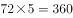，故原数列最后一项为。

故正确答案为A。

---

## 第 2 题　qid 2144587 · 数学运算

2 3 10 26 72 （    ）

- **A**. 124
- **B**. 170
- **C**. 196　✅
- **D**. 218

**答案**：C

**官方解析**

数列无明显特征，作差无规律，考虑递推数列。观察前三项2，3，10······发现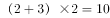，即，验证其他连续的三个数均符合，所以。

故正确答案为C。

---

## 第 3 题　qid 2144594 · 数学运算

          （  ）

- **A**. 

- **B**. 
1
　✅
- **C**. 

- **D**. 
2

**答案**：B

**官方解析**

分数数列，分母呈递减趋势，优先反约分，将数列分母转化为单调递减。原数列可转化为：， 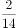， ， 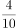， ，（），发现分母是公差为-2的等差数列，分子是公差为1的等差数列，所以1。

故正确答案为B。

---

## 第 4 题　qid 2144609 · 数学运算

10 12 13 22 25 35 （    ）

- **A**. 60
- **B**. 50
- **C**. 47　✅
- **D**. 37

**答案**：C

**官方解析**

数列无明显特征，作差无规律，考虑递推数列。观察前四项10，12，13，22······发现，即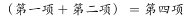，验证其他连续的四个数均符合，所以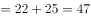。

故正确答案为C。

---

## 第 5 题　qid 2144610 · 数学运算

5 7 4 9 25 （  ）

- **A**. 49
- **B**. 121
- **C**. 189
- **D**. 256　✅

**答案**：D

**官方解析**

数列无明显特征，优先考虑作差。作差后得新数列2，-3，5，16，（    ），无明显规律。考虑递推，观察新数列与原数列之间的关系，发现，即新数列的平方＝原数列的下一项，即在原数列中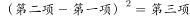，验证其他连续三项均符合，所以。

故正确答案为D。

---

## 第 6 题　qid 2144637 · 数学运算

把最合适的一项填入？中，使其符合一定的规律：

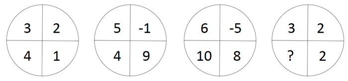

- **A**. 

- **B**. 

- **C**. 

- **D**. 

　✅

**答案**：D

**官方解析**

图形数阵，考虑对角线方向的数字联系。

观察发现：

第一个数阵中，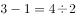；

第二个数阵中，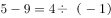；

第三个数阵中，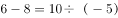；

故第四个数阵中，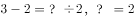。

故正确答案为D。 

---

## 第 7 题　qid 2144638 · 数学运算

把最合适的一项填入？中，使其符合一定的规律：

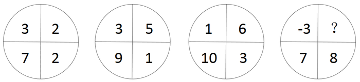

- **A**. 1
- **B**. 2　✅
- **C**. 3
- **D**. 4

**答案**：B

**官方解析**

图形数阵，考虑对角线方向的数字联系。

观察发现：

第一个数阵中，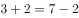；

第二个数阵中，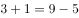；

第三个数阵中，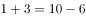；

故第四个数阵中，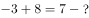，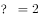。

故正确答案为B。 

---

## 第 8 题　qid 2144639 · 数学运算

把最合适的一项填入？中，使其符合一定的规律：

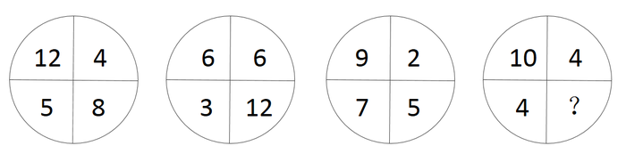

- **A**. 2
- **B**. 4
- **C**. 6　✅
- **D**. 8

**答案**：C

**官方解析**

图形数阵，考虑对角线方向的数字联系。

观察发现：

第一个数阵中，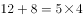；

第二个数阵中，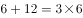；

第三个数阵中，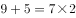；

故第四个数阵中，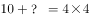，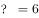。

故正确答案为C。 

---

## 第 9 题　qid 2144640 · 数学运算

把最合适的一项填入？中，使其符合一定的规律：

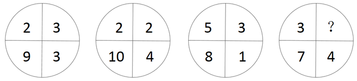

- **A**. 

　✅
- **B**. 
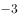

- **C**. 

- **D**. 

**答案**：A

**官方解析**

图形数阵，考虑对角线方向的数字联系。

观察发现：

第一个数阵中，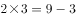；

第二个数阵中，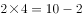；

第三个数阵中，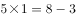；

故第四个数阵中，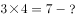，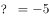。

故正确答案为A。 

---

## 第 10 题　qid 2144641 · 数学运算

把最合适的一项填入？处，使其符合一定的规律性：

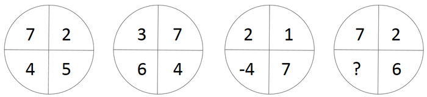

- **A**. 1
- **B**. 3　✅
- **C**. 5
- **D**. 7

**答案**：B

**官方解析**

图形数阵，考虑对角线方向的数字联系。

观察发现：

第一个数阵中，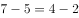；

第二个数阵中，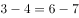；

第三个数阵中，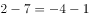；

故第四个数阵中，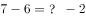，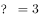。

故正确答案为B。 

---

## 第 11 题　qid 2144531 · 数学运算

某班共有8名战士，现在从中挑出4人平均分成两个战斗小组分别参加射击和格斗考核，问共有多少种不同的方案？

- **A**. 210
- **B**. 420　✅
- **C**. 630
- **D**. 840

**答案**：B

**官方解析**

方法一：从8个人里选出4人平均分两组进行射击与格斗考核，即射击考核2人，格斗考核2人。可以先从8人里选2人进行射击考核，方案数为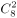；再从剩下的6人中选2人进行格斗考核，方案数为。由于是分步讨论，所以总方法数为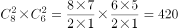。

方法二：从8人里选出4人的方案数为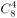，再从选出的4人中选出2人参加射击考核的方案数为，剩下的2人参加格斗考核。由于是分步讨论，所以总方法数为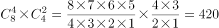。

故正确答案为B。

---

## 第 12 题　qid 2144534 · 数学运算

甲、乙和丙是同一公司的同事，甲工资为8000元/月，乙工资为7200元/月，丙工资比3人工资的平均值高400元/月。问丙的工资为多少元/月？

- **A**. 7800
- **B**. 8000
- **C**. 8200　✅
- **D**. 8400

**答案**：C

**官方解析**

设本题丙的工资为元，则三人的平均工资为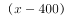元，根据工资总数一定可得方程：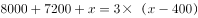，解得元。

故正确答案为C。

---

## 第 13 题　qid 2144541 · 数学运算

某工厂员工周一到周五每天工作8小时，周六工作5小时，周日休息。小王某年6月下旬到该工厂上班，某天下班后算得已到该工厂上班500小时。如当年7月1日是星期六，问小王到该工厂上班的日期是：

- **A**. 6月21日
- **B**. 6月22日
- **C**. 6月23日
- **D**. 6月24日　✅

**答案**：D

**官方解析**

周一至周五工作8小时，周六工作5小时，则每周工作小时。又知总工作时长为500小时，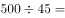，故小王工作了11周余5小时，而5小时即为周六一天的工作时间，所以推出上班第一天为周六（同理最后一天也为周六，只不过我们要求小王到该工厂上班的日期即第一天上班的时间，所以考虑第一天而不考虑最后一天）。由于7月1日为周六，所以6月下旬的周六为24号，故上班日期为6月24日。

故正确答案为D。

---

## 第 14 题　qid 2144493 · 数学运算

某测验包含10道选择题，评分标准为答对得3分，答错扣1分，不答得0分，且分数可以为负数。如所有参加测验的人得分都不相同，问最多有多少名测验对象？

- **A**. 38　✅
- **B**. 39
- **C**. 40
- **D**. 41

**答案**：A

**官方解析**

根据题意设答对道，答错道，则不答的为道。因“如所有参加测验的人得分都不相同”，则有多少种得分即有多少名测验对象。又“评分标准为答对得3分，答错扣1分，不答得0分”，则得分等于，因“且分数可以为负数”，则最低分为答错10道即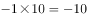分，最高分为答对10道即分，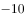分至30分一共41种得分，接下来我们分析这41种得分是否均可以得到。

当、时，得30分；

因一共10道题，不存在、与、这两种情况，因此得不到29分和28分；

当、时，得分；

当、时，得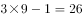分；

因一共10道题，不存在、这种情况，因此得不到25分；

当、时，得分。

到此时我们会发现得不到29、28、25分，则最多可以得到种分数，结合选项发现，B、C、D三项一定错误，没有比38再小的数，因此只有A项符合。

故正确答案为A。

备注：本题采用枚举法来做，但是并不需要枚举出所有情况，只需要根据选项得到正确答案即可，在枚举时一定要注意一共有10道选择题这个范围。

---

## 第 15 题　qid 2144497 · 数学运算

汽车销售店本周共卖出36辆小汽车，其中燃油动力汽车销量比混合动力汽车销量的2倍少3辆，比纯电动汽车销量的3倍多1辆。每辆混合动力汽车和纯电动汽车分别可以获得政府补贴3万元和9万元，问该销售店本周卖出的混合动力汽车和纯电动汽车总共可以获得多少万元政府补贴？

- **A**. 72
- **B**. 75
- **C**. 81
- **D**. 87　✅

**答案**：D

**官方解析**

设该销售店本周卖出混合动力汽车辆，则卖出燃油动力汽车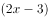辆，卖出纯电动汽车辆。根据“燃油动力汽车销量比纯电动汽车销量的3倍多1辆”可得，，解得。即该销售店本周卖出混合动力汽车11辆，纯电动汽车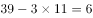辆，两种车共可以获得政府补贴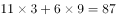万元。

故正确答案为D。

---

## 第 16 题　qid 2144509 · 数学运算

已知今年小明父母的年龄之和为76岁，小明和他弟弟的年龄之和为18岁。三年后，母亲的年龄是小明的三倍，父亲的年龄是小明弟弟的四倍。问小明今年几岁？

- **A**. 11　✅
- **B**. 12
- **C**. 13
- **D**. 14

**答案**：A

**官方解析**

方法一：设三年后小明年龄为岁，弟弟为岁，则此时母亲年龄为，父亲年龄为。根据题意：今年四人的年龄关系为，解得，则今年小明的年龄为岁。

方法二：设小明、小明的弟弟、小明的父亲和母亲今年的年龄分别为，，和，根据题意可得，今年四人的年龄关系为，三年后四人的年龄关系为，得，，代入得，，解得。得，。

故正确答案为A。

---

## 第 17 题　qid 2144584 · 数学运算

某次比赛报名参赛者有213人，但实际参赛人数不足200。主办方安排车辆时，每5人坐一辆车，最后多2人；安排就餐时，每8人坐一桌，最后多7人；分组比赛时，每7人一组，最后多6人。问未参赛人数占报名人数的比重在以下哪个范围内？

- **A**. 
低于

- **B**. 
之间
　✅
- **C**. 
之间

- **D**. 
高于

**答案**：B

**官方解析**

由题干条件“每5人坐一辆车，最后多2人”“每8人坐一桌，最后多7人”“每7人一组，最后多6人”，设共有a辆车、b张桌子、c组比赛，则，

设实际参赛人数为（）人（56为7、8的最小公倍数，为两种情况共同的差），由，得，只有当时，满足“每5人坐一辆车，最后多2人”，故实际参赛人数为167人。未参赛人数为人，所以未参赛人数所占比重为，B项满足。

故正确答案为B。

---

## 第 18 题　qid 2144589 · 数学运算

超市采购小米、糯米和红豆的价格分别为5元/千克、6元/千克和7元/千克。若将小米、糯米和红豆按7:6:5的比例混在一起做成杂粮粥原料出售，问定价为多少时，销售的毛利润额在采购金额的到之间？

- **A**. 6.6元/千克
- **B**. 7元/千克
- **C**. 7.4元/千克　✅
- **D**. 8元/千克

**答案**：C

**官方解析**

根据题干条件，赋值小米、糯米、红豆混成杂粮粥的分配量分别为7、6、5，根据，可得下表：

故配成的杂粮粥的总重量，总成本。

设定价为元/千克，因要求“毛利润额在采购金额的与之间”，则可得：

，化简后约为：，C项满足。

故正确答案为C。

---

## 第 19 题　qid 2144580 · 数学运算

某水利部门以月份为横轴、降水量为纵轴绘制散点图，统计分析当年当地的降水情况，发现1～4月份的降水量散点恰好是一个平行四边形的四个顶点。已知1～4月份的降水总量为200毫米，1、2月份的降水量相差10毫米，2、3月份的降水量相差40毫米。问4月份的降水量最高可能为：

- **A**. 50毫米
- **B**. 60毫米
- **C**. 70毫米
- **D**. 80毫米　✅

**答案**：D

**官方解析**

方法一：设1～4月份的降水量分别为a、b、c、d，这四个点恰好是平行四边形的四个顶点，则a与d、b与c恰好是两组相对顶点。因为平行四边形相对顶点的纵坐标和相等，即。已知1～4月份降水总量为200，所以。要想4月份降水量最高，则1月份降水量尽可能低。1月份与2月份相差10毫米，则2月份降水量也要尽可能低。又已知2、3月份降水量相差40，则有，解得，因此a最低为，。所以4月份降水量最高为80毫米。

方法二：根据条件，1、2月份的降水量相差10毫米，因平行四边形对边平行且相等，则3、4月份也应相差10毫米，同时2、3月份的降水量相差40毫米。 

设1～4月份的降水量分别为a、b、c、d。要想4月份降水量最高，则1月份降水量尽可能低，2月份降水量也要尽可能低。可列方程得：

，，，。

因求最高为多少，从最大开始代入。

当时，解得，，。，满足要求。

故正确答案为D。 

---

## 第 20 题　qid 2144581 · 数学运算

机械厂加工某器件，需依次进行3道工序，工作量的比依次是3:2:4。甲完成1个工件后又完成了第2个工件的前两道工序，正好用时1小时。已知甲和乙的加工效率比是7:9，问乙完成1个工件需要多长时间？

- **A**. 30分钟　✅
- **B**. 36分钟
- **C**. 42分10秒
- **D**. 46分40秒

**答案**：A

**官方解析**

由题意可知，3道工序的工作量之比为3:2:4，赋值3道工序的工作量分别为3、2、4。由条件“甲完成1个工件后又完成了第2个工件的前两道工序”，则。因刚好用时1小时，则。已知，则乙的效率应为。，则。

故正确答案为A。

---

## 第 21 题　qid 2144582 · 数学运算

甲、乙各自驾驶汽车匀速相向行驶，且同时进入双向公路隧道的两端，30秒后两车相遇。甲车继续行驶20秒到达隧道出口时，乙车距离出口还有200米。问隧道的长度为多少米？

- **A**. 450
- **B**. 500
- **C**. 600　✅
- **D**. 800

**答案**：C

**官方解析**

设隧道的两端分别为AB两点，两车在C点相遇。由B点到C点，乙车用了30秒，同时由C点到B点，甲车用了20秒。路程相同，速度与时间成反比，则。设，，则。相遇后乙走了20秒，此时共走了，距离出口还剩余，距出口200米，即，米。全程米。

故正确答案为C。

---

## 第 22 题　qid 2144503 · 数学运算

某水库每天的上游来水量是10万立方米。5月1日水库向周边供水7万立方米，在5月15日午夜降雨之前，每日的供水量都比上一日多2万立方米。问该水库5月1日零时的库存至少要为多少万立方米，才能保证在降雨之前对周边充足的水供应？

- **A**. 143
- **B**. 150
- **C**. 165　✅
- **D**. 185

**答案**：C

**官方解析**

先计算5月1日零时-15日午夜的供水量，每日的供水量是公差为2的等差数列，5月1日的供水量为，则前15日供水总量为：万立方米。每天上游来水量是10万立方米，15日共来水万立方米，则该水库5月1日零时的库存至少万立方米，才能保证在降雨之前对周边充足的水供应。

故正确答案为C。

---

## 第 23 题　qid 2144505 · 数学运算

某蛋糕店接到300个蛋糕的订单。已知老板一天能做30个蛋糕，店员小红一天只能做10个。蛋糕制作过程中，老板有一个周末外出，小红请了8天假，两人在外时间不重叠。问制作这批蛋糕一共花了多少天？

- **A**. 11　✅
- **B**. 12
- **C**. 13
- **D**. 14

**答案**：A

**官方解析**

设制作这批蛋糕时间为天，蛋糕制作过程中，老板有一个周末外出，小红请了8天假，则老板做了天，小红做了天，由题意可得，，解得。故制作这批蛋糕一共花了11天。

故正确答案为A。

---

## 第 24 题　qid 2144508 · 数学运算

小王购买甲、乙两种特价商品。甲商品打八折后每件52元，乙商品打八五折后每件34元，小王购买这些商品总共比打折前节省了83元。问他购买这两种特价商品总共支出了多少元？

- **A**. 544
- **B**. 445
- **C**. 427
- **D**. 362　✅

**答案**：D

**官方解析**

根据甲商品打八折后每件52元，可计算出甲的售价为元；根据乙商品打八五折后每件34元，可计算出乙的售价为元。甲商品一件节省元，乙商品一件节省元。设购买甲商品件，乙商品件，由于小王购买这些商品比打折前节省了83元，可得，该式为不定方程，结合奇偶特性，可得，，即甲、乙两种商品分别买了5件、3件。购买这两种特价商品总支出为：元。

故正确答案为D。

---

## 第 25 题　qid 2144513 · 数学运算

某停车场按以下办法收取停车费：

小张整点将车辆驶入该停车场，并于整点驶出，停车费为50元，问他停车的时长有多少种不同的可能性？

- **A**. 5
- **B**. 6　✅
- **C**. 7
- **D**. 8

**答案**：B

**官方解析**

选项数字不大，可采用枚举法。

根据上表中的总收费，可以详细枚举出停车的时间段。

注：10:00-12:00整点都不能作为起点，因为12:00-17:00是5小时，总费用是25元。同理14:00、16:00、20:00-22:00、00:00-3:00整点也不能作为起点。

根据上表的时间段，他停车的时长有5小时、6小时、7小时、9小时、10小时和13小时共6种时长。

故正确答案为B。

---
