# 2018年湖北省选调生招录考试综合知识和行政职业能力测验试卷（网友回忆版）

> 数量关系 · 10 题 · 选调 2018

## 第 1 题　qid 2672491 · 数学运算

某市2017财政收入1000亿，财政赤字占当年财政收入比率为；2018年该比率降为，预算赤字为2017年的。该市2018年财政支出预算为：

- **A**. 1200亿
- **B**. 1220亿
- **C**. 1224亿　✅
- **D**. 1230亿

**答案**：C

**官方解析**

由题意可知，2017年财政赤字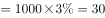亿，则2018年的财政赤字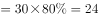亿。根据“2018年该比率降为”可知，2018年财政收入亿，则该市2018年财政支出预算财政收入财政赤字亿。

故正确答案为C。

---

## 第 2 题　qid 2672518 · 数学运算

某电信营业厅，全年营业利润符合以下模型：

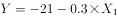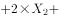，其中，为营业利润，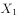为短信量，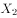为网络流量，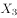为通话量，为其它业务。

以下解释正确的是：

- **A**. 
四种业务均对营业利润有贡献

- **B**. 
业务发展优先次序为，，，

- **C**. 
各项业务都应当同等发展

- **D**. 
各变量的单位增量中，对贡献最大
　✅

**答案**：D

**官方解析**

A项：由营业利润模型“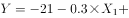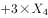”可知，短信量的值越大，营业利润的值就越小，因此短信量对营业利润没有贡献，错误；

B项：由营业利润模型可知，、、、前的系数分别为-0.3、2、0.5、3，系数越大，对利润的贡献越大，因此业务发展优先次序为，因为前的系数为负值，故业务不应该发展，应该缩减此业务，错误；

C项：不同业务的系数不同，对利润产生的贡献也不同，应当优先发展系数更大的业务，才能有更高的利润，错误；

D项：每增加1，就增加3，前的系数是最大的，因此对的贡献也是最大的，正确。

故正确答案为D。

【备注】本题的B项可能存在争议，优先选择正确且无争议的D项。

---

## 第 3 题　qid 2672521 · 数学运算

去年小李年工资收入4万元，今年预计增加。今年居民消费价格指数（CPI）预计为，据此推算，今年小李的实际购买力约增加：

- **A**. 

- **B**. 

- **C**. 

　✅
- **D**. 

**答案**：C

**官方解析**

方法一：由题意可知，小李今年收入为去年的倍，今年居民消费价格指数（CPI）预计为去年的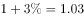倍，则今年小李的实际购买力增加了。

方法二：由题意可知，小李去年的收入为4万元，则今年的收入为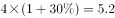万元，设去年小李的收入可以购买价格为4万元的商品，则今年小李的收入可以购买原价为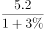万元的商品，则今年小李的实际购买力增加了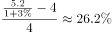。

故正确答案为C。

---

## 第 4 题　qid 2672522 · 数学运算

某单位投入100000元用于植树，每人每天可植树30棵，人员费用40元/天，树苗每棵10元。该单位在预算范围内最多可植树：

- **A**. 8740棵
- **B**. 8780棵　✅
- **C**. 8823棵
- **D**. 3920棵

**答案**：B

**官方解析**

问最多，从最大的选项逐一代入验证。代入C项，种植8823棵树需要人（向上取整），总费用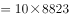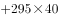，不符合；代入B项，种植8780棵树需要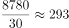人（向上取整），总费用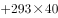，符合，A、D两项无需验证。

故正确答案为B。

【备注】方程法：设该单位植树课，则由题意可列式：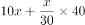，解得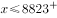，因此总的植树数量8823，此时人数为294.1人，但人数为整数，所以向下取整为294人，此时植树数量为8820颗，故实际最多可植树8820棵，但选项中没有，选择符合条件的最大值B项。

---

## 第 5 题　qid 2672525 · 数学运算

小张接手一项扶贫任务，这项任务包括A、B、C、D、E、F六部分的内容，完成这些内容所需时间分别为3天、5天、2天、1天、7天、2天，各部分之间的序次关系如下图所示。完成这项任务最少需要：

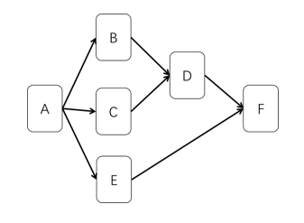

- **A**. 13天
- **B**. 12天　✅
- **C**. 11天
- **D**. 10天

**答案**：B

**官方解析**

由题意可知，首先需要完成A任务，耗时3天；接下来可以同时进行B、C、E任务，E任务耗时最长需要7天；B、C任务耗时5天都完成后，可以继续耗时1天完成D任务，，此时需要等待E任务完成后，才可以进行F任务，F任务需要2天来完成。因此完成这项任务最少需要天。

故正确答案为B。

---

## 第 6 题　qid 2672574 · 数学运算

四件相同包装的快递包裹，装有不同重量的商品，每件和其他一件合称一次，得到的重量依次为8、9、10、11、12、13，已知4件空包裹的重量之和以及里面商品的重量之和均为质数。则最重的两个包裹里的商品的总重量和为：

- **A**. 10
- **B**. 11
- **C**. 12　✅
- **D**. 13

**答案**：C

**官方解析**

由题意可知，最轻的两件包裹重量之和为8，最重的两件包裹重量之和为13，因此四件包裹的重量之和为。因为“已知4件空包裹的重量之和以及里面商品的重量之和均为质数”，即4件空包裹的重量商品总重量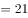，系数一奇一偶且都为质数，因此4件空包裹的重量，2件空包裹的重量，故最重的两个包裹里的商品的总重量和为。

故正确答案为C。

---

## 第 7 题　qid 2672592 · 数学运算

如下图，有正方形ABCD，点E和点F分别在正方形AD和DC边上，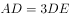。正方形ABCD的面积与三角形EFB的面积之比是12：5，则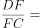（    ）。

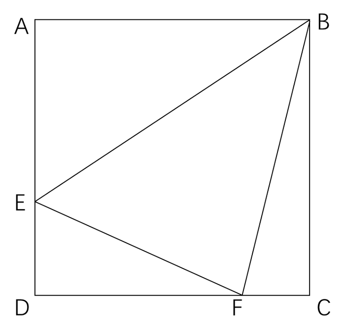

- **A**. 

- **B**. 
1

- **C**. 
2

- **D**. 
3
　✅

**答案**：D

**官方解析**

设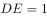，则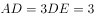，正方形ABCD的面积。根据“正方形ABCD的面积与三角形EFB的面积之比是12：5”，可求出三角形EFB的面积为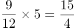。设DF的长度为，则FC的长度为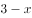，因为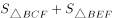，所以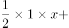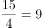，解得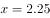，因此。

故正确答案为D。

---

## 第 8 题　qid 2672607 · 数学运算

张大妈买了一篮子菜，包含A、B、C三个品种，其中A菜品1斤，单价40元/斤；B菜品2斤，单价5元/斤；C菜品2.5斤，单价2元/斤。这一篮子菜的平均价格为：

- **A**. 约8.54元/斤
- **B**. 10元/斤　✅
- **C**. 约15.67元/斤
- **D**. 15元/斤

**答案**：B

**官方解析**

根据题干可知，这一篮子菜的总价格元，这一篮子菜的总重量斤，因此这一篮子菜的平均价格为元/斤。

故正确答案为B。

---

## 第 9 题　qid 2673107 · 数学运算

大学生张明开办网店，他购买了一批夜光灯，每台8元购进20元售出。当他卖出进货量的时，不仅收回了全部购买成本，还赢利了224元。张明共购进这批夜光灯：

- **A**. 32台　✅
- **B**. 31台
- **C**. 30台
- **D**. 25台

**答案**：A

**官方解析**

设共购进了4x台，则卖出3x时收回总成本，且赢利了224元。根据利润总售价总成本，可得，解得。因此共购进台。

故正确答案为A。

---

## 第 10 题　qid 2672618 · 数学运算

小杰学习制作泡菜，他需要用浓度分别为和的盐水来调制300克浓度为的盐水，则需要使用的盐水：

- **A**. 90克
- **B**. 100克
- **C**. 110克
- **D**. 150克　✅

**答案**：D

**官方解析**

方法一：根据线段法，混合溶液的浓度之差与溶液质量成反比，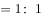，因此混合前的溶液质量相等，则需要使用的盐水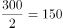克。

方法二：设需要的盐水克，的盐水克，则由题意可列式：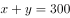······①，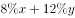······②，①式和②式联立方程组，解得，，则需要使用的盐水150克。

故正确答案为D。

---
