# 2018年福建省选调生考试《行政职业能力测验》

> 数量关系 · 10 题 · 福建 2018

## 第 1 题　qid 4713905 · 数学运算

有19个连续整数，其总和为4009。那么，最大的数是（    ）。

- **A**. 217
- **B**. 218
- **C**. 219
- **D**. 220　✅

**答案**：D

**官方解析**

根据题意可知，19个连续整数恰好构成等差数列。根据等差数列求和公式：，则这19个连续整数的中位数。根据等差数列通项公式：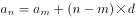，假设这19个数由小到大排列，则最大数为。

故正确答案为D。

---

## 第 2 题　qid 4713935 · 数学运算

工程队A的工作方式是工作4天休息2天，工程队B的工作方式是工作5天休息3天。现一项工程交给A单独做需要34天，而B单独做需要29天，那么，这项工程A、B一起施工，需要多少天完成？

- **A**. 15
- **B**. 16　✅
- **C**. 17
- **D**. 18

**答案**：B

**官方解析**

根据题意，A工程队4+2=6天为一个工作周期，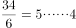天，即A工程队单独完成该项工程需工作4×5+4=24天；B工程队5+3=8天为一个工作周期，天，即B工程队单独完成该项工程需工作5×3+5=20天。赋值这项工程的工作总量为120，则A工程队的工作效率为，B工程队的工作效率为。当A、B工程队一起施工时，可列表如下：

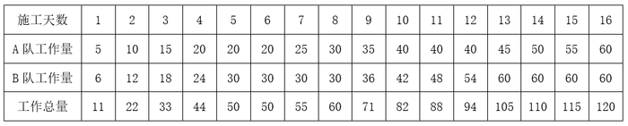

由上表可知，这项工程A、B一起施工，需要16天完成。

故正确答案为B。

---

## 第 3 题　qid 4713954 · 数学运算

有一个正方形边长1厘米，将正方形的每条边进行6等分，如下图所示，那么正中间这个阴影部分的面积是多少平方厘米？

- **A**. 
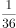

- **B**. 

　✅
- **C**. 

- **D**. 

**答案**：B

**官方解析**

如下图所示，连接正方形的等分线。根据题意可知，在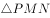中，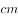，，则，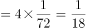。

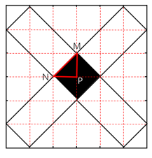

故正确答案为B。

---

## 第 4 题　qid 4713904 · 数学运算

有一个数列，第一项是2、第二项是6，后面的数都是其前面两项的和的个位数。那么，第2018项是多少？

- **A**. 2
- **B**. 4
- **C**. 6　✅
- **D**. 8

**答案**：C

**官方解析**

根据题意，该数列前两项依次为2、6，第三项为2+6=8，第四项为6+8=14的个位数4，第五项为8+4=12的个位数2，第六项到第八项依次为6、8、4。观察可得，此数列以2、6、8、4四个数字周期循环， 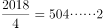，即经过504个周期后，剩余2项，则第2018项是6。

故正确答案为C。

---

## 第 5 题　qid 4713921 · 数学运算

有两种瓶子，体积之比为1：2。大瓶子和小瓶子分别装满浓度为20%和50%的酒精溶液。现将大瓶子中的酒精溶液倒掉后和小瓶子中的溶液混合，那么，此时混合溶液浓度是多少？

- **A**. 25%
- **B**. 30%
- **C**. 35%
- **D**. 40%　✅

**答案**：D

**官方解析**

题干给比例求比例，考虑赋值法，根据题意可赋值小瓶子和大瓶子的体积分别为2和4，大瓶子剩余酒精溶液体积为，因此题干所求为大瓶子中体积为1的20%酒精溶液与小瓶子中体积为2的50%酒精溶液混合。

方法一：根据公式：浓度，可得混合溶液浓度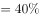。

方法二：设混合溶液浓度为x，根据线段法，混合溶液的浓度之差与溶液质量成反比，则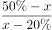，解得x=40%。

故正确答案为D。

---

## 第 6 题　qid 4713923 · 数学运算

自然数1-2018中，数位上含有0的自然数有多少个？

- **A**. 470　✅
- **B**. 479
- **C**. 551
- **D**. 1199

**答案**：A

**官方解析**

①0在个位：当数字为10的倍数时，其个位为0，有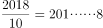，即201个；

②0在十位：百位是1的有101-109，有9个；同理百位是2到9的各有9个，共有9×9=81个；

千位、百位均是1的有1101-1109，有9个；同理千位是1，百位是2到9的各有9个，共有9×9=81个；

③0在百位：千位是1，十位是1的有1011-1019，有9个；同理千位是1，十位是2到9的各有9个，共有9×9=81个；

千位是2，十位是1的有2011-2018，有8个；

④0在十位、百位：千位是1的有1001-1009，有9个；千位是2的有2001-2009，有9个，共有9×2=18个。

数位上含有0的数共有201+81+81+81+8+18=470个。

故正确答案为A。

---

## 第 7 题　qid 4713916 · 数学运算

集合A={1，2，3，4，5，6，7，8，9｝，集合B={1，2，3，6，9｝，集合C={1，2，4，7，8，9｝。那么，属于集合A，但不属于集合B和集合C的集合一共有多少个？

- **A**. 421
- **B**. 422
- **C**. 423
- **D**. 424　✅

**答案**：D

**官方解析**

n个元素的集合，一共有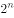个子集。由题意可知，集合A中有9个元素，则属于集合A的集合有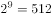个；集合B中有5个元素，则属于集合B的集合有个；集合C中有6个元素，则属于集合C的集合有个。设集合D为集合B和集合C的交集，则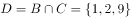，集合D中有3个元素，则属于集合D的集合有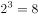个。根据两集合容斥原理可知，属于集合B或属于集合C的集合一共有32+64-8=88个；因此属于集合A，但不属于集合B和集合C的集合一共有512-88=424个。

故正确答案为D。

---

## 第 8 题　qid 4713955 · 数学运算

有一个00后的孩子，其今年年龄的20倍加上18，然后乘以5，再加365，减去其出生的月份后得到的数字是1646，那么，这个孩子的出生日期是多少？

- **A**. 2006年9月　✅
- **B**. 2007年8月
- **C**. 2008年7月
- **D**. 2009年6月

**答案**：A

**官方解析**

设这个孩子今年的年龄为x岁，出生月份为y月。则由题意可列式：（20x+18）×5+365-y=1646，化简后可得：100x=1191+y。等式左边尾数为0，因此右边尾数1+y=0，y是月份，即y只能取9。结合选项，月份为9的只有A项。
故正确答案为A。

---

## 第 9 题　qid 22939 · 数学运算

一副扑克牌有52张，最上面一张是红桃A。如果每次把最上面的10张移到最下面而不改变它们的顺序及朝向，那么，至少经过多少次移动，红桃A会出现在最上面：

- **A**. 27
- **B**. 26　✅
- **C**. 25
- **D**. 24

**答案**：B

**官方解析**

每次移动扑克牌张数为10，因此移动的扑克牌总数必然是10的倍数；又因红桃A从最上面再回到最上面，则移动的扑克牌总数必然是52的倍数。10与52的最小公倍数是260，即移动扑克牌数达到260后，红桃A再次出现在最上面，移动次数为次。

故正确答案为B。

---

## 第 10 题　qid 4713922 · 数学运算

在下图中，三个圆的半径分别为1厘米、2厘米、3厘米 ，AB和CD垂直且过这三个圆的共有圆心O。图中阴影部分面积与非阴影部分的面积之比是多少？

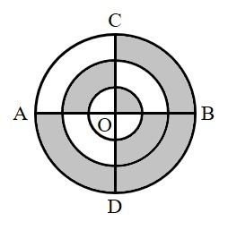

- **A**. 11：7　✅
- **B**. 10：7
- **C**. 12：5
- **D**. 13：6

**答案**：A

**官方解析**

半径为1厘米的圆面积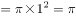平方厘米，其阴影部分面积平方厘米。半径为2厘米的圆面积平方厘米，则中间圆环的面积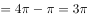平方厘米，中间圆环阴影部分面积平方厘米。半径为3厘米的圆面积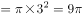平方厘米，则外侧圆环的面积平方厘米，外侧圆环阴影部分面积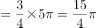平方厘米。因此图中阴影部分的总面积平方厘米，非阴影部分的总面积平方厘米，则阴影部分面积与非阴影部分的面积之比。

故正确答案为A。

---
