# 2018年辽宁省公务员录用考试《行测》题（网友回忆版）

> 数量关系 · 10 题 · 辽宁 2018

## 第 1 题　qid 2307701 · 数学运算

一张纸上画了5排共30个格子，每排格子数相同。小王将1个红色和1个绿色棋子随机放入任意一个格子（2个棋子不在同一格子），则2个棋子在同一排的概率

- **A**. 
不高于

- **B**. 
高于但低于
　✅
- **C**. 
正好为

- **D**. 
高于

**答案**：B

**官方解析**

方法一：从30个格子中随机选两个格子放入红色和绿色棋子，总的情况数为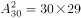。要让它们恰好放在同一排，应先从5排中选一排，再从这一排中有顺序地选2个格子，符合条件的情况数为。则满足情况的概率为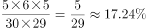，在到之间。

方法二：要2个棋子在同一排，可以看做要选两个格子在同一排。而第一个选择的格子，任意选取都可以，所以概率为1。第二个选择的格子，需要跟第一个格子在同一排，一排有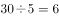个格子，被第一个选择占去1个，还剩5个选择，而全部选择可能性还有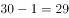种，所以第二个格子满足条件的概率为。故两个棋子在同一排的概率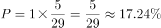，在到之间。

故正确答案为B。

---

## 第 2 题　qid 2307703 · 数学运算

某工程50人进行施工。如连续施工20天，每天工作10小时，正好按期完成。但施工过程中遭遇原料短缺，有5天时间无法施工。工期还剩8天时，工程队增派15人并加班施工。若工程队想按期完成，则平均每天需工作（  ）小时。

- **A**. 12.5　✅
- **B**. 11
- **C**. 13.5
- **D**. 11.5

**答案**：A

**官方解析**

赋值每人每小时的效率为1。因遭遇原料短缺，5天无法施工，则只能施工天。题目所求还剩8天时，此时实际施工天，则剩余工程总量。在增派15人情况下，若想按期完成，设每天需要工作小时，可得：，解得，即平均每天需工作12.5小时。

故正确答案为A。

---

## 第 3 题　qid 2307705 · 数学运算

春风街道办事处为丰富老年人文化生活，准备举办老年才艺秀活动。活动项目共有书法、绘画、歌曲演唱、太极拳四项。参加者报名项数不限，每种报名方式最多可报4人。经统计，共有3人同时报名参加书法和绘画项目。据此，参加老年才艺秀活动最多报名（  ）人。

- **A**. 68
- **B**. 73
- **C**. 45
- **D**. 47　✅

**答案**：D

**官方解析**

四项活动，可选择一种、两种、三种或者全部报名，不同的报名方式共有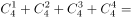种，要想“老年才艺秀活动”报名人数尽量多，则每种报名方式报名人数尽量多，即4人报名，则最多共有人。而同时报名参加书法和绘画项目的情况为（书法、绘画）、（书法、绘画、歌曲演唱）、（书法、绘画、太极拳）、（书法、绘画、歌唱演唱、太极拳），4种报名方式最多可报名人，实际报名3人。则此时报名人数最多为人。

故正确答案为D。

---

## 第 4 题　qid 2307706 · 数学运算

现有60枚1元硬币，若把它们在平面上紧密排列成正三角形，要使剩下的硬币尽可能少，则三角形的最大边长是（  ）。

- **A**. 11
- **B**. 10　✅
- **C**. 8
- **D**. 6

**答案**：B

**官方解析**

设组成的紧密排列的正三角形每边有枚硬币，则排列出来的三角形共有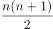枚硬币。

当三角形边长为11，则三角形硬币总数为枚，超过60枚，排除；

当三角形边长为10，则三角形硬币总数为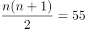枚，剩余枚；

当三角形边长为8，则三角形硬币总数为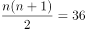枚，剩余枚；

当三角形边长为6，则三角形硬币总数为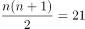枚，剩余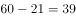枚。

当边长为10的时候，剩下的硬币最少。

故正确答案为B。

---

## 第 5 题　qid 2307707 · 数学运算

某班在筹备联欢会时发现很多同学都会唱歌和乐器演奏，但有部分同学这2种才艺都不会。具体有4种情况：只会唱歌、只会乐器演奏、唱歌和乐器演奏都会、唱歌和乐器演奏都不会。现知会唱歌的有22人，会乐器演奏的有15人，两种都会的人数是两种都不会的5倍。这个班至多有（  ）人。

- **A**. 27
- **B**. 30
- **C**. 33　✅
- **D**. 36

**答案**：C

**官方解析**

由题意可知此题为两集合容斥问题。根据两集合容斥公式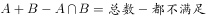，设两种都不会的人数为，则两种都会的人数为，代入公式可得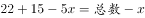，化简得总数。当时，，此时班里的人数最多。

故本题正确答案为C。

---

## 第 6 题　qid 2307710 · 数学运算

某超市在春节前购进一批食品礼盒，加价后全部卖出，用收入的一半又购进一批，加价后全部卖出又盈利3000元，则第一次购进的食品礼盒全部卖出后盈利（  ）元。

- **A**. 2000
- **B**. 3000
- **C**. 4000　✅
- **D**. 7000

**答案**：C

**官方解析**

设第一次食品礼盒全部卖出后收入元。根据题意有：，解得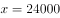元，则第一次购进的食品礼盒全部卖出后的盈利为：元。

故本题正确答案为C。

---

## 第 7 题　qid 2307719 · 数学运算

现有装有相等重量纯水的红白蓝三个桶和装有不知浓度与重量的酒精溶液的黑桶。将红桶中水全部倒入黑桶，此时酒精浓度变为；再将白桶的水全部倒入黑桶，此时酒精浓度变为；再将蓝桶的水全部倒入黑桶，此时酒精浓度变为：

- **A**. 

- **B**. 

　✅
- **C**. 

- **D**. 

**答案**：B

**官方解析**

设红白蓝桶重量为，黑桶重量为。根据混合前后溶质的总质量不变，可列式：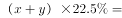，化简得：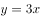。蓝桶水加入后，根据，可列式：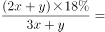。

故正确答案为B。

---

## 第 8 题　qid 2307721 · 数学运算

上午8点甲、乙二人同时从A地出发前往B地，甲骑电动车，乙步行。40分钟后甲到达B地，此时乙距离两地的中点处还需走10分钟，于是乙停下来等待甲返回接他。若甲立刻原速返回，当甲到达乙处接上乙立刻前往B地，速度保持不变。则甲、乙到达B地时甲共骑行（  ）分钟。

- **A**. 88　✅
- **B**. 44
- **C**. 80
- **D**. 94

**答案**：A

**官方解析**

如图，设A到B路程为，由“此时乙距离两地中点处还需走10分钟”可知，乙走一半路程需要分钟；故而40分钟时，乙走的路程为：；则 “甲从A到B，再返回接乙到B”这全过程一共走了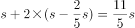，根据题干可知甲行驶s用时为40分钟，则题干所求为：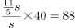分钟。

故正确答案为A。

---

## 第 9 题　qid 2307725 · 数学运算

公司的门卫岗与消防岗均采用轮班制，门卫岗每隔两天值一天班，消防岗每4天值一天班，节假日无休息。小张是门卫，小王是消防员，则小张和小王在2019年中一个自然月里同时上班最多有（  ）天。

- **A**. 8
- **B**. 4
- **C**. 3　✅
- **D**. 2

**答案**：C

**官方解析**

门卫岗周期为3天，消防岗周期为4天，二者同时上班的周期为天，自然月最长31天，如果二者在自然月1号同时上班，则本月13日、25日他们同时上班，即一个自然月里同时上班最多有3天。

故正确答案为C。

---

## 第 10 题　qid 2307733 · 数学运算

如图，已知一个四边形中边AD长为3cm，边BC长7cm；∠DAB＝135°，∠ABC=∠ADC=90°那么这个四边形的面积是（  ）。

- **A**. 
49/4

- **B**. 
21

- **C**. 
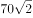

- **D**. 
20
　✅

**答案**：D

**官方解析**

如图，作BA与CD延长线交于E点。由于，则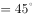，由于，则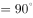，从而为等腰直角三角形，进一步可知为等腰直角三角形，则所求四边形面积。

故正确答案为D。

---
