# 2018年重庆市公务员录用考试《行测》题（下半年）

> 数量关系 · 10 题 · 重庆 2018

## 第 1 题　qid 2402028 · 数学运算

若某单位从5位优秀毕业生甲、乙、丙、丁、戊中录用三人，这五人被录用的机会均等，则甲乙中至少一人被录用的概率为：

- **A**. 

- **B**. 

- **C**. 

- **D**. 

　✅

**答案**：D

**官方解析**

方法一：从5位优秀毕业生中录用3人，总情况数为种。

满足的条件为“甲乙中至少一人被录用”，分类讨论：

①甲被录用，乙未被录用，在丙丁戊中选2人录用，情况数为种；

②乙被录用，甲未被录用，在丙丁戊中选2人录用，情况数为种；

③甲乙都被录用，在丙丁戊中选1人录用，情况数为种。

因此满足条件的情况数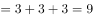种。

所以本题概率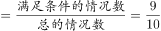。

方法二：从5位优秀毕业生中录用3人，总情况数为种。

“甲乙中至少一人被录用”的反面情况为“甲乙中没有人被录用”，即丙丁戊三人被录用，情况只有1种，所以本题概率。

故正确答案为D。

---

## 第 2 题　qid 2402029 · 数学运算

甲、乙两队进行一场排球比赛，根据以往经验，单局比赛甲队胜乙队的概率均为0.6，本场比赛采用五局三胜制，即先胜三局的队获胜，且比赛到此结束。如果各局比赛相互间没有影响，现已知前两局双方战成平手，则甲队获得这场比赛胜利的概率为：

- **A**. 
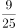

- **B**. 
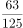

- **C**. 

　✅
- **D**. 
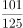

**答案**：C

**官方解析**

前两局甲乙两队战成平手，即分别各胜一局，若甲队获得比赛胜利，则需要在后三局比赛中胜两局，分类如下表:

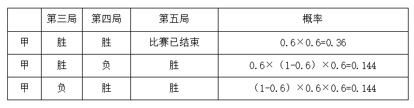

分类相加，甲队获得比赛胜利的概率。

故正确答案为C。

---

## 第 3 题　qid 2402030 · 数学运算

李强与张龙创办了一家微型企业，企业股份归两人所有，且两人所占股份比为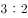。后来，王伟也决定加盟，他花28000元从李强和张龙那取得了的股份。若此时，张龙的股份为王伟的，那么李强从王伟那获得了多少元的股金？

- **A**. 12600
- **B**. 16800
- **C**. 18600
- **D**. 22400　✅

**答案**：D

**官方解析**

设企业的总股份为，根据题干信息可得：

由“他花28000元从李强和张龙那取得了50%的股份”可得：，解得。

则李强获得股金（卖出的股份）为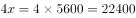元。

故正确答案为D。

---

## 第 4 题　qid 2402031 · 数学运算

某跑步团的3位队员A、B、C在一环形湿地公园晨跑，三人同时从同一地点出发，A、B按逆时针奔跑，C按顺时针方向奔跑。A、B两人晨跑速度之比为，且他俩的速度（以米/分计）均为整数并能被5整除，其中B的速度小于70米/分，C在出发20分钟后与A相遇，2分钟之后又遇到了B。那么，这个湿地公园周长为：

- **A**. 3300米　✅
- **B**. 3360米
- **C**. 3500米
- **D**. 3900米

**答案**：A

**官方解析**

由题干信息可得，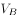是13的倍数，也是5的倍数，则为65的倍数，而且由于为整数且小于70米/分，所以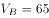米/分。由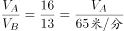，得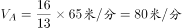。根据相遇公式：，可得：，代入数据得：，解得。湿地公园周长米。

故正确答案为A。

---

## 第 5 题　qid 2402032 · 数学运算

某企业的员工参加了一项需缴纳170元培训费的培训。同时，该企业允许非内部员工参加培训，但其不能享受员工优惠价。参训的非内部员工，如果是男生需交350元；如果是女生需交300元。结果，共有50人参加培训，整个培训收到的费用总额为10000元。由此可知，有多少个不是内部员工的女生参加了培训？

- **A**. 4
- **B**. 5
- **C**. 6　✅
- **D**. 7

**答案**：C

**官方解析**

设企业的员工的人数为，非内部员工男生的人数为, 非内部员工女生的人数为。根据人数和费用总额列方程：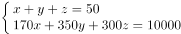,消得：，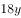与150均为3的倍数，所以为3的倍数，即非内部员工女生的人数为3的倍数，观察选项，只有C项符合要求。

故正确答案为C。

---

## 第 6 题　qid 2402033 · 数学运算

某季度初期，某贸易公司库存相同数量的T恤、牛仔裤和衬衣。该季度结束时，T恤、牛仔裤、衬衣三种产品的销售比例是，其中牛仔裤还有库存480件，T恤库存数量恰好为衬衣库存数量的2倍，则该季度该贸易公司共销售出多少件衬衣？

- **A**. 160
- **B**. 320
- **C**. 640　✅
- **D**. 960

**答案**：C

**官方解析**

根据已知条件三种产品的销售比例是，设T恤、牛仔裤、衬衣三种产品的销售量为、、；又“T恤库存数量恰好为衬衣库存数量的2倍”，设衬衣库存数量为，则T恤库存数量为。可列表如下：

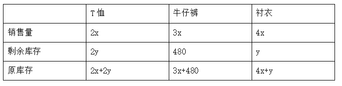

由“三种产品原库存相同”可得，，整理得。再根据牛仔裤原库存=衬衣原库存，得，整理得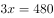，解得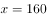。则该季度该贸易公司共销售出衬衣件。

故正确答案为C。

---

## 第 7 题　qid 2402034 · 数学运算

如下图所示，一张边长8厘米的正方形纸片先进行对折，再沿着两边的中点连线剪掉一个角后，则剩下部分展开面积是多少平方厘米？ 

- **A**. 16
- **B**. 32
- **C**. 36
- **D**. 48　✅

**答案**：D

**官方解析**

根据题意，沿着两边的中点连线剪掉一个角后，则剪掉的角展开后是一个边长为的正方形。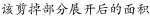平方厘米。则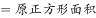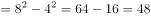平方厘米。

故正确答案为D。

---

## 第 8 题　qid 2402035 · 数学运算

 某超市采购了一批水果，第一天销售出1箱，此后每一天比前一天多销售1箱，若干天后，超市剩余水果不够该天销售时，则该天起每天销售2箱，由此可知，该仓库库存水果箱数与天数对应关系曲线最可能是： 

- **A**. A
- **B**. B
- **C**. C
- **D**. D　✅

**答案**：D

**官方解析**

根据“此后每一天比前一天多销售1箱”可以确定是等差数列。设按照等差数列销售了天，总销售量就可以用等差数列求和公式表示，其中，，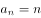，即总销售量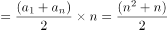。那么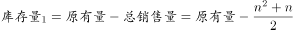，此为二次函数，其中原有量是常数，且的系数为负，这样库存量开始时为一个开口向下的抛物线，排除B、C项。

若干天后，超市剩余水果不够该天销售时，则该天起每天销售2箱，设这样销售了天，销售量为箱，此时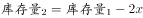，此为一次函数，是常数，这是一条直线。

综上，符合的图像是D项。

故正确答案为D。

---

## 第 9 题　qid 2402036 · 数学运算

如下图所示，一个小正方体的表面积为64平方厘米，则几何物体甲垒放成几何物体乙后，物体甲与物体乙表面积之比为： 

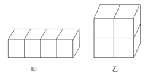

- **A**. 

- **B**. 

- **C**. 

- **D**. 

　✅

**答案**：D

**官方解析**

由于物体甲和乙都是由小正方体拼成，每个小面是相同的，要计算物体甲和乙的表面积之比，只需计算甲和乙表面的小面数量之比。物体甲的小面数量个，物体乙的小面数量个，则物体甲与物体乙表面积之比为。

故正确答案为D。

---

## 第 10 题　qid 2402037 · 数学运算

一群有若干人的寻宝团队，在一小岛上发现一处宝藏，经商议按如下规则分配宝藏：首先，第1人分得1百万和剩余部分的；其次，第2人分得2百万和剩余部分的；接下去第3人分得3百万和剩余部分的，依次类推，最后剩余的部分全给了最后一个人。结果每人都得到了同样价值的宝藏。那么，该寻宝团队共有多少人？

- **A**. 5　✅
- **B**. 6
- **C**. 7
- **D**. 8

**答案**：A

**官方解析**

设该处宝藏共有百万，由“第1人分得1百万和剩余部分的”得，第1个人分得的数量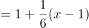百万元；由“第2人分得2百万和剩余部分的”得，第2个人分得的数量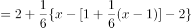百万元。根据“每人都得到了同样价值的宝藏”得，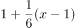，两边同乘以6得，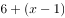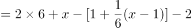，整理得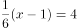，解得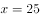。每人分得的宝藏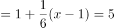百万。那么，该寻宝团队共有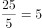人。

故正确答案为A。

---
