# 2018年重庆市选调优秀大学生到基层工作考试《行测》题

> 数量关系 · 13 题 · 选调 2018

## 第 1 题　qid 4695864 · 数学运算

7，5，3，-1，-7，-17，（    ）

- **A**. -19
- **B**. -24
- **C**. -35
- **D**. -33　✅

**答案**：D

**官方解析**

数列无明显规律，优先考虑多级数列。前项减后项可得新数列：2，2，4，6，10，观察发现新数列为简单递推和数列，则下一项为6+10=16，故所求项为-17-16=-33。
故正确答案为D。

---

## 第 2 题　qid 2262548 · 数学运算

6，14，18，（    ），28，36

- **A**. 19
- **B**. 22
- **C**. 25
- **D**. 26　✅

**答案**：D

**官方解析**

两两分组，（6，14）、（18，（    ））、（28，36），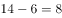，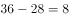，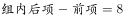，则所求项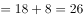。

故正确答案为D。

---

## 第 3 题　qid 2005246 · 数学运算

1/2，1，1，（ ），9/11，11/13

- **A**. 2
- **B**. 3
- **C**. 1　✅
- **D**. 7/9

**答案**：C

**官方解析**

第一步：分析题干
题干数列是一个分数数列，所以可以考虑将原数列拆分成分子数列和分母数列分开寻找规律。
第二步：寻找规律
观察题干数列发现有相同的两项均为1，可以考虑将该数列反约分得到：1/2，3/3，5/5，（），9/11，11/13；所以分子组成的数列是1，3，5，？，9，是公差为2的等差数列，则分子数列中？项表示的数为5+2=7；分母组成的数列是2，3，5，？，11，13，是质数数列，则分母数列中？项表示的数为7。
第三步：得出答案
题干括号所求数字分子为7，分母为7，所以题干括号所求数字应为7/7=1。
第四步：再次标注答案
故正确答案为C。

---

## 第 4 题　qid 4695873 · 数学运算

嘉陵江是长江的支流，嘉陵江的水流速度为每小时3千米，长江的水流速度为每小时4千米，一艘船上午8点钟从起点出发，沿嘉陵江顺水航行2小时，行驶了56千米达到长江，在长江上还要逆水航行126千米才能到达终点。这艘船到达终点的时间是（    ）点钟。

- **A**. 13
- **B**. 14
- **C**. 15
- **D**. 16　✅

**答案**：D

**官方解析**

设船速为x千米/时，则在嘉陵江顺水航行的速度为（x+3）千米/时，在长江逆水航行的速度为（x-4）千米/时。沿嘉陵江顺水航行2小时，行驶了56千米，可得：（x+3）×2=56，解得x=25。在长江上逆水航行126千米还需小时。则整个航行过程需要2+6=8小时，结合出发时间为上午8点钟，故这艘船到达终点的时间是16点钟。

故正确答案为D。

---

## 第 5 题　qid 4695881 · 数学运算

一社区居委会为丰富居民的业余生活，专门设立了多个俱乐部邀请居民自愿参加。统计结果如下：22人参加了棋类俱乐部、27人参加了音乐俱乐部、50人参加了戏剧俱乐部、10人参加了棋类和音乐俱乐部、14人参加了音乐和戏剧俱乐部、10人参加了戏剧和棋类俱乐部、8人参加了这三个俱乐部。那么参与活动的居民人数是（    ）。

- **A**. 57
- **B**. 68
- **C**. 73　✅
- **D**. 84

**答案**：C

**官方解析**

根据题意，设参与活动的居民人数是x人，由三集合容斥原理标准型公式：，可得22+27+50-10-14-10+8=x-0，解得x=73。

故正确答案为C。

---

## 第 6 题　qid 4695904 · 数学运算

某大学一高年级学生准备在新生报到期间勤工俭学，从批发市场购进80件衬衫，购进价每件40元，起初以每件68.5元的价格售出60件，为了促销，他准备把剩下的衬衫按售价不变但以“买一赠一”的方式全部售出，那么售完该批衬衫一共赚得（    ）元。

- **A**. 4795
- **B**. 1995
- **C**. 1595　✅
- **D**. 1853

**答案**：C

**官方解析**

根据题意，“从批发市场购进80件衬衫，购进价每件40元”，则购入衬衫共花费80×40=3200元。未促销时“以每件68.5元的价格售出60件”，销售额为68.5×60=4110元，还剩80-60=20件未卖出，此时进行“买一赠一”促销活动，销售额为元。故售完这批衬衫一共赚得4110+685-3200=1595元。

故正确答案为C。

---

## 第 7 题　qid 4695912 · 数学运算

某加油站每次只能对一辆车进行加油，加满一辆大卡车的油需要7分钟，加满一辆客车的油需要5分钟，加满一辆小汽车的油需要3分钟。现有一辆大卡车、一辆客车、一辆小汽车同时来到加油站加油，合理安排加油顺序，使三辆车总的加油和等待时间最短共需要（    ）分钟。

- **A**. 29
- **B**. 26　✅
- **C**. 21
- **D**. 32

**答案**：B

**官方解析**

三辆车的加油时间固定，要想使总时间最短，那么等待时间要尽可能短。要想使等待时间最短，应使加油时间短的在前，加油时间长的在后，则顺序为小汽车、客车、大卡车。此时三辆车总的加油和等待时间最短，为3+（3+5）+（3+5+7）=26分钟。
故正确答案为B。

---

## 第 8 题　qid 4695915 · 数学运算

某公路的一侧从一端到另一端每隔3米植一棵树，一共挖了49个坑。现在要改成每隔4米植一棵树，那么可以不重新挖的坑共有（    ）个。

- **A**. 8
- **B**. 9
- **C**. 11
- **D**. 13　✅

**答案**：D

**官方解析**

两端植树的棵树。根据题意，间隔长度为3米，共挖49个坑，即可种植49棵树，则公路的长度为（49-1）×3=144米。现间隔改为4米，两次间隔3和4的最小公倍数为12，根据两端植树不移动棵数，可得不需要重新挖的坑有个。

故正确答案为D。

---

## 第 9 题　qid 16677 · 数学运算

把一根线绳对折、对折、再对折，然后从对折后线绳的中间剪开，这根线绳被剪成了几小段：

- **A**. 6
- **B**. 7
- **C**. 8
- **D**. 9　✅

**答案**：D

**官方解析**

对折3次，剪1刀，绳子变成。

剪绳问题：若初始为1根绳子，则绳子段数为切口数加1。一根绳子连续对折次，剪刀，则绳子被剪成段。

故正确答案为D。

---

## 第 10 题　qid 4695923 · 数学运算

某射击运动员每次射击命中10环的概率是75%，5次射击有4次命中10环的概率是（    ）。

- **A**. 31.64%
- **B**. 39.55%　✅
- **C**. 43.66%
- **D**. 50%

**答案**：B

**官方解析**

根据题意，5次射击有4次命中10环，则有1次没有命中，命中10环的概率为75%，没有命中10环的概率为1-75%=25%。故满足题意的概率为：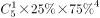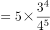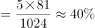，与B项最接近。

故正确答案为B。

---

## 第 11 题　qid 4695925 · 数学运算

某地公交车站顶棚长4米，宽2米，已知该顶棚材料能承受的最大压强为800帕。时下该地正值大雪天气，那么，顶棚上的积雪厚度不超过（    ）厘米，才不会导致顶棚坍塌。（假定积雪密度与水相同）

- **A**. 1
- **B**. 8　✅
- **C**. 10
- **D**. 80

**答案**：B

**官方解析**

设顶棚上的积雪厚度为h，质量为m，密度为，顶棚面积为S，由压强公式：可知，顶棚承受的压强，因为积雪的重力，所以顶棚承受的压强，将顶棚材料能承受的最大压强800帕、雪的密度（等于水的密度）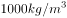、重力加速度g取代入该公式，可得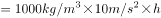，即h=0.08m=8cm，因此顶棚上的积雪厚度不能超过8厘米。

故正确答案为B。

---

## 第 12 题　qid 4695928 · 数学运算

一瓶碳酸饮料，一次喝掉饮料后，连瓶共重600克。如果喝掉剩余饮料的后，连瓶共重500克。那么，空瓶子重（    ）克。

- **A**. 100
- **B**. 200
- **C**. 350
- **D**. 400　✅

**答案**：D

**官方解析**

根据题意，设整瓶饮料的重量为3x克，空瓶子重量为y克。在喝掉饮料的后，瓶内饮料还剩克，连瓶共重600克，可得：2x+y=600；继续喝掉剩余饮料的后，瓶内饮料还剩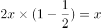克，连瓶共重500克，可得：x+y=500。联立方程，解得x=100，y=400，则空瓶子的重量为400克。

故正确答案为D。

---

## 第 13 题　qid 4695935 · 数学运算

一个六边形点阵，它中心的一个点算作第一层，从内往外依次为第二层，第三层······那么第五十层的点的个数是（    ）。

- **A**. 294　✅
- **B**. 300
- **C**. 306
- **D**. 312

**答案**：A

**官方解析**

根据题干图形，可梳理出点阵层数n与点的个数m的具体关系为：

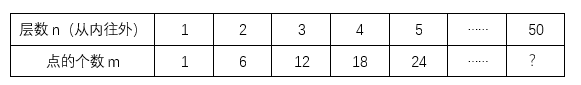

分析可得，除第一层外，其他层点的个数m=6（n-1），则第五十层的点的个数为6×（50-1）=294个。

故正确答案为A。

---
