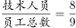

# 2018年黑龙江省公务员考试（乡镇）题（网友回忆版）

> 数量关系 · 15 题 · 黑龙江 2018

## 第 1 题　qid 2188497 · 数学运算

一条笔直的林荫道两旁种植着梧桐树，同侧道路每两棵梧桐树间距50米。林某每天早上七点半穿过林荫道步行去上班，工作地点恰好在林荫道尽头。经测试，他每分钟步行70步，每步大约50厘米，每天早上八点准时到达工作地点。那么，这条林荫道两旁栽种的梧桐树共有：

- **A**. 44棵　✅
- **B**. 42棵
- **C**. 22棵
- **D**. 21棵

**答案**：A

**官方解析**

由“每分钟步行70步，每步大约50厘米”可得，每分钟可步行厘米，即35米/分钟。由“林某每天早上七点半出发，八点准时到达工作地点”可得，林某步行时间30分钟。由此可以计算出林某步行的路程。根据每两棵梧桐树间距50米，代入线形植树公式棵数，并考虑两旁种树的棵数应乘以2，故这条林荫道两旁栽种的梧桐树共棵。

故正确答案为A。

---

## 第 2 题　qid 2188545 · 数学运算

A、B两地间有三种类型列车运行，其中高速铁路动车组列车每天6车次，普通动车组列车每天5车次，快速旅客列车每天4车次。甲、乙两人要同一天从A地出发前往B地。假设他们买票前没有互通信息，而且火车票票源充足，问他们买到同一趟列车车票的概率有多大？

- **A**. 
小于
　✅
- **B**. 
到之间

- **C**. 
到之间

- **D**. 
到之间

**答案**：A

**官方解析**

方法一：，由题意从A到B的买到的车票种类数种，则。甲乙都买同一趟列车共有15种情况，因此他们买到同一趟列车车票的概率。

方法二：从A到B共有6+5+4=15种选择，其中任意一人从A到B有15种选择，另外一人与该人买到同一趟列车车票，即只有一种情况，因此满足条件的概率为。

故正确答案为A。

---

## 第 3 题　qid 2187811 · 数学运算

装修工人小郑用相同的长方形瓷砖装饰正方形墙面，每10块瓷砖组成一个如下图所示的图案。小郑用这个图案恰好铺满该墙面，那么，他最少用了多少块瓷砖？

- **A**. 250
- **B**. 300　✅
- **C**. 400
- **D**. 450

**答案**：B

**官方解析**

设长方形瓷砖宽为厘米，由图示可得： ，解得：，。

由图所示，图案的长为厘米。要用长为90厘米、宽为75厘米的长方形图案拼成正方形墙面，若要使用的瓷砖最少，则正方形的边长应该为90和75的最小公倍数450厘米。那么长需要5个，宽需要6个，这样共需要个该图案，每个图案10块瓷砖，则他最少用了块瓷砖。

故正确答案为B。

---

## 第 4 题　qid 2188551 · 数学运算

某超市下午3点开始对其新上架的洗发液进行半价促销，并规定之后每次整点时，洗发液的价格都会上调其原价的，直至恢复原价。张大妈4点15分在超市抢购了2瓶，6点半又去超市买了2瓶。张大妈两次购买洗发液共花费48元，问与原价相比共节省了多少元？

- **A**. 12
- **B**. 24
- **C**. 32　✅
- **D**. 48

**答案**：C

**官方解析**

根据题意，设洗发液原价为100a元，则有：

张大妈两次抢购的总价，解得；原价购买4瓶的总价元，则与原价相比共节省了元。

故正确答案为C。

---

## 第 5 题　qid 2188556 · 数学运算

从A地到B地为上坡路。自行车选手从A地出发按A-B-A-B的路线行进，全程平均速度为从B地出发，按B-A-B-A的路线行进的全程平均速度的，如自行车选手在上坡路与下坡路上分别以固定速度匀速骑行，问他上坡的速度是下坡速度的：

- **A**. 

　✅
- **B**. 

- **C**. 

- **D**. 

**答案**：A

**官方解析**

假设上坡所用时间为x，下坡所用时间为y，从A地出发按A-B-A-B的路线行进所用时间为，从B地出发按B-A-B-A的路线行进所用时间为。总路程相同，速度与时间成反比，已知前者全程平均速度是后者的，则，则。由于上坡和下坡路程相同，速度和时间成反比，。

故正确答案为A。

---

## 第 6 题　qid 2189321 · 数学运算

如下图所示，五个圆相连，现在用三种不同颜色分别给每个圆涂色，要求相连接的两个圆不能涂同种颜色，共有不同的涂色方法：

- **A**. 36种　✅
- **B**. 72种
- **C**. 144种
- **D**. 32种

**答案**：A

**官方解析**

从P点开始逐个涂色，P点有3种颜色可选，则T点有2种颜色可选，根据S点和Q点的颜色是否相同分为两种情况：

第一种情况，S点和Q点的颜色相同，SQ的颜色选择情况有2种，R点也有2种颜色可选，情况数为；

第二种情况，S点和Q点的颜色不同，SQ的颜色选择情况有种，R点只有1种颜色可选，情况数为。

则总情况数为。

故正确答案为A。

---

## 第 7 题　qid 2195776 · 数学运算

某公司技术人员占员工总数的8/9，年底公司共有7人获得优秀员工奖励，其中获奖的技术人员占公司员工总数的1/6，问获奖的非技术人员占非技术人员总数的（  ）

- **A**. 1/2
- **B**. 1/4　✅
- **C**. 1/6
- **D**. 1/9

**答案**：B

**官方解析**

根据题意，，，则员工总数应是9和6的公倍数，即可能为18人、36人……

若总人数为18人，获奖技术人员数为人，获奖非技术人员数为人，而非技术人员总数为人，低于获奖非技术人员数，矛盾。

若总人数为36人，获奖技术人员数为人，获奖非技术人员数为人，非技术人员数为人，此时获奖的非技术人员占非技术人员总数的，B选项满足。

故正确答案为B。

---

## 第 8 题　qid 2188555 · 数学运算

若干名天使投资人对某个需求资金120万的创业项目表达出投资意向，并计划每人以相同的金额投资该项目。但实际投资时有2人退出，剩下的每人需要多投资10万元才能满足该项目的资金需求，问实际投资这一项目的有多少人？

- **A**. 3
- **B**. 4　✅
- **C**. 6
- **D**. 8

**答案**：B

**官方解析**

设实际投资这一项目的有x人，则计划投资的有人，根据题意可得，，解得（分式方程求解过程计算量大，建议结合选项代入）。

故正确答案为B。

---

## 第 9 题　qid 2187755 · 数学运算

一直升机在海上救援行动中搜索到遇险者方位后通知快艇，快艇立即朝遇险者直线驶去。此时，直升机距离海平面的垂直高度200米，从机上看，遇险者在正南方向，俯角（朝下看时视线与水平面的夹角）为，快艇在正东方向，俯角为。若忽略当时风向、潮流等其它因素，且假定遇险者位置不变，则快艇以60千米/小时的速度匀速前进需要多长时间才能到达遇险者的位置？

- **A**. 21秒
- **B**. 22秒
- **C**. 23秒
- **D**. 24秒　✅

**答案**：D

**官方解析**

因为直升机距离海平面的垂直高度200米，在机上看遇险者俯角为，所以直升机和遇险者的水平距离为米；同理，直升机和快艇的水平距离为米。如图所示，直升机在O点正上方200米A点处，遇险者在正南方向的B点，快艇在正东方向的C点，其中米，米，所以米。快艇的速度为60千米/小时=米/秒，所以快艇匀速前进到达遇险者的位置所需要的时间是秒。

故正确答案为D。

---

## 第 10 题　qid 2187777 · 数学运算

联欢会上，有24人吃冰激凌、30人吃蛋糕、38人吃水果，其中既吃冰激凌又吃蛋糕的有12人，既吃冰激凌又吃水果的有16人，既吃蛋糕又吃水果的有18人，三样都吃的则有6人。假设所有人都吃了东西，那么只吃一样东西的人数是多少？

- **A**. 12
- **B**. 18　✅
- **C**. 24
- **D**. 32

**答案**：B

**官方解析**

如图所示，共有24人吃冰激凌，其中有12人吃了蛋糕，16人吃了水果，既吃了蛋糕又吃了水果的有6人，则只吃了冰激凌的人数为人；同理，只吃了蛋糕的人数为人；只吃了水果的人数为人，则只吃一样东西的人数为人。

故正确答案为B。

---

## 第 11 题　qid 2187721 · 数学运算

某社团组织周末自驾游，集合后发现小王和小李未到。由于每辆小车限坐5人，按照现有车辆恰有1人坐不上车。为难之际，小王和小李分别开车赶到，于是所有人都坐上车，且每辆车人数均相同。那么，参加本次自驾游的小车数为：

- **A**. 9
- **B**. 8
- **C**. 7　✅
- **D**. 6

**答案**：C

**官方解析**

方法一：设参加本次自驾游的小车总数（包含小王和小李的车）为辆，根据题意可得，包含小王和小李在内的人。因为小王和小李开车赶到后每辆车人数均相同，所以总人数能被整除，是的倍数，所以7应是的倍数，只有C项满足条件。

方法二：代入排除法。

代入A选项，若参加本次自驾游的小车数为9辆，则人，平均每辆车可坐人，不是整数，错误；

代入B选项，若参加本次自驾游的小车数为8辆，则人，平均每辆车可坐人，不是整数，错误；

代入C选项，若参加本次自驾游的小车数为7辆，则人，平均每辆车可坐人，符合条件，正确；

代入D选项，若参加本次自驾游的小车数为6辆，则人，平均每辆车可坐人，不是整数，错误。

故正确答案为C。

---

## 第 12 题　qid 2188498 · 数学运算

甲、乙、丙三个网站定期更新，甲网站每隔48小时，乙网站每隔72小时，丙网站每隔96小时更新一次内容。问在一个星期内至多有几天，三个网站中至少有一个更新内容？

- **A**. 4天
- **B**. 5天
- **C**. 6天
- **D**. 7天　✅

**答案**：D

**官方解析**

由题意可知，甲每天更新一次，乙每天更新一次，丙每天更新一次，要想有更新的天数尽可能多，则三个网站在一周的更新天数应尽可能多，且尽量不重复。安排甲从周一开始更新，则甲在周一、周三、周五、周日均更新一次，此时乙在周一、周四、周日更新，丙分别在周二与周六更新，情况最优，一周内每天均有网站更新。

注：每隔48小时就是每48小时，不需要额外加1小时。

故正确答案为D。

---

## 第 13 题　qid 2188447 · 数学运算

甲、乙、丙三所学校的学生被安排在周一至周五参观某革命纪念馆。纪念馆每天最多只能安排一所学校，其中甲学校连续参观两天，其余学校均只参观一天，那么共有多少种安排方法？

- **A**. 12种
- **B**. 24种　✅
- **C**. 36种
- **D**. 60种

**答案**：B

**官方解析**

由于甲学校连续参观两天，故先安排甲，甲参加的时间可能为“周一和周二、周二和周三、周三和周四、周四和周五”共4种情况。甲安排好后，工作日还差3天未安排，故在其中选择2天安排乙和丙，情况数为种。故总的情况数种。

故正确答案为B。

---

## 第 14 题　qid 2188571 · 数学运算

10个相同的盒子中分别装有1～10个球，任意两个盒子中的球数都不相同。小李分三次每次取出若干个盒子，每次取出的盒子中的球数之和都是上一次的3倍，且最后剩下1个盒子。问剩下的盒子中有多少个球？

- **A**. 9
- **B**. 6
- **C**. 5
- **D**. 3　✅

**答案**：D

**官方解析**

由题意可得，共有小球个数为个，假设第一次取出小球个数为x，剩下盒子中球数为y，则第二次与第三次取出小球个数分别为3x，9x，前三次取出小球总个数为，则，是13的倍数，只有D项满足。

故正确答案为D。

---

## 第 15 题　qid 2187825 · 数学运算

小庄要制作一个工业模具。他在一个边长4厘米的正方体上表面正中心位置向下挖掉一个直径2厘米、高2厘米的圆柱体，接着再向下挖掉一个直径1厘米、高1厘米的小圆柱体（如右图所示）。那么，该模具的表面积约为多少平方厘米？

- **A**. 82.8
- **B**. 108.6
- **C**. 111.7　✅
- **D**. 114.8

**答案**：C

**官方解析**

边长4厘米的正方体的表面积为平方厘米。中心位置一个直径2厘米、高2厘米的圆柱体平方厘米，一个直径1厘米、高1厘米的小圆柱体平方厘米。那么，该模具的表面积约为平方厘米。

注：挖掉的大小圆柱体底面的面积，可以叠加还原成最上层的表面，故不需要单独计算圆柱体底面积，只需要计算侧面积即可。

故正确答案为C。

---
