# 2018年黑龙江省公务员考试（公检法）题（网友回忆版）

> 数量关系 · 15 题 · 黑龙江 2018

## 第 1 题　qid 2188497 · 数学运算

一条笔直的林荫道两旁种植着梧桐树，同侧道路每两棵梧桐树间距50米。林某每天早上七点半穿过林荫道步行去上班，工作地点恰好在林荫道尽头。经测试，他每分钟步行70步，每步大约50厘米，每天早上八点准时到达工作地点。那么，这条林荫道两旁栽种的梧桐树共有：

- **A**. 44棵　✅
- **B**. 42棵
- **C**. 22棵
- **D**. 21棵

**答案**：A

**官方解析**

由“每分钟步行70步，每步大约50厘米”可得，每分钟可步行厘米，即35米/分钟。由“林某每天早上七点半出发，八点准时到达工作地点”可得，林某步行时间30分钟。由此可以计算出林某步行的路程。根据每两棵梧桐树间距50米，代入线形植树公式棵数，并考虑两旁种树的棵数应乘以2，故这条林荫道两旁栽种的梧桐树共棵。

故正确答案为A。

---

## 第 2 题　qid 2188552 · 数学运算

6月1日当天，小张用去其当月手机上网套餐流量的，2日用去8MB，这时用去的流量和套餐内剩下的流量之比为1:3。如小张从3日开始每天使用6MB流量，问小张6月使用的套餐外手机流量为多少MB？

- **A**. 80
- **B**. 96
- **C**. 108　✅
- **D**. 128

**答案**：C

**官方解析**

根据题意，设当月上网套餐流量为x MB，则该月流量如下表：

由“这时用去的流量和套餐内剩下的流量之比为1:3”可得，解得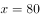。那么，剩下套餐内流量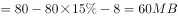。又“小张从3日开始每天使用6MB流量”，可计算出6月3日-30日共需流量，因此，小张6月使用的套餐外手机流量为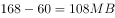。

故正确答案为C。

---

## 第 3 题　qid 2188550 · 数学运算

甲乙两车早上分别同时从A、B两地出发驶向对方所在城市，在分别到达对方城市并各自花费1小时卸货后，立刻出发以原速返回出发地。甲车的速度为60千米/小时，乙车的速度为40千米/小时，两地之间相距480千米。问两车第二次相遇距离两车早上出发经过了多少个小时？

- **A**. 13.4
- **B**. 14.4
- **C**. 15.4　✅
- **D**. 16.4

**答案**：C

**官方解析**

第二次相遇存在两种可能，即在端点处或中间某一位置。根据题意，甲从A地到B地需要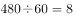小时，卸货花费1小时，回到A地再花费8小时，共用时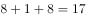小时；同理，乙从B地到A地需要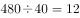小时，卸货花费1小时，共用时小时，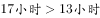，则两车第二次相遇一定在A、B两地之间（非端点）。结合两端出发多次相遇公式：，第二次相遇时：，解得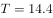；由于两车在中间各自花费1小时卸货，则两车第二次相遇距离两车早上出发经过了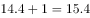小时。

故正确答案为C。

---

## 第 4 题　qid 2188556 · 数学运算

从A地到B地为上坡路。自行车选手从A地出发按A-B-A-B的路线行进，全程平均速度为从B地出发，按B-A-B-A的路线行进的全程平均速度的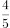，如自行车选手在上坡路与下坡路上分别以固定速度匀速骑行，问他上坡的速度是下坡速度的：

- **A**. 

　✅
- **B**. 

- **C**. 

- **D**. 

**答案**：A

**官方解析**

假设上坡所用时间为x，下坡所用时间为y，从A地出发按A-B-A-B的路线行进所用时间为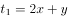，从B地出发按B-A-B-A的路线行进所用时间为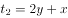。总路程相同，速度与时间成反比，已知前者全程平均速度是后者的，则，则。由于上坡和下坡路程相同，速度和时间成反比，。

故正确答案为A。

---

## 第 5 题　qid 2188555 · 数学运算

若干名天使投资人对某个需求资金120万的创业项目表达出投资意向，并计划每人以相同的金额投资该项目。但实际投资时有2人退出，剩下的每人需要多投资10万元才能满足该项目的资金需求，问实际投资这一项目的有多少人？

- **A**. 3
- **B**. 4　✅
- **C**. 6
- **D**. 8

**答案**：B

**官方解析**

设实际投资这一项目的有x人，则计划投资的有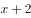人，根据题意可得，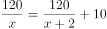，解得（分式方程求解过程计算量大，建议结合选项代入）。

故正确答案为B。

---

## 第 6 题　qid 2189321 · 数学运算

如下图所示，五个圆相连，现在用三种不同颜色分别给每个圆涂色，要求相连接的两个圆不能涂同种颜色，共有不同的涂色方法：

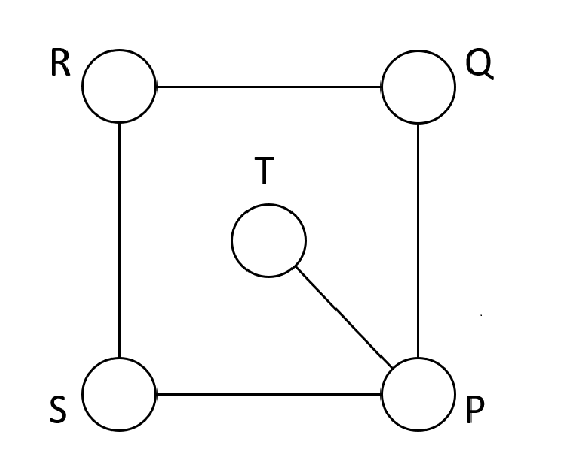

- **A**. 36种　✅
- **B**. 72种
- **C**. 144种
- **D**. 32种

**答案**：A

**官方解析**

从P点开始逐个涂色，P点有3种颜色可选，则T点有2种颜色可选，根据S点和Q点的颜色是否相同分为两种情况：

第一种情况，S点和Q点的颜色相同，SQ的颜色选择情况有2种，R点也有2种颜色可选，情况数为；

第二种情况，S点和Q点的颜色不同，SQ的颜色选择情况有种，R点只有1种颜色可选，情况数为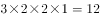。

则总情况数为。

故正确答案为A。

---

## 第 7 题　qid 2187772 · 数学运算

某试验室通过测评Ⅰ和Ⅱ来核定产品的等级：两项测评都不合格的为次品，仅一项测评合格的为中品，两项测评都合格的为优品。某批产品只有测评Ⅰ合格的产品数是优品数的2倍，测评Ⅰ合格和测评Ⅱ合格的产品数之比为。若该批产品次品率为，则该批产品的优品率为：

- **A**. 

- **B**. 

- **C**. 

　✅
- **D**. 

**答案**：C

**官方解析**

假设这批产品的优品数为，则只有测评Ⅰ合格的产品数为，测评Ⅰ合格的全部产品数为，测评Ⅱ合格的产品数为。根据两集合容斥原理公式：，则这批产品非次品数量为，在总数中占比为，则产品总数为，则优品率为。

故正确答案为C。

---

## 第 8 题　qid 2188447 · 数学运算

甲、乙、丙三所学校的学生被安排在周一至周五参观某革命纪念馆。纪念馆每天最多只能安排一所学校，其中甲学校连续参观两天，其余学校均只参观一天，那么共有多少种安排方法？

- **A**. 12种
- **B**. 24种　✅
- **C**. 36种
- **D**. 60种

**答案**：B

**官方解析**

由于甲学校连续参观两天，故先安排甲，甲参加的时间可能为“周一和周二、周二和周三、周三和周四、周四和周五”共4种情况。甲安排好后，工作日还差3天未安排，故在其中选择2天安排乙和丙，情况数为种。故总的情况数种。

故正确答案为B。

---

## 第 9 题　qid 2187724 · 数学运算

某苗木公司准备出售一批苗木，如果每株以4元出售，可卖出20万株，若苗木单价每提高0.4元，就会少卖10000株。问在最佳定价的情况下，该公司最大收入是多少万元？

- **A**. 60
- **B**. 80
- **C**. 90　✅
- **D**. 100

**答案**：C

**官方解析**

假设在原价基础上提价次，则共提高元，少卖了株，即万株。根据题意可得方程，收入，令，解得，，当时，取得最大值万元。

故正确答案为C。

---

## 第 10 题　qid 2187755 · 数学运算

一直升机在海上救援行动中搜索到遇险者方位后通知快艇，快艇立即朝遇险者直线驶去。此时，直升机距离海平面的垂直高度200米，从机上看，遇险者在正南方向，俯角（朝下看时视线与水平面的夹角）为，快艇在正东方向，俯角为。若忽略当时风向、潮流等其它因素，且假定遇险者位置不变，则快艇以60千米/小时的速度匀速前进需要多长时间才能到达遇险者的位置？

- **A**. 21秒
- **B**. 22秒
- **C**. 23秒
- **D**. 24秒　✅

**答案**：D

**官方解析**

因为直升机距离海平面的垂直高度200米，在机上看遇险者俯角为，所以直升机和遇险者的水平距离为米；同理，直升机和快艇的水平距离为米。如图所示，直升机在O点正上方200米A点处，遇险者在正南方向的B点，快艇在正东方向的C点，其中米，米，所以米。快艇的速度为60千米/小时=米/秒，所以快艇匀速前进到达遇险者的位置所需要的时间是秒。

故正确答案为D。

---

## 第 11 题　qid 2188500 · 数学运算

加油站营业时间为每日1时到午夜12时，且在每日停业的1小时中进货1万升92号汽油。某月1日开始营业时有92号汽油库存4万升，当日销售92号汽油1万升，但由于周边车流量增加，每日92号汽油销量都比上一日增加1000升。问该加油站如不增加每日的进货量，92号汽油将在哪一日售罄？

- **A**. 11日
- **B**. 10日
- **C**. 9日　✅
- **D**. 8日

**答案**：C

**官方解析**

由“每日停业的1小时中进货1万升，某月1日开始营业时有92号汽油库存4万升”，开始营业是1时，说明4万升已经包含了当日进货的1万升，故1日0时库存为3万升。又“某月1日，当日销售1万升”可得，在不增加车流量的情况下，每日新进货和当日销售额持平，故原库存3万升不会被消耗掉。

考虑在增加车流量的情况下，“比上一日增加1000升”，每日新增销量构成一个首项为0，公差为0.1万升的等差数列。设天内新增销量之和超过3万升，由等差数列求和公式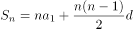，代入数据可得，化简得。结合选项枚举代入：

当时，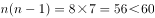，不满足题意；

当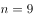时，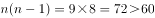，满足题意，即汽油将在9日售罄。

故正确答案为C。

---

## 第 12 题　qid 2187825 · 数学运算

小庄要制作一个工业模具。他在一个边长4厘米的正方体上表面正中心位置向下挖掉一个直径2厘米、高2厘米的圆柱体，接着再向下挖掉一个直径1厘米、高1厘米的小圆柱体（如右图所示）。那么，该模具的表面积约为多少平方厘米？

- **A**. 82.8
- **B**. 108.6
- **C**. 111.7　✅
- **D**. 114.8

**答案**：C

**官方解析**

边长4厘米的正方体的表面积为平方厘米。中心位置一个直径2厘米、高2厘米的圆柱体平方厘米，一个直径1厘米、高1厘米的小圆柱体平方厘米。那么，该模具的表面积约为平方厘米。

注：挖掉的大小圆柱体底面的面积，可以叠加还原成最上层的表面，故不需要单独计算圆柱体底面积，只需要计算侧面积即可。

故正确答案为C。

---

## 第 13 题　qid 2188571 · 数学运算

10个相同的盒子中分别装有1～10个球，任意两个盒子中的球数都不相同。小李分三次每次取出若干个盒子，每次取出的盒子中的球数之和都是上一次的3倍，且最后剩下1个盒子。问剩下的盒子中有多少个球？

- **A**. 9
- **B**. 6
- **C**. 5
- **D**. 3　✅

**答案**：D

**官方解析**

由题意可得，共有小球个数为个，假设第一次取出小球个数为x，剩下盒子中球数为y，则第二次与第三次取出小球个数分别为3x，9x，前三次取出小球总个数为，则，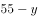是13的倍数，只有D项满足。

故正确答案为D。

---

## 第 14 题　qid 2187774 · 数学运算

某水渠长100米，截面为等腰梯形，其中渠面宽2米，渠底宽1米，渠深2米。因突降暴雨，水深由1米涨至1.8米。则水渠水量增加了：

- **A**. 112立方米
- **B**. 136立方米　✅
- **C**. 272立方米
- **D**. 324立方米

**答案**：B

**官方解析**

根据题意可得下图，增加的水量断面为梯形EFGM。已知水渠截面为等腰梯形，则米，米；，则，即，米，则米；米，则米。梯形EFGM截面积为平方米。又根据水渠长100米，则水渠水量增加了立方米。

故正确答案为B。

---

## 第 15 题　qid 2187796 · 数学运算

一个班级组织跑步比赛，共设100米、200米、400米三个项目。班级有50人，报名参加100米比赛的有27人，参加200米比赛的有25人，参加400米比赛的有21人。如果每人最多只能报名参加2项比赛，那么该班最多有多少人未报名参赛？

- **A**. 11
- **B**. 12
- **C**. 13　✅
- **D**. 14

**答案**：C

**官方解析**

由“每人最多只能报名参加2项比赛”可得，报名三项的人数为0。设参加两项的人数为，未报名参赛的人为，根据三集合非标准公式可得：，化简得。

要让未报名参赛的人最多，则让尽量多。考虑让参加两项的人尽量多，则每人尽量参与两项，此时最多为人，向下取整为36人，即最多为36，故最多为人。

故正确答案为C。

---
