# 2018深圳市公务员录用考试《行测》题（网友回忆版）

> 数量关系 · 13 题 · 深圳市考 2018

## 第 1 题　qid 2166169 · 数学运算

-1，-4，5，-22，59，（    ）

- **A**. -184　✅
- **B**. 302
- **C**. -243
- **D**. 140

**答案**：A

**官方解析**

数列无明显特征，优先考虑作差。后一项减前一项，得到的新数列为-3、9、-27、81，是公比为-3的等比数列，则新数列的下一项为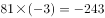，故所求项减去59所得的差为-243，所求项。

故正确答案为A。

---

## 第 2 题　qid 2166171 · 数学运算

20.15，29.34，40.35，53.58，（  ）

- **A**. 64.59
- **B**. 65.70
- **C**. 68.63　✅
- **D**. 68.73

**答案**：C

**官方解析**

数列为小数数列，考虑机械划分。将数列中每一个数字的整数部分与小数部分划分后，得到两组新的数列。其中，整数部分组成的新数列为20、29、40、53，观察该数列，用后一项减前一项得9、11、13，得到公差为2的等差数列，则下一项为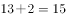，故原数列所求项的整数部分为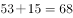，排除A、B两项；小数部分单独看没有规律，考虑整体看，用整数部分减小数部分，得到周期数列5，-5，5，-5，故下一项为5，只有C项符合。

故正确答案为C。

---

## 第 3 题　qid 2166172 · 数学运算

， ， ， ，（    ）

- **A**. 

- **B**. 

　✅
- **C**. 

- **D**. 

**答案**：B

**官方解析**

观察数列，全为分数，故该数列为分数数列。分子和分母有递增趋势，先考虑分子、分母分开看，但分开看没有明显规律；再考虑分子、分母合起来看，于是形成的新数列为2，3，5，7，11，13，17，19，是质数数列且每两项一组，奇数项为分子，偶数项为分母，故新数列的后两项分别为23，29，所求项为。

故正确答案为B。

---

## 第 4 题　qid 2166173 · 数学运算

某轮船发生漏水事故，漏洞处不断地匀速进水，船员发现险情后立即开启抽水机向外抽水。已知每台抽水机每分钟抽水20立方米，若同时使用2台抽水机15分钟能把水抽完，若同时使用3台抽水机9分钟能把水抽完。当抽水机开始向外抽水时，该轮船已进水（  ）立方米。

- **A**. 360
- **B**. 450　✅
- **C**. 540
- **D**. 600

**答案**：B

**官方解析**

牛吃草问题，套用公式：原有草量时间（牛的数量牛的吃草速度草长的速度）。本题中，抽水机相当于“牛”，进水相当于“草”，抽水前已进水量相当于“原有草量”。设进水的速度为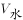，则有，解得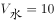，故当抽水机开始向外抽水时，该轮船已进水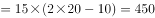立方米。

故正确答案为B。

---

## 第 5 题　qid 2166174 · 数学运算

清晨，爷爷、爸爸和小磊在同一条笔直跑道上朝同一方向匀速晨跑，某一时刻，爷爷在前，爸爸在中，小磊在后，且三人之间的间距正好相等。跑了12分钟后小磊追上了爸爸，又跑了6分钟后小磊追上了爷爷，则再过（  ）分钟，爸爸可追上爷爷。

- **A**. 12
- **B**. 15
- **C**. 18　✅
- **D**. 36

**答案**：C

**官方解析**

假设小磊的速度为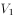，爸爸的速度为，爷爷的速度为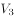，三人之间的间距为S。追及问题，套用公式，。

跑了12分钟后小磊追上了爸爸 ，则，即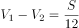······①；

又跑了6分钟后小磊追上了爷爷，即从一开始追到追上爷爷，共用时18分钟，，即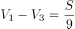······②。

题目所求为爸爸追上爷爷的时间，即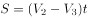；由可得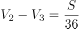，则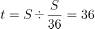分钟；所以爸爸从一开始到追上爷爷所需的时间为36分钟，但此时已经过去了分钟，所以再过分钟时爸爸可以追上爷爷。

故正确答案为C。

---

## 第 6 题　qid 2166175 · 数学运算

某新款手机上市时单价是2598元，销售一段时间后，厂家采取降价促销策略，手机单价直降300元，于是每月销量提升为原来的2倍，每月利润提升为原来的1.5倍，则该款手机的成本价是（  ）元。

- **A**. 1698
- **B**. 1598
- **C**. 1498
- **D**. 1398　✅

**答案**：D

**官方解析**

假设原来手机每月销售量为1台，并设该款手机的成本价是x元，则原来每月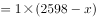；促销后，手机每月销售量为2台，售价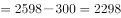元，则促销后每月。“促销后，每月利润提升为原来的1.5倍”，故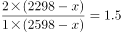，解得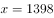元。

故正确答案为D。

---

## 第 7 题　qid 2166176 · 数学运算

“梦想号”和“启航号”两列火车在两条平行轨道上匀速相向而行，“梦想号”的车长为270米，“启航号”的车长为360米。若“梦想号”的乘客从车窗看见“启航号”驶过的时间是8秒，则“启航号”的乘客从车窗看见“梦想号”驶过的时间是（  ）秒。

- **A**. 10
- **B**. 8
- **C**. 6　✅
- **D**. 4

**答案**：C

**官方解析**

相遇问题，套用公式，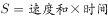。若“梦想号”的乘客从车窗看见“启航号”驶过，看到的车身长度即为相遇的路程；则，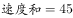；若“启航号”的乘客从车窗看见“梦想号”驶过，则，故“启航号”的乘客从车窗看见“梦想号”驶过的时间是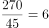秒。

故正确答案为C。

---

## 第 8 题　qid 2166177 · 数学运算

阳光下，电线杆的影子投射在地面以及与地面成45度角的土坡上。其中，电线杆投影在土坡上的部分长米，投影在地面上的部分长12米，而此时同一位置站立的人在地面的影子长度恰好与身高相同，则电线杆的高度为（  ）米。

- **A**. 12
- **B**. 14　✅
- **C**. 15
- **D**. 16

**答案**：B

**官方解析**

如图所示，根据题意可得，米，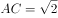米。因“此时同一位置站立的人在地面的影子长度恰好与身高相同”，故米；因“电线杆的影子投射在地面以及与地面成45度角的土坡上”，米，则在等腰三角形ACD中，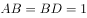米，而在等腰三角形EOD中，且，则有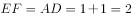米，故电线杆的高度为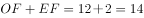米。

故正确答案为B。

---

## 第 9 题　qid 2166178 · 数学运算

某校师生为元旦晚会排练合唱表演，要求合唱团在台阶上排列成不少于3排的前多后少的梯形队阵，且各排的人数须是连续的自然数，以使后一排的合唱团成员均站在前一排两名合唱团成员之间的空隙处。若合唱团共100人，则满足上述要求的排列方案有（  ）种。

- **A**. 1
- **B**. 2　✅
- **C**. 3
- **D**. 4

**答案**：B

**官方解析**

设合唱团一共n排，则由于各排人数是连续的自然数，则从前到后构成公差为-1的等差数列，则。分情况讨论：

若n为奇数，由于乘积100是偶数，则中位数只能为偶数；

若n为偶数，则中位数为最中间两排人数的平均数，由于相邻两排人数相差1，故中位数应为小数部分为0.5的小数。

100的约数中，只有1、5、25为奇数，由于n不少于3，故时，中位数为20，满足题意；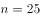时，中位数为4，会出现后排人数为负数的情况，排除。

若n为偶数，只有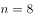时，中位数为12.5，满足题意。

所以满足上述要求的排列方案有2种，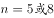。

故正确答案为B。

---

## 第 10 题　qid 2166179 · 数学运算

甲、乙、丙三名质检员对一批依次编号为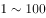的电脑进行质量检测。每个人均从随机序号开始，按顺序往后检测，如检测到编号为100的电脑，则该质检员的检测工作结束。某一时刻，甲检测了76台电脑，乙检测了61台电脑，丙检测了54台电脑，则甲、乙、丙三人均检测过的电脑至少有（  ）台。

- **A**. 12
- **B**. 15　✅
- **C**. 16
- **D**. 18

**答案**：B

**官方解析**

本题并非多集合反向构造，这是因为题干中要求“按顺序往后检测”，而并非任意检测。题干所求为“甲、乙、丙三人均检测过的电脑至少”，直接考虑三人均检测过的至少即最少比较难考虑，先考虑任意两人检测过的电脑最少，这里我们先去分析甲、乙，要使甲、乙两人都检测过的电脑最少，如下图所示，甲、乙检测的电脑应尽可能少的重合，甲从1号开始检测一直至76号，而乙相当于从100号倒数至40号（注意40号至100号为61台，并非39号至100号），这样便可以保证甲、乙两人都检测过的电脑最少。再去考虑丙，如果丙从1号开始检测一直至54号，则甲、乙、丙均检测过的电脑编号为40至54，一共15台；如果从100号倒数至47号，则甲、乙、丙均检测过的电脑编号为47至76，一共30台，显然前者更少即甲、乙、丙三人均检测过的电脑至少有15台。

故正确答案为B。

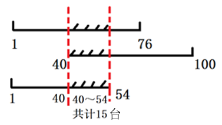

---

## 第 11 题　qid 2166180 · 数学运算

桌子上放有2018枚硬币，小芳、小强两人轮流取走其中一些。当小芳取硬币时，只能取2枚或4枚；当小强取硬币时，只能取1枚或3枚，取走最后一枚硬币的人即为获胜者，假设两人均使用最佳策略，则（  ）能获胜。

- **A**. 先取者
- **B**. 后取者
- **C**. 小芳
- **D**. 小强　✅

**答案**：D

**官方解析**

由题意可知，，，即小芳和小强分别取一次存在一个加和定值为5，。分类讨论如下：

若小芳先取，无论小芳取2枚还是4枚，小强总能与小芳凑成每次加和为5的情况，最后剩余3。此时小芳再取，只能取2，小强取最后一个获胜；

若小强先取，按照最佳策略，小强先取3枚，剩余2015枚，随后无论小芳取2枚还是4枚，小强都与小芳凑成每次加和为5的情况，最后剩余5枚时，也是小芳取完小强再取，小强获胜。

故小强一定获得最终胜利。

故正确答案为D。

---

## 第 12 题　qid 2166181 · 数学运算

某公园内原有一个深2.5m、长宽均为5m的观赏鱼池，现需将鱼池四壁及底面铺满厚5cm、长宽均为10cm的砖，则至少需使用（  ）块砖。

- **A**. 7500
- **B**. 7401
- **C**. 7351　✅
- **D**. 7301

**答案**：C

**官方解析**

题干要求使用的砖尽可能少，则在铺的时候尽可能使用砖面积最大的一面，砖最大面的面积。

①先铺鱼池的左立面与右立面，分别需要块，两侧共需块；

②再铺鱼池的前立面与后立面，分别需要块，两侧共需块；

③最后铺底面，需要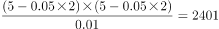块。

故总共需要块，满足条件“将鱼池四壁及底面铺满”。

故正确答案为C。

---

## 第 13 题　qid 2166182 · 数学运算

甲、乙、丙三市位于一条直线公路上，甲、乙两市相距120公里，丙市位于甲、乙之间，距离甲市30公里。小李驱车匀速沿公路从甲市前往乙市，小李出发15分钟后，小赵驱车从甲市出发，以80公里/小时的速度匀速沿公路前往乙市，半小时后，小赵发现有物品遗落在丙市，遂原路返回丙市取回物品后继续前往乙市，且在到达乙市前与小李只相遇一次。假设小赵到达丙市后即刻取回遗落物品，所耽误的时间忽略不计，则小李的速度不可能为（  ）公里/小时。

- **A**. 32
- **B**. 46　✅
- **C**. 56
- **D**. 58

**答案**：B

**官方解析**

设小李速度为v，小赵出发半小时时，已经走了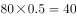公里，返回丙市需再走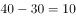公里。

若小赵发现有物品遗落在丙市前，并未与小李相遇。说明小赵在出发半小时时，并未追上小李，即小李走了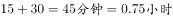的路程大于小赵走的40公里，则有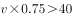，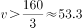公里/小时；此时由于要在到达乙市之前与小李相遇一次，故小赵到达乙市前，一定超过小李，小赵从甲到达乙市时，共花费时间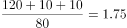小时，此时小李已从甲出发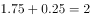小时，尚未到达乙市，则有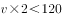，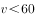公里/小时。选项C、D在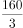公里/小时60公里/小时范围内，排除。

若小赵发现有物品遗落在丙市前，就已经与小李相遇。由于在到达乙市前与小李只相遇一次，则只有可能是小李在到达丙市前被小赵超越（否则小赵返回丙市时，会与小李再次相遇）。小赵到达丙市时，花费时间小时，此时小李已从甲出发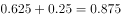小时，尚未到达丙市，则有，公里/小时。选项A在公里/小时范围内，排除。

故正确答案为B。

---
