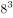
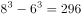
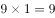
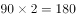
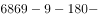
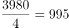

# 2019年1月天津市定向招录选调生考试综合能力测试试卷（精选）

> 数量关系 · 5 题 · 天津 2019

## 第 1 题　qid 2661738 · 数学运算

一个边长为8的立方体，由若干个边长为1的正立方体组成，现在要在表面涂上颜色，问被涂上颜色的小立方体有多少个？

- **A**. 296　✅
- **B**. 325
- **C**. 328
- **D**. 384

**答案**：A

**官方解析**

由题意可知，该正方体共由个小立方体组成，去除被涂色的小立方体，剩下没被涂色的是一个棱长为6的立方体，即有个小立方体。因此一共有个小立方体被涂上了颜色。

故正确答案为A。

---

## 第 2 题　qid 34637 · 数学运算

某一天，小张发现办公桌上的台历已经有7天没有翻了，就一次翻了7张，这7张的日期加起来之和是77，那么这一天是：

- **A**. 13日
- **B**. 14日
- **C**. 15日　✅
- **D**. 17日

**答案**：C

**官方解析**

这7个日期是连续的自然数，构成等差数列，则这7个日期的中位数为，即没翻日历的第四天是11日，则这7天分别为8、9、10、11、12、13、14日，所以今天应该是15日。

故正确答案为C。 

---

## 第 3 题　qid 15755 · 数学运算

一试卷有50道判断题，规定每做对一题得3分，不做或做错一题扣1分。某学生共得82分，问做对的题与不做或做错的题数相差几题：

- **A**. 15题
- **B**. 16题　✅
- **C**. 17题
- **D**. 18题

**答案**：B

**官方解析**

设做对题，不做或做错题，根据题意可得：······①，······②，联立①②解得：，。则做对的题与不做或做错的题数相差题。

故正确答案为B。

---

## 第 4 题　qid 15747 · 数学运算

汽车从甲地到乙地用了4小时，从乙地返回甲地用了3小时，返回时的速度比去时快百分之几：

- **A**. 20%
- **B**. 18.26%
- **C**. 33.3%　✅
- **D**. 36.4%

**答案**：C

**官方解析**

题干中只给出了时间，路程和速度都是未知且路程不变，故可赋值不变量路程为，则去时速度为，返回时速度为，返回时的速度比去时快。

故正确答案为C。 

---

## 第 5 题　qid 2661742 · 数学运算

某局机关正在组织人力编辑一本《文本汇编》，其页数需用6869个数字，请问，这本《文本汇编》具体是多少页？

- **A**. 1994　✅
- **B**. 1968
- **C**. 1942
- **D**. 1886

**答案**：A

**官方解析**

1-9页每页需要1个数字，共需要个数字；

10-99页每页需要2个数字，共需要个数字；

100-999页每页需要3个数字，共需要个数字。

1000页以上的每页需要4个数字，剩下的数字有个，需要的页数为。因此本书的总页数为：页。

故正确答案为A。

---
