# 2019年420联考《行测》题（吉林乙级）（网友回忆版）

> 数量关系 · 7 题 · 吉林 2019

## 第 1 题　qid 2376442 · 数学运算

11，24，26，（    ），19

- **A**. 24
- **B**. 25
- **C**. 26
- **D**. 39　✅

**答案**：D

**官方解析**

观察数列，变化不一致，作差行不通，考虑机械拆分，、、、（  ）、；得到新数列0、2、4、（  ）、8，构成公差为2的等差数列，那么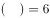。即所求项的个位数字减去十位数字为6，观察选项，只有D项满足。

故正确答案为D。

---

## 第 2 题　qid 2376443 · 数学运算

2，8，26，（    ），242

- **A**. 60
- **B**. 80　✅
- **C**. 120
- **D**. 180

**答案**：B

**官方解析**

方法一：观察数列特性，在幂次数字附近，考虑幂次修正数列。原数列可以转化为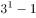，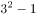，，（  ），。可以看出所求项。

方法二：观察数列没有看出特征，优先考虑作差，作差后得到新数列：6、18、（  ），（  ），作差后相邻两项之间是3倍关系，，则新数列第一个，代入原数列，原数列，对应B选项，验证规律，，符合题意。

故正确答案为B。

---

## 第 3 题　qid 2376543 · 数学运算

某宣讲团甲宣传员骑摩托车从红星村出发以20公里/小时的速度去相距60公里的八一村，1小时后由于路面湿滑，速度减少一半，在甲出发1小时后，乙宣传员以50公里/小时的速度开车从红星村出发追甲，当乙追上甲时，他们与八一村的距离为

- **A**. ​25公里
- **B**. ​30公里
- **C**. ​35公里　✅
- **D**. ​40公里

**答案**：C

**官方解析**

由题意可知，甲出发一小时后的路程为20公里。之后甲速度变为公里/小时，根据追及公式“”，可得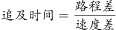小时。此时，乙的路程为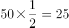公里，距离八一村还有公里。

故正确答案为C。

---

## 第 4 题　qid 2376545 · 数学运算

汽车厂甲、乙、丙三个机器人承担拧螺丝任务，程序设定甲先开始，3分钟后乙开始，再3分钟后丙开始。当乙工作12分钟时，所拧的螺丝数与甲拧的螺丝数相同，丙工作20分钟时，所拧的螺丝数与甲拧的螺丝数相同，则丙的工作效率是乙的

- **A**. 1.04倍　✅
- **B**. 1倍
- **C**. 0.9倍
- **D**. 0.8倍

**答案**：A

**官方解析**

根据题意可知，甲开始3分钟后乙再开始，则乙工作12分钟时，甲已工作了15分钟。，总量相同时，效率与时间成反比，甲乙工作时间之比为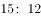，则效率之比为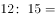。

同理，乙开始3分钟后丙再开始，即甲开始6分钟后丙再开始，则丙工作20分钟时，甲已工作了26分钟。甲丙的效率之比为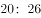。甲乙丙三个机器人效率之比为，则丙的工作效率是乙的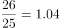倍。

故正确答案为A。

---

## 第 5 题　qid 2376547 · 数学运算

将浓度分别为和的酒精溶液各100毫升混合在一个容器里，要想使混合后酒精溶液的浓度达到，需要加水

- **A**. 40毫升　✅
- **B**. 50毫升
- **C**. 60毫升
- **D**. 70毫升

**答案**：A

**官方解析**

方法一：设加水毫升，根据混合前后溶质的量不变可列方程：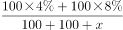，解得毫升。

方法二：根据线段法可知，距离与量成反比。第一次混合时，两种溶液质量相等，可知混合之后的浓度应为。第二次与水混合后浓度变为，则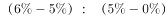，可知需加水40毫升。

故正确答案为A。

---

## 第 6 题　qid 2376549 · 数学运算

小明有2盆兰花和3盆杜鹃，小明打算随机拿出2盆送给小红，则至少有1盆兰花的概率是

- **A**. 

- **B**. 

- **C**. 

- **D**. 

　✅

**答案**：D

**官方解析**

方法一：从5盆中任选两盆，有种方法。至少有1盆兰花包括两种情况：①有1盆兰花，情况数为；②2盆都是兰花，情况数为种；共有种。则至少有一盆为兰花的概率为。

方法二：正面情况较多可以从反面考虑，至少有1盆兰花的反面为没有兰花，即2盆都是杜鹃，情况数为种，总情况数为种，所求的概率为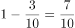。

故正确答案为D。

---

## 第 7 题　qid 2376551 · 数学运算

某计算机企业有职工150人，其中50岁以上共有50人。现拟减员增效，总体规模压缩为100人，并规定50岁以上的人裁减比例为，则50岁以下的人裁减比例为

- **A**. 

- **B**. 

- **C**. 

- **D**. 

　✅

**答案**：D

**官方解析**

需裁减的总人数为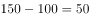人，50岁以上需裁减人数为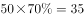人。50岁以下原来有人，需要裁减人数为人，裁减比例为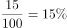。

故正确答案为D。

---
