# 2019年420联考《行测》题（吉林甲级）（网友回忆版）

> 数量关系 · 17 题 · 吉林 2019

## 材料 1

根据以下资料，回答下列问题。

        自2013年习近平主席提出“一带一路”的战略构想以来，中国东北地区积极参与其中，取得了丰硕成果，2013年至2017年中国东北地区对“一带一路”国家各区域进出口额如下：

### 第 1 题　qid 2376743 · 数学运算

2017年中国东北地区与“一带一路”国家的进出口贸易总额为

- **A**. 396.1亿美元
- **B**. 514.0亿美元
- **C**. 617.0亿美元　✅
- **D**. 723.3亿美元

**答案**：C

**官方解析**

表1为2017年中国东北地区对“一带一路”国家的出口额，表2为相对应进口额。故2017年中国东北地区与“一带一路”国家的进出口总额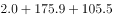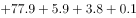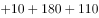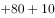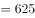，与C项最为接近。

故正确答案为C。

---

### 第 2 题　qid 2376745 · 数学运算

2016年中国东北地区与“一带一路”各区域的贸易中，中国东北地区与之存在贸易顺差的地区有

- **A**. 1个
- **B**. 2个
- **C**. 3个
- **D**. 4个　✅

**答案**：D

**官方解析**

贸易顺差即“出口额进口额”，定位表格1与表格2，满足2016年中国东北地区对“一带一路”国家出口额进口额的有：亚洲大洋洲地区、南亚地区、非洲及拉美地区、中亚地区，共计4个地区。

故正确答案为D。

---

### 第 3 题　qid 2376730 · 数学运算

若中国东北地区继续维持2016-2017年与亚洲大洋洲地区的贸易出口增长率，则中国东北地区与亚洲大洋洲地区的贸易出口金额首次超过2013年贸易出口金额的年份是：

- **A**. 2020
- **B**. 2021　✅
- **C**. 2022
- **D**. 2023

**答案**：B

**官方解析**

根据题干“······首次超过2013年贸易出口金额的年份是”，可判定本题为现期追赶问题。定位表格1，中国东北地区在2016-2017年与亚洲大洋洲地区的贸易出口增长率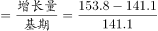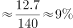。根据公式“”可得，出口额超过2013年水平，即，化简为：。根据选项可知，出口额超过2013年水平，至少需要3年。验证3年，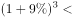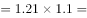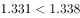；验证4年，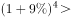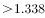，故2021年出口额首次超过2013年水平，满足要求。

故正确答案为B。

---

### 第 4 题　qid 2376736 · 数学运算

下列说法错误的是

- **A**. 
自2013年到2017年中国东北地区同非洲及拉美地区的贸易顺差不断下降

- **B**. 
2014年中国东北地区与南亚地区的贸易顺差高于该年份中国东北地区与其他任何一个“一带一路”地区产生的贸易顺差
　✅
- **C**. 
2015年中国东北地区与亚洲大洋洲地区的进出口贸易总额占该年份中国东北地区与“一带一路”地区进出口贸易总额的比重已超过

- **D**. 
2016年中国东北地区同“一带一路”各区域的出口额均低于2015年

**答案**：B

**官方解析**

A项，定位两个表格材料，2013—2017年中国东北地区同非洲及拉美地区的贸易顺差分别为：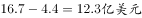，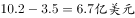，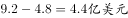，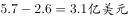，，顺差额不断下降，正确；

B项，定位两个表格材料，2014年中国东北地区与南亚地区的贸易顺差额为：，2014年中国东北地区与东欧地区的顺差额为：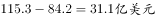，27.2不高于31.1，错误；

C项，定位两个表格材料，2015年中国东北地区与亚洲大洋洲地区的进出口贸易总额为：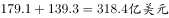；2015年中国东北地区与“一带一路”地区进出口贸易总额为：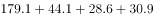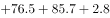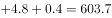，，正确；

D项，定位第一个表格，2016年数值：141.1，34.6，19.4，27.7，5.7，1.6；2015年数值为：179.1，44.1，28.6，30.9，9.2，2.3，2016年数值均低于2015年，正确。

本题为选非题，故正确答案为B。

---

## 材料 2

根据以下资料，回答下列问题。 

        截至2018年底，全国60周岁及以上老年人口24949万人，占总人口的，其中65周岁及以上老年人口16658万人，占总人口的。全国共有老龄事业单位1600个，老年法律援助中心2.0万个，老年维权协调组织6.4万个，老年学校4.9万所，在校学习人员704.0万人，各类老年活动室35.0万个；享受高龄补贴的老年人2682.2万人，比上年增长；享受护理补贴的老年人61.3万人，比上年增长；享受养老服务补贴的老年人354.4万人，比上年增长。

        截至2017年底，全国共有孤儿41.0万人，其中集中供养孤儿8.6万人，社会散居孤儿32.4万人，2017年全国办理收养登记近1.9万件，其中内地居民收养登记近1.7万件，港澳台华侨收养登记103件，外国人收养登记2228件。

        截至2017年底，全国共有农村特困人员466.9万人，比上年减少。全年各级财政共支出农村特困人员救助供养资金269.4亿元，比上年增长。全国共有城市特困人员25.4万人，全年各级财政共支出城市特困人员救助供养资金21.2亿元。

### 第 5 题　qid 2376752 · 数学运算

2018年底，每所老年学校平均容纳在校学习的老年人约为

- **A**. 120人
- **B**. 140人　✅
- **C**. 160人
- **D**. 180人

**答案**：B

**官方解析**

根据题干“2018年底······平均容纳······”, 结合材料时间为2018年，可判断本题为现期平均数问题。定位文字材料第一段可知“2018年底······老年学校4.9万所，在校学习人员704.0万人”，可得2018年底，每所老年学校平均容纳在校学习的老年人人，与B项最接近。

故正确答案为B。

---

### 第 6 题　qid 2376757 · 数学运算

下列说法正确的是

- **A**. 
2010-2018年我国60岁及以上老年人口占比年增量均为

- **B**. 
2010-2018年我国60岁及以上老年人口总量呈上下波动态势

- **C**. 
2017-2018年我国60岁及以上老年人口增长率约为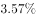
　✅
- **D**. 
2015-2018年我国60岁及以上老年人口增量逐年递增

**答案**：C

**官方解析**

A项：定位图1，由图1折线图可知2011年和2010年60岁及以上老年人口所占比重分别为、，可得2011年60岁及以上老年人口所占比重增量为，错误；

B项：定位图1，由图1柱形图可知2010-2018年60岁及以上老年人口总量呈逐年上升态势，错误；

C项：定位图1，由图1柱形图可知2017年和2018年60岁及以上老年人口数分别为24090万人、24949万人，故2017-2018年60岁及以上老年人增长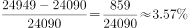，正确；

D项：定位图1，由图1柱形图可知2016年、2017年、2018年60岁及以上老年人口数分别为23086万人、24090万人、24949万人，2018年增量为万人，2017年增量为万人，，2018年增量下降，错误。

故正确答案为C。

---

### 第 7 题　qid 2376740 · 数学运算

2010-2017年我国收养登记数呈现的态势是：

- **A**. 总量持续降低
- **B**. 降幅持续加大
- **C**. 降幅持续收窄
- **D**. 总量和降幅起伏波动　✅

**答案**：D

**官方解析**

定位材料图2，可知：
A项：2017年收养登记数（18820件）较2016年（18735件）有所提升，错误；
B项：2010年-2017年，收养登记增长率降幅起伏波动，错误；
C项：2010年-2017年，收养登记增长率降幅起伏波动，错误；
D项：2010年-2017年，我国收养登记数有升有降，降幅起伏波动，正确。
故正确答案为D。

---

### 第 8 题　qid 2376749 · 数学运算

下列说法错误的是：

- **A**. 
截至2017年底我国城乡特困人员有近五百万人

- **B**. 
2017年，我国城市特困人员人均得到各级财政救助供养资金超过八千元

- **C**. 
2017年，我国的收养登记主要是由国外人士办理
　✅
- **D**. 
2018年，我国65岁及以上人口超过60岁及以上人口的

**答案**：C

**官方解析**

A项：定位文字材料第三段可知：截至2017年底，全国共有农村特困人员466.9万人，城市特困人员25.4万人，共计万人（小于且接近500万人），正确；

B项：定位文字材料第三段可知：截至2017年底，全国共有城市特困人员25.4万人，全年各级财政共支出城市特困人员救助供养资金21.2亿元，则2017年，我国城市特困人员人均得到各级财政救助供养资金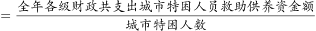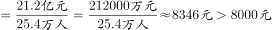，正确；

C项：定位文字材料第二段可知：截至2017年底，全国办理收养登记1.9万件，外国人收养登记2228件，国外人士收养登记占全国收养登记比重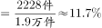，并不是主要部分，错误；

D项：定位文字材料第一段可知：截至2018年底，全国60周岁及以上老年人口占总人口的，65周岁及以上老年人口占总人口的，则2018年，我国65岁及以上人口占60周岁以上人口的比重，正确。

本题为选非题，故正确答案为C。

---

### 第 9 题　qid 2376742 · 数学运算

123，147，258，（  ），432

- **A**. 345　✅
- **B**. 413
- **C**. 368
- **D**. 421

**答案**：A

**官方解析**

方法一：数项都是三位数，考虑机械划分。将原数列中的数字拆成三个数字去看，1、2、3是公差为1的等差数列，1、4、7是公差为3的等差数列，2、5、8是公差为3的等差数列，4、3、2是公差为-1的等差数列，即规律为：每个三位数的数字依次为等差数列，观察选项，只有A项3、4、5符合等差数列。

方法二：数项都是三位数，考虑机械划分。将原数列中的数字拆成三个数字去看，发现123中：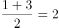，147中：，258中：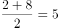，432中：；规律为三位数中，中间数字是两端数字的平均数。观察选项，满足此规律的只有A项，。

故正确答案为A。

---

### 第 10 题　qid 2376746 · 数学运算

某高校本年度毕业学生3060名，比上年度增长。其中本科生毕业数量比上年度减少，而研究生毕业数量比上年度增加，那么，这所高校本年度本科生毕业数量是

- **A**. 1900人
- **B**. 1930人
- **C**. 1960人　✅
- **D**. 1990人

**答案**：C

**官方解析**

方法一：根据今年本科生毕业人数减少，则今年本科生毕业人数：去年本科生毕业人数。则今年本科生毕业人数一定是49的整数倍，结合选项，只有C项符合。

方法二：根据题意，上年度毕业学生为 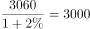人。结合混合增长率，增长率的差值之比与基期量之比成反比，则有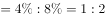，则上年度研究生毕业人数与本科生毕业人数之比为。则上年度本科生毕业人数为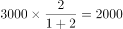人，因此今年本科生毕业人数为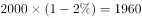人。

故正确答案为C。

---

### 第 11 题　qid 2376747 · 数学运算

1辆汽车原价为20万元，商家促销，预存1000元可拥有1万元抵用券，之后还可以再打9折，则购买这辆汽车总共需支付的金额是

- **A**. 17.1万元
- **B**. 17.2万元　✅
- **C**. 18.1万元
- **D**. 18.2万元

**答案**：B

**官方解析**

思路一：根据题意，已知预存1000元抵用1万元，原价20万，则抵用后价格为万，又因为还可以再打九折，所以折后还需要支付万元，因此总共支付金额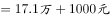。

思路二：已知预存1000元可拥有1万元抵用券，原价20万，则抵用后价格为万，又因为还可以再打九折，所以折后需要支付万元，但是预存了1000元也就是0.1万，购车时可以抵用，所以购车时又支付，因此总共支付金额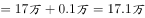。

备注：两种思路的争议在于预存的1000元是否可以抵扣最终的车款，第一种思路是预存1000元相当于支付1000元用于购买1万元抵用券，后期这1000元不再抵用车款；第二种思路是预存1000元便拥有1万元抵用券，后期这1000元仍然可以抵用车款。粉笔倾向于第一种思路，这是因为命题人设计了17.1万元和17.2万元、18.1万元和18.2万元，其考点明显在于前面的1000元要不要算，而问法还写了“总共支付了”，意思是多次支付，故倾向于答案为B。

故正确答案为B。

---

### 第 12 题　qid 2376748 · 数学运算

假设本月28号是星期四，则本月1号是

- **A**. 星期三
- **B**. 星期四
- **C**. 星期五　✅
- **D**. 星期六

**答案**：C

**官方解析**

本月1号到28号共计28天，有四个完整的星期，因此1号对应的星期数与29号星期数相同，已知28号是星期四，则29号是星期五，所以1号也是星期五。
故正确答案为C。

---

### 第 13 题　qid 2376733 · 数学运算

一项工程按计划将用20天完成，为提高效率，从第三天开始，每天都比前一天多完成1倍，则完成这个工程至少需要的时间是

- **A**. 5天
- **B**. 6天　✅
- **C**. 7天
- **D**. 8天

**答案**：B

**官方解析**

由于本题只给出完工时间，故可采用赋值法，赋值原来每天的效率为1，则总工程量。根据题意可得，从第一天到第五天每天的效率依次为：1、1、2、4、8，故其每天完成的工程量依次为1、1、2、4、8，这五天完成的总工程量为1+1+2+4+8=16，剩余的工程量为，由于第六天可完成的工程量为，故完成这个工程至少需要6天。

故正确答案为B。

---

### 第 14 题　qid 2376735 · 数学运算

一个圆形，半径变为原来的4倍之后的圆的面积，等于半径增加2厘米之后的面积的4倍，则原来的半径是

- **A**. 1厘米
- **B**. 2厘米　✅
- **C**. 3厘米
- **D**. 4厘米

**答案**：B

**官方解析**

假设原来的半径为厘米。半径变为原来的4倍后，圆的面积为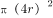平方厘米；半径增加2厘米后，圆的面积为平方厘米。根据题干可得：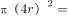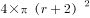，化简得到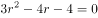，即，解得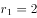，，半径不能为负，所以原来的半径为2厘米。

故正确答案为B。

---

### 第 15 题　qid 2376737 · 数学运算

寒假第一天，骑行社团从学校出发去滑雪，他们以20公里/小时的速度骑行2个小时到达滑雪场，游玩4个小时后按原路以原速返回。骑行社团离开学校5.5小时后，辅导员派大客车以40公里/小时的速度沿相同路线迎接骑行社团，则大客车出发后与骑行社团相遇需要的时长是

- **A**. 30分钟
- **B**. 40分钟
- **C**. 50分钟　✅
- **D**. 60分钟

**答案**：C

**官方解析**

从学校到滑雪场的路程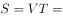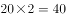公里。社团骑行2小时，游玩4小时，共花费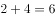小时后原路返回。客车在社团离开5.5小时后开始出发，相当于在社团原路返回时，客车已走了小时，也就是走了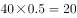公里。剩余的20公里，相当于客车与社团在线段两端出发相遇的过程，根据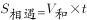，可得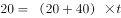，解得小时。故相遇时大客车共走了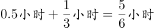，即50分钟。

故正确答案为C。

---

### 第 16 题　qid 2376741 · 数学运算

某位党员同志制定了个人“新时代e支部”学习目标：每天学习时长都比前一天增加。如果他第一天学习时长是16分钟，第5天他的学习时长是

- **A**. 27分钟
- **B**. 54分钟
- **C**. 81分钟　✅
- **D**. 100分钟

**答案**：C

**官方解析**

方法一：根据“每天学习时长都比前一天增加”，可知每天的学习时长是前一天的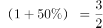倍，即每天的学习时长是公比为的等比数列，由等比数列的通项公式，可得第5天学习时长为：分钟。

方法二：枚举法。第1天学习时长为16分钟，依据题意，第2天学习时长为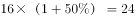分钟，第3天学习时长为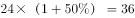分钟，第4天学习时长为分钟，第5天学习时长为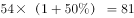分钟。

故正确答案为C。

---

### 第 17 题　qid 2376744 · 数学运算

抽奖箱子里剩下8张奖券，其中5张有奖，3张无奖，小王有两次抽奖机会，他不放回地依次抽取两张奖券，则这两张奖券中一张有奖一张无奖的概率是

- **A**. 

- **B**. 

- **C**. 

- **D**. 

　✅

**答案**：D

**官方解析**

两张奖券中一张有奖一张无奖共有两种情况：1.第一张有奖第二张无奖；2.第一张无奖第二张有奖。

1.第一张有奖第二张无奖：先抽一张有奖的，概率为，再抽一张无奖的，概率为，该种情况的概率为；

2.第一张无奖第二张有奖：先抽一张无奖的，概率为，再抽一张有奖的，概率为，则该种情况的概率为。

两种情况总的概率为。

故正确答案为D。

---
