# 2019年420联考《行测》题（四川卷）（网友回忆版）

> 数量关系 · 9 题 · 四川 2019

## 第 1 题　qid 2377247 · 数学运算

某助农项目从农民手中以1元/斤的价格收购一批芒果，通过网络平台销售，定价30元/10斤包邮，售出芒果的后调价为35元/10斤，售完全部芒果的总收入比调价前预计的多20万元。问这批芒果总重量为多少吨？

- **A**. 50
- **B**. 100
- **C**. 500　✅
- **D**. 1000

**答案**：C

**官方解析**

调价后，每10斤比预计多卖35-30=5元，总收入比预计多20万元，则调价后卖出的芒果量为，这批芒果的总重量为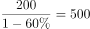吨。

故正确答案为C。

---

## 第 2 题　qid 2377248 · 数学运算

某会议室共5排座位，每排的座位数依次为10、9、8、7、6个。甲、乙两人随机选择位置入座，则他们左右相邻的概率:

- **A**. 
不到

- **B**. 
在之间
　✅
- **C**. 
在之间

- **D**. 
高于

**答案**：B

**官方解析**

因每排座位数依次为10、9、8、7、6个，则会议室共有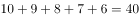个座位，挑选两个座位让甲、乙坐，总的情况数为。

要让两人左右相邻，则若两人在第一排左右相邻的情况数为，在第二排左右相邻的情况数为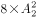，在第三排左右相邻的情况数为，在第四排左右相邻的情况数为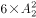，在第五排左右相邻的情况数为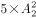，则两人左右相邻满足条件的情况数为，题目所求概率为，在~之间。

故正确答案为B。

---

## 第 3 题　qid 2377251 · 数学运算

商店购入一百多件A款服装，其单件进价为整数元，总进价为1万元。已知单件B款服装的定价为其进价的1.6倍，其进价为A款服装的，销售每件B款服装的利润正好为A款服装的一半。某日商店以定价销售A款服装的总销售额超过2500元。问当天至少销售了多少件A款服装？

- **A**. 13
- **B**. 15
- **C**. 17　✅
- **D**. 19

**答案**：C

**官方解析**

假设A款服装每件进价为，则B款服装每件进价为，定价为，每件利润为，A款服装每件定价为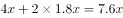。假设某日A款服装销售量为，则，当取得最大值时，可取得最小值。因购进100多件A款服装，单件进价为整数元，总进价为1万元， 则10000能被整除且，满足条件的最大值为20，此时，则至少售出了17件A款服装。

故正确答案为C。

---

## 第 4 题　qid 2377255 · 数学运算

某企业员工编号为6位自然数，其中前两位代表入职年份的最后两位数，第3位代表所属部门，后3位代表员工当年在部门中的入职顺序。2018年入职的员工小张发现，自己的员工编号能同时被5、9和101整除。问当年他所在的部门最少可能有多少人入职？

- **A**. 不到250人
- **B**. 250～499人之间　✅
- **C**. 500～749人之间
- **D**. 超过749人

**答案**：B

**官方解析**

小张18年入职，则6位工号前两位为18。由于其员工编号能同时被5、9、101整除，因此，其6位工号组成的数是5、9、101的最小公倍数4545的倍数。前两位是18且是4545倍数的六位数只有4545的40倍为181800，及其41倍为186345。已知后三位为员工入职顺序，故其部门18年最少有345人入职，在B项的范围内。
故正确答案为B。

---

## 第 5 题　qid 2377277 · 数学运算

甲、乙两个企业2018年投入的研发经费之和总计占收入之和的。其中，甲企业的收入是乙企业的2倍，投入的研发经费比乙企业多。如甲、乙企业投入的研发经费占各自收入的比重分别为和，则有：

- **A**. 

- **B**. 
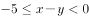
　✅
- **C**. 

- **D**. 

**答案**：B

**官方解析**

甲收入是乙的2倍，设乙收入是，则甲收入是；甲研发经费比乙多，设乙研发经费为，则甲为。此时甲乙研发经费之和为，收入之和为，经费之和占收入之和的，则，整理得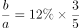。甲、乙研发经费占各自收入比重分别为和，则，，所求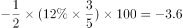，在B项范围内。

故正确答案为B。

---

## 第 6 题　qid 2377279 · 数学运算

2016年某电子产品定价为n元/台，2017年由于技术升级成本降低，定价降低，每台产品利润提升，2017年全年销售这种产品的总利润较2016年增加了。那么，2017年的销量比2016年：

- **A**. 
提高了不到
　✅
- **B**. 
提高了或以上

- **C**. 
降低了不到

- **D**. 
降低了或以上

**答案**：A

**官方解析**

赋值2016年每台电子产品的利润为100元，则2017年每台产品利润提升之后利润为110元。设2016年的销量为台，则2016年的总利润为，由于2017年总利润比2016年增加了，因此2017年总利润为，则2017年销量为，即2017年的销量比2016年提高了。

故正确答案为A。

---

## 第 7 题　qid 2377282 · 数学运算

小张从甲地出发匀速前往乙地，同时小李和小王从乙地出发匀速前往甲地，小张和小李在途中的丙地相遇，小张和小王在途中的丁地相遇。已知小张的速度比小李快一半，小王的速度比小李慢一半，则丙、丁两地之间的距离与甲、乙两地之间的距离之比为：

- **A**. 2:15
- **B**. 1:4
- **C**. 3:20　✅
- **D**. 1:15

**答案**：C

**官方解析**

设甲乙两地的距离为，小张、小李、小王的速度分别为、、，由下图可知，小张和小李相遇时用时为，小张和小王相遇时用时为，因此小张走丙、丁之间的路程所用时为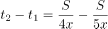，所以丙、丁之间的路程。故丙、丁两地之间的距离与甲、乙两地之间的距离之比为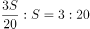。

故正确答案为C。

---

## 第 8 题　qid 2377283 · 数学运算

现用5700立方厘米的蜡制作二十多个同样大小，且长、宽、高均为整数厘米的长方体实心蜡块，问蜡块的尺寸有多少种不同的可能性？

- **A**. 4
- **B**. 6
- **C**. 10　✅
- **D**. 16

**答案**：C

**官方解析**

5700立方厘米的蜡制作二十多个同样大小的长方形实心蜡块，将5700因式分解为，其因数为二十多的只有一种情况，因此可以拆分为25个，每个体积为立方厘米。蜡块的尺寸分类讨论如下：

①若长宽高有两条为1厘米：，1种情况；

②若长宽高只有一条为1厘米：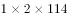，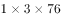，，，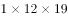，5种情况；

③若长宽高均不为1厘米：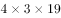，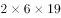，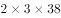，，4种情况。

所以共有种情况。

故正确答案为C。

---

## 第 9 题　qid 2377285 · 数学运算

某农户在半径为100米的圆形及内接的等边六边形田地中的不同区域种植不同作物，如图所示。已知阴影面积种植A作物，平均年产量为2公斤/平方米；空白区域种植B作物，平均年产量为1公斤/平方米。问每年两种作物的总产量在以下哪个范围内?（，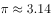）

- **A**. 不到40吨
- **B**. 40～45吨之间
- **C**. 45～50吨之间　✅
- **D**. 50吨以上

**答案**：C

**官方解析**

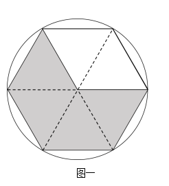

如图一，连接六边形各顶点做辅助线，可将六边形切割成6块完全相等的等边三角形，每个三角形的边长为圆的半径100m。

如图二，做等边三角形ABO的高AH，，，则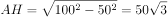，则三角形ABO的面积为 。同理，每个三角形的面积都是 。

所以阴影面积为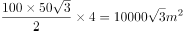。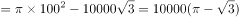。已知阴影部分的作物年平均产量为2公斤/平方米，空白区域的作物年平均产量为1公斤/平方米，所以总产量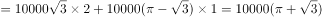，在45~50吨之间。

故正确答案为C。

---
