# 2019年420联考《行测》题（安徽卷）（网友回忆版）

> 数量关系 · 15 题 · 安徽 2019

## 第 1 题　qid 2376451 · 数学运算

林先生要将从故乡带回的一包泥土分成小包装送给占其朋友总数的老年朋友。在分包过程中发现，如果每包200克，则少500克；如果每包150克，则多250克。那么，林先生的朋友共有多少人?

- **A**. 15
- **B**. 30
- **C**. 50　✅
- **D**. 100

**答案**：C

**官方解析**

设林先生的老年朋友为人，根据分包过程可得：，解得人。因老年朋友占朋友总数的，则林先生的朋友总共有：人。

故正确答案为C。

注：本题并未说明每人分1包，不够严谨；但是不按每人1包则有无数种可能，无法求解。

---

## 第 2 题　qid 2376452 · 数学运算

小王在商店消费了90元，口袋里只有1张50元、4张20元、8张10元的钞票，他共有几种付款方式，可以使店家不用找零钱?

- **A**. 5
- **B**. 6
- **C**. 7　✅
- **D**. 8

**答案**：C

**官方解析**

根据题干条件分析，付款方式可包含使用50元与不使用50元两种情况。对情况进行枚举可得：

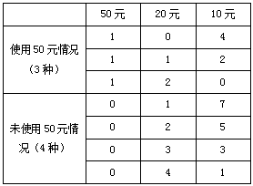

可得共有7种付款方式，可以使店家不用找零钱。

故正确答案为C。

---

## 第 3 题　qid 2376459 · 数学运算

甲乙两人相约骑共享单车运动健身。停车点现有9辆单车，分属3个品牌，各有2、3、4辆。假如两人选择每一辆单车的概率相同，两人选到同一品牌单车的概率约为：

- **A**. 
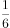

- **B**. 

- **C**. 
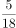
　✅
- **D**. 

**答案**：C

**官方解析**

假设三个品牌分别为A、B、C，两人各选一辆单车的情况数共有种。两人选到同一品牌的单车，包含三种情况：

（1）两人同时选到A品牌，情况数为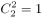；

（2）两人同时选到B品牌，情况数为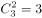；

（3）两人同时选到C品牌，情况数为；

则两人选到同一品牌单车的概率。

故正确答案为C。

---

## 第 4 题　qid 2376465 · 数学运算

某次田径运动会中，选手参加各单项比赛计入所在团体总分的规则为：一等奖得9分，二等奖得5分，三等奖得2分。甲队共有10位选手参赛，均获奖。现知甲队最后总分为61分，问该队最多有几位选手获得一等奖？

- **A**. 3
- **B**. 4
- **C**. 5　✅
- **D**. 6

**答案**：C

**官方解析**

设获得一等奖、二等奖、三等奖的人数分别为、、，根据题意得：，，整理两式，消去得：。

问获得一等奖人数最多，考虑从大到小代入：

代入D项，若，代入，为负且不是整数，排除；

代入C项，若，代入，解得，，符合题意。

故正确答案为C。

---

## 第 5 题　qid 2376471 · 数学运算

小张用10万元购买某只股票1000股，在亏损时，又增持该只股票1000股。一段时间后，小张将该只股票全部卖出，不考虑交易成本，获利2万元。那么，这只股票在小张第二次买入到卖出期间涨了多少？

- **A**. 

- **B**. 

- **C**. 

　✅
- **D**. 

**答案**：C

**官方解析**

10万元购买1000股，即100元/股。在亏损时，即每股市值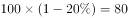元，购得1000股，成本需要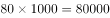元，即8万元。

将这2000股全部卖出后获利2万元，共卖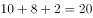万元，即卖出价格为。那么小张第二次买入为80元/股，卖出为100元/股，共涨了。

故正确答案为C。

---

## 第 6 题　qid 2376445 · 数学运算

小林在距家1.5公里的工厂上班。一天，小林出发10分钟后，父亲老林发现小林的手机没带，立即追出去，并在距离工厂500米的地方追上了他。如果老林追赶的速度比小林快6公里/小时，那么，下列关于小林速度，求值所列方程正确的是：

- **A**. 

　✅
- **B**. 

- **C**. 
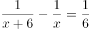

- **D**. 
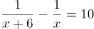

**答案**：A

**官方解析**

根据题意，老林从家到追上小林，老林和小林行驶的路程均为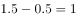 公里，老林比小林少用 分钟，即 小时。小林速度为，老林速度为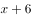，则。

故正确答案为A。

---

## 第 7 题　qid 2376446 · 数学运算

幼儿园老师设计了一个摸彩球游戏，在一个不透明的盒子里混放着红、黄两种颜色的小球，它们除了颜色不同，形状、大小均一致。已知随机摸取一个小球，摸到红球的概率为三分之一。如果从中先取出3红7黄共10个小球，再随机摸取一个小球，此时摸到红球的概率变为五分之二，那么原来盒中共有红球多少个？

- **A**. 5　✅
- **B**. 10
- **C**. 15
- **D**. 20

**答案**：A

**官方解析**

假设原来盒子中共有个红球，因随机摸取一个小球，摸到红球的概率为，则原来盒子中共有个小球。取出红黄共个小球后，红球剩下个，小球总个数为，此时随机摸取一个小球，摸到红球的概率为，则，解得。

故正确答案为A。

---

## 第 8 题　qid 2376448 · 数学运算

一位学生在距离热气球100米处观看它起飞。在热气球起飞后，学生注意到热气球顶部从他的仰角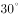上升到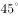，再从上升到的位置分别用了11秒和17秒。则前后两段时间热气球平均上升速度的比值约为：

- **A**. 0.89　✅
- **B**. 0.91
- **C**. 1.12
- **D**. 1.10

**答案**：A

**官方解析**

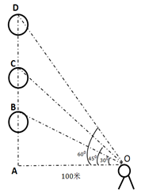

如图所示：当仰角为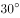时，在中，

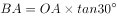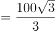米；当仰角为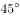时，在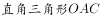中， 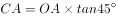米；当仰角为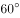时，在中，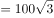米。两段时间上升的距离分别为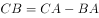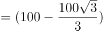米，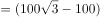米，则两段时间平均上升速度比为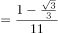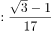。 

故正确答案为A。

---

## 第 9 题　qid 2376449 · 数学运算

小张、小李和小王三人以擂台形式打乒乓球，每局2人对打，输的人下一局轮空。半天下来，小张共打了6局，小王共打了9局，而小李轮空了4局。那么，小李一共打了多少局？

- **A**. 5局
- **B**. 7局　✅
- **C**. 9局
- **D**. 11局

**答案**：B

**官方解析**

小李轮空4局，说明小王和小张打了4局。小王共打9局，则小王和小李打了9-4=5局。小张共打6局，则小张和小李打了6-4=2局，所以小李共打5+2=7局。
故正确答案为B。

---

## 第 10 题　qid 2376450 · 数学运算

某楼盘的地下停车位，第一次开盘时平均价格为15万元/个；第二次开盘时，车位的销售量增加了一倍、销售额增加了。那么，第二次开盘的车位平均价格为：

- **A**. 10万元/个
- **B**. 11万元/个
- **C**. 12万元/个　✅
- **D**. 13万元/个

**答案**：C

**官方解析**

赋值第一次车位销售量为1，则。根据题意，第二次开盘时，销售量增加了一倍、销售额增加了，可得第二次销售量为，销售额为，则第二次平均价格为。

故正确答案为C。

---

## 第 11 题　qid 2376447 · 数学运算

调酒师调配鸡尾酒，先在调酒杯中倒入120毫升柠檬汁，再用伏特加补满，摇匀后倒出80毫升混合液备用，再往杯中加满番茄汁并摇匀，一杯鸡尾酒就调好了。若此时鸡尾酒中伏特加的比例是，问调酒杯的容量是多少毫升？

- **A**. 160
- **B**. 180
- **C**. 200　✅
- **D**. 220

**答案**：C

**官方解析**

假设调酒杯的容量为毫升，在原有120毫升柠檬汁的基础上，用伏特加补满，因此加入伏特加的量为，故伏特加浓度为。混匀后倒出80毫升后，还剩余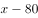毫升混合液，此时伏特加的量为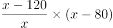。最后加入番茄汁，但是伏特加的量无变化，可得方程：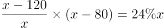。

由于本题属于分式方程，直接计算难度太高，故考虑代入选项验证。优先选择好算的选项入手，C项为整百的数，因此代入C项。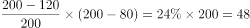，等式成立。

故正确答案为C。

---

## 第 12 题　qid 2376466 · 数学运算

太阳高度角是太阳光的入射方向和地平面之间的夹角。在正午时，太阳高度角为，为纬度，为太阳赤纬。已知小陈的身高为180厘米，他所在地的纬度为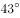，当日太阳赤纬为。那么，在正午时他的影子长度约为：

- **A**. 60厘米
- **B**. 90厘米
- **C**. 104厘米　✅
- **D**. 208厘米

**答案**：C

**官方解析**

根据题干，正午时太阳高度角为。如下图所示，在中，AC代表小陈的身高，故为180厘米。AB代表太阳光，由于正午太阳高度角为，故为。为，BC即为影子的长度。根据直角三角形三边关系可知，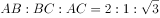，因此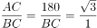，则。

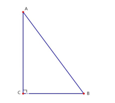

故正确答案为C。

---

## 第 13 题　qid 2376467 · 数学运算

某河道由于淤泥堆积影响到船只航行安全，现由工程队使用挖沙机进行清淤工作，清淤时上游河水又会带来新的泥沙。若使用1台挖沙机300天可完成清淤工作，使用2台挖沙机100天可完成清淤工作。为了尽快让河道恢复使用，上级部门要求工程队25天内完成河道的全部清淤工作，那么工程队至少要有多少台挖沙机同时工作？

- **A**. 4
- **B**. 5
- **C**. 6
- **D**. 7　✅

**答案**：D

**官方解析**

假定每天每台挖沙机效率为1，每天新增泥沙的量为，原有泥沙量为。由于1台挖沙机300天可完成清淤工作，可得：；由于2台挖沙机100天可完成清淤工作，可得：。两式联立，解得，。若要求工程队25天内完成河道的全部清淤工作，此时，设所需的挖沙机台数为，则有，解得，至少需要7台挖沙机同时工作。

故正确答案为D。

---

## 第 14 题　qid 2376497 · 数学运算

因装修需要，拟在边长为2m的正方形浴室正中央处安装圆形淋浴喷头，喷头直径为10cm，出水喷射角度与垂直方向的最大夹角为。假设不考虑重力影响，要使喷头喷射到的面积能完全覆盖浴室，而且考虑施工实际，只有下列四个选项可选，则在满足设计要求的情况下，喷头底面距离地面可供选择的最低高度是多少？（）

- **A**. 185cm
- **B**. 190cm　✅
- **C**. 195cm
- **D**. 200cm

**答案**：B

**官方解析**

根据题干要求“要使喷头喷射到的面积能完全覆盖浴室”，即。设喷头底面距离地面高度为hcm，由“出水喷射角度与垂直方向的最大夹角为”，可知喷头外延能够喷射的最远距离l为cm。由“喷头直径为10cm”可知喷头半径r为5cm，喷头喷射的总半径。则喷头喷射的面积，正方形浴室的面积。由，解得。结合题干要求“考虑施工实际，只有下列四个选项可选”，则要选择略大于187的选项，B项符合。

故正确答案为B。

备注：这道题目本质上是一道错题，命题人在命题过程中只考虑了面积大小关系，但从实际情况来看，圆形喷头喷出的水会打在墙壁上，但房间的四角喷射不到。而此题如果以喷射半径覆盖房间，，进行计算，，没有答案。

---

## 第 15 题　qid 2376501 · 数学运算

如右图所示，一条河流的两岸分别有A、B两处景点，河面宽80米，A与B的直线距离是100米。现需铺设一条观光栈道连接A与B。已知陆地栈道的铺设费用是0.1万元/米，河面栈道的铺设费用是0.125万元/米，则最少需要铺设费用：

- **A**. 12.5万元　✅
- **B**. 12万元
- **C**. 11.5万元
- **D**. 11万元

**答案**：A

**官方解析**

如图所示若沿AB建造观光栈道，则需建造河面栈道AB段100m，共需要铺设费用万元；若沿AO→OB铺设栈道，则需建造河面栈道AO段80m和陆地栈道OB段，共需要铺设费用万元。通过所给条件对比分析，最少铺设费用为12.5万元（沿AB段建造）。

故正确答案为A。

备注：如若讨论陆地与河面栈道的转折点：在OB段上取任意点C，设。沿AC→CB铺设栈道，则需建造河面栈道AC段和陆地栈道CB段，共需要铺设费用万元。取特值分析x和y的增减关系，取值如表：

由特值分析可知，x取值越大，费用y越小。故时（即C点与B点重合）， y可取得最小值12.5。

---
