# 2019年420联考《行测》题（山东卷）（网友回忆版）

> 数量关系 · 15 题 · 山东 2019

## 第 1 题　qid 2376983 · 数学运算

甲、乙、丙三人各出100万元资金购买某种每股10元的股票。当股价涨到12元时甲卖出，丙卖出；当股价涨到15元时甲卖出剩余部分的，乙卖出；此后股价回落到13元时三人全部卖出剩余股票。如不计税费，则此次投资获利最高的人比获利最低的人多赚多少万元？

- **A**. 1
- **B**. 14
- **C**. 15　✅
- **D**. 18

**答案**：C

**官方解析**

根据题意可得：甲、乙、丙三人各购买了10万只股票。分析情况：

当股价涨到12元时，甲卖出，获利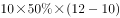万元；丙卖出，获利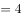万元。

当股价涨到15元时，甲卖出剩余部分的，获利万元；乙卖出，获利万元。

最后股价回落到13元，甲、乙、丙全部卖出剩余股票，甲获利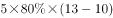万元；乙获利万元；丙获利万元。

甲共获利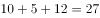万元；乙共获利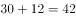万元；丙共获利万元，获利最多的乙比获利最低的甲多赚万元。

故正确答案为C。

---

## 第 2 题　qid 2376989 · 数学运算

小刘买120元的玫瑰、康乃馨和百合共20朵。其中康乃馨价格为3元/朵，百合和玫瑰的价格也均为整数元。其中，玫瑰的价格比百合便宜但比康乃馨贵；购买玫瑰的数量少于百合但多于康乃馨，问玫瑰最高多少元/朵？

- **A**. 4
- **B**. 5
- **C**. 6　✅
- **D**. 7

**答案**：C

**官方解析**

本题未知数较多，等量关系很少，属于不定方程问题，可采用代入排除法的思想来做题。问玫瑰单价最高可能为多少元，从D项开始代入，D项：玫瑰为7元，那么百合至少为8元，平均价格为元，两者比均价高出1元、2元，康乃馨价格比均价低3元，而且要求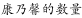，根据平均数混合线段法：那么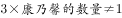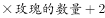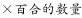，排除D项。代入C项：玫瑰为6元，那么百合至少为7元，此时玫瑰的价格等于平均价格，说明康乃馨和百合的平均价格也为6元。两者混合，根据线段法，距离和量成反比，那么百合的数量：康乃馨的数量。设购买康乃馨数量为只，那么百合的数量为只，玫瑰的数量为只，列式：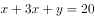，即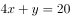，且。最小为1，从1开始代入，当，，不满足，排除；当，，不满足，排除；当，，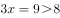，满足，同时元也满足。

故正确答案为C。

---

## 第 3 题　qid 2376993 · 数学运算

某集团有13个分公司，每个分公司的员工数均不超过50人。甲和乙两个分公司各招聘若干人后，员工人数分别达到76人和137人，且集团平均每个分公司的员工数增加了9人。问甲分公司和乙分公司在招聘前的员工数最多相差几人？

- **A**. 4　✅
- **B**. 3
- **C**. 2
- **D**. 1

**答案**：A

**官方解析**

甲乙新招聘若干人后，集团平均每个分公司的员工数增加了9人，说明甲乙分公司共招聘了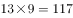人。甲乙两个分公司招聘前的员工数和为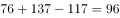人。问甲乙分公司招聘前的员工数最多相差几人，且每个分公司的员工数均不超过50人，最多为50人，甲乙分公司中一个为50人，另一个公司就为人，两者相差人。

故正确答案为A。

---

## 第 4 题　qid 2377006 · 数学运算

某单位所有员工都参加艺术、科学、人文三类书籍的阅读活动，每名员工至多阅读2种书籍，阅读1种书籍员工人数比阅读2种书籍的人数多一半，阅读艺术类书籍的人数是阅读科学类书籍人数的，阅读科学类书籍人数是阅读人文类书籍人数的，问该单位至少有多少人？

- **A**. 20
- **B**. 25　✅
- **C**. 30
- **D**. 50

**答案**：B

**官方解析**

根据阅读艺术类书籍人数是阅读科学类书籍人数的，可得艺术类：科学类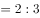 ；根据阅读科学类书籍人数是阅读人文类书籍人数的 ，可得科学类：人文类，根据倍数特性，阅读科学类人数同时满足3和4的倍数，即科学类人数是12的倍数，那么艺术类：科学类：人文类，因求“该单位至少有多少人”，则先赋值阅读艺术类、科学类、人文类书籍的人数分别是8人次、12人次、15人次。设阅读2种书籍的人数为人，则阅读1种书籍的人数为人，根据三集合容斥原理公式：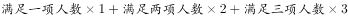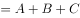，代入得：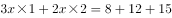，解得，满足为整数，则总人数至少为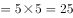人，对应B项。

故正确答案为B。

---

## 第 5 题　qid 2377013 · 数学运算

打字员小张每10分钟可录入1页文档，平均每页有2个错字；打字员小李每15分钟可录入1页文档，平均每页有1个错字，现有12页、7页、11页、8页、14页和20页的6篇文档需要录入，要求每篇文档由同一人录入，且总共在9个小时内完成。问录入文档的错误率最低可以控制在平均每页多少个错字？

- **A**. 不高于1.4个
- **B**. 高于1.4个但不高于1.5个
- **C**. 高于1.5个但不高于1.6个　✅
- **D**. 高于1.6个

**答案**：C

**官方解析**

小张平均每页2个错字，小李平均每页1个错字，要使每页错误率最低，就让小李完成页数尽可能多，规定9小时内完成，小李完成1页需要15分钟，小李9小时完成页数最多页。要求每篇文档同一人录入，小李最多完成页数页。还剩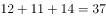页，小张9小时完成页数最多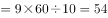页，小张可在9小时内完成。错误率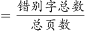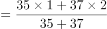，高于1.5个但不高于1.6个，对应C项。

故正确答案为C。

---

## 第 6 题　qid 2376870 · 数学运算

A、B两台高性能计算机共同运行30小时可以完成某个计算任务，如两台计算机共同运行18小时后，A、B计算机分别抽调出和的计算资源去执行其他任务，最后任务完成的时间会比预计时间晚6小时，如两台计算机共同运行18小时后，由B计算机单独运行，还需要多少小时才能完成该任务？

- **A**. 22
- **B**. 24
- **C**. 27　✅
- **D**. 30

**答案**：C

**官方解析**

分别抽调出和的计算资源后，两台计算机效率分别变为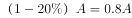，，因最终完成比预计时间晚6小时，则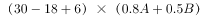，解得。假设，，任务总量为，则两台计算机共同运行18小时后，剩余任务量为，B计算机单独运行需要小时。

故正确答案为C。

---

## 第 7 题　qid 2376871 · 数学运算

某商店中甲、乙、丙三种商品销量分别为6件、10件和5件，总销售额为元，其中乙商品的销售额是甲商品的1.2倍，丙商品的销售额是甲商品的倍，问如果只卖甲商品，至少要卖多少件销售额才能超过元？

- **A**. 20
- **B**. 21
- **C**. 22　✅
- **D**. 24

**答案**：C

**官方解析**

假设6件甲商品的销售额为30元，每件销售单价为元，则10件乙商品的销售额为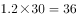元，5件丙商品的销售额为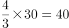元，，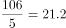，则至少卖出22件甲商品，销售额才能超过元。

故正确答案为C。

---

## 第 8 题　qid 2376872 · 数学运算

集装箱内部空间的长、宽和高分别为20英尺、7英尺和7英尺。某种货物的包装箱尺寸为英尺，问一个集装箱内最多可以装多少箱这种货物？

- **A**. 29
- **B**. 30
- **C**. 31
- **D**. 32　✅

**答案**：D

**官方解析**

要想装的货物尽可能多，则集装箱浪费的体积应尽可能少。以这个面为底面，已知货物尺寸有一个的面，所以一层可放8个货物（如下图所示）。已知货物高为5，大集装箱高为20，则可以放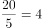层，即共放个。

故正确答案为D。

---

## 第 9 题　qid 2376874 · 数学运算

小王和小李参加某公司招聘考试，笔试成绩占总成绩的，面试成绩占总成绩的。笔试部分小王得分比小李高6分，面试部分小李得80分，两人的总成绩刚好相同，问小王面试得了多少分？

- **A**. 74
- **B**. 71
- **C**. 78
- **D**. 76　✅

**答案**：D

**官方解析**

方法一：设小李笔试成绩为分，小王面试成绩为分。由于笔试部分小王比小李高6分，所以小王笔试分数为分。笔试成绩占总成绩，则面试成绩占总成绩的。根据两人总成绩相同可知：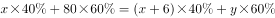，解得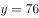，即小王面试分数为76分。 

方法二：由于笔试部分小王比小李高6分，且笔试占总成绩，则转化为总成绩，在笔试方面，小王比小李高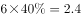分。要想最终总成绩相等，则在面试方面转化为总成绩后，小李应比小王高2.4分。则转化前小李面试应比小王高分，因此小王面试分数为分。

故正确答案为D。

---

## 第 10 题　qid 2376877 · 数学运算

某老旧写字楼重新装修，需要将原有的窗户全部更换为单价90元每扇的新窗户。已知每7扇换下来的旧窗户可以跟厂商兑换一个新窗户。全部更换完毕后共花费16560元且剩余4个旧窗户没有兑换，那么该写字楼一共有多少扇窗户？

- **A**. 214　✅
- **B**. 218
- **C**. 184
- **D**. 188

**答案**：A

**官方解析**

方法一：设兑换了个新窗户，根据“ 7个旧窗户换1个新窗户，且最后剩4个旧窗户”可知：总旧窗户数。由于所有旧窗户全部换新，所以新买的窗户数为。每个新窗户90元，共花费16560元，则，解得。则总旧窗户数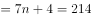，总旧窗户数即总窗户数。

方法二：7个旧窗户可以换1个新窗户，且最后有4个旧窗户没兑换，则总旧窗户数是7的倍数，只有A项满足。（总旧窗户数即总窗户数）

故正确答案为A。

---

## 第 11 题　qid 2376878 · 数学运算

甲、乙两人分别从A、B两地同时出发，6小时后在A、B两地中点相遇，如果甲每小时多走8公里，乙提前2小时出发，则甲、乙两人仍在中点相遇，那么A、B两地相距多少公里？

- **A**. 168
- **B**. 192　✅
- **C**. 256
- **D**. 304

**答案**：B

**官方解析**

两人同时出发6小时后在中点相遇，因此两人路程相同，则有，故。第二次相遇点也在中点，因此乙提前2小时出发后，速度保持不变则剩余路程需要时间为小时。则甲提速后从开始出发到与乙在中点相遇也用时4小时。两次相遇点均为中点故甲所走的路程均为总路程的一半，路程不变因此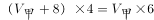，解得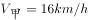。所以两地路程为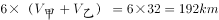。

故正确答案为B。

---

## 第 12 题　qid 2376879 · 数学运算

一个盒子里有乒乓球100多个，如果每次取5个出来最后剩下4个，如果每次取4个最后剩3个，如果每次取3个最后剩2个，那么如果每次取12个最后剩多少个？

- **A**. 11　✅
- **B**. 10
- **C**. 9
- **D**. 8

**答案**：A

**官方解析**

根据题意，取5个剩4个说明乒乓球的总数加1是5的倍数，同理取4个剩3个说明乒乓球的总数加1是4的倍数，取3个剩2个说明乒乓球的总数加1是3的倍数，故乒乓球的总数加1应同时满足5、4、3的倍数，因此乒乓球的总数。由于乒乓球有100多个，即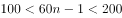，所以解得。当时，乒乓球的数量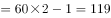，每次取12个最后会剩余11个；当时，乒乓球的数量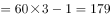，每次取12个最后也会剩余11个。

故正确答案为A。

---

## 第 13 题　qid 2376880 · 数学运算

某研究团队开展小学生身体健康状况调查活动，需要从某市三所小学中抽取部分小学生组成研究样本，其中实验小学抽取的人数占其他两所小学抽取人数的五分之一，解放路小学抽取的人数占其他两所小学抽取人数的二分之一，精英小学抽取的人数为180人，那么三所小学合计抽取多少人？

- **A**. 540
- **B**. 480
- **C**. 360　✅
- **D**. 280

**答案**：C

**官方解析**

根据“实验小学抽取的人数占其他两所小学抽取人数的五分之一”可知总人数是6的倍数，实验小学抽取人数占总人数的；“解放路小学抽取的人数占其他两所小学抽取人数的二分之一”可知总人数是3的倍数，解放路小学抽取人数占总人数的。因此设总抽取人数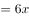，则实验小学抽取人数，解放路小学抽取人数，精英小学抽取人数，解得，因此三所小学共抽取人数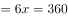人。

故正确答案为C。

---

## 第 14 题　qid 2376881 · 数学运算

某工厂生产过程中需要用到A、B、C三种零件，工厂仓库中原有三种零件的数量比为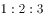，现在采购部门新购进一批零件，新购进三种零件的数量比是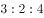，工厂每天使用的三种零件数量相同，当A零件用完的时候，B零件还剩下10个，C零件还剩下170个，请问工厂仓库中原有A、B、C零件各多少个？

- **A**. 40   80  120
- **B**. 50  100  150
- **C**. 60  120  180　✅
- **D**. 70  140  210

**答案**：C

**官方解析**

设原有三种零件的数量分别为，，，再次购买的数量分别为，，，工厂每天使用的三种零件数量相同，所以A、B、C三种零件使用的总量相同。当A零件用完时，一共用了，因此B、C两种零件也用了。根据B零件剩余10个，C零件剩余170个可得：

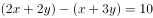······①

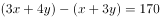······②

①式整理得，②式整理得。联立解得，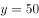。所以原有三种零件的数量分别为60，120，180。

故正确答案为C。

---

## 第 15 题　qid 2376882 · 数学运算

某啤酒厂为促销啤酒，开展6个空啤酒瓶换1瓶啤酒的活动，孙先生去年花钱先后买了109瓶该品牌啤酒，期间不断用空啤酒瓶去换啤酒，请问孙先生去年一共喝掉了多少瓶啤酒？

- **A**. 127
- **B**. 128
- **C**. 129
- **D**. 130　✅

**答案**：D

**官方解析**

根据空瓶换酒公式：个酒瓶可以换1瓶酒，个空瓶最多可以喝到瓶酒。6个空酒瓶换1瓶啤酒，孙先生花钱买了109瓶啤酒，产生的109个空瓶，最多可喝到瓶酒，因啤酒数一定是整数，故最多可以喝到21瓶酒。加上花钱买到109瓶酒，一共可以喝到瓶。

故正确答案为D。

---
