# 2019年420联考《行测》题（广西卷）（网友回忆版）

> 数量关系 · 10 题 · 广西 2019

## 第 1 题　qid 2377041 · 数学运算

某小学组织6个年级的学生外出参观包括A科技馆在内的6个科技馆，每个年级任选一个科技馆参观，则有且只有两个年级选择A科技馆的方案有：

- **A**. 1800种
- **B**. 18750种
- **C**. 3800种
- **D**. 9375种　✅

**答案**：D

**官方解析**

6个年级参观6个科技馆，每个年级任选一个，要求有且只有两个年级选择A馆。可先从6个年级中抽取两个参观A馆，有种选择；

剩余4个年级，随机参观剩余5个科技馆，因各年级之间可以选择相同的馆，故每个年级都有5种选择，共计种选择。

故6个年级总计选择方案有：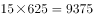种选择。

故正确答案为D。

备注：根据题意，6个年级之间有可能重复选择同一个科技馆，故剩余4个年级参观剩余5个科技馆，并非种选择。

---

## 第 2 题　qid 2377061 · 数学运算

某技校在每月首日招收学员，学习时限以月为周期，每月首日为考核日。考核通过即离校。据统计，每批学员学习1个月后，在次月初的考核通过的比例为，而学习2个月后，仍未通过考核的占该批学员的，学习3个月后该批学员全部考核通过离校。如果从3月份起，该技校每个月招收300名学员，则7月2日在该技校的学员有多少名？

- **A**. 540
- **B**. 600
- **C**. 720　✅
- **D**. 810

**答案**：C

**官方解析**

根据表格可知，7月2日在校的学员数量包括5月剩余150人，6月剩余270人，以及7月1日新招的300人，共计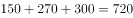人。

故正确答案为C。

---

## 第 3 题　qid 2377186 · 数学运算

如图所示，在长为64米、宽为40米的长方形耕地上修建宽度相同的两条道路（一条横向、一条纵向），把耕地分为大小不等的四块。已知修路后耕地总面积为1377平方米，则该道路路面宽度为多少米？

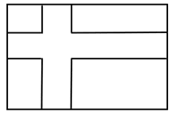

- **A**. 10
- **B**. 11
- **C**. 12
- **D**. 13　✅

**答案**：D

**官方解析**

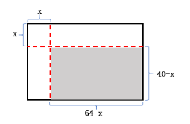

设道路的宽度为。将两条道路移至边缘处（如下图所示），耕地面积为阴影部分，其长为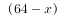米，宽为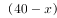米，所以耕地面积为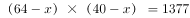，由于乘积为奇数，则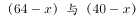均必为奇数，所以为奇数，排除A、C两个选项，代入B选项：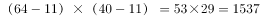，不符合题意，排除B选项。

故正确答案为D。

---

## 第 4 题　qid 2377054 · 数学运算

某饮料厂生产的A、B两种饮料均需加入某添加剂，A饮料每瓶需加该添加剂4克，B饮料每瓶需加3克，已知370克该添加剂恰好生产了这两种饮料共计100瓶，则A、B两种饮料各生产了多少瓶？

- **A**. 30、70
- **B**. 40、60
- **C**. 50、50
- **D**. 70、30　✅

**答案**：D

**官方解析**

设A、B两种饮料各生产了、瓶，根据题意得：，，解得：，。即A、B两种饮料各生产了70、30瓶。

故正确答案为D。

---

## 第 5 题　qid 2377050 · 数学运算

现有5盒动画卡片，各盒卡片张数分别为：7、9、11、14、17。卡片按图案分为米老鼠、葫芦娃、喜羊羊和灰太狼4种，每个盒内装的是同图案的卡片。已知米老鼠的卡片只有一盒，而喜羊羊、灰太狼图案的卡片数之和比葫芦娃图案的多1倍。据此可知，图案为米老鼠的卡片张数为：

- **A**. 7　✅
- **B**. 9
- **C**. 14
- **D**. 17

**答案**：A

**官方解析**

根据题意，5个盒子中卡片总数为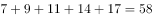个。又因为总共四种卡片，且喜羊羊、灰太狼两种卡片数量之和比葫芦娃多1倍，即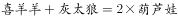。因此这三种卡片的数量之和是3的整数倍，即是3的整数倍，代入选项，只有A选项米老鼠的卡片张数是7的时候满足，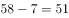是3的整数倍，其余均不满足。

故正确答案为A。

---

## 第 6 题　qid 2377047 · 数学运算

某农户饲养有肉兔和宠物兔两种不同用途的兔子共计2200只，所有兔子的毛色分为黑、白两种。肉兔中有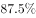的毛色为黑色，宠物兔中有毛色为白。据此可知，毛色为白色的肉兔至少有多少只？

- **A**. 25　✅
- **B**. 50
- **C**. 100
- **D**. 200

**答案**：A

**官方解析**

肉兔中有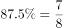毛色为黑，则有毛色为白。宠物兔中有毛色为白。设宠物兔有只，则肉兔有只。则肉兔的数量既是8的整数倍又是100的整数倍即200（8与100的最小公倍数）的整数倍，要使肉兔中毛色为白色的最少，应使肉兔的数量尽可能少，则肉兔最少为200只，故毛色为白色的肉兔至少为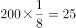只。

故正确答案为A。

---

## 第 7 题　qid 2377045 · 数学运算

A、B两地各有一批相同数量的货物需由某运输队用卡车完成交换。假设每辆卡车运送的货物箱数量相同，运输队首先从A地出发，中途时有10辆卡车抛锚，其余车辆必须每辆车再多运2箱。到达B地卸货后有15辆卡车不返程。因此参与返程的卡车每辆都需比出发时多装运6箱。据此可知，两地共有货物多少箱？

- **A**. 2000
- **B**. 1800
- **C**. 3600　✅
- **D**. 4000

**答案**：C

**官方解析**

设运输队从A地出发时共有辆卡车，每辆卡车运货物箱。根据题意可得：

······①

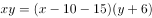······②

联立①②，化简之后得，

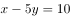······③

······④

解得，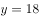，因此原来两地共有货物箱。

故正确答案为C。

---

## 第 8 题　qid 2377043 · 数学运算

在一次马拉松比赛中，某国运动员包揽了前四名，他们佩戴的参赛号码很有趣：一人的号码加4，另一人减4，第三人乘4，第四人除以8，其所得的数字都一样。且这四个号码中有1个三位数号码，2个两位数号码，1个一位数号码。而其中一位运动员在比赛中取得的名次也与自己的号码相同。据此可知，其中三位数的号码为：

- **A**. 120
- **B**. 128　✅
- **C**. 256
- **D**. 512

**答案**：B

**官方解析**

题干中四人对应的号码数分别设为、、、（均为正整数），根据题干条件可得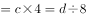，分析可知，一定是最大的，则一定是三位数。

代入A选项进行验证，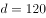时，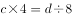，解得，非整数排除；

代入B选项进行验证，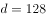时，，解得，，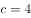，满足题干所有条件。

故正确答案为B。

---

## 第 9 题　qid 2377184 · 数学运算

某学校举行迎新篝火晚会，100名新生随机围坐在篝火四周，其中，小张与小李是同桌，他俩坐在一起的概率为：

- **A**. 
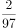

- **B**. 

- **C**. 
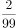
　✅
- **D**. 

**答案**：C

**官方解析**

方法一：100名新生围坐在篝火四周，总情况数为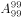（类似于n人的圆桌排列，方法数为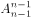）；小张与小李坐在一起，采用捆绑法，将小张与小李看成一个整体（内部有顺序）与另外98名新生进行圆桌排列，满足条件的方法数为，所以小张与小李坐在一起的概率为。

方法二：小李先坐好，剩下99个位置，小张与小李坐在一起，有2种选择，故。

故正确答案为C。

---

## 第 10 题　qid 2377040 · 数学运算

某儿童剧以团购方式销售门票，其票价如下：

现有甲、乙两个小学组织学生观看，若两个学校以各自学生总数分别购票，则两个学校门票共计需花费6120元；若两个学校将各自学生合在一起购票，则门票费为5040元。据此可知，两个小学相差多少人？

- **A**. 18　✅
- **B**. 19
- **C**. 20
- **D**. 21

**答案**：A

**官方解析**

根据已知条件，总人数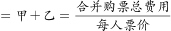人，为偶数，根据知和求差，奇偶同性，则甲-乙也是偶数，排除B、D两项。将A项代入验证，即，结合，可以求出，，则分开购票总费用元，满足题干条件。

故正确答案为A。

---
