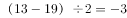
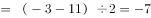
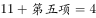
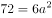
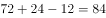

# 2019年420联考《行测》题（新疆卷）（网友回忆版）

> 数量关系 · 16 题 · 新疆 2019

## 第 1 题　qid 2377433 · 数学运算

13，19，-3，11，（  ）

- **A**. 8
- **B**. 5
- **C**. -4
- **D**. -7　✅

**答案**：D

**官方解析**

方法一：观察数列，无明显特征考虑作差。前一项减后一项作差得到新数列：-6，22，-14，观察发现新数列的每一项恰好为原数列下一项的二倍，即，，因此原数列规律为，故所求。

方法二：从第一项开始，每两项依次加和分别为32、16、8，这是一个等比数列，所以接下来应该是4。也就是，第五项7。

故正确答案为D。

---

## 第 2 题　qid 2376471 · 数学运算

小张用10万元购买某只股票1000股，在亏损时，又增持该只股票1000股。一段时间后，小张将该只股票全部卖出，不考虑交易成本，获利2万元。那么，这只股票在小张第二次买入到卖出期间涨了多少？

- **A**. 

- **B**. 

- **C**. 

　✅
- **D**. 

**答案**：C

**官方解析**

10万元购买1000股，即100元/股。在亏损时，即每股市值元，购得1000股，成本需要元，即8万元。

将这2000股全部卖出后获利2万元，共卖万元，即卖出价格为。那么小张第二次买入为80元/股，卖出为100元/股，共涨了。

故正确答案为C。

---

## 第 3 题　qid 2376451 · 数学运算

林先生要将从故乡带回的一包泥土分成小包装送给占其朋友总数的老年朋友。在分包过程中发现，如果每包200克，则少500克；如果每包150克，则多250克。那么，林先生的朋友共有多少人?

- **A**. 15
- **B**. 30
- **C**. 50　✅
- **D**. 100

**答案**：C

**官方解析**

设林先生的老年朋友为人，根据分包过程可得：，解得人。因老年朋友占朋友总数的，则林先生的朋友总共有：人。

故正确答案为C。

注：本题并未说明每人分1包，不够严谨；但是不按每人1包则有无数种可能，无法求解。

---

## 第 4 题　qid 2376452 · 数学运算

小王在商店消费了90元，口袋里只有1张50元、4张20元、8张10元的钞票，他共有几种付款方式，可以使店家不用找零钱?

- **A**. 5
- **B**. 6
- **C**. 7　✅
- **D**. 8

**答案**：C

**官方解析**

根据题干条件分析，付款方式可包含使用50元与不使用50元两种情况。对情况进行枚举可得：

可得共有7种付款方式，可以使店家不用找零钱。

故正确答案为C。

---

## 第 5 题　qid 2376449 · 数学运算

小张、小李和小王三人以擂台形式打乒乓球，每局2人对打，输的人下一局轮空。半天下来，小张共打了6局，小王共打了9局，而小李轮空了4局。那么，小李一共打了多少局？

- **A**. 5局
- **B**. 7局　✅
- **C**. 9局
- **D**. 11局

**答案**：B

**官方解析**

小李轮空4局，说明小王和小张打了4局。小王共打9局，则小王和小李打了9-4=5局。小张共打6局，则小张和小李打了6-4=2局，所以小李共打5+2=7局。
故正确答案为B。

---

## 第 6 题　qid 2376445 · 数学运算

小林在距家1.5公里的工厂上班。一天，小林出发10分钟后，父亲老林发现小林的手机没带，立即追出去，并在距离工厂500米的地方追上了他。如果老林追赶的速度比小林快6公里/小时，那么，下列关于小林速度，求值所列方程正确的是：

- **A**. 

　✅
- **B**. 

- **C**. 

- **D**. 

**答案**：A

**官方解析**

根据题意，老林从家到追上小林，老林和小林行驶的路程均为 公里，老林比小林少用 分钟，即 小时。小林速度为，老林速度为，则。

故正确答案为A。

---

## 第 7 题　qid 2376704 · 数学运算

甲、乙两个工程队共同参与一项建设工程。原计划由甲队单独施工30天完成该项工程三分之一后，乙队加入，两队同时再施工15天完成该项工程。由于甲队临时有别的业务，其参加施工的时间不能超过36天，那么为全部完成该项工程，乙队至少要施工多少天？

- **A**. 18　✅
- **B**. 20
- **C**. 24
- **D**. 30

**答案**：A

**官方解析**

根据题意可得，甲队单独完成这项工程需要天，则，得，则甲、乙效率之比为，赋值甲的效率为1，乙的效率为3，工程总量为。根据问题，乙队施工天数尽可能少，则甲队施工天数应尽可能多，其最多可为36天，则乙队施工天数至少天。

故正确答案为A。

---

## 第 8 题　qid 2376450 · 数学运算

某楼盘的地下停车位，第一次开盘时平均价格为15万元/个；第二次开盘时，车位的销售量增加了一倍、销售额增加了。那么，第二次开盘的车位平均价格为：

- **A**. 10万元/个
- **B**. 11万元/个
- **C**. 12万元/个　✅
- **D**. 13万元/个

**答案**：C

**官方解析**

赋值第一次车位销售量为1，则。根据题意，第二次开盘时，销售量增加了一倍、销售额增加了，可得第二次销售量为，销售额为，则第二次平均价格为。

故正确答案为C。

---

## 第 9 题　qid 2377412 · 数学运算

一家早餐店只出售粥、馒头和包子。粥有三种：大米粥、小米粥和绿豆粥，每份1元；馒头有两种：红糖馒头和牛奶馒头，每个2元；包子只有一种三鲜大肉包，每个3元。陈某在这家店吃早餐，花了4元钱，假设陈某点的早餐不重样，问他吃到包子的概率是多少？

- **A**. 

　✅
- **B**. 

- **C**. 

- **D**. 

**答案**：A

**官方解析**

花4元且不重样，可能分为3类：

1份馒头两种粥每种1份共有种情况；

两种馒头每种1份共有1种情况；

1个包子1份粥共有种，故总的情况有种。

其中吃到包子的情况为1个包子1份粥，有3种，所求概率。

故正确答案为A。

---

## 第 10 题　qid 2376467 · 数学运算

某河道由于淤泥堆积影响到船只航行安全，现由工程队使用挖沙机进行清淤工作，清淤时上游河水又会带来新的泥沙。若使用1台挖沙机300天可完成清淤工作，使用2台挖沙机100天可完成清淤工作。为了尽快让河道恢复使用，上级部门要求工程队25天内完成河道的全部清淤工作，那么工程队至少要有多少台挖沙机同时工作？

- **A**. 4
- **B**. 5
- **C**. 6
- **D**. 7　✅

**答案**：D

**官方解析**

假定每天每台挖沙机效率为1，每天新增泥沙的量为，原有泥沙量为。由于1台挖沙机300天可完成清淤工作，可得：；由于2台挖沙机100天可完成清淤工作，可得：。两式联立，解得，。若要求工程队25天内完成河道的全部清淤工作，此时，设所需的挖沙机台数为，则有，解得，至少需要7台挖沙机同时工作。

故正确答案为D。

---

## 第 11 题　qid 2376753 · 数学运算

甲、乙两部参加军事演习。甲部从大本营以60千米/小时的速度往西行进，乙部晚半小时由大本营往东行进，速度比甲部慢。两部同时接到军令紧急集合，集合地位于大本营正北某处。此时两部所在位置与集合地恰好构成有一角为30度的直角三角形。若两部同时调整方向往集合地行军，且保持速度不变，则可同时到达集合地。问集合地与大本营的距离约为多少千米？

- **A**. 38
- **B**. 41　✅
- **C**. 44
- **D**. 48

**答案**：B

**官方解析**

根据题意可得右图，

因甲部速度大于乙部且早出发半小时，故，则，。两部同时调整方向可同时到达集合地C，则甲部、乙部速度之比为，则乙部速度为千米/小时。

设乙部从B点到C点行驶时间为，则，，在直角三角形OCB中，，则，同理可得。因甲部比乙部早出发半小时即0.5小时，则，解得小时。，即约为41千米。

故正确答案为B。

---

## 第 12 题　qid 2376459 · 数学运算

甲乙两人相约骑共享单车运动健身。停车点现有9辆单车，分属3个品牌，各有2、3、4辆。假如两人选择每一辆单车的概率相同，两人选到同一品牌单车的概率约为：

- **A**. 

- **B**. 

- **C**. 

　✅
- **D**. 

**答案**：C

**官方解析**

假设三个品牌分别为A、B、C，两人各选一辆单车的情况数共有种。两人选到同一品牌的单车，包含三种情况：

（1）两人同时选到A品牌，情况数为；

（2）两人同时选到B品牌，情况数为；

（3）两人同时选到C品牌，情况数为；

则两人选到同一品牌单车的概率。

故正确答案为C。

---

## 第 13 题　qid 2376447 · 数学运算

调酒师调配鸡尾酒，先在调酒杯中倒入120毫升柠檬汁，再用伏特加补满，摇匀后倒出80毫升混合液备用，再往杯中加满番茄汁并摇匀，一杯鸡尾酒就调好了。若此时鸡尾酒中伏特加的比例是，问调酒杯的容量是多少毫升？

- **A**. 160
- **B**. 180
- **C**. 200　✅
- **D**. 220

**答案**：C

**官方解析**

假设调酒杯的容量为毫升，在原有120毫升柠檬汁的基础上，用伏特加补满，因此加入伏特加的量为，故伏特加浓度为。混匀后倒出80毫升后，还剩余毫升混合液，此时伏特加的量为。最后加入番茄汁，但是伏特加的量无变化，可得方程：。

由于本题属于分式方程，直接计算难度太高，故考虑代入选项验证。优先选择好算的选项入手，C项为整百的数，因此代入C项。，等式成立。

故正确答案为C。

---

## 第 14 题　qid 2376465 · 数学运算

某次田径运动会中，选手参加各单项比赛计入所在团体总分的规则为：一等奖得9分，二等奖得5分，三等奖得2分。甲队共有10位选手参赛，均获奖。现知甲队最后总分为61分，问该队最多有几位选手获得一等奖？

- **A**. 3
- **B**. 4
- **C**. 5　✅
- **D**. 6

**答案**：C

**官方解析**

设获得一等奖、二等奖、三等奖的人数分别为、、，根据题意得：，，整理两式，消去得：。

问获得一等奖人数最多，考虑从大到小代入：

代入D项，若，代入，为负且不是整数，排除；

代入C项，若，代入，解得，，符合题意。

故正确答案为C。

---

## 第 15 题　qid 2377444 · 数学运算

将一个表面积为72平方米的正方体平分两个长方体，再将这两个长方体拼成一个大长方体，则大长方体的表面积是多少平方米？

- **A**. 56
- **B**. 64
- **C**. 72
- **D**. 84　✅

**答案**：D

**官方解析**

正方体的表面积为：，则每个面的面积为12平方米。如下图所示，切开之后增加了两个截面，每个截面均与正方体各面相等，故共增加平方米。两个长方体拼接之后会减少两个接触面的面积，两个接触面均为原正方体各面的一半，故共减少了平方米。则大长方体的表面积是：平方米。

故正确答案为D。

---

## 第 16 题　qid 2376448 · 数学运算

一位学生在距离热气球100米处观看它起飞。在热气球起飞后，学生注意到热气球顶部从他的仰角上升到，再从上升到的位置分别用了11秒和17秒。则前后两段时间热气球平均上升速度的比值约为：

- **A**. 0.89　✅
- **B**. 0.91
- **C**. 1.12
- **D**. 1.10

**答案**：A

**官方解析**

如图所示：当仰角为时，在中，

米；当仰角为时，在中， 米；当仰角为时，在中，米。两段时间上升的距离分别为米，米，则两段时间平均上升速度比为。 

故正确答案为A。

---
