# 2019年420联考《行测》题（湖南卷）（网友回忆版）

> 数量关系 · 10 题 · 湖南 2019

## 第 1 题　qid 2376501 · 数学运算

如右图所示，一条河流的两岸分别有A、B两处景点，河面宽80米，A与B的直线距离是100米。现需铺设一条观光栈道连接A与B。已知陆地栈道的铺设费用是0.1万元/米，河面栈道的铺设费用是0.125万元/米，则最少需要铺设费用：

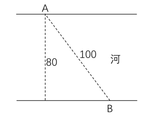

- **A**. 12.5万元　✅
- **B**. 12万元
- **C**. 11.5万元
- **D**. 11万元

**答案**：A

**官方解析**

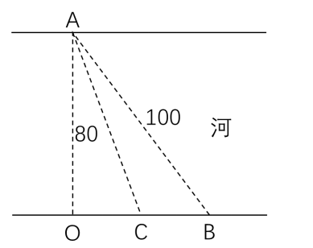

如图所示若沿AB建造观光栈道，则需建造河面栈道AB段100m，共需要铺设费用万元；若沿AO→OB铺设栈道，则需建造河面栈道AO段80m和陆地栈道OB段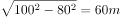，共需要铺设费用万元。通过所给条件对比分析，最少铺设费用为12.5万元（沿AB段建造）。

故正确答案为A。

备注：如若讨论陆地与河面栈道的转折点：在OB段上取任意点C，设。沿AC→CB铺设栈道，则需建造河面栈道AC段和陆地栈道CB段，共需要铺设费用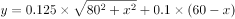万元。取特值分析x和y的增减关系，取值如表：

由特值分析可知，x取值越大，费用y越小。故时（即C点与B点重合）， y可取得最小值12.5。

---

## 第 2 题　qid 2376451 · 数学运算

林先生要将从故乡带回的一包泥土分成小包装送给占其朋友总数的老年朋友。在分包过程中发现，如果每包200克，则少500克；如果每包150克，则多250克。那么，林先生的朋友共有多少人?

- **A**. 15
- **B**. 30
- **C**. 50　✅
- **D**. 100

**答案**：C

**官方解析**

设林先生的老年朋友为人，根据分包过程可得：，解得人。因老年朋友占朋友总数的，则林先生的朋友总共有：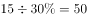人。

故正确答案为C。

注：本题并未说明每人分1包，不够严谨；但是不按每人1包则有无数种可能，无法求解。

---

## 第 3 题　qid 2376446 · 数学运算

幼儿园老师设计了一个摸彩球游戏，在一个不透明的盒子里混放着红、黄两种颜色的小球，它们除了颜色不同，形状、大小均一致。已知随机摸取一个小球，摸到红球的概率为三分之一。如果从中先取出3红7黄共10个小球，再随机摸取一个小球，此时摸到红球的概率变为五分之二，那么原来盒中共有红球多少个？

- **A**. 5　✅
- **B**. 10
- **C**. 15
- **D**. 20

**答案**：A

**官方解析**

假设原来盒子中共有个红球，因随机摸取一个小球，摸到红球的概率为，则原来盒子中共有个小球。取出红黄共个小球后，红球剩下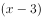个，小球总个数为，此时随机摸取一个小球，摸到红球的概率为，则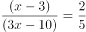，解得。

故正确答案为A。

---

## 第 4 题　qid 2376450 · 数学运算

某楼盘的地下停车位，第一次开盘时平均价格为15万元/个；第二次开盘时，车位的销售量增加了一倍、销售额增加了。那么，第二次开盘的车位平均价格为：

- **A**. 10万元/个
- **B**. 11万元/个
- **C**. 12万元/个　✅
- **D**. 13万元/个

**答案**：C

**官方解析**

赋值第一次车位销售量为1，则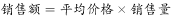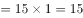。根据题意，第二次开盘时，销售量增加了一倍、销售额增加了，可得第二次销售量为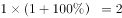，销售额为，则第二次平均价格为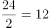。

故正确答案为C。

---

## 第 5 题　qid 2376753 · 数学运算

甲、乙两部参加军事演习。甲部从大本营以60千米/小时的速度往西行进，乙部晚半小时由大本营往东行进，速度比甲部慢。两部同时接到军令紧急集合，集合地位于大本营正北某处。此时两部所在位置与集合地恰好构成有一角为30度的直角三角形。若两部同时调整方向往集合地行军，且保持速度不变，则可同时到达集合地。问集合地与大本营的距离约为多少千米？

- **A**. 38
- **B**. 41　✅
- **C**. 44
- **D**. 48

**答案**：B

**官方解析**

根据题意可得右图，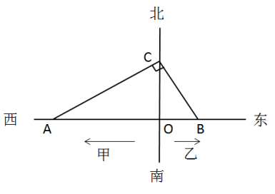

因甲部速度大于乙部且早出发半小时，故，则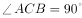，。两部同时调整方向可同时到达集合地C，则甲部、乙部速度之比为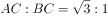，则乙部速度为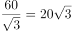千米/小时。

设乙部从B点到C点行驶时间为，则，，在直角三角形OCB中，，则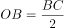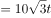，同理可得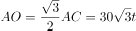。因甲部比乙部早出发半小时即0.5小时，则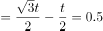，解得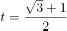小时。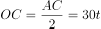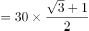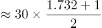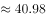，即约为41千米。

故正确答案为B。

---

## 第 6 题　qid 2376704 · 数学运算

甲、乙两个工程队共同参与一项建设工程。原计划由甲队单独施工30天完成该项工程三分之一后，乙队加入，两队同时再施工15天完成该项工程。由于甲队临时有别的业务，其参加施工的时间不能超过36天，那么为全部完成该项工程，乙队至少要施工多少天？

- **A**. 18　✅
- **B**. 20
- **C**. 24
- **D**. 30

**答案**：A

**官方解析**

根据题意可得，甲队单独完成这项工程需要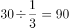天，则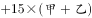，得，则甲、乙效率之比为，赋值甲的效率为1，乙的效率为3，工程总量为。根据问题，乙队施工天数尽可能少，则甲队施工天数应尽可能多，其最多可为36天，则乙队施工天数至少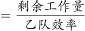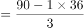天。

故正确答案为A。

---

## 第 7 题　qid 2376497 · 数学运算

因装修需要，拟在边长为2m的正方形浴室正中央处安装圆形淋浴喷头，喷头直径为10cm，出水喷射角度与垂直方向的最大夹角为。假设不考虑重力影响，要使喷头喷射到的面积能完全覆盖浴室，而且考虑施工实际，只有下列四个选项可选，则在满足设计要求的情况下，喷头底面距离地面可供选择的最低高度是多少？（）

- **A**. 185cm
- **B**. 190cm　✅
- **C**. 195cm
- **D**. 200cm

**答案**：B

**官方解析**

根据题干要求“要使喷头喷射到的面积能完全覆盖浴室”，即。设喷头底面距离地面高度为hcm，由“出水喷射角度与垂直方向的最大夹角为”，可知喷头外延能够喷射的最远距离l为cm。由“喷头直径为10cm”可知喷头半径r为5cm，喷头喷射的总半径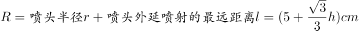。则喷头喷射的面积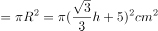，正方形浴室的面积。由，解得。结合题干要求“考虑施工实际，只有下列四个选项可选”，则要选择略大于187的选项，B项符合。

故正确答案为B。

备注：这道题目本质上是一道错题，命题人在命题过程中只考虑了面积大小关系，但从实际情况来看，圆形喷头喷出的水会打在墙壁上，但房间的四角喷射不到。而此题如果以喷射半径覆盖房间，，进行计算，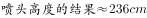，没有答案。

---

## 第 8 题　qid 2376731 · 数学运算

一工厂生产的某规格齿轮的齿数是一个三位数的质数（除了1和它本身之外，不能被其他整数整除的正整数），其个、十、百位数字各不相同且均为质数。若将该齿数的百位数字与个位数字对调，所得新的三位数比该齿数大495，则该齿数的十位数字为：

- **A**. 7
- **B**. 5　✅
- **C**. 3
- **D**. 2

**答案**：B

**官方解析**

三位数数字各不相同且均为质数，可知三位数字应在2、3、5、7中选择。调换位置后所得新数字比原数字大495，根据尾数判断则原数字的个位（调换后的百位）应为7，原数字的百位（调换后的个位）应为2，则十位数字只能是3或5。如果是3，则原数字为，不是质数，不符合题意，因此原十位数字只能为5。

故正确答案为B。

---

## 第 9 题　qid 2376465 · 数学运算

某次田径运动会中，选手参加各单项比赛计入所在团体总分的规则为：一等奖得9分，二等奖得5分，三等奖得2分。甲队共有10位选手参赛，均获奖。现知甲队最后总分为61分，问该队最多有几位选手获得一等奖？

- **A**. 3
- **B**. 4
- **C**. 5　✅
- **D**. 6

**答案**：C

**官方解析**

设获得一等奖、二等奖、三等奖的人数分别为、、，根据题意得：，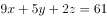，整理两式，消去得：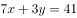。

问获得一等奖人数最多，考虑从大到小代入：

代入D项，若，代入，为负且不是整数，排除；

代入C项，若，代入，解得，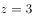，符合题意。

故正确答案为C。

---

## 第 10 题　qid 2376467 · 数学运算

某河道由于淤泥堆积影响到船只航行安全，现由工程队使用挖沙机进行清淤工作，清淤时上游河水又会带来新的泥沙。若使用1台挖沙机300天可完成清淤工作，使用2台挖沙机100天可完成清淤工作。为了尽快让河道恢复使用，上级部门要求工程队25天内完成河道的全部清淤工作，那么工程队至少要有多少台挖沙机同时工作？

- **A**. 4
- **B**. 5
- **C**. 6
- **D**. 7　✅

**答案**：D

**官方解析**

假定每天每台挖沙机效率为1，每天新增泥沙的量为，原有泥沙量为。由于1台挖沙机300天可完成清淤工作，可得：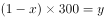；由于2台挖沙机100天可完成清淤工作，可得：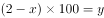。两式联立，解得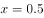，。若要求工程队25天内完成河道的全部清淤工作，此时，设所需的挖沙机台数为，则有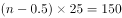，解得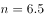，至少需要7台挖沙机同时工作。

故正确答案为D。

---
