# 2019年420联考《行测》题（陕西卷）（网友回忆版）

> 数量关系 · 10 题 · 陕西 2019

## 第 1 题　qid 2377367 · 数学运算

防火指挥小组中，男性比重为，党员比非党员多12人，那么该小组男性中党员的比重最高为（  ）。

- **A**. 

- **B**. 

- **C**. 

- **D**. 

- **E**. 

- **F**. 

　✅
- **G**. 

- **H**. 

**答案**：F

**官方解析**

设总人数为（为正整数），则男生人数为。设党员人数为，则非党员人数为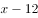，根据题意得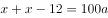，解得。若使男性中党员的比重最高，则需男性中的党员人数最多，最多为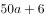人，男性中党员的比重最高为。若使比重最大，则a取值最小，时，男性中党员的比重最高为。题干问最高，向下取整为。

故正确答案为F。

---

## 第 2 题　qid 2377368 · 数学运算

有一个三位数的质数（除了1和它本身之外，不能被其他整数整除的正整数），其个、十、百位数字各不相同且均为质数。若将该数的百位数字与个位数字对调，所得新数比该数大495，则该数的十位数字为（  ）。

- **A**. 0
- **B**. 1
- **C**. 2
- **D**. 3
- **E**. 4
- **F**. 5　✅
- **G**. 6
- **H**. 7

**答案**：F

**官方解析**

由这个三位数的个位、十位、百位均为质数可知：个位、十位、百位上的数可能为2、3、5、7，百位和个位对调后，得到的新数比该数字大495，即原来的百位-原来的个位得到的尾数为5，确定原来的百位为2，原来的个位为7，因为个位、十位、百位上的数字各不相同，十位只能从3和5中选择，如果十位为3，237为3倍数不是质数，排除，则该数只能为257。，满足所有条件。

故正确答案为F。

---

## 第 3 题　qid 2377370 · 数学运算

制作一批风筝，甲需要12天完成，乙需要18天完成，两人共同制作，完成时甲比乙多制作了72个，如果按“甲制作一天、乙制作两天”的方式重复下去，当制作完成时，甲制作的风筝有（  ）个。

- **A**. 140
- **B**. 145
- **C**. 150
- **D**. 155
- **E**. 160　✅
- **F**. 165
- **G**. 170
- **H**. 175

**答案**：E

**官方解析**

设总量为36x，则甲效率为，乙效率为，俩人合作完成时间为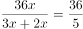，根据题意可得：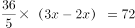，解得。即总量为360，甲效率为30，乙效率为20。

按照“甲制作一天、乙制作两天”的方式重复工作，工作周期为，，5个周期中，甲制作了个，最后10个也由甲完成，一共完成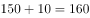个。

故正确答案为E。

---

## 第 4 题　qid 2377371 · 数学运算

幼儿园老师设计了一个摸彩球游戏，在一个不透明的盒子里混放着红、黄两种颜色的小球，它们除了颜色不同，形状、大小均一致。已知随机摸取一个小球，摸到红球的概率为三分之一，如果从中先取出3红7黄共10个小球，再随机摸取一个小球，此时摸到红球的概率变为五分之二，那么原来盒中共有红球（  ）个。

- **A**. 2
- **B**. 3
- **C**. 4
- **D**. 5　✅
- **E**. 6
- **F**. 7
- **G**. 8
- **H**. 9

**答案**：D

**官方解析**

假设原来盒子中共有x个红球，因随机摸取一个小球，摸到红球的概率为1/3，则原来盒子中共有3x个小球。取出3红7黄共10个小球后，红球剩下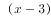个，小球总个数为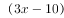，此时随机摸取一个小球，摸到红球的概率为，则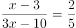，解得。

故正确答案为D。

---

## 第 5 题　qid 2377374 · 数学运算

汽车的经济时速是指汽车最省油的行驶速度，据某汽车公司测算，该公司一款新型汽车以每小时70~110公里的速度行驶时，其每公里耗油量公式为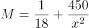（为汽车速度，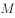为耗油量），那么该款汽车在70~110公里/小时速度区间行驶时每百公里的最低耗油量约为（  ）。

- **A**. 9　✅
- **B**. 10
- **C**. 11
- **D**. 12
- **E**. 13
- **F**. 14
- **G**. 15
- **H**. 16

**答案**：A

**官方解析**

，即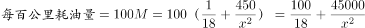。若每百公里耗油量越小，则越大，即越大，且。故当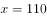公里时，每百公里耗油量最小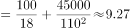，与A项最接近。

故正确答案为A。

---

## 第 6 题　qid 2377373 · 数学运算

主人随机安排10名客人坐成一圈就餐，这10名客人中有两对情侣，那么这两对情侣恰好都被安排相邻而坐的概率约在（  ）。

- **A**. 
到之间

- **B**. 
到之间

- **C**. 
到之间

- **D**. 
到之间

- **E**. 
到之间
　✅
- **F**. 
到之间

- **G**. 
到之间

- **H**. 
以上

**答案**：E

**官方解析**

10人围成一圈就餐，构成圆桌排列，则总的情况数种情况；

所求情况分步考虑：①两对情侣要相邻而坐，用捆绑法有种情况；②再将捆绑的两对情侣看成2个人，与剩余6个人一起，8个人进行圆桌排列，有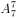种情况。

则。

故正确答案为E。

---

## 第 7 题　qid 2377376 · 数学运算

小明的步行速度为1米/秒，从A地到B地步行需要3小时，骑自行车需要1小时，电动车的速度是自行车的两倍。现在小明从A地出发，步行1.5小时后骑自行车到B地，然后返回途中先骑电动车走完一半路程，再步行返回A地，则小明的往返平均速度为（  ）千米/小时。

- **A**. 4.75
- **B**. 5.76　✅
- **C**. 5.96
- **D**. 6.25
- **E**. 6.75
- **F**. 7.24
- **G**. 8.18
- **H**. 9.20

**答案**：B

**官方解析**

分情况讨论往返的各种用时：

①小明去程走了1.5小时、返程走一半路程同样需要1.5小时，则步行时间为3小时；

②去程有一半路程骑自行车，因自行车走全程需1小时，则骑自行车时间为0.5小时；

③返程有一半路程骑电动车，电动车的速度是自行车的2倍，路程相同则时间与速度成反比，则骑电动车时间是骑自行车时间的一半，为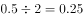小时；

所以往返总时间为小时。

而小明的步行速度为1米/秒=3.6千米/小时，根据题意，从A到B需要步行3小时，则单程为千米，往返路程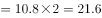千米。

根据，千米/小时。

故正确答案为B。

---

## 第 8 题　qid 2377378 · 数学运算

甲乙两部队参加军事演习，甲部队从大本营以60千米/小时的速度往西行进，乙部队晚半小时由大本营往东行进，速度比甲部队慢，一段时间后，两部队同时接到军令紧急集合，集合地位于大本营正北某处。此时两部队所在位置与集合地恰好构成有一角为30度的直角三角形，若两部队同时调整方向往集合地行军，且保持速度不变，则可同时到达集合地，则集合地与大本营的距离约为（  ）千米。

- **A**. 41　✅
- **B**. 43
- **C**. 45
- **D**. 47
- **E**. 49
- **F**. 51
- **G**. 53
- **H**. 55

**答案**：A

**官方解析**

根据题意可得右图，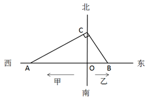

因甲部队速度大于乙部队且早出发半小时，故，则，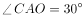。两部队同时调整方向可同时到达集合地C，则甲部队、乙部队速度之比为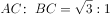，则乙部队速度为千米/小时。

设乙部队从B点到C点行驶时间为，则，，在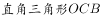中，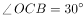，则，同理可得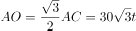。因甲部队比乙部队早出发半小时即0.5小时，则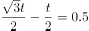，解得小时。，即约41千米。

故正确答案为A。

---

## 第 9 题　qid 2377379 · 数学运算

调酒师调配鸡尾酒，先在调酒杯中倒入120毫升柠檬汁，再用伏特加补满，摇匀后倒出80毫升混合液备用，再往杯中加满番茄汁并摇匀，一杯鸡尾酒就调好了。若此时鸡尾酒中伏特加的比例是，则调酒杯的容量是（    ）毫升。

- **A**. 165
- **B**. 170
- **C**. 175
- **D**. 180
- **E**. 185
- **F**. 190
- **G**. 195
- **H**. 200　✅

**答案**：H

**官方解析**

假设调酒杯的容量为毫升，在原有120毫升柠檬汁的基础上，用伏特加补满，因此加入伏特加的量为毫升，这时伏特加浓度为毫升。混匀后倒出80毫升后，还剩余毫升混合液，此时伏特加的量为。最后加入番茄汁，但是伏特加的量无变化，可得方程：。

由于本题属于分式方程，直接计算难度太高，故考虑代入选项验证。优先选择好算的选项入手，H项为整百的数，因此代入H项。，等式成立。

故正确答案为H。

---

## 第 10 题　qid 2377384 · 数学运算

某小学举行作文大赛，家长们对挑选出来的6篇作文进行不记名投票。每张选票可以选择6篇作文中的任意一篇或多篇，但只有选择不超过3篇作文的票才是有效票。6篇作文的得票数（不考虑是否有效）分别为总票数的、、、、、，那么本次投票的有效率最少为（  ）。

- **A**. 

- **B**. 

- **C**. 

- **D**. 

　✅
- **E**. 

- **F**. 

- **G**. 

- **H**. 

**答案**：D

**官方解析**

假设共有100位家长，每名家长有一张投票，在票上写出相应作文的编号。则6篇作文的总得票数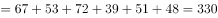票，人均投票数为票。

要使投票有效率（即有效票占比）最低，则应让无效率最高。因此，应让无效票的人均投票数尽可能靠近3.3票，取为一人4票；让有效票的人均投票数尽可能远离3.3票，取为一人1票。

设有效票观众人数为，无效票观众人数为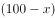，则总票数票，解得：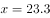人，则最少为24人，即有效率最低为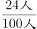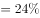。

故正确答案为D。

---
